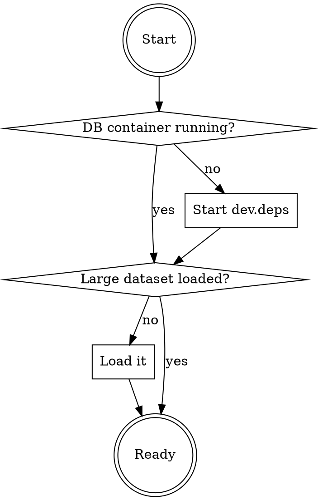

# Optimize Neo4j Cypher Query

## Overview

Slow Infrahub endpoints are almost always slow Cypher queries underneath. This skill drives the loop: **reproduce → find → extract → PROFILE → analyze → fix → re-PROFILE**. It does not try to be clever about which query to optimize — it gives you the tools to find the slowest one against a realistic dataset and read the plan.

The single source of truth for "which query ran with which parameters" is the neo4j container's `logs/query.log*` — every executed query is logged with its parameters, duration, and query name. Each entry also carries a `bolt_id` (the per-connection sequence number neo4j stamps on every query) which is the primary identifier the helper script uses. When the API server is started with `INFRAHUB_TRACE_ENABLE=true`, the log also carries the OTel span id as `infrahub_id`, which lets you cross-reference from Tempo/Grafana — but tracing is **not required** for any of the steps below.

## When NOT to use

- The slow path isn't database-bound (CPU profiling, network, file I/O). Profile the Python side first if you don't already know it's the DB.
- The dataset is tiny. Optimizing against an empty DB just teaches you nothing about the production plan.
- You're chasing a correctness bug, not a performance bug.

## Prerequisites



Check large-dataset presence with:
```bash
docker exec infrahub-database-1 cypher-shell --format plain -u neo4j -p admin -d neo4j \
  "MATCH (n) RETURN count(n);"
```
If the count is under ~100k, the dataset is not the realistic one. **REQUIRED SUB-SKILL:** Use `loading-infrahub-test-dataset` to restore a team snapshot before continuing — optimizing against an empty DB is a waste of cycles.

The neo4j query log is on by default in the bundled image (`logs/query.log`, rotating to `query.log.01`, etc.); no extra config needed.

**Optional — distributed tracing.** If the user wants to correlate Cypher queries to a higher-level trace (which HTTP request triggered them, which other queries ran in the same flow), set these in the API server's environment and restart it:

```
INFRAHUB_TRACE_ENABLE=true
INFRAHUB_TRACE_EXPORTER_TYPE=console   # or `otlp` if the observability stack is running with `--profile trace`
```

With tracing on, every query.log entry's `infrahub_id` field equals the OTel span id, so you can pivot from Grafana/Tempo into the log. The workflow below does not require this — `bolt_id` alone is enough.

## Workflow

### 1. Reproduce the slow path

Get a precise description from the user of the action that triggers the slow query — e.g. "GET `/api/branch/X/diff` between `main` and `feature-Y`", "GraphQL `DcimDevice` query with filter Z", "branch merge for branch X". Then have the user trigger it once against the running server (UI, curl, or `infrahubctl`) so a fresh entry lands in `logs/query.log`.

If the path runs many queries, ask the user to wait for the slow part to finish before continuing — otherwise the slowest query may still be running and absent from the log.

### 2. Find the slowest query

If you already know the query name behind the scenario, scope the list to it rather than eyeballing the full dump — pass `--name` and/or a `--min-ms` floor so the result *is* the scoped source of truth:

```bash
# scoped to a known query name (preferred when the scenario maps to one)
python .agents/skills/optimizing-neo4j-cypher-query/scripts/profile_slow_query.py find-slow --name diff_property_paths --min-ms 200

# unscoped — only when you don't yet know which query name to expect
python .agents/skills/optimizing-neo4j-cypher-query/scripts/profile_slow_query.py find-slow --limit 15
```

Reads `logs/query.log*` from `infrahub-database-1` and prints the slowest queries with their duration, runtime, query name, and `bolt_id` (span_id too if tracing was enabled). Pick the entry whose name matches the user's scenario — `diff_property_paths`, `relationship_get_peer`, `node_get_list`, etc.

If you can't tell which query name corresponds to the scenario, ask the user. Don't guess.

If `find-slow` prints a `[warning] skipped N unparseable log entries` line, treat an empty or suspiciously short result with suspicion — see the note under step 5 about log-format drift.

### 3. Extract the query + parameters

```bash
python .agents/skills/optimizing-neo4j-cypher-query/scripts/profile_slow_query.py extract <bolt_id>
```

Prints the full query text and the parameter map in neo4j map-literal syntax (directly usable as `:params <...>` in cypher-shell). Sanity-check that the params look right for the scenario (branch name, node uuids, time window). Pass `<span_id>` instead of `<bolt_id>` if you got here from a trace.

### 4. Run PROFILE

```bash
python .agents/skills/optimizing-neo4j-cypher-query/scripts/profile_slow_query.py profile <bolt_id> --no-parallel --out ./profile-out
```

The script:
- prepends `PROFILE` to the query;
- strips any `CYPHER runtime=parallel` (or other) prefix when `--no-parallel` is set — parallel runtime hides single-thread cost and makes the plan harder to read, always profile non-parallel first;
- runs it via `cypher-shell` in the database container with the extracted params;
- writes `profile_<tag>.cypher`, `.params`, `.out`, `.meta` under `--out` (tag is `bolt<N>` or the span_id).

Confirm the elapsed time roughly matches what query.log reported — if it's way faster on the second run, the data is now in page cache and the original measurement was cold. Either way, the plan shape is what matters; absolute numbers are secondary.

### 5. Read the plan

Open the `.out` file. Read it against the anti-pattern reference:

**REQUIRED READ:** `.agents/skills/optimizing-neo4j-cypher-query/references/cypher-profile-anti-patterns.md`

Tag every operator with high `db hits` or high `rows` going in vs out, and map them to anti-patterns. Prefer the first bad operator from the top of the plan — that's the planner's choice of entry point, which is usually where the win is.

> **Log-format drift.** The whole workflow depends on `profile_slow_query.py` parsing neo4j's `query.log` layout, which can change across neo4j upgrades. The parser is pinned by `scripts/test_profile_slow_query.py` (stdlib, no container needed — `python scripts/test_profile_slow_query.py`). If `find-slow` returns empty/short or prints the `skipped N unparseable` warning right after a neo4j bump, run that test first: a failure there means the log format moved and the regexes in the script need updating, not that the database is fast.

### 6. Propose a fix and re-PROFILE

Apply the smallest change that addresses the worst operator (add a property/rel index, restructure the query, drop a function call that defeats an index, build conditional Cypher in Python instead of using a `$param IS NULL`-guarded `UNION`). Re-run step 4 against the same span scenario — confirm the bad operator is gone and total `db hits` dropped.

If adding an index, it must go in `backend/infrahub/core/graph/index.py` so it persists across migrations. **This is a migration-carried database-schema change — `AGENTS.md` lists it under *Ask First*. Before editing `index.py`:**

1. **Confirm the index isn't already there.** Grep `index.py` for the same label/relationship + property — an existing one may simply not be getting used (a `toString()` / type coercion on the indexed property defeats it; strip that first and re-PROFILE before adding anything).
2. **Get explicit user confirmation** of the proposed index (label/rel, property, type) before writing it. Don't add the index as a silent side effect of the profiling loop.

### 7. Report

When done, summarize for the user:
- the query name and what triggered it,
- the original plan's worst operator + db hits,
- the change applied and why,
- the new plan's worst operator + db hits.

Skip the play-by-play of how you got the span id — the user cares about cause and fix.

## Reference

- **Anti-patterns:** `references/cypher-profile-anti-patterns.md` — operator-level PROFILE checklist (the focus of this skill).
- **Modern Cypher syntax:** see the `neo4j-cypher-guide` skill — the write-time counterpart. Reach for it in step 6 when restructuring a query (QPP rewrites, CALL subqueries, null-safe sorting, replacing deprecated syntax). It covers *how to write* correct Cypher; this skill covers *how to diagnose* a slow one.
- **Example PR:** opsmill/infrahub#9225 (slow branch diffs — fixed via entry-path restructure + rel indexes + removing `toString` on indexed property).

## Common mistakes

- **Optimizing the wrong query.** The first slow span in a trace is rarely the bottleneck; pick the one with the worst (duration × frequency) for the scenario, not whatever appears first.
- **Profiling with `runtime=parallel`.** Always strip it for first analysis. Parallel runtime can mask serial inefficiency and the plan diagrams are harder to read.
- **Trusting cold-cache numbers only.** Run the same PROFILE twice; the first run is often page-cache cold. Compare plan shape, not just elapsed.
- **Adding an index just because PROFILE shows a scan.** A scan over 1k nodes that returns 1k rows is fine. A scan over 10M to return 5 rows is the problem. Look at `db hits` ÷ `rows`, not just operator names.
- **Skipping the re-PROFILE step.** If you don't measure after, you're guessing whether the fix worked.

## Red flags — stop and reconsider

- Reading the plan without first running with `--no-parallel` → the parallel scheduling hides where time goes. Re-run.
- Recommending an index without checking `index.py` for an existing one → may be there but not picked due to a `toString()` / type coercion. Strip the coercion first.
- Making three changes in one pass → if perf changes, you won't know which one mattered. One change per PROFILE iteration.
- Skipping the user's exact scenario in favour of a synthetic query → the param shape (branch name, IN-list size, time window) is often what makes the planner pick a bad path.
