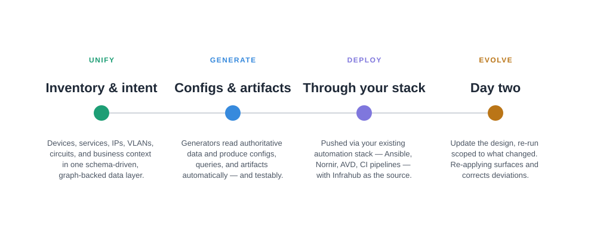
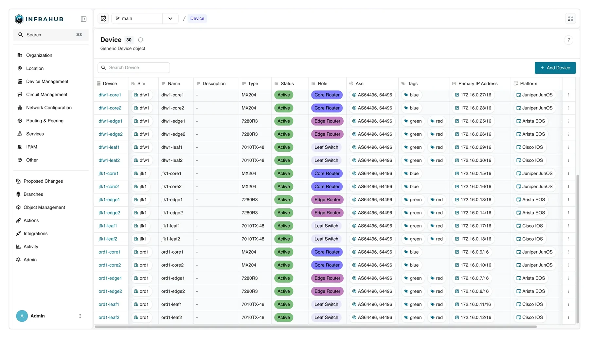
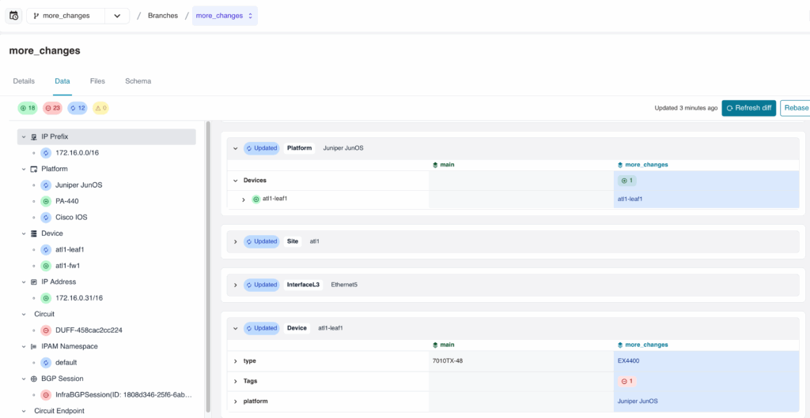
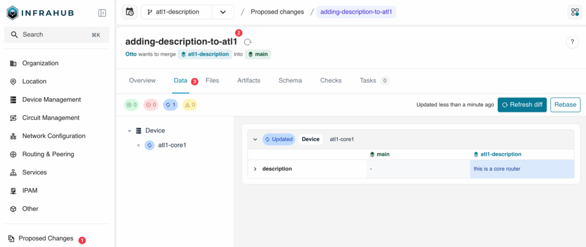
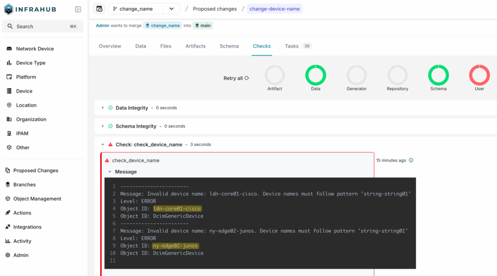

<h1 align="center">
  <a href="https://docs.infrahub.app"><picture>
    <source media="(prefers-color-scheme: dark)" srcset="docs/static/img/infrahub-logo-color-white.svg">
    
  </picture></a>
</h1>

  <strong>The data foundation for modern automation</strong>

  
  
  
  
  

  <strong><a href="https://docs.infrahub.app/topics/community-vs-enterprise#community-edition">Infrahub Community</a></strong> |
  <strong><a href="https://docs.infrahub.app/topics/community-vs-enterprise#enterprise-edition">Infrahub Enterprise</a></strong> |
  <strong><a href="https://sandbox.infrahub.app/">Sandbox</a></strong>

Infrahub is the data foundation for modern infrastructure automation, for teams managing networks, data centers, and cloud infrastructure. It moves them from fragmented data and one-off scripts to repeatable, validated workflows — delivering infrastructure as a reliable service to the rest of the business and the AI agents that consume it.

  <picture>
    <source media="(prefers-color-scheme: dark)" srcset="docs/static/img/infrahub-lifecycle-dark.svg">
    
  </picture>

## Key capabilities

- **Schema-first, graph-backed data model.** Define your own data models for devices, services, topologies, and business context — enforced with validation and queried with first-class relationships on a Neo4j graph database.
- **Version control for data, not just configs.** Branches, peer review, and a complete queryable history of who changed what, when, and why — applied to schema, data, and generated artifacts.
- **Generators and transforms.** Render configurations and other artifacts from Infrahub data using Jinja2 or Python — composable, reusable, and version-controlled alongside the data.
- **Built for production.** Templates and generators are unit-and-integration testable. Every change moves through branch → CI → review → merge — and idempotent re-runs surface and correct deviations without a full rebuild.
- **Integrations and self-service.** Connectors for Git, Ansible, and Nornir. Infrahub Sync federates data from Netbox, Nautobot, and IP Fabric. GraphQL, REST, and a web UI back service catalogs so internal teams and customers can self-serve.
- **AI-ready by design.** An MCP server and Infrahub Skills make Infrahub's validated, relationship-rich data directly usable to Claude, Cursor, and other AI agents.

## Where Infrahub fits

- **Unify infrastructure data** — one source of truth across devices, services, IPs, VLANs, circuits, and the business context tied to them.
- **Automate at scale** — generate, validate, and deploy configurations across vendors and sites; support full lifecycle workflows for provisioning, upgrade, and decommission.
- **Enable self-service** — let app, platform, and ops teams request infrastructure resources through APIs and a UI backed by authoritative data.
- **Build an AIOps knowledge graph** — model dependencies and relationships across infrastructure to provide the data foundation for AI-driven reasoning, troubleshooting, and predictive operations.

## What makes Infrahub different

Infrahub is purpose-built for network and infrastructure automation. It combines an extensible schema language, native version control of the data, a graph data store, and open-source foundations — Neo4j, Git, Prefect, GraphQL, and Python — in a single platform. For a side-by-side comparison with common alternatives, see [How Infrahub compares](https://opsmill.com/compare-source-of-truth-tools/).

## Getting started

Three ways to try Infrahub:

- **[Sandbox](https://sandbox.infrahub.app/)** — a hosted demo of the Infrahub UI with sample data — explore the interface without installing anything.
- **[Getting Started Lab](https://opsmill.instruqt.com/pages/labs)** — a guided browser tutorial covering branches, schemas, and unified storage.
- **[Quick Start guide](https://docs.infrahub.app/getting-started/quick-start)** — set up a local Infrahub instance and walk through the basics in your own environment.

For production deployments on Kubernetes, see [`opsmill/infrahub-helm`](https://github.com/opsmill/infrahub-helm) and the [installation guide](https://docs.infrahub.app/guides/installation).

## Documentation

- [Documentation home](https://docs.infrahub.app/)
- [Getting started](https://docs.infrahub.app/getting-started/overview)
- [Core concepts](https://docs.infrahub.app/getting-started/concepts)
- [Release notes](https://docs.infrahub.app/release-notes)
- [FAQ](https://docs.infrahub.app/faq/)

## The Infrahub ecosystem

OpsMill maintains a set of officially supported projects that help teams develop with Infrahub, run it in production, and integrate it with the rest of their automation stack.

**Develop with Infrahub**

| Project | Purpose |
|---|---|
| [`infrahub-sdk-python`](https://github.com/opsmill/infrahub-sdk-python) | Python SDK and the `infrahubctl` CLI — build integrations and manage Infrahub from code |
| [`infrahub-vscode`](https://github.com/opsmill/infrahub-vscode) | VS Code extension with schema validation, GraphQL query support, and schema visualization |
| [`schema-library`](https://github.com/opsmill/schema-library) | Reusable schemas for common infrastructure patterns — a starting point for modeling |
| [`infrahub-mcp`](https://github.com/opsmill/infrahub-mcp) | MCP server exposing Infrahub data to Claude, Cursor, and other AI agents |
| [`infrahub-skills`](https://github.com/opsmill/infrahub-skills) | AI skills that give coding assistants knowledge of Infrahub conventions and data models |

**Run Infrahub in production**

| Project | Purpose |
|---|---|
| [`infrahub-helm`](https://github.com/opsmill/infrahub-helm) | Helm charts for deploying Infrahub on Kubernetes |
| [`infrahub-backup`](https://github.com/opsmill/infrahub-backup) | Backup and restore CLI for Infrahub instances |

**Integrate with your automation stack**

| Project | Purpose |
|---|---|
| [`infrahub-ansible`](https://github.com/opsmill/infrahub-ansible) | Ansible Collection — use Infrahub as the source of truth for Ansible playbooks |
| [`nornir-infrahub`](https://github.com/opsmill/nornir-infrahub) | Nornir inventory plugin for Python network automation |
| [`infrahub-sync`](https://github.com/opsmill/infrahub-sync) | Federate data from Netbox, Nautobot, IP Fabric, and other systems into Infrahub |

The full set of OpsMill projects is at [github.com/opsmill](https://github.com/opsmill).

## Screenshots

  <strong>Infrahub UI</strong> 
  

  <strong>Branching and diff view — every change tracked, comparable, and queryable</strong> 
  

  <strong>Proposed change — peer review and approve before merge</strong> 
  

  <strong>CI checks — validation runs on every proposed change; merge blocked when checks fail</strong> 
  

## Community and support

The Infrahub Community edition is open source and free. For deployments that need high availability, advanced RBAC, performance enhancements, and SLA-backed support, [Infrahub Enterprise](https://opsmill.com/) is available.

- **Discord** — [discord.gg/opsmill](https://discord.gg/opsmill)
- **GitHub Issues** — [github.com/opsmill/infrahub/issues](https://github.com/opsmill/infrahub/issues)
- **Newsletter** — [Ottermatic](https://opsmill.com/infrastructure-automation-newsletter/)
- **Blog** — [opsmill.com/blog](https://opsmill.com/blog/)

## Contributing

Contributions of all sizes are welcome — bug fixes, schema accelerators, integrations, documentation, and core features. See [CONTRIBUTING.md](./CONTRIBUTING.md) to get started.

## Security

See our [security policy](https://github.com/opsmill/infrahub?tab=security-ov-file) for supported versions and disclosure procedures.

## License

Infrahub is released under the [Apache 2.0 License](LICENSE.txt).
