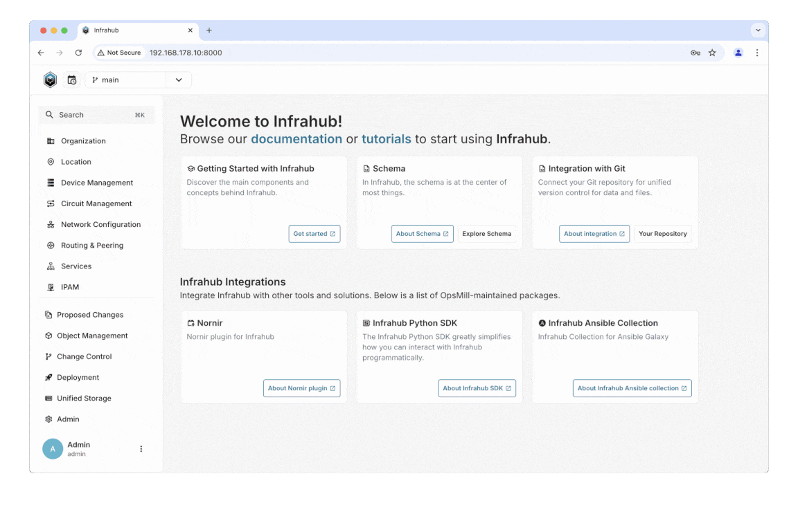

<!-- markdownlint-disable -->

<!-- markdownlint-restore -->

# Infrahub

Infrahub from [OpsMill](https://opsmill.com) is taking a new approach to Infrastructure Management by providing a new generation of datastore to organize and control all the data that defines how an infrastructure should run. Infrahub offers a central hub to manage the data, templates and playbooks that powers your infrastructure by combining the version control and branch management capabilities of Git with the flexible data model and UI of a graph database.

## Quick Start

Leveraging [GitHub Codespaces](https://docs.github.com/en/codespaces/overview), it's possible to start a new instance of Infrahub in the Cloud in minutes:

|  No Data | Demo Data |
|---|---|
|  |  |

For details on how to deploy a local instance of Infrahub please refer to our guide: [Installing Infrahub](https://docs.infrahub.app/guides/installation)

## Documentation

If you'd like to learn more about Infrahub, please refer to the following resources:

- [Infrahub Overview](https://docs.infrahub.app/overview/)
- [Getting Started](https://docs.infrahub.app/tutorials/getting-started/)
- [Infrahub Documentation](https://docs.infrahub.app/)
- [FAQ](https://docs.infrahub.app/faq/)

## Support and Community

If you need help, support for the open-source Infrahub project is provided on  or via [filing an issue on GitHub](https://github.com/opsmill/infrahub/issues).

## Contributing

[View our CONTRIBUTING](./CONTRIBUTING.md) policy to find the latest information.

## Security

[View our SECURITY](https://github.com/opsmill/infrahub?tab=security-ov-file) policy to find the latest information.
