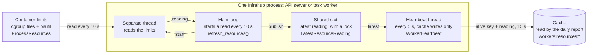

# Telemetry

> Part of: `dev/knowledge/backend/` | Related: [Events System](events.md), [Asynchronous Tasks](async-tasks.md)

Infrahub gathers an anonymous usage snapshot once a day. The snapshot is always stored locally
(so air-gapped and opted-out deployments still retain their own history) and, unless the
operator opts out, is also sent to the OpsMill telemetry endpoint. It exists to understand
adoption and scale, never to capture customer data.

## Collection flow

A daily Prefect flow (`anonymous_telemetry_send`, cron ~02:00 UTC with a per-deployment random
minute) gathers the payload, stores it as a `TelemetrySnapshot`, then conditionally sends it:

```text
anonymous_telemetry_send (daily)
  └─ build_anonymous_telemetry_gatherer() → AnonymousTelemetryGatherer.gather() → TelemetryData
       └─ TelemetrySnapshot.save()        ← ALWAYS stored locally first
            └─ opted out?  → mark "skipped"
               opted in?   → POST to endpoint → mark "sent" / "failed"
```

The random cron minute spreads load across deployments; it is why the windowing below is
anchored to a calendar boundary rather than to the moment the flow happens to run.

## What is collected — by category

The payload groups metrics into categories. Fields are documented in the payload contract; the
distinction that matters operationally is each category's **temporal model** (below).

| Category | What it covers |
|----------|----------------|
| Deployment | anonymous deployment id, Infrahub version/type, Python/platform |
| Workers | worker pool size and active count |
| Server | API server process count and active count, and one API server process's CPU and memory |
| Task workers | task-worker process count and active count, and one task worker's CPU and memory |
| Branches | total and open (non-system) branch counts |
| Accounts | active accounts, account groups |
| Schema | node/generic kind counts, last schema change |
| Features | how many objects of adoption-signalling kinds exist (artifacts, repos, generators, …) |
| Database | database type, node/relationship counts, server versions, the CPU and memory Neo4j can use |
| Prefect | event tally, automation counts, work-pool state |
| Activity (24h) | logins, checks, artifacts, branch actions, webhook deliveries |

### Activity (24h) field semantics

| Field | Counts |
|-------|--------|
| `logins` / `unique_logins` | Interactive sign-ins only — password, OIDC, OAuth2. Per-request API-key/token authentication is stateless and never emits a login event, so token-authenticated SDK/CI traffic is **not** included. |
| `checks_started` / `_passed` / `_failed` | Validator lifecycle events (see the checks caveat under Graceful degradation). |
| `artifacts_created` / `_updated` | Artifact lifecycle events. |
| `branches_created` / `_merged` / `_deleted` | Branch lifecycle events. |
| `webhooks_fired_success` / `_failure` | Terminal `webhook-process` flow-run states. |

## CPU and memory figures

The `database`, `server` and `task_workers` blocks report how much CPU and memory each component
is allowed to use, so a deployment's size can be compared with its licence tier. Every field is
described in the [payload contract](../../specs/infp-631-resource-telemetry/contracts/telemetry-resources.md).

The API server and task-worker figures come from two sources:

- **The container limit**, from the Linux "cgroup" files where Docker or Kubernetes writes the
  limit it puts on a container, for example "2 CPUs and 4 GB".
- **The whole machine**, from psutil, for example "18 CPUs and 64 GB".

If a container limit is set, the limit is reported, because that is all Infrahub can use. If no
limit is set, the machine's figures are reported, because Infrahub can then use the whole machine.
Both sources are needed: inside a container psutil still sees the whole machine, and without a
limit the cgroup files have no number to give. Three exceptions:

- A limit that is set but cannot be read is reported as unknown (`null`), never as the machine's
  figure, which could be far too high.
- The assigned CPUs come only from the container limit. With no limit they stay `null`.
- The usable CPUs are the smallest of the machine's CPU count, the container's CPU limit and the
  number of CPUs the process is pinned to, if it is pinned.

`server` and `task_workers` each report **one worker's share** of its container in `per_worker`,
so `per_worker × active` is the component's total. A task worker has its container to itself. The
API server runs several processes in one container (4 by default), so its figures are divided
between them. Their `total` and `active` count processes the same way `workers` does, which stays
unchanged: `server.total + task_workers.total` equals `workers.total`, except for a process that
stopped about two hours earlier and is only remembered by its presence key.

A whole-number CPU share is sent as an integer (`2`, not `2.0`). The telemetry endpoint checks the
checksum by writing the received data out again in JavaScript, which cannot tell the two apart, so
a whole-number float fails the check and the endpoint drops the whole report. Any new float field
in the payload needs the same treatment.

Each API server and task-worker process reports its own figures through the cache. Every 10 seconds
the main loop starts a read of the limits on a separate thread, so that a slow read never holds up
requests and flows, and puts the reading in a shared slot in memory. The heartbeat
thread, which only writes to the cache so that a busy main loop never stalls it, copies the latest
reading into the cache every 5 seconds next to its "alive" key, with the same 15-second expiry.
Once a day the report reads those entries. The database figures come from Neo4j itself when the
report runs.



<!-- Extracted from specs/infp-631-resource-telemetry on 2026-10-08 -->
An empty figure is `null`, never zero. For the API server and task workers the CPU pair shows why:
`processor_available` set with `processor_assigned` empty means no CPU limit is set, and both empty
means a limit is set but could not be read, or no process of that component has reported. Two
things cannot be seen from inside a container: a limit set only on a Kubernetes pod, and Kubernetes
CPU requests, which reserve CPU but do not limit it. The share assumes every copy of a component
runs with the same settings, and it reads high for a moment after a process starts, until that
process has stored its first reading. Why it is built this way:
[ADR 0021](../../adr/0021-resource-allocation-telemetry.md).

## Temporal models (the important part)

Not every number means the same thing over time. There are three kinds:

1. **Point-in-time snapshot** — most metrics (node/relationship counts, accounts, branches,
   schema, features, workers, database info) are the *current* value at gather time. Re-running
   the flow reflects the graph as it is now.

2. **Cumulative over Prefect retention (~7 days)** — the `prefect.events` tally is a raw count
   of each event type that Prefect *still retains*. Prefect expires events after ~7 days, so
   this is a rolling window bounded by retention — **not** a per-day figure and not comparable
   day to day. This is the older, coarse signal.

3. **Windowed — previous full UTC day** — every `activity_24h.*` metric counts only events (or
   webhook flow-runs) that occurred within `[yesterday 00:00 UTC, today 00:00 UTC)`. This is the
   precise daily signal that supersedes the coarse cumulative tally for activity.

The contrast between (2) and (3) is deliberate: `prefect.events` answers "roughly how much of X
is Prefect holding right now", while `activity_24h` answers "exactly how much X happened
yesterday".

## Windowing

`get_activity_window()` returns the half-open interval `[start, end)` where `end` is midnight
UTC of the current day and `start` is 24h earlier — the previous full calendar day. Because it
is anchored to the midnight boundary (not to `now`), consecutive daily runs tile exactly with no
overlap or gap regardless of the jittered cron minute. The upper bound is exclusive; the event
counters pull their query's inclusive `until` back one microsecond so an event stamped exactly on
midnight lands in one window only, never two.

### Retention interaction

Prefect keeps events and flow-runs for ~7 days. The windowed metrics only ever look one day back,
so they are safe as long as the daily flow runs within retention (it runs every day, well inside
7 days). If the flow were down for several days, days beyond retention could not be recovered —
the metrics are a live daily sample, not a backfillable ledger.

## Graceful degradation

Many metric sources are gathered through a single helper (`safe_metric`) that isolates failures:
if a source raises, that field is reported as `null` (and the failure is logged) while the rest
of the payload is still built, stored, and sent. A source that succeeds with nothing to count
reports `0`. So **`null` means "could not measure", `0` means "measured, nothing there"**.

The new CPU and memory figures for the API server and the task workers, and the database's
`processor_assigned`, are protected this way. Several older parts are not, among them the list of
workers and the database block, including its CPU and memory figures: a failure in any of them
stops the whole report.

One caveat on the check metrics: `checks_started` counts every validator that starts, but
`checks_passed`/`checks_failed` are only emitted for validators that run through the checks
runner. A validator that concludes without executing checks (a trivial no-op) is counted in
`checks_started` only, so `started` can exceed `passed + failed` without any run being
incomplete.

## Storage & access

Snapshots are stored as `TelemetrySnapshot` nodes with a `remote_send_status`
(`pending`/`sent`/`skipped`/`failed`). They are readable regardless of opt-out via
`infrahubctl telemetry list` / `infrahubctl telemetry export` or `GET /api/telemetry/snapshots`,
both gated on the `READ_TELEMETRY` global permission.

## Key Locations

| Path | Purpose |
|------|---------|
| `backend/infrahub/telemetry/tasks.py` | Daily flow, payload assembly, remote send |
| `backend/infrahub/telemetry/task_manager.py` | Windowed event / webhook-run counters |
| `backend/infrahub/telemetry/utils.py` | Degradation helper, 24h window functions, infrahub-type detection |
| `backend/infrahub/telemetry/database.py` | Database and node-count metrics |
| `backend/infrahub/telemetry/resources.py` | Reads a process's CPU and memory limits and the machine's figures |
| `backend/infrahub/services/scheduler.py`, `backend/infrahub/tasks/recurring.py` | The 10-second schedule on the main loop that starts each read of the figures on a separate thread |
| `backend/infrahub/services/heartbeat.py` | The heartbeat thread that copies the latest reading into the cache every 5 seconds |
| `backend/infrahub/services/component.py` | Stores each process's CPU and memory reading next to its heartbeat |
| `backend/infrahub/telemetry/models.py` | Payload schema |
| `backend/infrahub/workflows/catalogue.py` | Registers the `anonymous_telemetry_send` deployment |

## See Also

- [Events System](events.md) — the Prefect events the activity metrics count
- [Asynchronous Tasks](async-tasks.md) — how the daily flow is scheduled and run
