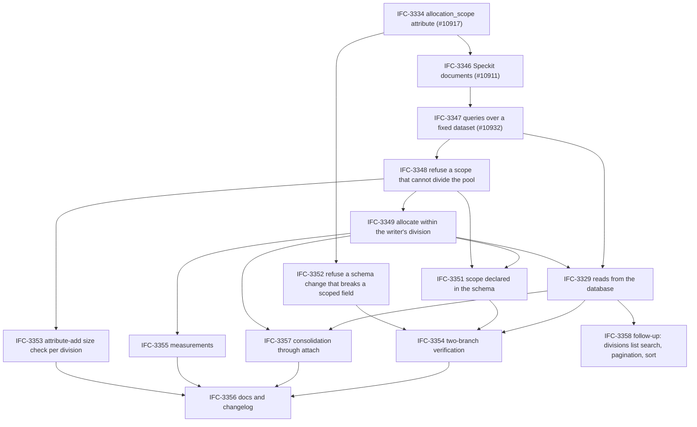

# Tasks: Scoped number pools — one pool serves every scope

**Input**: Design documents from `dev/specs/ifc-3185-scoped-number-pools/`

**Prerequisites**: [plan.md](./plan.md), [spec.md](./spec.md), [research.md](./research.md),
[data-model.md](./data-model.md), [contracts/](./contracts/),
[critiques/critique-20261002.md](./critiques/critique-20261002.md)

**Tests**: required. Constitution IV and the spec's Testing Decisions mandate them, and every branch
case is written with two branches because a single-branch test cannot tell a union from an
allocating-branch read.

**Organization**: one section per Jira ticket of the epic
[IFC-3185](https://opsmill.atlassian.net/browse/IFC-3185), in the merge order into
`feature-number-pools-1.12`. Each ticket is one pull request that merges on its own: a coherent
piece of behaviour with its own tests. The plan's change sets map onto the tickets as follows.

| Ticket | Pull request | Change sets | Delivers |
|---|---|---|---|
| [IFC-3334](https://opsmill.atlassian.net/browse/IFC-3334) | #10917 | A | `allocation_scope` on the pool and in the attribute parameters |
| [IFC-3346](https://opsmill.atlassian.net/browse/IFC-3346) | #10911 | documents | This spec directory, consistent with the tickets, and the GraphQL contract of the three number-pool queries; the bottom of the stack once #10917 has merged |
| [IFC-3347](https://opsmill.atlassian.net/browse/IFC-3347) | #10932 | B | The three queries over a fixed dataset, so the frontend can build |
| [IFC-3348](https://opsmill.atlassian.net/browse/IFC-3348) | new | D3 (validator) | A scope that cannot divide the pool is refused at save |
| [IFC-3352](https://opsmill.atlassian.net/browse/IFC-3352) | new | D4 | A schema change that breaks a scoped field is refused |
| [IFC-3349](https://opsmill.atlassian.net/browse/IFC-3349) | new | C, D1 | Allocation within the writer's division |
| [IFC-3353](https://opsmill.atlassian.net/browse/IFC-3353) | new | D3 (size check) | The attribute-add size check compares against the largest division |
| [IFC-3351](https://opsmill.atlassian.net/browse/IFC-3351) | new | D3 (schema) | The scope declared on a number-pool attribute in the schema |
| [IFC-3329](https://opsmill.atlassian.net/browse/IFC-3329) | new | D2, E | The three queries read the database; the fixed dataset is deleted |
| [IFC-3357](https://opsmill.atlassian.net/browse/IFC-3357) | new | US7 | Consolidation of per-site pools through attach |
| [IFC-3355](https://opsmill.atlassian.net/browse/IFC-3355) | new | F (measure) | SC-005 and SC-006 figures; one anchor order kept |
| [IFC-3354](https://opsmill.atlassian.net/browse/IFC-3354) | new | US6 | Two-branch verification of the branch seam |
| [IFC-3356](https://opsmill.atlassian.net/browse/IFC-3356) | new | F (close) | Docs, changelog, knowledge, SDK pointer |
| [IFC-3358](https://opsmill.atlassian.net/browse/IFC-3358) | follow-up | none | Search, pagination and sort orders of the divisions list, if the frontend needs them |

## Format: `[ID] [P?] [Story] Description`

- **[P]**: can run in parallel (different files, no dependency on another incomplete task)
- **[Story]**: US1 (contract), US2 (scoped allocation), US3 (division reads), US4
  (schema-declared scope), US5 (refusals), US6 (branch seam), US7 (consolidation), US8
  (measurement)
- Task IDs are stable; a task keeps its ID when it moves between tickets. Code citations are
  `module::Symbol`, never line numbers.
- Changelog fragments are written once, in IFC-3356; no other ticket carries one.

---

## IFC-3334: Add allocation_scope to NumberPool and Parameters (#10917)

**Delivers**: the attribute and the parameters field every generated type derives from (change set
A). The pull request also carries its rebase onto `feature-number-pools-1.12` and the regeneration
of the generated files after it.

**Depends on**: nothing. **Blocks**: IFC-3346, IFC-3352 and, through them, every other ticket. Merged on its own into `feature-number-pools-1.12`, outside the stack.

- [X] T005 Add `allocation_scope` (`kind="List"`, `optional=True`, description "Fields of the kind
      that divide the pool's space; allocation returns the lowest free number within the writer's
      division", order after `pool_type`) to
      `backend/infrahub/core/schema/definitions/core/resource_pool.py::core_number_pool`. No branch
      support override: the pool is agnostic.
- [X] T006 [P] Add `allocation_scope: list[str] | None = Field(default=None, …,
      json_schema_extra={"update": UpdateSupport.ALLOWED.value})` to
      `backend/infrahub/core/schema/attribute_parameters.py::NumberPoolParameters` with the same
      description as T005 and "same notation as uniqueness constraints".
- [X] T007 [P] Add the `List` field to the hand-maintained
      `tasks/backend.py::SdkSchemaGenerator.number_pool_parameters_fields` (the generated SDK,
      OpenAPI and REST models are not introspected from the Pydantic class).
- [X] T008 Regenerate: `uv run invoke backend.generate`, `uv run invoke
      schema.generate-graphqlschema`, `uv run invoke schema.generate-jsonschema`, `uv run invoke
      docs.generate`. Confirm `schema/schema.graphql` carries `allocation_scope: ListAttribute` on
      `CoreNumberPool` and `ListAttributeCreate` / `ListAttributeUpdate` on its three inputs, and
      `schema/openapi.json` carries it on `NumberPoolParametersWrite` / `Read`. Run `uv run pytest
      backend/tests/unit/core/schema/test_write_json_schema.py`.
- [X] T009 Component test in `backend/tests/component/core/schema/test_attribute_parameters.py`:
      a `NumberPool` attribute declaring `parameters.allocation_scope: ["site"]` loads and the
      parameters round-trip through the schema API; absent and `[]` both read back as unscoped.
- [X] T010 Component test in
      `backend/tests/component/graphql/resource_manager/number_pools/test_pool_scope.py` (new,
      using that folder's `helpers.py`): create a pool with `allocation_scope: {value: ["site"]}`
      and read it back; create without it and read `null`; update with `{value: null}` clears it.
      (Validation is not wired yet; this pins the round trip and the empty/null equivalence, User
      Story 1 scenario 1.)

**Checkpoint**: A merges. The SDK models come from
[infrahub-sdk-python#1402](https://github.com/opsmill/infrahub-sdk-python/pull/1402); the
`python_sdk` pointer moves to the merged commits in IFC-3356.

---

## IFC-3346: Align the Speckit documents of scoped number pools with the Jira tickets (#10911)

**Delivers**: the documents of this directory, consistent with the tickets of the epic, and the
written contract ([contracts/graphql-number-pool-surface.md](./contracts/graphql-number-pool-surface.md)).
No code. Based on `feature-number-pools-1.12` once #10917 (IFC-3334) has merged; every later pull request of the epic is based on it.

**Depends on**: IFC-3334 (merged). **Blocks**: IFC-3347 and, through it, every later ticket.

No tasks: the pull request carries the documents.

---

## IFC-3347: Serve the three number-pool queries from a fixed dataset so the frontend can build (#10932)

**Delivers**: the three dedicated root fields over a fixed in-memory dataset (change set B), the
description notes on the generic queries, the regenerated schema and frontend types, the SDL
snapshot that freezes the contract, and the test fixture every later ticket shares. The pull
request also carries its rebase onto `feature-number-pools-1.12`.

**Depends on**: IFC-3346, IFC-3334. **Blocks**: IFC-3348, IFC-3329.

**Note**: the queries read nothing from the database (contract section "Fixed dataset of the first
delivery"): `backend/infrahub/pools/number_pool_mock.py` holds a pool scoped by `site` returned for
any `pool_id` and an unscoped pool returned for the reserved id `mock-unscoped`. The tasks that
read real pools are listed under IFC-3329.

### Setup

- [X] T001 Read `dev/knowledge/backend/database-schema.md` (edge activity, the Resource Pool
      Reservations section, the retention predicate) and `dev/knowledge/backend/query-pattern.md`
      (branch-aware edge resolution, result dataclasses, "keep Cypher readable inline") before
      touching any query. Read `dev/guidelines/backend/component-design.md` before adding a class.
- [X] T002 Read `backend/infrahub/core/query/resource_manager.py::reserved_values_query` and its two
      UNION legs in full, `NumberPoolGetAllocated` (range-set filter, result dataclass), and
      `backend/infrahub/core/query/relationship.py::RelationshipGetPeerQuery` for how arrows are
      rendered from `direction`; D3's hop copies both. Read
      `backend/infrahub/graphql/queries/resource_manager.py` in full: the dedicated surface
      reuses its `NodeNotFoundError` pattern and changes nothing else there but descriptions. Read
      `backend/infrahub/pools/number_pool_repository.py::NumberPoolRepository.get_ranges`,
      `backend/infrahub/pools/number_pool_shorthand.py::NumberPoolShorthandMirror` (why
      `start_range` / `end_range` is null on a pool holding several ranges) and
      `backend/infrahub/graphql/mutations/resource_manager/number_pools/pool.py` (where the scope
      validation of IFC-3348 goes).
- [X] T003 [P] Add a scoped-pool test schema to `backend/tests/helpers/number_pool.py`: a kind with
      a **non-unique** `Number` attribute to pool, a required cardinality-one relationship (`site`
      → a site kind), a required scalar attribute (`role`, Dropdown), an optional attribute, a many
      relationship and a self-referencing cardinality-one relationship (for the direction case).
      Do not reuse `tests/helpers/schema/snow.py::SNOW_TASK`: its pooled attribute is `unique`, and
      the global taken-values scan masks scoped behaviour. Add a `scoped_pool_schema` fixture, a
      helper that creates N sites and M nodes per site, and a helper that creates a pool with two
      ranges (`1 - 50` weighted 10, `51 - 100` unweighted) so the contract examples can be
      reproduced.
- [X] T004 [P] Create `backend/tests/unit/pools/__init__.py` if absent and
      `backend/tests/component/core/constraint_validators/__init__.py` if absent, so the new test
      modules are collected.

### The fixed dataset and the surface

- [X] T011 [P] [US1] Unit tests in `backend/tests/unit/pools/test_number_pool_mock.py`: the
      figures computed from the dataset's rows (the figures of one division over the pool and over
      each range, distinct values never summed across divisions, site D absent from the divisions
      list), each filter alone and combined, the partial division filter keeping `D1`'s row on
      `branch1`, ordering, `count` before `offset` and `limit`, the `range_id` and `division`
      refusals, a missing or incomplete `division` refused by the utilization query on the scoped
      dataset, a dataset holding a value the pool cannot allocate refused, the unscoped dataset.
- [X] T013 [P] [US1] Component tests in
      `backend/tests/component/graphql/queries/test_number_pool_surface.py` on the fixed dataset,
      read through the GraphQL schema: the scoped utilization refused without `division`, the
      divisions A, B, C over the whole pool without site D, the utilization of site B (30 of 100,
      `1 - 50` 0 of 50, `51 - 100` 30 of 50), a filtered read on site B whose `count` equals site
      B's `used`, the filter on site A returning `D1`'s row on `branch1`, the `provenance` filter,
      the unscoped dataset for `mock-unscoped`, and every refusal message the dataset applies
      (unknown `range_id` on the allocations query, `division` on the unscoped dataset on both
      queries, a path other than `site`, the same path twice).
- [X] T017 [US1] Create `backend/infrahub/pools/number_pool_mock.py` (pure, no database read): the
      scoped dataset of the contract (sites A, B and C, and site D with no value; `D1` in site A on
      `main` and in site C on `branch1`; a `PROVIDED` row; every row inside the pool's space)
      returned for any `pool_id`, the unscoped dataset returned for `mock-unscoped`, and
      `get_utilization`, `get_divisions` and `get_allocations`, which compute every figure from the
      rows, filter, order and paginate in memory, and raise the contract's `range_id` and `division`
      refusals.
- [X] T018 [US1] Create `backend/infrahub/graphql/queries/number_pool.py` with the object types
      `NumberPoolUtilization`, `NumberPoolUtilizationFigures`, `NumberPoolRangeUtilization`,
      `NumberPoolDivisions`, `NumberPoolDivision`, `NumberPoolDivisionEntry`,
      `NumberPoolAllocations`, `NumberPoolAllocation`, `NumberPoolHolder`, `NumberPoolRangeRef`,
      the input `NumberPoolDivisionEntryInput` and the graphene `Enum` `NumberPoolProvenance`
      (`ALLOCATED`, `PROVIDED`), with the field descriptions of the contract verbatim. Add a shared
      `_load_number_pool(graphql_context, pool_id) -> CoreNumberPool` raising
      `NodeNotFoundError(node_type="CoreNumberPool", identifier=pool_id)` for any other kind, a
      shared `_ranges(db, pool, branch, at)` ordered by `start`, and a shared
      `_scope_in_force(pool, branch) -> tuple[ScopeEntry, ...]` over `entries_in_force`. (Done for
      the types; the resolvers call the fixed dataset, and the shared loaders land with T019 to
      T021.)
- [X] T022 [US1] Register the three root fields in
      `backend/infrahub/graphql/schema.py::InfrahubBaseQuery` as `InfrahubNumberPoolUtilization`,
      `InfrahubNumberPoolDivisions` and `InfrahubNumberPoolAllocations`, each a `Field` with the
      arguments and the root-field descriptions of the contract, `required=True`.
- [X] T023 [P] [US1] In `backend/infrahub/graphql/queries/resource_manager.py`, add
      `description=` to the root `Field`s `InfrahubResourcePoolUtilization` and
      `InfrahubResourcePoolAllocated` and a `class Meta: description = …` to `PoolUtilization`,
      `PoolAllocated` and `PoolAllocatedNode`, with the two note texts of the contract's "Generic
      queries frozen for number pools" table. No other change in the file.

### Freeze

- [X] T024 [US1] Regenerate: `uv run invoke schema.generate-graphqlschema`, then
      `cd frontend/app && pnpm codegen`. Diff `schema/schema.graphql` against the contract's SDL
      and confirm that `PoolUtilization`, `PoolAllocated`, `PoolAllocatedNode`,
      `IPPrefixUtilizationEdge`, `IPPoolUtilizationResource` and the two generic root fields differ
      from the previous export in description text only (SC-009). Run `uv run invoke docs.validate`.
- [X] T025 [US1] Add the snapshot test
      `backend/tests/unit/graphql/test_number_pool_surface_contract.py` pinning the printed SDL of
      the ten object types, the input, the enum, the three root fields and the `allocation_scope`
      field of the three `CoreNumberPool` inputs, so a later ticket cannot rename, retype or remove
      what this ticket published (FR-018).

**Checkpoint**: B merges. Frontend and SDK start from the exported schema. Everything below changes
no published field; the only later visible change is the fixed dataset giving way to real reads.

---

## IFC-3348: Refuse a pool allocation scope that cannot divide the pool

**Delivers**: the scope validator and its wiring into the pool mutations (User Story 5 scenario 1,
FR-009, FR-013, FR-020), plus the pure parts of `pools/scope.py` that every later ticket imports.
It lands before scoped allocation so that the division resolver only meets scopes the validator
accepted.

**Depends on**: IFC-3334, IFC-3347. **Blocks**: IFC-3349, IFC-3351, IFC-3353.

- [ ] T027 [US2] Create `backend/infrahub/pools/scope.py` with `ScopeEntry`, `DivisionKey` (frozen
      dataclass: the entries and the writer's value per entry) and
      `DivisionResolver.entries_in_force(scope, schema_branch, kind)` (pure) dropping every entry
      the branch's schema does not define on the kind, keeping scope order, carrying the
      relationship identifier for relationship entries. `division_of` lands with IFC-3349 (T040).
- [ ] T028 [P] [US2] Unit tests in `backend/tests/unit/pools/test_scope.py` for
      `entries_in_force`: an entry the branch's schema does not define is dropped; all unknown →
      empty tuple; order preserved; relationship entries carry the relationship identifier.
- [ ] T053 [P] [US5] Unit tests in `backend/tests/unit/pools/test_scope.py` (extend) for
      `ScopeValidator`: every refusal row of `contracts/graphql-pool-scope.md` (optional attribute,
      optional relationship, many relationship, related-node path, list kind, JSON kind, the pool's
      own attribute, duplicate, entry not defined on the kind) names the entry; any scope on a pool
      whose attribute is `unique: true` is refused naming the attribute; on a kind that inherits the
      pooled attribute from a generic, an entry declared on the kind but not on the generic is
      refused naming the generic, and an entry declared on the generic is accepted; `role__value`
      normalises to `role`; a valid two-entry scope returns the normalised tuple. Build the
      `SchemaBranch` from T003's schema in memory, extended with a generic that declares the pooled
      attribute and a required `site`, implemented by two kinds of which one declares an extra
      required `pod`.
- [ ] T054 [P] [US5] Component tests in
      `backend/tests/component/graphql/resource_manager/number_pools/test_pool_scope.py` (extend
      T010's file): each refused entry through `CoreNumberPoolCreate` and `CoreNumberPoolUpdate`; a
      valid scope through create, update and upsert; a scope naming a field that exists only on
      branch `b1` is refused on `b1` and on the default branch naming the entry; the same scope
      saves from any branch once the field is merged into the default branch; a pool re-sent whole
      from a branch forked before the field reached the default branch saves; a scope on a pool
      whose attribute is `unique: true` is refused naming the attribute; a scope change on a
      `pool_type: Schema` pool is refused with the message of the scope contract, of the same form
      as the shorthand refusal in `test_schema_pools.py`.
- [ ] T057 [US5] Add `ScopeValidator(schema_branch)` to `backend/infrahub/pools/scope.py` with
      `validate(kind, attribute_name, scope) -> tuple[str, ...]`: calls
      `SchemaBranch.validate_schema_path(allowed_path_types=SchemaElementPathType.ATTR |
      SchemaElementPathType.REL_ONE_MANDATORY_NO_ATTR)`, then checks `optional` on the field itself
      (relationships included, because the path validator exempts `ip_namespace`), the attribute
      kind against list and JSON, the pool's own attribute, duplicates; normalises `__value` away;
      raises `ValidationError({"allocation_scope": …})` naming the entry.
- [ ] T091 [US5] Add to `ScopeValidator` the two rules of the Notion PRD's FR-017 carve-out and
      FR-015 generic case: refuse any scope when the target attribute's schema has `unique: true`,
      naming the attribute; when the pool's `node` is a generic, or the kind inherits the pooled
      attribute from a generic, resolve every entry on that generic's schema and refuse an entry the
      generic does not declare as a required cardinality-one field, naming the generic. The
      division of a node is then read from the generic's fields (T040).
- [ ] T058 [US5] Wire it into
      `backend/infrahub/graphql/mutations/resource_manager/number_pools/pool.py::InfrahubNumberPoolMutation`:
      `mutate_create` and `mutate_update` validate whenever the payload carries `allocation_scope`,
      against the default branch's schema,
      `registry.schema.get_schema_branch(name=registry.default_branch)`, whatever branch the
      mutation runs on; `mutate_update` refuses any change on a `pool_type == Schema` pool with the
      scope contract's message, beside `_refuse_shorthand_conflicts`.

**Checkpoint**: every pool-save refusal of User Story 5 scenario 1 ships.

---

## IFC-3352: Refuse a schema change that breaks a field a scoped pool depends on

**Delivers**: the dependency checker over existing pools (User Story 5 scenarios 2 and 3, FR-010;
change set D4): a schema load that makes a scoped entry optional, absent or cardinality many, or
that makes the pool's own attribute `unique: true` while the pool carries a scope, is refused
naming the pool. It needs nothing from allocation or reads and runs in parallel with IFC-3348 and
IFC-3349.

**Depends on**: IFC-3334. **Blocks**: IFC-3354.

- [ ] T063 [P] [US5] Unit test in `backend/tests/unit/core/validators/test_scoped_pool_dependency.py`:
      `ScopedPoolDependencyChecker.check` with a `node_schema` that no longer holds the field reads
      kind and field from `request.schema_path` and does not raise on the lookup itself.
- [ ] T064 [P] [US5] Component tests in
      `backend/tests/component/core/constraint_validators/test_scoped_pool_dependency.py`: a pool
      scoped by `site`; three loads (optional, removed, cardinality many) → three refusals naming the
      pool; a pool scoped by `["site", "pod"]` and a load on a branch forked before `pod` reached
      the default branch, where `pod` never existed → accepted; a load that sets `unique: true` on
      the pool's own attribute while the pool carries a scope → refused naming the pool; a pool
      scoped by `site` on a generic and a load that makes `site` optional on the generic → refused
      naming the pool, while a change on a field an implementing kind declares on its own is not
      checked; `node_attribute` itself removed → the existing attribute-removal path still governs
      (no double refusal).
- [ ] T065 [P] [US5] Component tests in `backend/tests/component/pools/test_pools_referencing_field.py`
      for `PoolsReferencingField.get`: pools on the kind, on a generic the kind inherits from, by
      scope entry and by `node_attribute`; a pool on an unrelated kind is not returned.
- [ ] T066 [US5] Create `backend/infrahub/pools/referencing.py::PoolsReferencingField` (repository,
      `db` in the constructor, `get(kind, field_name, branch) -> list[CoreNumberPool]`) using
      `NodeManager.query(CoreNumberPool, filters={"node__values": [kind, *generics]})` and a Python
      filter on `allocation_scope` and `node_attribute`.
- [ ] T067 [US5] Create `backend/infrahub/core/validators/pool/__init__.py` and
      `backend/infrahub/core/validators/pool/scope.py::ScopedPoolDependencyChecker` (name
      `pool.scope.dependency`; `supports` for the constraint names below; `check` raises
      `ValueError` naming each pool, skipping entries absent from the branch's schema, and also
      refuses the constraint that sets `unique: true` on an attribute when a scoped pool allocates
      that attribute). Register it in
      `backend/infrahub/core/validators/__init__.py::CONSTRAINT_VALIDATOR_MAP` for
      `attribute.optional.update`, `relationship.optional.update`,
      `relationship.cardinality.update`, `node.attribute.remove`, `node.relationship.remove` and
      the existing constraint name for `attribute.unique` changes (verify the name in the map). Do not
      touch `core/models.py`: `add_validator_for_migration` already turns the removal migrations
      into constraints. The map holds one checker class per name and
      `core/validators/determiner.py` instantiates it by name, so for the three update names that
      already map to a checker add a `CompositeConstraintChecker` in
      `backend/infrahub/core/validators/composite.py` that takes the checker classes in its
      constructor, instantiates each with the same `db` and `branch`, `supports` when any does, and
      concatenates their `check` results (a raised `ValueError` propagates as it does today); map the
      two removal names, unmapped today, to the new checker directly. Unit-test the composite in
      `backend/tests/unit/core/validators/test_composite_checker.py`.
- [ ] T068 [US5] Integration-docker test
      `backend/tests/integration_docker/test_number_pool_scope_schema_load.py` (shard marker as the
      other tests in that folder): the removal refusal through the schema-load API names the pool.

**Checkpoint**: every schema-load refusal of User Story 5 ships and names the pool.

---

## IFC-3349: Allocate the lowest free number within the writer's division

**Delivers**: User Story 2 end to end (change sets C and D1): the division resolver, the scoped
records fragment, the division threaded from every write path to the free and used queries, the
pool handling deferred on update and on template create until every field is applied (FR-002), and
the allocation lock keyed by pool and division (FR-031). Unscoped pools issue the same query and
take the same lock as today.

**Depends on**: IFC-3334, IFC-3347, IFC-3348. **Blocks**: IFC-3329, IFC-3351, IFC-3355, IFC-3357.

**Independent Test**: the scoped pool fixture; devices in several sites through the ordinary
allocation path, on one branch and on two.

### The seams

- [ ] T029 [US2] Thread `division: DivisionKey | None = None` along the allocation path:
      `backend/infrahub/pools/number_pool_attribute_allocator.py::NumberPoolAttributeAllocator.allocate`
      → `backend/infrahub/core/node/resource_manager/number_pool.py::CoreNumberPool.get_resource`
      → `backend/infrahub/pools/number_pool_number_picker.py::NumberPoolNumberPicker.next_number`
      → `backend/infrahub/pools/number_pool_repository.py::NumberPoolRepository.get_free` and
      `get_used` → the `NumberPoolGetFree` and `NumberPoolGetUsed` constructors in
      `backend/infrahub/core/query/resource_manager.py`. `NumberPoolRepository.get_taken` and
      `NumberPoolGetTaken` keep the global scan over the attribute (the `unique: true` edge case of
      the spec). The queries ignore the division in this task; the unscoped text is unchanged.
- [ ] T030 [US2] Defer pool handling on update in `Node.from_graphql`
      (`backend/infrahub/core/node/__init__.py`): apply every attribute with
      `process_pools=False`, collect the attributes whose payload carried `from_pool`, then call
      `handle_pool` for each after the loop. `BaseAttribute.from_graphql` keeps assigning
      `from_pool` inline (the mutation lock names are read from it). Assert `Node.from_graphql` still
      has exactly its two callers.
- [ ] T031 [US2] Defer pool handling on template create: in
      `backend/infrahub/templates/node_applier.py::NodeTemplateApplier._handle_pool_relationship`,
      record the pool id and mark the attribute pending in `TemplatePoolFields.pending` instead of
      allocating through `pools/default_allocator.py::DefaultPoolAllocator`; in
      `Node._process_fields_attributes`, run `handle_pool` for pending attributes after the
      relationships are applied. Remove `DefaultPoolAllocator.allocate_for_attribute` if it has no
      other caller; otherwise leave it and note the caller.
- [ ] T032 [US2] Functional tests in `backend/tests/functional/pools/test_numberpool_lifecycle.py`
      (extend): a scoped field changed and `from_pool` sent in one update allocates after the
      relationship is applied and the pool lock is taken after the division is resolved; a
      template-created node allocates after its relationships exist. These pass with an unscoped
      pool (lock `resource_pool.<id>`) and gain scoped assertions with T039.
- [ ] T092 [US2] Key the allocation lock by pool and division (FR-031): in
      `backend/infrahub/core/node/resource_manager/number_pool.py::CoreNumberPool.get_resource`,
      lock on `resource_pool.<pool id>.<division key>` when a division is given (the key is the
      normalised tuple of the writer's entry values in scope order) and on `resource_pool.<pool
      id>` otherwise, after the division is resolved. Decide what happens to the mutation-level pool
      lock that `backend/infrahub/core/node/lock_utils.py::get_lock_names_on_object_mutation`
      derives from `from_pool` before the node is saved: remove it for `from_pool` allocations, or
      keep it as a pool-level guard, so that two writers in different divisions allocate in
      parallel; record the choice in the PR description. Every write that takes the pool lock for a
      tracked attribute uses the same key.

### Tests first

- [ ] T036 [P] [US2] Snapshot test in
      `backend/tests/component/core/resource_manager/test_number_pool_query.py`: the text
      `reserved_values_query` renders with `division=None, with_branch=False` is byte-for-byte
      today's (capture it before T040).
- [ ] T037 [P] [US2] Component tests in
      `backend/tests/component/core/resource_manager/test_division_resolver.py` for
      `DivisionResolver.division_of`: relationship entry (peer set by id, by node, by
      human-friendly id), attribute entry, enum attribute unwrapped, two entries in scope order.
- [ ] T038 [P] [US2] Component tests in
      `backend/tests/component/core/resource_manager/test_number_pool_scoped_query.py`
      (`NumberPoolGetFree` / `NumberPoolGetUsed` with a division): one relationship entry; one
      attribute entry; two entries; the FR-001 two-branch case (D1 holds 5 in A on the default
      branch, moved to C on `b1`: default branch reads 6 free in A, 6 in C, 5 in D; delete `b1` → 5
      free in C with no write); the fork-window case on the hop (D1 moved from A to C **on the
      default branch** after `b0` forked: `b0` still reads 5 as taken in A); a self-referencing
      relationship entry collects only the forward peers; every entry unknown → the unscoped
      result.
- [ ] T039 [P] [US2] Functional tests in
      `backend/tests/functional/pools/test_numberpool_scoped_allocation.py` through GraphQL: the
      User Story 2 scenarios 1, 2, 3, 7, 8 and 9 of `spec.md`; fifty concurrent creates in site A
      yield fifty distinct numbers and fifty in A plus fifty in B yield 1–50 twice (FR-004); two
      writers in different divisions hold different lock keys and allocate in parallel, two writers
      in one division serialise on `resource_pool.<pool id>.<division key>` (FR-031); on a kind that
      inherits the pooled attribute from a generic, the division is read from the generic's fields;
      the T032 deferral tests gain their scoped assertions.

### The division resolver and the scoped fragment

- [ ] T040 [US2] Add `DivisionResolver.division_of(db, node, entries) -> DivisionKey` to
      `backend/infrahub/pools/scope.py` (peer id through `RelationshipManager.get_peer_id`,
      attribute `.value`, enum unwrapped, `None` kept as `None`). In
      `backend/infrahub/core/node/__init__.py::Node.handle_pool`, resolve the entries against
      `registry.schema.get_schema_branch(name=self._branch.name)` from
      `number_pool.allocation_scope.value`, on the generic's schema when the pooled attribute is
      inherited from a generic, compute the division from `self`, and pass it to
      `NumberPoolAttributeAllocator.allocate`. Keep every existing refusal and message.
- [ ] T041 [US2] Pass the division from the two remaining allocation callers:
      `backend/infrahub/core/node/create.py` (template allocation after `obj.new()`) and
      `backend/infrahub/core/migrations/schema/node_attribute_add.py` (the backfill: load the scoped
      fields in the same query that loads `{"id", attr}` so there is no per-node round trip).
- [ ] T042 [US2] Extend `backend/infrahub/core/query/resource_manager.py::reserved_values_query`
      with `division: DivisionKey | None = None` and `with_branch: bool = False`. Lift the two-leg
      visibility predicate into a named module constant (open now on a non-deleting branch; or
      closed on the default branch, still inside a live fork window, with no hiding edge on the same
      vertex) and use it for the value read and for each entry hop. With a division: match
      `(n:Node)-[:HAS_ATTRIBUTE]->(attr)`, one `CALL` per entry collecting the peer uuids
      (relationship, arrows from `direction`, `Relationship {name: $identifier}`) or the values
      (attribute), then `WHERE $entry_i_value IN entry_i_values` for every entry, before the value
      read. Bind every name and value as a parameter. With `with_branch`, project `branch` from both
      legs and end `WITH DISTINCT res, value, branch`.
- [ ] T043 [US2] Render the division-side anchor as a second shape behind the same parameter (match
      the writer's peer or value vertex, walk to the nodes holding it, then to their reserved
      attributes for this pool), selected by a module-level switch, so T077 can profile both. Both
      must pass T038.
- [ ] T044 [US2] Pass the division from `NumberPoolRepository.get_free` and `get_used` into the
      fragment. `NumberPoolNumberPicker.next_number` keeps its structure: it clips the ranges to the
      attribute's domain with `EffectiveSpace`, drains the segments heaviest first and calls
      `get_free` once per segment; the division travels through it and is applied inside the
      fragment, not in the range walk.
- [ ] T045 [US2] Run T036 to T039 and the regression set: `uv run pytest
      backend/tests/component/core/resource_manager/ backend/tests/component/graphql/resource_manager/
      backend/tests/component/graphql/queries/ backend/tests/functional/pools/`, with identical
      figures (FR-005, SC-003) and an unchanged SDL snapshot (T025).

**Checkpoint**: User Story 2 is functional; scoped pools allocate per division.

---

## IFC-3353: Refuse adding a scoped number-pool attribute smaller than its largest division

**Delivers**: the division enumeration query over the nodes of a kind and the attribute-add size
check against the largest division (research decision D9). The divisions list of the dedicated
queries derives from the allocation rows, so this checker is the query's only consumer.

**Depends on**: IFC-3334, IFC-3348 (`entries_in_force`). Reuses the visibility constant of
IFC-3349 when it has merged; otherwise introduces it and IFC-3349 adopts it. **Blocks**: IFC-3356.

- [ ] T046 [P] [US3] Component tests in
      `backend/tests/component/core/resource_manager/test_number_pool_divisions_query.py` for
      `NumberPoolDivisions`: distinct tuples over nodes on the default branch and on `b1`; a
      node with no record still yields its division; a deleted node's division disappears; a
      `DELETING` branch's nodes are excluded; two entries.
- [ ] T048 [US3] Add `NumberPoolDivisions` to `backend/infrahub/core/query/resource_manager.py`:
      over `(n:Node:<kind>)-[:IS_PART_OF]->(:Root)` with the visibility constant on the
      `IS_PART_OF` edge and one `CALL` per entry (same shape as T042), return the distinct tuple of
      entry values with `count(DISTINCT n.uuid)`; frozen dataclass result; `ORDER BY` on the tuple.
- [ ] T056 [P] [US4] Component test in
      `backend/tests/component/core/constraint_validators/test_attribute_numberpool_constraints.py`
      (extend): adding a scoped `NumberPool` attribute of size 10 to a kind with 25 nodes spread
      over three sites (max 9 per site) is accepted; with 11 in one site it is refused with the
      division count in the message.
- [ ] T061 [US4] In `backend/infrahub/core/validators/node/attribute.py::NodeAttributeAddChecker`,
      when the added `NumberPool` attribute declares a scope, compare the pool size against the
      largest per-division node count from `NumberPoolDivisions` (entries resolved with
      `DivisionResolver.entries_in_force` against `request.node_schema`'s branch). Needs T048.

**Checkpoint**: the unscoped size check keeps its message; the scoped check compares per division.

---

## IFC-3351: Declare the allocation scope on a number-pool attribute in the schema

**Delivers**: User Story 4 (FR-012, FR-013): the schema-created pool carries the declared scope, a
default-branch schema load that changes the declaration updates the pool, and an invalid declared
entry refuses the load.

**Depends on**: IFC-3348 (the validator), IFC-3349 (the allocation assertions). **Blocks**: IFC-3354.

- [ ] T055 [P] [US4] Component tests in `backend/tests/component/pools/test_schema_number_pool_scope.py`:
      `vlan_id` with ranges 100–200 and scope `["site"]` → the created pool reads back the scope and
      two sites both receive 100; clearing the scope on the default branch and reloading → next
      allocation 102; a scope declared on `b1` only does not change the pool until merge; a direct
      `CoreNumberPoolUpdate` of the scope is refused with the default-branch message; a declaration
      naming an optional field, a many relationship, a related-node path or an unknown field is
      refused at load naming the entry; a declaration on a `unique: true` number-pool attribute is
      refused at load naming the attribute; on a generic that declares the pooled attribute, a
      declaration naming a field that only an implementing kind declares is refused at load naming
      the generic.
- [ ] T059 [US4] Write the schema-declared scope onto the pool:
      `backend/infrahub/pools/schema_number_pool_upserter.py::SchemaNumberPoolUpserter.upsert_number_pool`
      sets `allocation_scope` from the parameters at creation;
      `backend/infrahub/pools/schema_number_pool_synchronizer.py::SchemaNumberPoolSynchronizer._update_pool_from_schema`
      copies it from the default-branch schema when it differs, as it does the bounds.
- [ ] T060 [US4] Call `ScopeValidator` from
      `backend/infrahub/core/schema/schema_branch.py::SchemaBranch._validate_number_pool_parameters`
      with `self` as the schema branch when `parameters.allocation_scope` is set.
- [ ] T062 [US4] Run T055 and
      `backend/tests/integration/schema_lifecycle/test_attribute_parameters_update.py`.

**Checkpoint**: schema-created pools carry and honour a declared scope.

---

## IFC-3329: Show number pool usage for each allocation scope

**Delivers**: User Story 3 and the open part of User Story 1 (change sets D2 and E): the
allocated-rows query on the shared fragment with branch, provenance, in-space and per-entry
division values; the pure division reporter; the three resolvers reading the database; the fixed
dataset deleted. The three queries switch together so that they agree with each other (SC-010).

**Depends on**: IFC-3347, IFC-3349. **Blocks**: IFC-3354, IFC-3356, IFC-3357, IFC-3358.

**Independent Test**: uneven occupancy across sites on the scoped fixture; compare the headline, the
division rows, the range rows and the filtered allocation list against the records.

### Tests first

- [ ] T012 [P] [US1] Component tests in
      `backend/tests/component/graphql/queries/test_number_pool_surface.py` on the unscoped
      two-range pool of T003 (its shorthand `start_range` / `end_range` is null) holding 1 and 51
      on the default branch, 7 on `b1` only, 500 provided on the default branch and held by no
      range, and 40 provided on the default branch while the attribute lists 40 in
      `excluded_values`: `InfrahubNumberPoolUtilization` returns `allocation_scope: []`, `figures`
      `{size: 99, used: 3, used_default_branch: 2, used_branches: 1}` with the three percentages,
      two ranges ordered by start with id, display label, start, end, weight (10 and 0) and figures
      `{50, 2, 1, 1}` and `{50, 1, 1, 0}`; `InfrahubNumberPoolDivisions` returns `count` 0, an
      empty `allocation_scope` and an empty `divisions` list; `InfrahubNumberPoolAllocations`
      returns three rows (1, 7 and 51; 40 and 500 are not listed) ordered by value then branch then
      holder id, each with `holder {id hfid kind display_label}` read on the row's branch,
      `identifier`, `provenance` (`ALLOCATED`) and `range`; the filters `branch: "b1"`,
      `provenance: PROVIDED` (no row), `range_id` of `1 - 50` (1 and 7) each return the expected
      rows with `count` before pagination; `offset` and `limit` page the ordered list; `division`
      on this pool is refused with the contract's message. A second case with the attribute's
      `max_value` below a range's end checks that a value above the limit is not listed and counts
      in no figure.
- [ ] T014 [P] [US1] Component tests in the same file for refusals: an IP prefix pool as
      `pool_id` and a random uuid both raise `NodeNotFoundError` naming the id; `range_id` of
      another pool's range raises `ValidationError` naming the pool and the range; an unknown
      `branch` raises `BranchNotFoundError`.
- [ ] T015 [P] [US1] Regression tests in
      `backend/tests/component/graphql/queries/test_resource_pool.py`: `InfrahubResourcePoolUtilization`
      and `InfrahubResourcePoolAllocated` on the same unscoped pool return exactly what they
      return before this ticket (count, percentages, edges, the 500 row absent); on the scoped pool
      they return pool-wide figures and the whole pool's values (FR-029).
- [ ] T034 [P] [US3] Unit tests in `backend/tests/unit/pools/test_division_report.py`: divisions
      ordered by utilization; a division with nodes and no records is not listed; branch split per
      division; absolute counts (`size`, `used`, `used_default_branch`, `used_branches`) per
      division; unscoped single division equals the whole; `of_within` reports `used` 0 for a range
      in which the division holds no value (spec User Story 3, scenario 3).
- [ ] T047 [P] [US3] Extend `backend/tests/component/graphql/queries/test_number_pool_surface.py`
      with the real-division cases, replacing the T013 fixed-dataset assertions: the spec's User Story 3
      scenario 1 (A 50 records, B two nodes no records, C no nodes → A alone listed with 50 of
      100, no division for B or C, utilization without `division` refused); scenario 2 (branch
      split over the division read); scenario 3 (the division of A reports 40 of 100, `1 - 50` 40
      of 50 and `51 - 100` 0 of 50; the division of B reports 30 of 100, `1 - 50` 0 of 50 and
      `51 - 100` 30 of 50); scenario 4 (a division keyed by a site that exists
      only on `b1`, read from the default branch, is listed with `display_label` falling back to the
      id and `peer_kind` null); scenario 5 (D1 holding 5 in A on the default branch and moved to C
      on `b1`: the allocation list filtered on A returns D1's two rows, the `b1` row listed because
      D1 carries A on the default branch; filtered on C, the same two rows; SC-010 holds for both);
      a partial two-entry filter on a `["site", "role"]` pool; `InfrahubResourcePoolAllocated`
      count, offset and limit unchanged across the fragment move.
- [ ] T085 [P] [US3] Component test in the same file (scenario of part 2, IFC-3184 T064): a number
      attached outside the ranges is not listed and counts in no figure; once a range is widened to
      hold it, it is listed with that range and counts, with no new attach; when a range is removed
      under a tracked number, the number is no longer listed and no longer counts.
- [ ] T086 [P] [US3] Component test in the same file (scenario of part 2, IFC-3184 T065): one
      record whose value is inside the space on one branch and outside it on another is listed
      once, with the `branch` on which it is inside the space, and counts only there.
- [ ] T087 [P] [US3] Component test in the same file (scenario of part 2, IFC-3184 T066): number 50
      allocated in site A and attached on site B with no uniqueness constraint gives two rows, one
      `ALLOCATED` and one `PROVIDED`, while the pool's `used` counts 50 once.

### The rows query and the reporter

- [ ] T016 [US1] Extend `backend/infrahub/core/query/resource_manager.py::NumberPoolGetAllocated`:
      keep the `ranges` constructor argument and make it optional (`None` lists every tracked
      value; the dedicated callers pass `EffectiveSpace.as_query_ranges()` or the segments of the
      one range of `range_id`; the generic callers pass the space's segments as today); add
      `branch_name: str | None = None` and `provenance: PoolRecordProvenance | None = None`;
      project `coalesce(ir.provenance, $allocated_provenance) AS provenance`; add `provenance:
      PoolRecordProvenance` to `NumberPoolAllocatedResult`; keep `ORDER BY av.value, hv.branch,
      n.uuid`. A row outside the pool's space is dropped
      (`backend/infrahub/pools/number_ranges.py::EffectiveSpace.contains`); the `range` of each row
      comes from `EffectiveSpace.range_for`. The
      generic callers (`resolve_number_pool_allocation`, `NumberUtilizationGetter`) pass nothing
      new and render the same text as today. Component test in
      `backend/tests/component/core/resource_manager/test_number_pool.py` (extend): each filter
      alone and combined; two ranges with a null shorthand; the default renders today's rows.
- [ ] T016a [US1] Obsolete. The stand-in module `pools/effective_space.py` is not created:
      `backend/infrahub/pools/number_ranges.py::EffectiveSpace` (size, `size_of`, `contains`,
      `range_for`, `as_query_ranges`) is the shared effective-space calculation, built from the
      pool's ranges and the attribute's domain by `pools/number_pool_space.py`.
- [ ] T033 [US3] Reduce `backend/infrahub/pools/number.py::NumberUtilizationGetter` (constructor
      `db`, `pool`, `space: EffectiveSpace`, `branch`, `at`) to a seam: `load_data` loads the rows
      and hands them, the entries in force and the space to `DivisionReporter`; add
      `backend/infrahub/pools/division_report.py` with `Figures`, `DivisionFigures`,
      `DivisionReport` (`divisions`, `of(key)`, `of_within(key, start, end)`) and
      `DivisionReporter.report(rows, space, entries)`. With no entries it returns one division with
      an empty key and today's figures. `figures` and `range_figures(range_id)` on the getter keep
      their values for an unscoped pool, so the generic resolver reads unchanged figures.
- [ ] T035 [US3] Regression: run `uv run pytest backend/tests/component/core/resource_manager/
      backend/tests/component/graphql/resource_manager/ backend/tests/component/graphql/queries/
      backend/tests/functional/pools/` and confirm identical figures (FR-005, SC-003) and an
      unchanged SDL snapshot (T025).
- [ ] T049 [US3] Move `NumberPoolGetAllocated` onto the shared fragment with `with_branch=True`
      and, when scoped, the per-entry value lists per row and a `division` filter rendered like the
      writer's division in T042 (requested entries instead of the writer's); keep `n.uuid`,
      `res.identifier`, `value`, `branch`, `provenance` and the T016 filters in the result and
      constructor because `resolve_number_pool_allocation` and the dedicated resolvers share the
      class.
- [ ] T050 [US3] Complete `NumberUtilizationGetter.load_data`: run the rows query, resolve the
      entries in force on the reading branch, hand everything to `DivisionReporter`; expose
      `report.divisions`, `report.of` and `report.of_within`.

### The resolvers

- [ ] T019 [US1] Add `_figures(size, used_default_branch, used_branches) -> dict` in
      `backend/infrahub/graphql/queries/number_pool.py` (absolute counts plus the three
      percentages, 0 when `size` is 0) and the resolver `resolve_number_pool_utilization_surface`:
      rows from `NumberPoolGetAllocated(ranges=space.as_query_ranges())` split into default-branch
      and other-branch value sets through the reporter; pool `figures` with `size` from
      `EffectiveSpace.size`; each range's figures from `EffectiveSpace.size_of(range_id)` and the
      values within its bounds; `allocation_scope` from `_scope_in_force`; `id` and `display_label`
      from the pool. Validate `division` as T021 does and also refuse one that omits a path in
      force, naming the missing paths; with it, compute every figure and the count over the rows of
      that division; refuse a scoped pool read without `division` (FR-011).
- [ ] T020 [US1] Add `resolve_number_pool_divisions`: with an empty scope in force return `count`
      0 and an empty `divisions` list; otherwise list the
      divisions holding at least one row from `report.divisions`, compute each division's figures
      over the pool's space, build `entries` with `value` and `display_label` from the key and
      `peer_kind` None, join labels with `" / "`, order by `utilization` descending then
      `display_label`, set `count`.
- [ ] T021 [US1] Add `resolve_number_pool_allocations`: validate `range_id`; translate it to the
      one range's segments, otherwise pass the pool's space; validate `division`
      (non-empty scope in force, every path in force, no duplicate; messages of the contract); run
      `NumberPoolGetAllocated` with `ranges`, `branch_name` (after
      `registry.get_branch` so an unknown branch raises `BranchNotFoundError`), `provenance`,
      `offset`, `limit`; when `division` is given, pass it to the query so `count`, `offset` and
      `limit` are Cypher-side; build each row: `holder` from one `NodeManager.get_many(ids,
      branch=<row branch>, at)` per distinct branch (`display_label`, `hfid` via `get_hfid`, `kind`
      from the pool's `node`), `range` from `EffectiveSpace.range_for`.
- [ ] T051 [US3] Replace the fixed dataset in `backend/infrahub/graphql/queries/number_pool.py`: pool
      `figures` from `of(key)`; each range's figures from `of_within(key, start, end)`; the
      divisions list from `report.divisions`; the `division` filter
      passed to `NumberPoolGetAllocated` so `count`, `offset` and `limit` are Cypher-side;
      peer display labels and kinds from one `NodeManager.get_many(..., branch_agnostic=True)` over
      the distinct peer ids, falling back to the id; attribute values as text; a missing value as
      `""`. The module no longer imports `number_pool_mock`.
- [ ] T026 [US1] Run T012, T014, T015, T016, T025 and
      `uv run pytest backend/tests/component/graphql/queries/test_resource_pool.py`.
- [ ] T052 [US3] Run T047, T085 to T087, T025 (the SDL snapshot must not change) and the regression
      set.

### Fixed dataset removal

- [ ] T071 [US3] Delete `backend/infrahub/pools/number_pool_mock.py` and
      `backend/tests/unit/pools/test_number_pool_mock.py`, and remove the fixed-dataset cases of
      `backend/tests/component/graphql/queries/test_number_pool_surface.py`; confirm with
      `grep -rn "number_pool_mock\|mock-unscoped" backend/infrahub` that no reference remains.
- [ ] T072 [US3] Add to `backend/tests/component/graphql/queries/test_number_pool_surface.py` the
      real-data test: on the scoped fixture with values in three sites, read the three queries and
      assert that they return the pool's own ranges, rows and sites, that the divisions listed are
      exactly the sites, and that `pool_id` `mock-unscoped` or a random id is refused with
      `NodeNotFoundError` (FR-019, SC-011).
- [ ] T073 [US3] Run T025 (SDL snapshot unchanged), T072 and the regression set.

**Checkpoint**: the three queries return real divisions; no row of the fixed dataset is returned;
SC-010 and SC-011 hold.

---

## IFC-3357: Consolidate per-site pools into one scoped pool through attach

**Delivers**: User Story 7. The operator attaches each node with one `<Kind>Update` that sends
`value` and `from_pool` (the attach of part 2); no bulk attach mutation exists.

**Depends on**: IFC-3349, IFC-3329. **Blocks**: IFC-3356 (the consolidation procedure in the docs).

- [ ] T074 [US7] Add the consolidation scenario to
      `backend/tests/functional/pools/test_numberpool_scoped_allocation.py`: P_A and P_B each handed
      out 1–10; scope P_A by site; attach each of the ten site-B nodes with one `<Kind>Update`
      sending `value` and `from_pool: {id: <P_A>}` → `InfrahubNumberPoolDivisions` on P_A reports A
      10 of 100 and B 10 of 100, the next allocation in B returns 11, P_B tracks no number and is
      deleted, P_A's records are unchanged after the deletion; a write sending `from_pool` without
      `value` on a number no pool tracks is refused.

---

## IFC-3355: Measure the cost of a scoped pool and keep one division read shape

**Delivers**: User Story 8: SC-005 and SC-006 figures recorded, the anchor order chosen on numbers.
No behaviour changes.

**Depends on**: IFC-3349. **Blocks**: IFC-3356 (the knowledge document describes the anchor kept).

- [ ] T075 [P] [US8] Query benchmark `backend/tests/query_benchmark/test_number_pool_scoped_allocation.py`:
      a 4094-number pool with a three-entry scope (two relationships, one attribute), five live
      branches, fully occupied; one allocation; record latency and the `EXPLAIN`/`PROFILE` of the
      scoped free query (SC-006).
- [ ] T076 [P] [US8] Timed functional scenario
      `backend/tests/functional/pools/test_numberpool_scoped_throughput.py` marked `measurement`
      (excluded from the default run in `backend/pytest.ini` or the folder's `conftest.py`): one
      scoped pool, locking per pool and division (FR-031), versus N per-site pools serving the same
      nodes under concurrent allocation; record throughput for both (SC-005).
- [ ] T077 [US8] Run T075 against both anchor orders from T043 at the SC-006 shape and at a hub
      shape (one site holding most nodes); keep the better one, delete the other and its switch.
- [ ] T078 [US8] Write `dev/specs/ifc-3185-scoped-number-pools/measurements.md`: both figures, the
      plans, the anchor order kept, and the occupancy at which a stored division key would be
      needed. State what the lock per pool and division buys against the per-site pools (SC-005).
      The figures come from a run against a live stack.

---

## IFC-3354: Verify scoped allocation and reads across branches whose schemas differ

**Delivers**: User Story 6: the branch seam end to end, with two branches in every scenario:
unknown entries dropped per read, validation on the mutation branch, the full scope after merge,
the scope in force reported by the dedicated queries. Defects the scenarios reveal are fixed here.

**Depends on**: IFC-3348, IFC-3349, IFC-3329, IFC-3351, IFC-3352. **Blocks**: IFC-3356.

- [ ] T069 [US6] Functional tests in `backend/tests/functional/pools/test_numberpool_scoped_branch.py`
      (`workflow_awaited_only` for the merge and the rebase): `pod` declared required on Device in
      `b1` only; `["site", "pod"]` is refused on `b1` and on the default branch naming `pod`;
      branch `b0` forked, then `b1` merged; `["site", "pod"]` then saves from `b0` as from the
      default branch; the default branch allocates per site and pod and `b0` per site;
      `InfrahubNumberPoolDivisions` on the default branch reports
      `allocation_scope: ["site", "pod"]` with two-entry divisions and on `b0` `["site"]` with
      one-entry divisions; a `division` filter on `pod` is accepted on the default branch and
      refused on `b0`; after `b0` is rebased it allocates per the full scope; a node deleted on `b1`
      but live on the default branch still counts in its division on both; the pool re-sent whole
      from `b0` with its unchanged scope is accepted.
- [ ] T070 [US6] Extend `backend/tests/component/core/resource_manager/test_number_pool_branch_liveness.py`
      with the two lifecycle rows the spec adds: the scoped-field move on a branch (record counts in
      both divisions until merge or delete) and schema divergence (the transient double-1 under the
      coarser reading is accepted and documented in the test name by behaviour, not by issue).

**Checkpoint**: the branch cases in the spec's edge list each have a two-branch test.

---

## IFC-3356: Document scoped number pools and record the changelog

**Delivers**: the user documentation, the changelog fragments, the knowledge entry, the record of
the surface decision, the SDK pointer and the final checks. The only ticket that writes changelog
fragments.

**Depends on**: IFC-3329, IFC-3351, IFC-3352, IFC-3353, IFC-3354, IFC-3355, IFC-3357. **Blocks**:
the merge of `feature-number-pools-1.12` into the release branch.

- [ ] T079 [P] Changelog fragments in `changelog/` (use the `creating-changelog-entries` skill):
      scoped allocation and per-division utilization (feature); `parameters.allocation_scope`
      (feature); the three dedicated number-pool queries (feature); the description notes on the
      generic resource-pool queries (changed description); the pool-save refusals (new refusal); the
      schema-load refusal naming the pool (new refusal); the allocation lists no longer showing a
      deleting branch's values (changed behaviour, from the allocated read moving onto the shared
      fragment).
- [ ] T080 [P] User docs: a "Scope a pool" section in `docs/docs/resource-manager/allocate-number.mdx`
      (web and GraphQL tabs, the refusal list, the branch note) and a "Read a number pool" section
      showing the three dedicated queries; an `allocation_scope` example in
      `docs/docs/schema/number-pool.mdx`; regenerate `docs/docs/snippets/attribute-kind-params.mdx`
      and `docs/docs/reference/schema/attribute.mdx` with `uv run invoke docs.generate`; run
      `uv run invoke docs.lint`.
- [ ] T089 [P] User docs: a "Replace a pool per site with one scoped pool" procedure in
      `docs/docs/resource-manager/allocate-number.mdx`: scope the kept pool, widen its ranges,
      attach each node with one `<Kind>Update` sending `value` and `from_pool`, delete the other
      pools; with a Python SDK example that loops over the nodes, since no bulk attach mutation
      exists.
- [ ] T081 [P] Knowledge: in `dev/knowledge/backend/database-schema.md`, beside the Resource Pool
      Reservations section, describe the division read (entries in force per branch, the per-entry
      union, the shared visibility rule, the anchor order kept) in a few lines; no spec or ticket
      references.
- [ ] T082 Record in `spec.md` Open points that the surface keeps form A (three root fields,
      `InfrahubNumberPoolUtilization`, `InfrahubNumberPoolDivisions`,
      `InfrahubNumberPoolAllocations`), decided on 2026-10-07. No root field is renamed.
- [ ] T090 Check that the `allocation_scope` attribute description ("Fields of the kind that divide
      the pool's space; allocation returns the lowest free number within the writer's division")
      matches the delivered behaviour of IFC-3349; correct it in
      `backend/infrahub/core/schema/definitions/core/resource_pool.py`,
      `backend/infrahub/core/schema/attribute_parameters.py` and `tasks/backend.py` and regenerate
      if it does not.
- [ ] T088 SDK: merge [infrahub-sdk-python#1371](https://github.com/opsmill/infrahub-sdk-python/pull/1371)
      and [infrahub-sdk-python#1402](https://github.com/opsmill/infrahub-sdk-python/pull/1402) into
      `infrahub-develop`, then point `python_sdk` at the merged commits, before
      `feature-number-pools-1.12` merges into the release branch.
- [ ] T083 Run `/pre-ci`; confirm `uv run invoke docs.validate` passes with every generated file
      committed-ready and `python_sdk` points at a commit on `infrahub-develop`.
- [ ] T084 Run `quickstart.md` scenarios 1 to 6 and the regression guard; record the outcome in the
      PR description, not in the docs.

---

## Follow-up

### IFC-3358: Search, pagination and other sort orders for the divisions list of a number pool

Not in this epic's definition of done. `InfrahubNumberPoolDivisions` returns the complete list
ordered by utilization descending then display label, with no search and no pagination (FR-022).
The ticket records the search, pagination and sort orders (including "most recent") of the
original request, to be scheduled only if the frontend needs them. Depends on IFC-3329. No tasks.

---

## Dependencies and execution order

| Ticket | Blocked by | Blocks |
|---|---|---|
| IFC-3334 | none | IFC-3346, IFC-3352 |
| IFC-3346 | IFC-3334 | IFC-3347 |
| IFC-3347 | IFC-3346 | IFC-3348, IFC-3329 |
| IFC-3348 | IFC-3347 | IFC-3349, IFC-3351, IFC-3353 |
| IFC-3352 | IFC-3334 | IFC-3354 |
| IFC-3349 | IFC-3348 | IFC-3329, IFC-3351, IFC-3355, IFC-3357 |
| IFC-3353 | IFC-3348 | IFC-3356 |
| IFC-3351 | IFC-3348, IFC-3349 | IFC-3354 |
| IFC-3329 | IFC-3347, IFC-3349 | IFC-3354, IFC-3356, IFC-3357, IFC-3358 |
| IFC-3357 | IFC-3349, IFC-3329 | IFC-3356 |
| IFC-3355 | IFC-3349 | IFC-3356 |
| IFC-3354 | IFC-3329, IFC-3351, IFC-3352 | IFC-3356 |
| IFC-3356 | IFC-3329, IFC-3351, IFC-3352, IFC-3353, IFC-3354, IFC-3355, IFC-3357 | the release merge |
| IFC-3358 | IFC-3329 | none |

- **IFC-3334 merges first, on its own**; IFC-3346 (the documents) is then the bottom of the stack
  and every later pull request is based on it.
- **IFC-3334 blocks every code ticket**: every generated type derives from the attribute and the
  field.
- **IFC-3347 unblocks the frontend and the SDK** and freezes the contract; T025 guards it. It needs
  nothing from allocation: the fixed in-memory dataset supplies its data.
- **IFC-3348 before IFC-3349**: the division resolver only meets scopes the validator accepted.
- **IFC-3329 needs IFC-3347** (the resolvers and the snapshot) and **IFC-3349** (the shared
  fragment, the visibility constant, `entries_in_force`, `DivisionKey`).
- **IFC-3353 needs `entries_in_force`** from IFC-3348; the divisions list of the queries derives
  from the rows, so IFC-3329 does not need `NumberPoolDivisions`.
- **IFC-3354** needs the validator, the allocation, the reads, the schema-declared scope and the
  dependency checker to assert the two-branch scenarios.
- **IFC-3355** needs IFC-3349; T077 decides between the two anchor orders T043 rendered.
- **IFC-3356** is last: it documents the delivered behaviour and carries every changelog fragment.

## Parallel tracks

| Track | Tickets in order | Waits on |
|---|---|---|
| Allocation and reads | IFC-3349, then IFC-3329, then IFC-3355 | IFC-3348 |
| Schema | IFC-3352 alone; IFC-3353 and IFC-3351 after IFC-3348 | IFC-3334 (IFC-3352); IFC-3348 (IFC-3353, IFC-3351); IFC-3349 (IFC-3351's allocation assertions) |
| Acceptance and closing | IFC-3357, IFC-3354, IFC-3356 | IFC-3349 and IFC-3329 (IFC-3357); IFC-3329, IFC-3351, IFC-3352 (IFC-3354); everything (IFC-3356) |

Recommended merge order into `feature-number-pools-1.12`: IFC-3334, IFC-3346, IFC-3347, IFC-3348,
IFC-3352, IFC-3349, IFC-3353, IFC-3351, IFC-3329, IFC-3357, IFC-3355, IFC-3354, IFC-3356. IFC-3352
and IFC-3353 can merge anywhere after their dependencies; the order keeps IFC-3349 and IFC-3329,
which both change `resource_manager.py`, from colliding.

| Within a ticket | In parallel |
|---|---|
| IFC-3348 | T028, T053, T054 before T057 and T091 |
| IFC-3349 | T036, T037, T038, T039 before T040; T030 and T031 beside T029; T092 after T040 |
| IFC-3329 | T012, T014, T015, T034, T047, T085 to T087 before T016; T033 beside T016 |
| IFC-3352 | T063, T064, T065 before T066 |
| IFC-3353 | T046, T056 before T048 |
| IFC-3356 | T079, T080, T081, T089 |

## Summary

| Ticket | Tasks | Done |
|---|---|---|
| IFC-3346 | 0 | 0 |
| IFC-3334 | 6 (T005 to T010) | 6 |
| IFC-3347 | 12 (T001 to T004, T011, T013, T017, T018, T022 to T025) | 12 |
| IFC-3348 | 7 (T027, T028, T053, T054, T057, T058, T091) | 0 |
| IFC-3352 | 6 (T063 to T068) | 0 |
| IFC-3349 | 15 (T029 to T032, T036 to T045, T092) | 0 |
| IFC-3353 | 4 (T046, T048, T056, T061) | 0 |
| IFC-3351 | 4 (T055, T059, T060, T062) | 0 |
| IFC-3329 | 24 (T012, T014 to T016, T016a obsolete, T019 to T021, T026, T033 to T035, T047, T049 to T052, T071 to T073, T085 to T087) | 0 |
| IFC-3357 | 1 (T074) | 0 |
| IFC-3355 | 4 (T075 to T078) | 0 |
| IFC-3354 | 2 (T069, T070) | 0 |
| IFC-3356 | 9 (T079 to T084, T088 to T090) | 0 |
| Total | 94 (93 live, T016a obsolete) | 18 |
