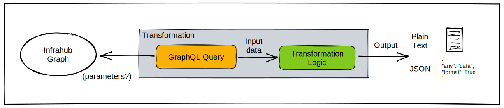

# Transformation

A `Transformation` is a generic plugin to transform a dataset into a different format to simplify it's ingestion by third-party systems.

The output of a transformation can be either in JSON format or in plain text.
>*Currently transformations must be written in Python, but in the future more languages could be supported.*

!!!success Examples

- With the `Jinja Plugin` it's possible to generate any configuration files, in plain text format.
- With the `Python Plugin` it's possible to generate the payload expected by CloudFormation to configure a resource in AWS.

!!!

## High level design

A transformation is composed of 2 main components:

- A **GraphQL query** that will define what the input data.
- A **Transformation logic** that will process the data and transform it.

!!!
The transformation will automatically inherit the parameters (variables) defined by the GraphQL query. Depending on how the GraphQL query has been constructed, a transformation can be static or work for multiple objects.
!!!

==- Common parameters
| Name            | Type                                | Default | Required |
| --------------- | ----------------------------------- | ------- | -------- |
| **name**        | `Text`                              | -       | Yes      |
| **label**       | `Text`                              | -       | No       |
| **description** | `Text`                              | -       | No       |
| **timeout**     | `Number`                            | 10      | No       |
| **rebase**      | `Boolean`                           | False   | No       |
| **query**       | `Relationship`  CoreGraphQLQuery | -       | Yes      |
| **repository**  | `Relationship`  CoreRepository   | -       | Yes      |

==-

## Available transformations

| Namespace | Transformation      | Description                            | Language | Output Format |
| --------- | ------------------- | -------------------------------------- | -------- | ------------- |
| Core      | **TransformJinja2** | A file rendered from a Jinja2 template | Jinja2   | Plain Text    |
| Core      | **TransformPython** | A transform function written in Python | Python   | JSON          |

### Rendered file (Jinja2 plugin)

Infrahub can natively render any Jinja templates dynamically. Internally it's referred to as `TransformJinja2`. It can generate any file in plain text format and must be composed of 1 main Jinja2 template and 1 GraphQL query.

#### Create a Jinja rendered transform

Please refer to the guide [Creating a Jinja Rendered Transform](/guides/jinja2-transform) for more information.

#### Render a Jinja2 transform

A Jinja2 Transform can be rendered with 3 different methods:

- On demand via the REST API
- As part of an [artifact](./artifact.mdx)
- In CLI for development and troubleshooting [infrahubctl render](/infrahubctl/infrahubctl-render)

### TransformPython (Python plugin)

A `TransformaPython` is a transformation plugin written in Python. It can generate any dataset in JSON format and must be composed of 1 main Python Class and 1 GraphQL Query.

#### Create a Python transform

A TransformPython must be written as a Python class that inherits from `InfrahubTransform` and it must implement one `transform` method. The transform method must accept a dict and return one.

Please refer to the guide [Creating a Python transform](/guides/python-transform) for more information.

#### Render a TransformPython

An TransformPython can be rendered with 2 different methods:

- On demand via the REST API
- As part of an [Artifact](./artifact.mdx)
- In CLI for development and troubleshooting [infrahubctl transform](/infrahubctl/infrahubctl-transform)

## Unit testing for transformation

!!!warning
Coming Soon
!!!
