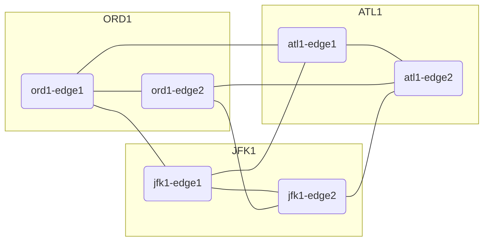

# Build a local Sandbox Environment

The project includes a local sandbox environment that can be used to experiment and/or demo Infrahub.
The main requirements to run the Sandbox environment are :
- Invoke 2.x
- Docker & Docker Compose

## Prepare the Sandbox Environment

```
invoke build
invoke init
```

You can then start all the services with

```
invoke start
```

The GraphQL interface will be available at `http://localhost:8000/graphql`


# Explore Infrahub with a scripted demo

To help you get started with Infrahub, a guided demo is included in the project based on a simple 6 nodes network.



## Pre-requisite

### Install a GraphQL Client
    Altair : https://altairgraphql.dev/

### Generate the data for the dem

```
invoke load-test-data
```

### Fork & Clone the repository for the demo

Create a fork of the repository https://github.com/opsmill/infrahub-demo-edge
The goal is to have a copy of this repo under your name this way your demo won't influence others.

Once you have created a fork in

> If you already cloned the repo in the past, ensure there only the main branch is present in Github.
If you other branches are present, it's recommanded to delete them for now.

## Explore the data that have been loaded into the database

```graphql
query {
  device {
    name {
      value
    }
  }
}
```

Query all interfaces and IP addresses for `ord1-edge`
```graphql
query {
  device(name__value: "ord1-edge1") {
    name {
      value
    }
    interfaces {
      id
      name {
        value
      }
      description {
        value
      }
      role {
        name {
        	value
        }
      }
    }
  }
}
```

## Create a new Branch and load some data
Create a new branch named `cr1234`
```graphql
# Endpoint : http://127.0.0.1:8000/graphql/main
mutation {
  branch_create(data: { name: "cr1234", is_data_only: false}) {
    ok
    object {
      id
      name
    }
  }
}
```

Add a new interface `Ethernet9` to the device `ord1-edge1`
```graphql
# Endpoint : http://127.0.0.1:8000/graphql/cr1234
mutation {
  interface_create(
    data: {
      name: { value: "Ethernet9" }
      enabled: { value: true }
      description: { value: "new interface in branch" }
      device: { id: "ord1-edge1" }
      status: { id: "active" }
      speed: { value: 10000 }
      role: { id: "spare" }
    }
  ) {
    ok
    object {
      id
      name {
        value
      }
      description {
        value
      }
    }
  }
}
```
> Copy the ID of the newly created interface, we'll need it for the next query

Add a new IP address connected to the new interface

```graphql
# Endpoint : http://127.0.0.1:8000/graphql/cr1234
mutation {
  ipaddress_create(
    data: {
      interface: { id: "<INTERFACE Ethernet9 UUID>" },
      address: { value: "192.168.0.2/24" }
    }
  ) {
    ok
    object {
      id
      address {
        value
      }
    }
  }
}

```