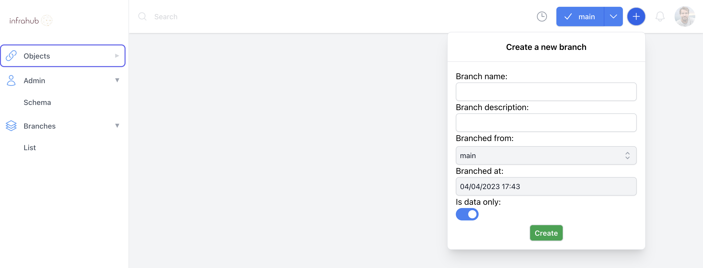
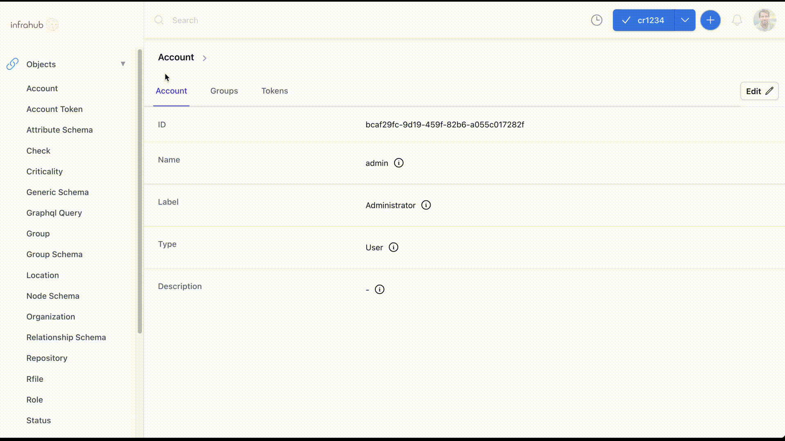

In Infrahub, Version Control is natively integrated into the graph database which opens up some new capabilities like : Branching, Diffing and Merging data directly in the database.

The default branch is called `main`.

## Create a new Branch

To get started, let's create a new branch that we'll call `cr1234`.

You can create a new branch in the frontend by using the round button with a plus sign in the top right corner



##### Other options available

==- Create a new Branch with `infrahubctl`

Use the command line below to create a new branch named `cr1234`
```
infrahubctl branch create cr1234
```

!!!info
Execute `invoke demo.cli-git` to start a shell session that will give you access to `infrahubctl`
!!!

==- Create a new Branch using GraphQL

Use the GraphQL query below to create a new branch named `cr1234`

```graphql
# Endpoint : http://127.0.0.1:8000/graphql/main
mutation {
  branch_create(data: { name: "cr1234", is_data_only: false}) {
    ok
    object {
      id
      name
    }
  }
}
```
==-

### Modify the Admin Account via the UI

> The name of the active branch in the top rigt corner should now be `cr1234`
1. Select Account under Object in the left menu (near the top)
2. Select the `admin` account (should be the only one)
3. Select the `edit` button on the top right corner
4. Update the label attribute of the Admin account, for example with `Administrator`
5. Save your change with the button `save`


!!!success Validate that everything is correct
Go back to the detailed page for the Account `Admin` and try to switch branches with the branch selection menu at the top. <br>
**You should be able to see the value of the label change when you change the branch.**
!!!

### Merge the branch cr1234 into Main

Now that we have modify some data in a controled environment, and after validating that everything is right, we can integrate these changes in the `main` branch by merging the branch `cr1234` into main.

To merge a branch you need to :
1. Navigate to the branch menu at the very bottom of the menu on the left (or [follow this link](http://localhost:3000/branches/))
2. Select the branch `cr1234` in the list of available branches.
3. Click the `merge` button




##### Other options available

==- Merge a Branch with `infrahubctl`

Use the command line below to create a new branch named `cr1234`
```
infrahubctl branch merge cr1234
```

!!!info
Execute `invoke demo.cli-git` to start a shell session that will give you access to `infrahubctl`
!!!

==- Merge a Branch using GraphQL

Use the GraphQL query below to create a new branch named `cr1234`

```graphql
# Endpoint : http://127.0.0.1:8000/graphql/main
mutation {
  branch_merge(data: { name: "cr1234" }) {
    ok
    object {
      id
      name
    }
  }
}
```
==-


!!!success Validate that everything is correct
Go back to the detailed page for the Account `Admin`.<br>
**The object should now have the value previously defined in the branch.**
!!!


