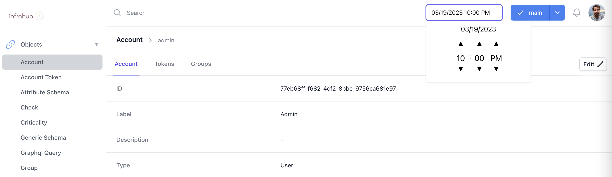

Infrahub is built around a immutable storage engine which means that all past value of the graph are never lost and it's always possible to go back in time.

## Query the Admin account object before the merge.

Using the time selection menu, next to the branch selection drop down, select a time (in UTC) before the branch `cr1234` has been merged.

!!!success Validate that everything is correct
When playing with the time around the time when the branch `cr1234` was merged into `main` you should be able to see the value changing in `main`.
!!!