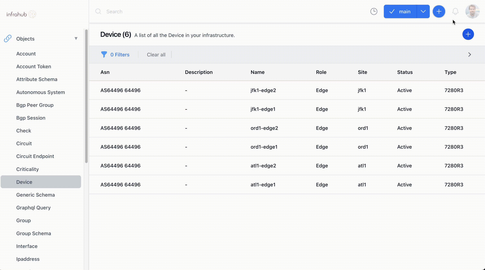

Infrahub is natively able to render any Jinja templates dynamically, internal it's referred as `RFile` for `Rendered File`.
Other systems are able to render Jinja templates but what makes Infrahub unique is the deep integration wit the `Unified Version Controled Sytems` and the Jinja Rendering engine that make it possible to prepare, and render, a change in a branch, including changes on the data AND on the template without impacting the rendering on the main branch.

!!!
The `infrahub-demo-edge` repository that we integrated in the previous step, includes 1 RFile that can generate a full configuration for each device.
!!!

## RFile

A `RFile` is an internal concept that represent a Jinja Template coupled with a `GraphQL Query`. Combined together they are able to render any file in text format.

## Generate the configuration of a device

The rendered configuration is available via the REST API under `/rfile/<rfile_name>` follow by any additional parameters expected in the GraphQL query.

The `rfile` **device_startup** present in the repository, expect the name of the device as a parameter `/rfile/<rfile_name>?device=<device_name>`, as an example, below are the URL for couple of devices:

- [Config for `ord1-edge1`](http://localhost:8000/rfile/device_startup?device=ord1-edge1)
- [Config for `atl1-edge2`](http://localhost:8000/rfile/device_startup?device=atl1-edge2)

## Create a new branch and modify the data AND the template

Next, we'll create a new branch, and make modifications both in the data and in the template to explore the integration between the Jinja Template Renderer and the storage engine.

#### 1. Create a new branch `update-ethernet1`

From the frontend, create a new branch named `update-ethernet1` and be sure to uncheck the toggle `is Data Only` in the UI.

#### 2. Update the interface Ethernet 1 for ord1-edge1

Now we'll make a change in the branch `update-ethernet1` that will be reflected in the rendered template, like updating the documentation.

1. Navigate to the device `ord1-edge1` in the frontend and
2. Navigate to the list of its interfaces in the `interfaces` Tab.
3. Select the interface `Ethernet1`
4. Edit the interface `Ethernet` and
5. Update its description to `New description in the branch`
6. Save your change

#### 3. Update the Jinja2 template in Github

The final step is to modify the Jinja template directly from Github

In Github:
- Navigate to your clone
- Select the new branch in the branch menu dropdown
- Select the file `device_startup_config.tpl.j2` at the root of the repository
- Edit the file with the `pen` in the top right corner
- Delete the lines 77 and 78 (i.e. the last two lines of 'ip prefix-list BOGON-Prefixes')
- Commit your changes in the branch `update-ethernet1` directly from github

!!!success Validate that everything is correct
After making these changes, you should be able to render the RFIle for the branch `update-ethernet1` and see the changes made to the data AND to the schema at the same time at the address 
[`/rfile/device_startup?device=ord1-edge1&branch=update-ethernet1`](http://localhost:8000/rfile/device_startup?device=ord1-edge1&branch=update-ethernet1)
!!!

#### 4. Merge the Branch `update-ethernet1`

After merging the branch `update-ethernet1`, regenerate the configuration for `ord1-edge1` in `main` and validate that the 2 changes are now available in `main`
