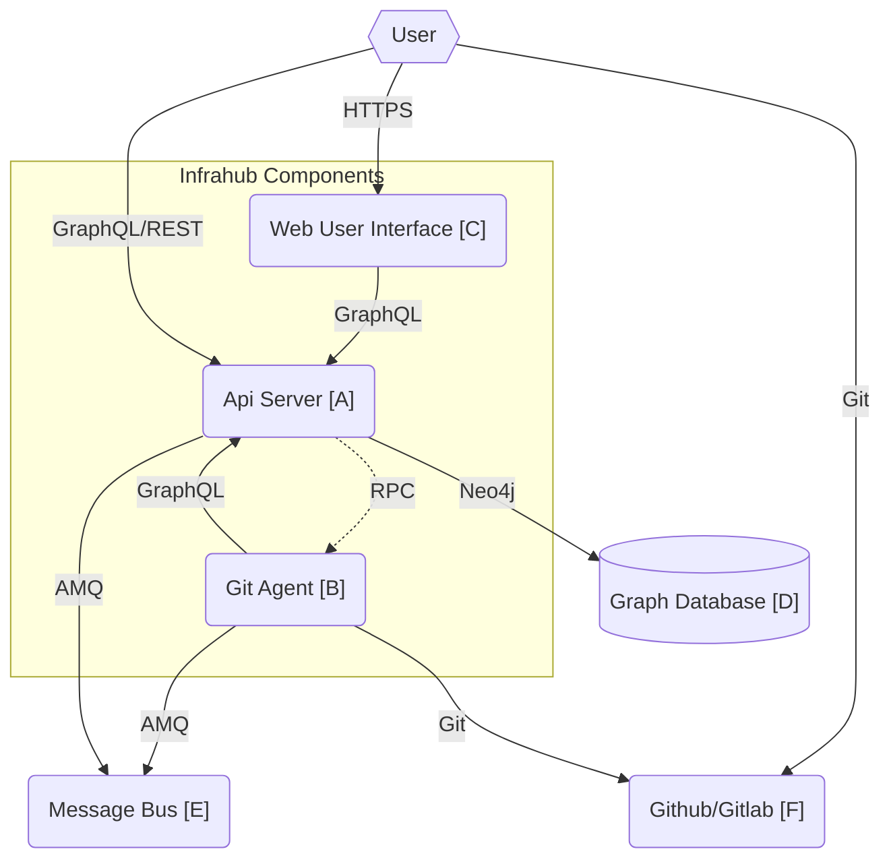

# Architecture Diagram

## Infrahub Components

### A - API Server

Language: python

> Multiple instance of the API Server can run at the same time to process more requests.

### B - Git Agent

Language: python

The Git agent is responsible for managing all the content related to the Git repositories, it organizes the file systems in order to quickkly access any relevant commit. The Git Agent is periodically pulling the Git Server for updates and it's listening to the RPC channel on the event bus for task to execute.
Some of the tasks that can be executed on the Git agent includes:
- Rendering a Jinja template
- Rendering a transform function
- Executing a check
- All Git operations (pull/merge/diff)

> Currently only one instance of the Git Agent can run at a time.

### C - Web User Interface

Language: React (TBC)

## External Systems

### D - Graph Database

The Graph Database is based on Neo4j 5.x. Neo4j is a production grade, battle tested graph database that is used in 1000s of deployments around the work.

### E - Message Bus

The message bus is based on RabbitMQ, it supports both a fanout channel to distribute messages to all members at the same time and it also support a RPC framework to distribute work Syncronously.

### F - Git Server (Github/Gitlab)

Any Git server. The most popular being : Github, Gitlab or Bitbucket