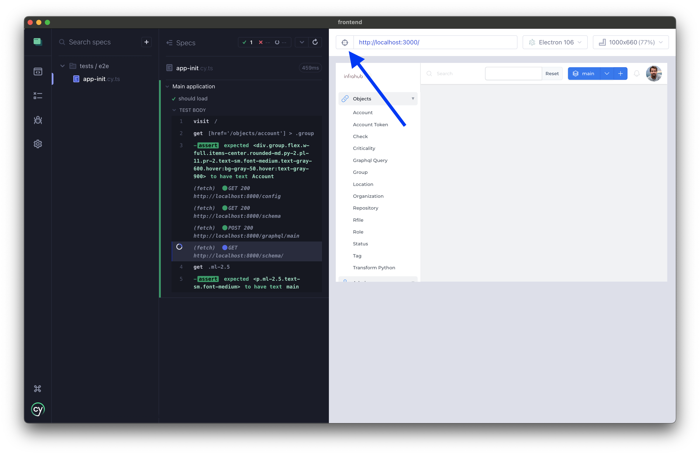
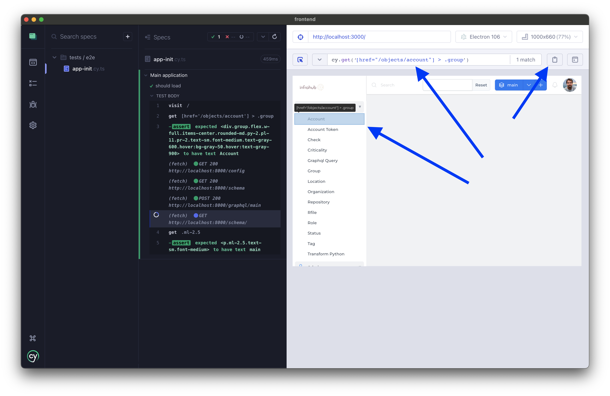

# Developer guide

## Backend / Python

### Code linting

- **yamllint**
- **ruff**
- **pylint**
- (soon) **mypy**
- (soon) **pydocstyle**

`invoke tests` will run all the linter at once to quickly validate if all files have the right format and are compliant with the internal coding guidelines.

To help format the code correctly, the project is also recommending:

- **autoflake** to automatically remove all unused variables and all unused import

> `invoke format` will run Ruff and autoflake together to ensure all files are as close as possible to the expected format.

### Run tests

```shell
invoke dev-start
infrahub test unit
infrahub test integration tests/integration/client/
infrahub test integration tests/integration/user_workflows/
infrahub test client
infrahub test ctl
```

or

```shell
infrahub test unit <path>
```

## Frontend

### Code linting

- **prettier**
- **eslint**

### Run tests

#### Unit tests

```sh
npm run test
```

or with coverage:

```sh
npm run test:coverage
```

#### Integration tests

```sh
npm run cypress:run:component
```

#### E2E tests

```sh
npm run cypress:run:e2e
```

#### How to create more E2E tests

- Select the spec (test file) you want to verify (in `/tests/e2e/`)


- Enable the selector button to get the selector to use in the test


- Choose the element in the application you want to retrieve


Now we can:

- verify if the content is correct:
```cy.get("...").should("have.text", "Account");```
- verify the same thing but for inputs:
```cy.get("...").should("have.value", "some value");```
- and also trigger a click:
```cy.get("...").click()```

Full documentation: https://docs.cypress.io/guides/end-to-end-testing/writing-your-first-end-to-end-test

## Developer environment

### VS Code extensions

- Excalidraw: https://marketplace.visualstudio.com/items?itemName=pomdtr.excalidraw-editor
- Jinja: https://marketplace.visualstudio.com/items?itemName=wholroyd.jinja
- Pylance: https://marketplace.visualstudio.com/items?itemName=ms-python.vscode-pylance
- Trailing Space: https://marketplace.visualstudio.com/items?itemName=shardulm94.trailing-spaces
- Better Toml: https://marketplace.visualstudio.com/items?itemName=bungcip.better-toml
- GraphQL: https://marketplace.visualstudio.com/items?itemName=GraphQL.vscode-graphql
- Ruff: https://marketplace.visualstudio.com/items?itemName=charliermarsh.ruff

Sample .vscode/settings.json

```json
{
    "[python]": {
        "editor.defaultFormatter": "charliermarsh.ruff",
        "editor.formatOnSave": true,
        "editor.codeActionsOnSave": {
            "source.organizeImports": "explicit"
        }
    },
    "python.analysis.typeCheckingMode": "basic",
    "python.testing.pytestArgs": [
        "backend"
    ],
    "python.testing.unittestEnabled": false,
    "python.testing.pytestEnabled": true,
    "ruff.enable": true,
}
```