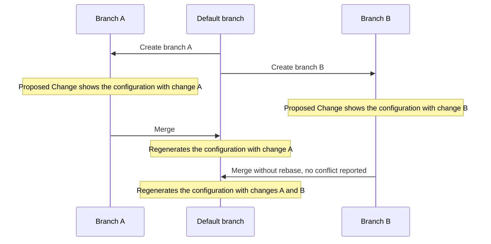

# Artifacts

An artifact is the result of a [Transformation](../transformations/overview) for a specific context and/or object.

The following MIME types or formats are supported and will be rendered properly in Infrahub's web interface:

- application/json
- application/yaml
- application/xml
- application/hcl
- text/plain
- text/markdown
- text/csv
- image/svg+xml

In Infrahub's web interface, rendering follows the format: JSON, YAML, XML, HCL, and plain text display as syntax-highlighted code; Markdown renders as formatted text, including diagrams from fenced mermaid code blocks; CSV renders as a table; and SVG renders as an image.

:::success Examples

- For a network device, you can use an artifact to track the configuration generated from a Jinja template (Transformation).
- For a Security Device, an artifact can be the list of rules in JSON in the format of your choice generated by a Python Transformation.
- An artifact can also represent the configuration of a DNS server or the configuration of a specific Virtual IP on a load balancer.

:::

While it's always possible to generate [Transformations](../transformations/overview) on demand via the API, having an artifact provides additional benefits:

- **Caching**: Generated artifacts are stored in the internal [object storage](../artifact-file-storage/overview.mdx). For resource-intensive Transformations, it will significantly reduce the load of the system if an artifact can be served from the cache instead of regenerating each time.
- **Traceability**: Past values of an artifact remain available. In a future release, it will be possible to compare the value of an artifact over time.
- **Peer Review**: artifacts are automatically part of the [Proposed Change](../proposed-changes/overview) review process.
- **Database**: artifact nodes are stored in the database and other nodes can optionally have a relationship with them, which makes it possible to perform certain artifact related queries.

While the content of an artifact can change, its identifier on a branch will remain the same over time.

## High level design

Artifacts are defined by grouping a [Transformation](../transformations/overview) with a [group](../groups/overview) of targets in an *artifact definition*.

An **artifact definition** centralizes all the information required to generate an artifact.

- [Group](../groups/overview) of targets - Specifies which objects will generate artifacts
- Transformation - Defines how to process the data
- Format of the output - MIME type for the generated content
- Information to extract from each target that must be passed to the Transformation

Groups provide flexible targeting that decouples artifact generation from specific object lists. You can add or remove objects from groups without modifying artifact definitions. See [Groups](../groups/overview) for details on creating target groups.

From an **artifact definition** artifact nodes are created, for each target which is part of the group. The result of the Transformation is stored in the [object storage](../artifact-file-storage/overview.mdx). The generation of the artifacts is performed by the Task worker(s).


## CoreArtifactTarget

A node for which you want to generate an artifact must inherit from the `CoreArtifactTarget` generic.

As a result of this, an artifacts tab will show up in the node's detailed view in the UI, which allows you to access all of the artifacts that have been generated for this node.


```yaml
nodes:
  - name: "Device"
    namespace: "Infra"
    inherit_from: ["CoreArtifactTarget"]
```

:::warning Deletion behavior
When a `CoreArtifactTarget` node is deleted, all artifacts associated with it are automatically deleted as well.
:::

## Composing content across artifacts

A Transformation can reference and include the rendered content of other artifacts or file objects using built-in Jinja2 filters or the Python SDK object store API. This enables modular configuration pipelines where each artifact generates one section, and a composite artifact assembles the final result.

For step-by-step instructions, see [Composing artifact content](./content-composition.mdx).

## When artifacts regenerate

An artifact is the cached output of a Transformation, so Infrahub regenerates it when its inputs change. Four kinds of change trigger regeneration or cleanup:

- **The target's data changes** — a node read by the artifact's GraphQL query is modified, so that target's artifact is regenerated.
- **A new target joins the group** — an artifact is generated for the new member; existing artifacts are left untouched.
- **A target leaves the group** — the former member's artifact is deleted on the next generation pass over the definition (for example after the change merges), so no stale artifact is left behind.
- **The definition's code or configuration changes** — when a proposed change commits to a linked repository, Infrahub regenerates an artifact only if the change touches that definition's GraphQL query, its Transformation's [dependency closure](../transformations/overview#dependency-tracking-and-regeneration), or the artifact definition itself. An unrelated commit — a README edit, or a helper no Transformation uses — regenerates nothing, once the Transformation is precise enough to say so: a Python Transformation that has not declared [`watch`](../git-integration/infrahub-yml#declaring-extra-dependencies-with-watch) regenerates on every commit, because Infrahub cannot rule out a dependency it has no way to see.

Data a Generator creates during a proposed change is not a reliable trigger for an artifact in that same pipeline: the two run concurrently, so the artifact can render before the data exists. To review artifacts built from Generator output, run the Generator on the branch before the pipeline starts. See [Ordering between Generators and artifacts](../proposed-changes/overview#ordering-between-generators-and-artifacts).

Every regeneration decision during a proposed change is recorded in the pipeline's task log, naming the file, query, or field that triggered it. See [Understanding artifact regeneration](../proposed-changes/overview#understanding-artifact-regeneration).

## How artifacts reach the default branch

Each branch has its own version of an artifact. When a branch merges, Infrahub does not merge the branch's versions into the default branch. It regenerates the affected artifacts on the default branch, from the default branch's data and repository commit at the time the regeneration runs. An artifact that existed on the default branch before the branch was created keeps the same ID on both branches. An artifact first created on the branch gets a new ID when Infrahub generates it on the default branch.

If automation deploys artifacts from the default branch, such as device configurations pushed to the network after a merge, it deploys the regenerated artifact. Its content is usually the same as the artifact you reviewed in the [Proposed Change](../proposed-changes/overview), but [it can differ](#when-the-default-branch-artifact-differs-from-the-reviewed-one). To check before you deploy, see [Deploy the artifact that was reviewed](#deploy-the-artifact-that-was-reviewed).

### What happens after a merge

Once the merge is complete, Infrahub sets the branch status to `MERGED` and queues a follow-up task at low priority. The merge does not wait for this task, so the artifacts on the default branch are regenerated after the merge has finished.

Which artifacts the task regenerates depends on the `INFRAHUB_SELECTIVE_EXECUTION_AFTER_MERGE` setting:

- **`true`, the default**: Infrahub regenerates the artifact definitions and targets that the merge changed. Before the artifacts, it runs the affected Generators that have `execute_after_merge` set, and adds the artifacts that read their output to the selection.
- **`false`**: Infrahub regenerates every artifact definition and runs every Generator definition after each merge.

Infrahub also regenerates everything when it cannot build the selection, for example because the summary of the merge is not available. When it regenerates everything, Infrahub queues the Generators and the artifacts at the same time, so an artifact can be generated before a Generator writes the data the artifact reads.

See [Configuration](../reference/configuration.mdx) for the setting. Each artifact is generated in its own task.

Infrahub sends the `infrahub.branch.merged` and `infrahub.proposed_change.merged` events after it tries to queue the follow-up task. If queuing fails, Infrahub logs the failure and still sends both events. Receiving the events therefore does not mean that any artifact was selected or regenerated.

#### Which Transformation files the regeneration uses

Infrahub generates each artifact with the Transformation files at the commit stored in the repository's `commit` attribute on the default branch. It reads that attribute when it queues the artifacts of a definition. What the merge does to that attribute depends on the repository:

- **Repository** (`CoreRepository`) on a branch that has `sync_with_git` set: Infrahub merges the branch's Git branch into the default branch's Git branch in a separate task, sets `commit` on the default branch to the resulting commit, then pushes it to the remote. The resulting commit can include changes that other branches merged before, so it is not always the commit the Proposed Change used.
- **Repository** (`CoreRepository`) on a branch without `sync_with_git`: Infrahub runs no Git merge, and `commit` on the default branch does not change.
- **Repository** (`CoreRepository`) whose `internal_status` is `staging`: Infrahub sets `commit` on the default branch to the latest commit of the repository's default Git branch, whatever the setting of `sync_with_git`.
- **Read-only repository** (`CoreReadOnlyRepository`): Infrahub runs no Git merge. The merge sets `ref` and `commit` on the default branch to the branch's values, like any other attribute.

Infrahub queues the Git merge and the follow-up task separately, and neither waits for the other. If Infrahub queues the artifacts of a definition before the Git merge has set `commit`, they are generated with the previous Transformation files.

### When the default branch artifact differs from the reviewed one

Infrahub generates the artifacts of a Proposed Change on its branch. On that branch, Infrahub reads the default branch's data as it was at the branch's `branched_from`, plus the changes made on the branch, as described in [Parallel branches](../branches/parallel-branches.mdx). The regeneration after the merge reads the default branch as it is when the task runs. The two artifacts differ when something the artifact uses changed in between, or when the regeneration did not complete. These are the known cases, and the list may not be complete:

- **The branch was not rebased.** Changes made on the default branch after `branched_from` are not in the reviewed artifact.
- **Another branch has changes to different data that the same artifact reads.** For example, you change the descriptions of a device's interfaces on one branch and add a BGP session to the same device on another, and the device's configuration artifact reads both. Changes to different objects do not conflict, even when the same artifact reads both. If the second branch merges without a rebase and a new run of its checks after the first merge, each Proposed Change showed only its own change, and the configuration on the default branch contains both, a combination that no Proposed Change showed. Infrahub has no check that blocks a merge in this case.
- **Another branch changed files that the same Transformation uses, in a `CoreRepository`.** For example, you change a Jinja2 partial on one branch and the template that includes it on another. Infrahub generated the artifacts of each Proposed Change with the commit of its own branch. After both merge, the commit on the default branch contains both changes.
- **The Git merge had not finished when Infrahub queued the regeneration.** The regeneration uses the previous Transformation files. Click **Re-generate** on the artifact's page after the Git merge has finished.
- **The Git merge failed.** If the local merge fails, `commit` on the default branch does not change, and the regeneration uses the previous Transformation files. If the local merge succeeds but the push to the remote is refused, for example by a protected branch, `commit` already points to the merge commit, which the remote does not have. In both cases the data merge stays in place. **Re-generate** regenerates the artifact with the current `commit`; it does not retry the Git merge.
- **The default branch changed after the last rebase or the last run of the checks.** A rebase does not re-run the Proposed Change checks. The default branch can also change between the merge and the regeneration.
- **A Generator changed data the artifact reads.** This includes Generators that run after the merge, and, when Infrahub regenerates everything, Generators that run at the same time as the artifacts.
- **A Python Transformation reads data from outside Infrahub**, such as an external API, and that data changed.
- **The regeneration failed.** The artifact on the default branch keeps its previous content. See [When the regeneration fails](#when-the-regeneration-fails).
- **The artifact includes content from another artifact.** The regeneration does not refresh the included content. See [Composing artifact content](./content-composition.mdx#known-limitations).

The two-branch case, for one device configuration:



<!-- vale off -->
The **Artifacts** tab of a Proposed Change compares each artifact on the branch with the current artifact on the default branch, not with the artifact as it was at `branched_from`. A change made on the default branch after `branched_from` can therefore appear in the tab as a difference, although the branch did not make it. Rebase the branch and re-run the checks to remove those differences from the tab.
<!-- vale on -->

### When the regeneration fails

When rendering an artifact fails, Infrahub sets its `status` to `Error`. The artifact keeps the content and the checksum it had before the merge, and the API still returns that content.

Do not rely on `status` alone to detect a failure:

- When a task fails before rendering starts, for example while Infrahub prepares the repository or looks up the artifact, Infrahub does not change `status`. An artifact that was `Ready` stays `Ready`.
- When a retry after a failure renders the same content as the stored file, Infrahub does not save the artifact, so `status` stays `Error`.

To find a failure:

- **Task log**: the failed task is named "Generate artifact" followed by the artifact name, and is tagged with the default branch and the target object.
- **Event**: when the status changes to `Error`, Infrahub sends `infrahub.node.updated` for the `CoreArtifact`, because the status is saved as a regular update. A [webhook](../webhooks/overview.mdx) filtered on the `CoreArtifact` node kind receives it.
- **Artifact status**: query `status` on the artifact on the default branch, or open the artifact in the web interface, keeping the two exceptions above in mind.

Infrahub sends `infrahub.artifact.created` and `infrahub.artifact.updated` only when a generation succeeds and the content changed. A regeneration that produces the same content sends neither.

To retry, click **Re-generate** on the artifact's page. To regenerate every artifact of a definition, send `POST /api/artifact/generate/<artifact_definition_id>`.

### Deploy the artifact that was reviewed

Infrahub does not require any of these steps. Add them to your merge and deployment process where a difference between the reviewed and the deployed artifact matters:

1. **Before you merge**, [rebase](../branches/rebase.mdx) the branch, then re-run the Proposed Change checks: click **Retry all** on the **Checks** tab, or send the `CoreProposedChangeRunCheck` mutation with `check_type` set to `ARTIFACT`. Review the regenerated artifacts in the Proposed Change, then merge.
2. **In the deployment step**, compare checksums rather than reading `status`. An artifact's `checksum` is an MD5 hash of its content. Infrahub records the checksum of each artifact that a Proposed Change generated on a `CoreArtifactCheck` node, with the artifact's ID in `artifact_id`. That node does not belong to a branch, so you can still read it after the source branch is deleted. For an artifact that existed on the default branch before the branch was created, `artifact_id` is also the ID of the artifact on the default branch. Compare the two checksums before you deploy. Infrahub sends no event when the regeneration finishes, so if they differ, the regeneration may not have run yet: compare again after a delay, and stop the deployment for review if they still differ. The check contains the result of the last run of the checks, so re-run them after the last change to the branch.

When several Proposed Changes change data that the same artifacts read, merge them one at a time. After each merge, wait for the regeneration to finish, then rebase the next branch and re-run its checks, so that its review includes the change merged before it.

To read the status and the checksum of an artifact on the default branch:

```graphql title="Status and checksum of a device's artifact on the default branch"
query ArtifactState {
  CoreArtifact(object__ids: ["<device-id>"], definition__name__value: "<artifact-definition-name>") {
    edges {
      node {
        id
        status { value }
        checksum { value }
      }
    }
  }
}
```

## How artifacts relate to other features

- **[Transformations](../transformations/overview)** define the logic that produces an artifact's content; an artifact is the cached output of a Transformation for a specific target.
- **Generators** create or update graph data; some Generators consume artifacts as part of their input pipeline.
- **[Object storage](../artifact-file-storage/overview.mdx)** is where artifact content lives on disk. See the storage topic for backend configuration and sizing.
- **[Proposed Changes](../proposed-changes/overview)** automatically include artifact diffs in their review surface, so changes to generated artifacts are visible alongside data changes.
