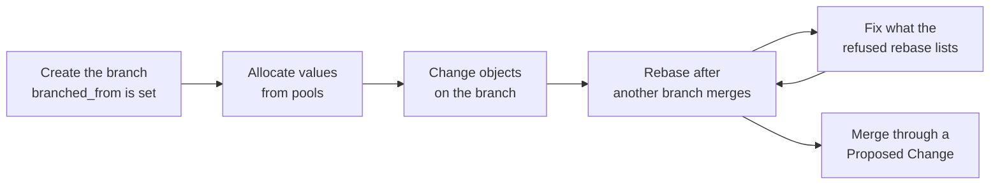

When several teams or Generators work on separate branches at the same time, each branch keeps reading the default branch as it was at that branch's `branched_from`. A merge into the default branch does not change the other open branches, and nothing marks them as behind, so Infrahub reports conflicts and duplicate values on a branch only when that branch rebases or merges. To keep each branch ready to merge, allocate unique values from [resource pools](../resource-manager/overview.mdx), [rebase](./rebase.mdx) each branch after another one merges, clear the [conflicts](./resolve-conflicts.mdx) that a refused rebase lists, and [merge](./merge.mdx) once the checks pass.



## What changes when another branch merges

Nothing changes on your branch. It keeps reading the default branch as it was at its `branched_from`, plus its own changes, until you rebase it.

No branch status means "behind the default branch", and Infrahub does not require a rebase before a merge, except after an upgrade sets `NEED_UPGRADE_REBASE`. For what a status blocks and what clears it, see [Branch statuses](./overview.mdx#branch-statuses).

To see your branch's `branched_from`, open the branch details page in the web interface, or query it through GraphQL:

```graphql title="List branches with their branched_from time"
query BranchState {
  Branch {
    name
    status
    branched_from
    is_default
  }
}
```

To list what changed on the default branch since then, compare the default branch with itself between your branch's `branched_from` and now, as described in [Compare changes between two timestamps](../immutable-history/query-historical-data.mdx#compare-changes-between-two-timestamps). This comparison runs through the GraphQL API. To apply those changes to your branch, rebase it.

A merge does make the stored diff of every other open branch out of date, and Infrahub queues a recalculation for each one. With a few branches open you will not notice. With dozens of long-lived branches, those recalculations compete with generators, artifacts and checks for task workers, and you can turn the automatic update off. See [Diff updates after a merge](../deploy-manage/install-configure/performance-tuning.mdx#diff-updates-after-a-merge).

## Allocate values from a pool

A value allocated from a [resource pool](../resource-manager/overview.mdx#branch-agnostic-allocation) is reserved for every branch at the moment you allocate it, so a request from another branch to the same pool gets a different one. Infrahub also locks each pool while it allocates from it, so simultaneous requests from different branches or Generators get different values.

A value you type into a unique attribute is not reserved. Two branches can each hold the same typed value. Once one of them merges, the other is refused at its next rebase or merge, and its Proposed Change reports the duplicate under **Schema Integrity**.

How you request a value depends on where you work:

- **Web interface**: when you create the object, click the pool button next to the field, labelled "select a pool", and choose the pool. On an IP address, the button is next to **Address**.
- **GraphQL API**: pass `from_pool` on the attribute or relationship. For an IP address pool or an IP prefix pool, you can also call the pool's mutation directly, `InfrahubIPAddressPoolGetResource` or `InfrahubIPPrefixPoolGetResource`.

Through the GraphQL API, you can pass an `identifier` when you allocate from an IP address pool or an IP prefix pool, and Infrahub returns the same value for a later request with the same identifier. The web interface sends no identifier, and Infrahub applies its default. Build one identifier per object, from the object it is allocated to, such as a device and its interface. On another branch that cannot yet read the object the value was allocated to, Infrahub allocates a different value for the same identifier, with no error. See [Idempotent allocation](../resource-manager/overview.mdx#idempotent-allocation).

**When a branch is deleted.** The values a branch took from a pool go back to the pool only if no branch can still read the objects they were allocated to. A branch deleted without merging usually frees its values, because the objects only ever existed on it. A branch that merged first does not, because the objects are now on the default branch. See [Branch-agnostic data](./branch-agnostic-data.mdx#when-the-value-is-released).

## Rebase after each merge

Rebase each open branch soon after another branch merges. Each rebase then compares fewer new changes from the default branch, and Infrahub reports any conflict on the branch where it has to be fixed, before review.

For both ways to run a rebase, and what to do when one is refused, see [Rebase a branch](./rebase.mdx). Rebases and merges each take the global graph lock, so they run one at a time.

### Automate the rebase (optional)

You can build a small service that rebases the open branches each time a branch merges. Infrahub's [event actions](../events/event-actions.mdx) add objects to groups or remove them, and run Generators, and none of them rebases a branch, so this approach combines a webhook with the GraphQL API. You build and run the service yourself.

1. Create a [webhook](../webhooks/overview.mdx) for the `infrahub.branch.merged` event that points at your service, and set its branch scope to **All Branches**. With the default scope, **Default Branch**, the webhook does not fire on a merge. See [Configuring branch types](../webhooks/overview.mdx#configuring-branch-types).
2. When your service receives the webhook, list the branches with the `Branch` query shown in [What changes when another branch merges](#what-changes-when-another-branch-merges). Skip the default branch (`is_default`) and any branch with the status `MERGED` or `MERGING`.
3. For each remaining branch, send `BranchRebase` to `/graphql` and let it wait for the rebase, which is the default, so the response contains the outcome.
4. Route a refusal by the `code` in the error's `extensions`:
   - `MERGE_IN_PROGRESS`: another merge is running. Retry after a delay.
   - `MERGE_RECOVERY_REQUIRED`: a merge failed. Stop and alert an administrator, who runs [`infrahub recover merge`](./merge.mdx#recovering-the-failed-merge).
   - Any other code: read the message. A conflict refusal lists each conflict and what it needs, so send it to the owner of the branch. The message `Cannot rebase a branch while a merge is in progress.` means a merge started during the request: retry it.

:::warning Do not check a branch with BranchValidate before rebasing

`BranchValidate` reads the branch's stored diff without refreshing it, and it reports conflicts already resolved in favor of the branch, which do not block a rebase. Run the rebase itself instead: a refused rebase changes nothing.

:::

## What blocks a rebase

See [What blocks a rebase](./rebase.mdx#what-blocks-a-rebase) for each cause and its fix.

## Merge the branch

Merge the branch through a [Proposed Change](../proposed-changes/overview.mdx). At merge time, Infrahub refreshes the diff and checks conflicts and constraints again against the current default branch, so a Proposed Change whose checks passed can still fail to merge when another branch merged first. If that happens, rebase the branch, fix what the refused rebase lists, and merge again.

For what the merge checks, how writes are blocked while it runs, and merging a branch directly, see [Merge a branch](./merge.mdx). For what a failed re-check does to the Proposed Change, see [Proposed Changes](../proposed-changes/overview.mdx).

## Limits

- Infrahub has no indicator that a branch is behind the default branch. To see what changed on the default branch, compare it over time as described in [What changes when another branch merges](#what-changes-when-another-branch-merges).
- A rebase has no dry run. A refused rebase changes nothing, so running the rebase is the check.
- Infrahub does not reserve an object for one branch. You can change the same object on two branches, and Infrahub reports the conflict on the second branch after the first one merges.

## Related

- [Rebase a branch](./rebase.mdx): what a rebase does, what blocks it, and both ways to run it
- [Resolve conflicts](./resolve-conflicts.mdx): each conflict type and what clears it
- [Merge a branch](./merge.mdx): write blocking during a merge, and recovery from a failed merge
- [Resolve a proposed-change conflict](../proposed-changes/resolve-conflict.mdx): choosing a side during review
- [Resource Manager](../resource-manager/overview.mdx): pools, allocation across branches, and identifiers
- [Webhooks](../webhooks/overview.mdx): event types and branch scope
- [Query historical data](../immutable-history/query-historical-data.mdx): comparing the data at two points in time
