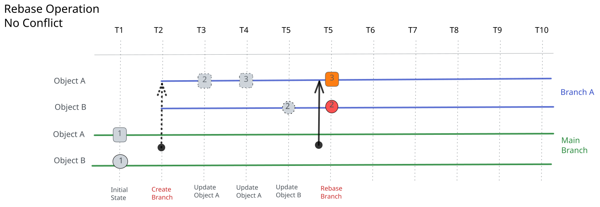

import Tabs from '@theme/Tabs';
import TabItem from '@theme/TabItem';

A rebase moves a branch's `branched_from` forward to the time the rebase starts, so the branch reads the current data on the default branch plus its own changes. Rebase before you open a Proposed Change, and after other branches merge into the default branch.

:::note

Rebasing acts on the Infrahub branch in Infrahub's versioned graph database. It is distinct from `git rebase`: it does not rebase a connected Git repository, rewrite Git history, or push to a Git remote. For how Infrahub synchronizes with connected Git repositories, see [Git integration](../git-integration/overview.mdx#read-only-vs-core).

:::

## Why rebase

A branch reads the default branch as it was at its `branched_from`. Infrahub does not mark a branch as behind the default branch, so a rebase is how you bring it up to date:

- **See what other branches merged**: after the rebase, the branch reads every change merged into the default branch since its previous `branched_from`.
- **Find conflicts before review**: during the rebase, Infrahub compares the branch with the current default branch and stops on any conflict that still needs your input, so you fix it on the branch before a reviewer sees it.



## How rebase works

Infrahub checks the branch before it writes anything, so a refused rebase changes nothing on the branch. The steps run in this order:

1. Infrahub refreshes the branch's diff against the default branch.
2. If a conflict needs a resolution or a change to the data, Infrahub refuses the rebase. The error lists each conflict and what it needs. See [Resolve conflicts](./resolve-conflicts.mdx).
3. Infrahub checks uniqueness and the other schema constraints against the data the branch would hold after the rebase, and refuses the rebase on a violation.
4. Under the global graph lock, in one database transaction, Infrahub moves `branched_from` to the end time of the diff from step 1 and sets the branch status to `OPEN`. Infrahub keeps the current values of the branch's own changes and drops their history from before the new `branched_from`.
5. If the branch changed the schema, Infrahub then applies the schema migrations that follow from it.

Rebases and merges both take the global graph lock, so they run one at a time.

## What blocks a rebase

Infrahub refuses a rebase in any of these cases:

- The branch is being merged (`MERGING`) or is already merged (`MERGED`).
- A merge of any branch is in progress, or a failed merge is waiting for an administrator to recover it.
- A conflict with the default branch needs a resolution or a change to the data.
- The rebased data would violate a constraint, such as a duplicate value in a unique attribute.

For each conflict type and what clears it, see [Resolve conflicts](./resolve-conflicts.mdx). For every blocker with its fix, in the context of several open branches, see [What blocks a rebase](./parallel-branches.mdx#what-blocks-a-rebase).

## How to rebase

<Tabs groupId="method" queryString>
  <TabItem value="web" label="Web interface" default>

The web interface has two **Rebase** buttons, and they show the result differently:

- **On the branch details page**, next to **Merge** and **Validate**. Selecting it starts the rebase as a background task. The page shows no message with the outcome: check the `Rebase branch <name>` task under **Tasks** on the same page, which ends as failed when the rebase is refused. The button is disabled on a merged branch.
- **On the Data tab** of a branch or of its Proposed Change, next to **Refresh diff**. Selecting it makes the web interface wait for the rebase. When the rebase succeeds, the web interface refreshes the diff. When the rebase is refused, it shows the server's message, which lists each conflict and what it needs. The message does not include the error code.

Choose the button on the **Data** tab when you want to see why a rebase was refused.

</TabItem>

  <TabItem value="graphql" label="GraphQL">

Send the `BranchRebase` mutation to `/graphql`, with no branch in the URL. The web interface sends it to the same endpoint.

```graphql title="Rebase a branch"
mutation RebaseBranch {
  BranchRebase(data: { name: "add-site-ord1" }) {
    ok
    object {
      name
      status
      branched_from
    }
  }
}
```

The mutation waits for the rebase by default, and returns a GraphQL error with the message when the rebase is refused. Pass `wait_until_completion: false` to start the rebase as a background task instead; the response then includes `task { id }` so you can follow the task.

</TabItem>
</Tabs>

From the command line, `infrahubctl branch rebase` rebases a branch. See the [`infrahubctl branch` reference]($(base_url)infrahubctl/infrahubctl-branch).

## Related

- [Branches](./overview.mdx): branch lifecycle, statuses and concepts
- [Resolve conflicts](./resolve-conflicts.mdx): each conflict type and what clears it during a rebase
- [Merge a branch](./merge.mdx): what the merge checks again, and how writes are blocked while it runs
- [Run parallel branches](./parallel-branches.mdx): rebasing several open branches as others merge
