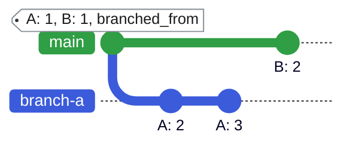
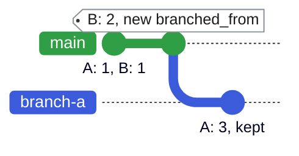
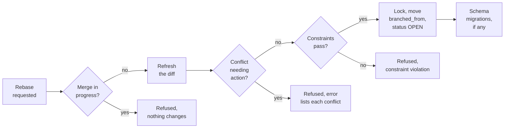

import Tabs from '@theme/Tabs';
import TabItem from '@theme/TabItem';

A rebase brings a branch up to date with the default branch. Afterwards, a query on the branch returns the default branch's current data together with the branch's own changes. Rebase before you open a Proposed Change, and again after another branch merges into the default branch.

:::note

Rebasing acts on the Infrahub branch in Infrahub's versioned graph database. It is distinct from `git rebase`: it does not rebase a connected Git repository, rewrite Git history, or push to a Git remote. For how Infrahub synchronizes with connected Git repositories, see [Git integration](../git-integration/overview.mdx#read-only-vs-core).

:::

## Why rebase

When you query a branch, Infrahub returns the default branch's data as of the branch's `branched_from`, plus the branch's own changes. No status indicates when the default branch has changed, so you rebase to include those changes:

- **See what other branches merged**: after the rebase, the branch includes every change merged into the default branch since its previous `branched_from`.
- **Find conflicts before review**: during the rebase, Infrahub compares the branch with the current default branch and stops on any conflict that still needs your input, so you fix it on the branch before a reviewer sees it.

The example below follows two attributes. `branch-a` changes `A`, and meanwhile another branch merges a change to `B` into the default branch.

**1. Before the rebase.** `branch-a` was created while `A` and `B` were both `1`. It has since set `A` to `2`, then to `3`. The default branch has since received `B: 2`. Query `branch-a` and you still get `B: 1`, because the branch has not been rebased.

<div style={{zoom: 1.3, textAlign: 'center'}}>



</div>

**2. After the rebase.** `branched_from` moves to the latest state of the default branch, so `branch-a` now reads `B: 2`. It keeps its own change, `A: 3`, and drops the history of that change from before the new `branched_from`, so `A: 2` is no longer in the branch's history.

<div style={{zoom: 1.3, textAlign: 'center'}}>



</div>

## How rebase works

Infrahub checks the branch before it writes anything, so a refused rebase changes nothing on the branch. The steps run in this order:

1. Infrahub refreshes the branch's diff against the default branch.
2. If a conflict needs a resolution or a change to the data, Infrahub refuses the rebase. The error lists each conflict and what it needs. See [Resolve conflicts](./resolve-conflicts.mdx).
3. Infrahub checks uniqueness and the other schema constraints against the data the branch would hold after the rebase, and refuses the rebase on a violation.
4. Under the global graph lock, in one database transaction, Infrahub moves `branched_from` to the end time of the diff from step 1 and sets the branch status to `OPEN`. Infrahub keeps the current values of the branch's own changes and drops their history from before the new `branched_from`.
5. If the branch changed the schema, Infrahub then applies the schema migrations that follow from it.

Rebases and merges both take the global graph lock, so they run one at a time.



## What blocks a rebase

Each refusal has its own fix. The message of a refused rebase names the conflicts and what each one needs.

| Blocker | Why | Fix |
|---|---|---|
| Branch status `MERGING` or `MERGED` | The branch is being merged, or it is merged and read-only | Wait for the merge to finish. A merged branch cannot change; create a new branch for further work |
| A merge is running, or a failed merge is waiting to be recovered | Infrahub refuses every rebase, on any branch, until the merge finishes or is recovered. Branches outside the merge stay writable | Retry once the merge finishes. After a failed merge, an administrator runs `infrahub recover merge` |
| Attribute value conflict | Both branches changed the value. A rebase keeps the branch's side, so it cannot apply a resolution in favor of the default branch | Resolve it in favor of the branch with the picker on the Proposed Change **Data** tab, or with the `ResolveDiffConflict` mutation. Or change the value to match the default branch |
| Attribute owner or source conflict | Same as an attribute value | Resolve it in favor of the branch with the `ResolveDiffConflict` mutation, using the conflict ID from the `DiffTree` query. The web interface has no picker for it. Or change the data to match |
| Attribute removed on the default branch | A rebase keeps the branch's side only for an attribute that still exists on the default branch | Update the data so that both branches agree |
| Relationship conflict | A rebase cannot keep the branch's side of a relationship conflict | Update the data so that both branches agree |
| Delete versus modify | One branch deleted an object that the other changed. Choosing a side does not clear it | Update the data so that both branches agree, for example by deleting the object on the branch as well |
| Duplicate unique value | During the rebase, Infrahub checks uniqueness and the other constraints against the data the branch would hold after it | Change the value on one of the branches |

For each conflict type in more detail, see [Resolve conflicts](./resolve-conflicts.mdx).

## How to rebase

<Tabs groupId="method" queryString>
  <TabItem value="web" label="Web interface" default>

The web interface has two **Rebase** buttons, and they show the result differently:

- **On the branch details page**, next to **Merge** and **Validate**. Selecting it starts the rebase as a background task and confirms that the request was sent. To see the outcome, check the `Rebase branch <name>` task under **Tasks** on the same page; it ends as failed when the rebase is refused. The button is disabled on a merged branch.
- **On the Data tab** of a branch or of its Proposed Change, next to **Refresh diff**. Selecting it makes the web interface wait for the rebase. When the rebase succeeds, the web interface refreshes the diff. When the rebase is refused, it shows the server's message, which lists each conflict and what it needs. The message does not include the error code.

Choose the button on the **Data** tab when you want to see why a rebase was refused.

</TabItem>

  <TabItem value="graphql" label="GraphQL">

Send the `BranchRebase` mutation to `/graphql`, with no branch in the URL. The web interface sends it to the same endpoint.

```graphql title="Rebase a branch"
mutation RebaseBranch {
  BranchRebase(data: { name: "add-site-ord1" }) {
    ok
    object {
      name
      status
      branched_from
    }
  }
}
```

The mutation waits for the rebase by default, and returns a GraphQL error with the message when the rebase is refused. Pass `wait_until_completion: false` to start the rebase as a background task instead; the response then includes `task { id }` so you can follow the task.

</TabItem>
</Tabs>

From the command line, `infrahubctl branch rebase` rebases a branch. See the [`infrahubctl branch` reference]($(base_url)infrahubctl/infrahubctl-branch).

## Related

- [Branches](./overview.mdx): branch lifecycle, statuses and concepts
- [Resolve conflicts](./resolve-conflicts.mdx): each conflict type and what clears it during a rebase
- [Merge a branch](./merge.mdx): what the merge checks again, and how writes are blocked while it runs
- [Parallel branches](./parallel-branches.mdx): Why merging one branch does not change the others, and when to rebase
