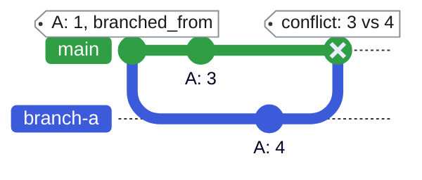
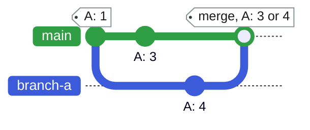
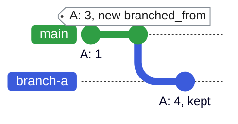
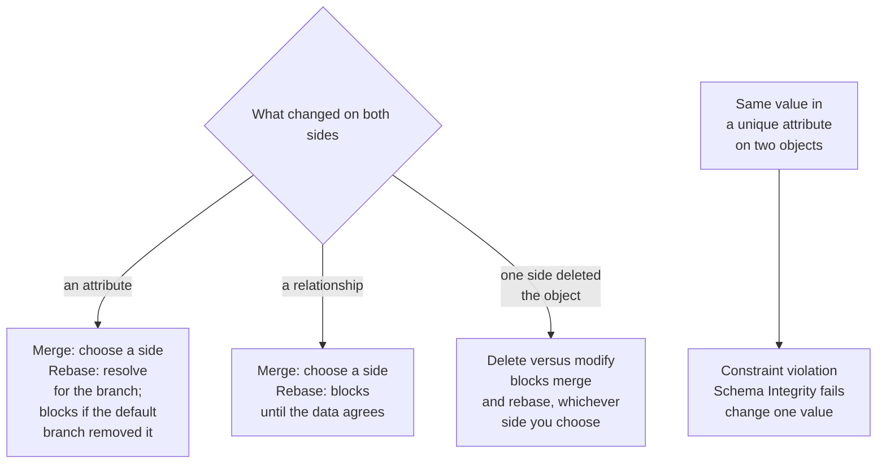

A conflict occurs when the same data changed on a branch and on the default branch after the branch's `branched_from`.

## Types of conflicts Infrahub detects

The system automatically detects several types of conflicts:

- **Attribute conflicts**: The same field of an object has been modified in both branches with different values. For example, the hostname of a device is changed to `router-1` in one branch and `router-primary` in another. For `List` and `JSON`-array attributes marked [`ordered: false`](../reference/schema/attribute.mdx#ordered) in the schema, a difference in element order alone doesn't raise a conflict.
- **Relationship conflicts**: Conflicting changes to object relationships occur when the connections between objects are modified differently in separate branches. For instance, a device might be assigned to datacenter A in one branch and datacenter B in another.
- **Schema conflicts**: Incompatible schema modifications between branches can cause structural conflicts. This might happen when a field is removed in one branch but modified in another.
- **Delete versus modify**: An object is deleted on one branch and changed on the other. Choosing a side does not clear this conflict; update the data so that both branches agree.

:::note

A duplicate value in a unique attribute is a constraint violation, not a conflict, so there is no side to choose. A Proposed Change reports it under **Schema Integrity**, and Infrahub refuses a rebase or a merge until you change the value on one of the branches.

:::

The example below follows one attribute, `A`. Both the default branch and `branch-a` change it after `branch-a` is created, to different values. Infrahub can't tell which value is right, so it reports a conflict, and a merge or a rebase of `branch-a` can't complete until you decide.

**1. The conflict.** `branch-a` is created while `A` is `1`, which sets its `branched_from`. After that point, `A` changes to `3` on the default branch and to `4` on `branch-a`. Both changes come after `branched_from` and the values differ, so when `branch-a` is compared with the default branch, Infrahub reports a conflict on `A`: 3 against 4. Until you resolve it, the merge stops at that point.

**2. Resolve it in a merge: keep either value.** In a Proposed Change, choose the branch whose value the default branch keeps. Choose `main` and `A` stays `3`; choose `branch-a` and the merge sets `A` to `4`.

**3. Resolve it in a rebase: keep the branch value.** Choose `branch-a` for `A`, and the rebase moves `branched_from` to the latest state of the default branch. `branch-a` then starts from `A: 3` and keeps its own `A: 4`. To take the default branch value instead, set `A` to `3` on `branch-a`: both branches agree, the conflict is cleared and the rebase succeeds. Choosing the default branch for `A` refuses the rebase.

## How to resolve conflicts

A [Proposed Change](../proposed-changes/overview.mdx) shows each conflict on its **Data** tab. For the steps to resolve them during review, see [Resolve a proposed-change conflict](../proposed-changes/resolve-conflict.mdx).

Infrahub also reports conflicts during a [rebase](./rebase.mdx). A rebase can't apply a resolution in favor of the default branch, so it stops on a conflict until you address it, and its error lists what each conflict needs:

- A conflict on an attribute blocks the rebase until you resolve it in favor of the branch. Open a proposed change for the branch to choose the branch for the value of an attribute, as described in [Resolve a proposed-change conflict](../proposed-changes/resolve-conflict.mdx). For another property of an attribute, such as its owner or source, use the `ResolveDiffConflict` GraphQL mutation with the conflict ID that the `DiffTree` query returns.
- A conflict on a relationship, such as the datacenter a device is assigned to or a property of that assignment, blocks the rebase until you update the data so that both branches agree.
- A conflict on an attribute that the default branch removed, or between the deletion of an object in one branch and a change to it in the other, also blocks the rebase until you update the data so that both branches agree.

This also applies to a branch in the `NEED_UPGRADE_REBASE` status after an upgrade, which only a rebase returns to `OPEN`.

## Conflicts between parallel branches

Two open branches never conflict with each other directly. Infrahub compares each branch with the default branch, not with other open branches, so when you change the same object on two branches, Infrahub reports the conflict on the second branch only after the first one merges. Nothing reserves an object for one branch.

To clear it, rebase the second branch. The refusal lists each conflict and what it needs: resolve it in favor of the branch, or update the data so that both branches agree, then rebase again. For the workflow with several open branches, see [Parallel branches](./parallel-branches.mdx).

## Related

- [Branches](./overview.mdx): branch lifecycle and concepts
- [Rebase a branch](./rebase.mdx): reports conflicts before review, rather than at merge
- [Resolve a proposed-change conflict](../proposed-changes/resolve-conflict.mdx): choosing a side during review
- [Parallel branches](./parallel-branches.mdx): Why merging one branch does not change the others, and when to rebase
