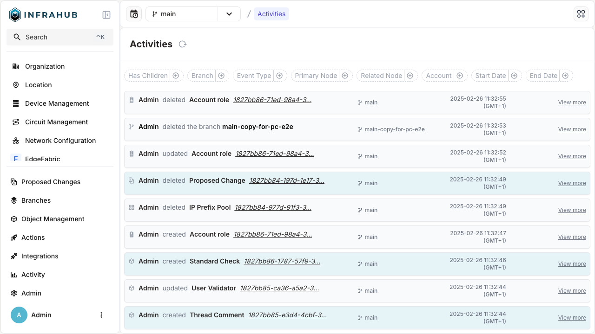
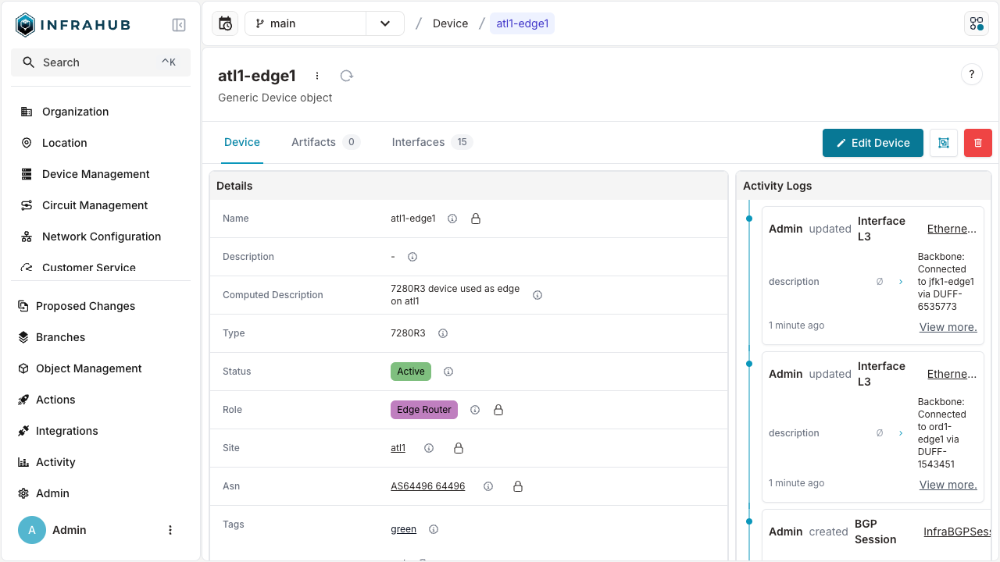
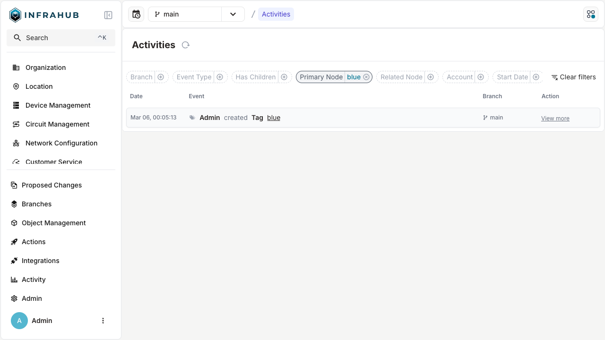
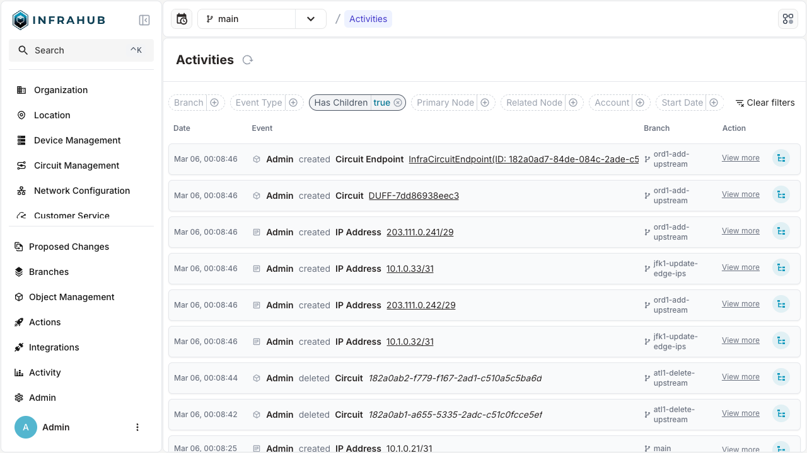
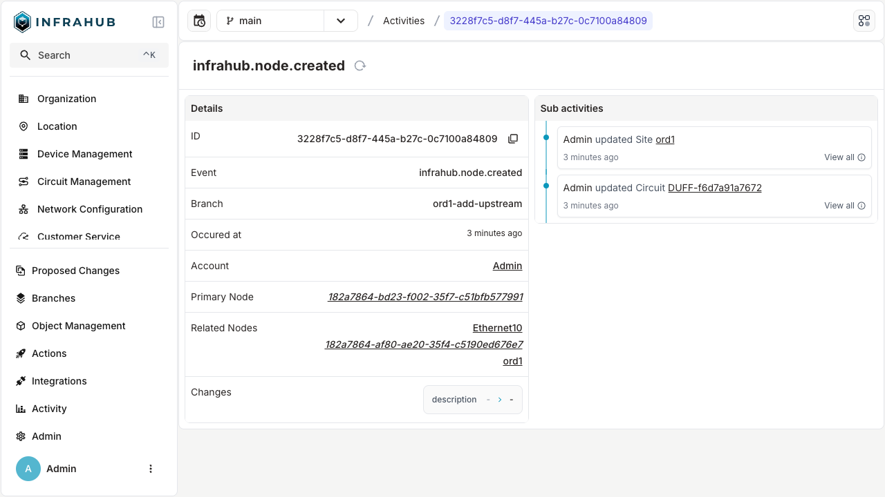
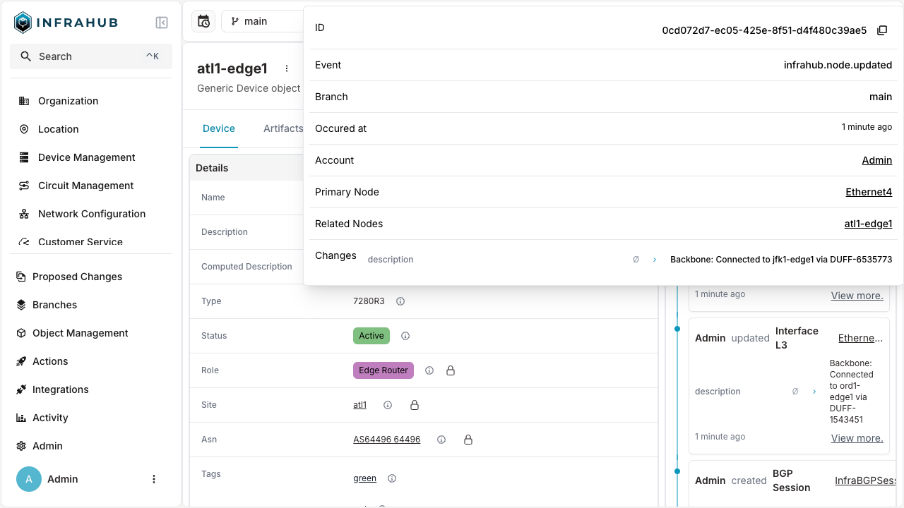

# Activity log

Changes (events) in Infrahub are documented in the **Activity log**. It helps you see which objects were impacted, when a change was made, and who made it. It can be used to troubleshoot unforeseen changes, audit previous operations, and comprehend the order of updates across various branches.

To export these events to an external SIEM or centralized logging system, see [log forwarding](./log-forwarding/overview.mdx).

:::warning Permissions
Because figuring out who may view which changes requires complicated query requirements, we have currently set aside the permission framework for this functionality.

:::

The activity log, in general, compiles and arranges events from several branches and objects into a single timeline:

* **Global view**: A consolidated list of all branch-wide activities (events).
* **Object-level view**: A timeline that is particular to a single object and only displays events that are pertinent to that object.
* **Filtering**: You can narrow down your search using a variety of filters (by branch, event type, account, principal node, linked node, date range).
* **Nested / child events**: Cascade actions are observed when specific top-level events trigger additional child events.

## Accessing the activity log

The activity log can be accessed in any of two ways: globally or at the object level.

1. **Global activity log**:
   * Menu location: In the main navigation, go to **Activity** → **Activity log**.
   * URL: `https://<your-instance>/activities`



:::info Time and date
The activity log's date and time are determined by the local time in your browser.

:::

:::info Child Events
Events containing child events have an extra (blue) icon at the end of the line.

:::

2. **Object-level activity log**:
   * Node / object detail pages: Within a node's detail view (for example an IP address or device), you'll see a right-hand "Activity logs" panel or a separate tab.



## Filters and search

There are several ways to hone your view in the global activity log:

* **Branch**: Select the branch you wish to view the events in, such as `main`.
* **Event type**: Filter by categories such as `Node Created`, `Branch Deleted`. You can find more information in the [Infrahub Events](../../reference/infrahub-events/overview.mdx) topic.
* **Account / user**: Only display events that have been initiated by a certain account.
* **Primary / related node**: Highlight activities associated with a specific node.
* **Has children**: Whether a certain occurrence led to other smaller ones.
* **Date range**: Set a start and end time and date for the timeline.




## Querying the activity log over the API

Use the `InfrahubEvent` GraphQL query to read the activity log from a script: collect every operation in an incident window, or line those operations up against the data as it stood at the time.

```graphql title="Events in a time range"
query IncidentEvents {
  InfrahubEvent(
    since: "2026-03-09T00:00:00Z"
    until: "2026-03-10T00:00:00Z"
    branches: ["main"]
  ) {
    count
    edges {
      node {
        id
        event
        branch
        occurred_at
        account_id
        primary_node { id kind }
      }
    }
  }
}
```

`until` defaults to the current time. A query that omits `since` returns events as far back as the [activity log retention](#retention), including events older than 180 days when the retention is longer. Selecting `count` makes the task manager count every matching event in the time range, which takes much longer than reading one page when the range holds millions of events; leave it out when you only need the events.

The filters available in the web interface map onto these parameters, and the query accepts several that the interface does not expose:

| Parameter | Selects |
|---|---|
| `since`, `until` | Events in a time range |
| `branches` | Events on specific branches |
| `account__ids` | Events initiated by specific accounts |
| `event_type` | Events matching a type, such as `infrahub.node.updated` |
| `event_type_filter` | Filters specific to one event type |
| `primary_node__ids` | Events whose primary node is one of these |
| `related_node__ids` | Events whose related nodes include one of these |
| `parent__ids` | Events listing one of these as a parent |
| `has_children` | Events that did or did not trigger child events |
| `level` | Root events (`0`) or a given depth of child event |
| `ids` | Specific events by ID |
| `order` | Sort order, descending by default |
| `limit`, `offset` | Page through the results |

See [Infrahub Events](../../reference/infrahub-events/overview.mdx) for the event types and the fields each one carries.

## Viewing event details

If you choose **View more** from the global or object-level list, a separate detail page or popover will show up. Additional details are shown in this view, such as:

* **Event ID**: A unique UUID referencing the event.
* **Event type**: The type of the event, for example, `infrahub.node.updated`. You can find more information in the [Infrahub Events](../../reference/infrahub-events/overview.mdx) topic.
* **Occurred at**: The exact moment the incident took place
* **Account**: The account that carried out the activity.
* **Primary node**: The primary object that the event affects.
* **Related nodes**: Additional affected objects.
* **Changes**: Any before and after adjustments to updated attributes, if any




## Retention

The task manager keeps the events of the activity log for the activity log retention, 7 days by default, and deletes older events every hour, together with their related records. Deleted events cannot be recovered. The activity log and the `InfrahubEvent` query return events as far back as the retention.

To keep the activity log longer, raise `task_manager.retention.activity_log` on the task manager, for example to `365d` with `INFRAHUB_TASK_MANAGER_RETENTION_ACTIVITY_LOG=365d`. [Set the retention](./tasks.mdx#set-the-retention) describes the three retention settings, how to set them, and the `PREFECT_*` variables that take precedence over them. To keep events beyond the retention, for example for an audit, export them with [log forwarding](./log-forwarding/overview.mdx).

The task manager also stores events for its own use, such as the state changes of task runs, in the same database. The activity log does not show them. They are kept for their own retention, `prefect_own_events`, 7 days by default, so a longer activity log retention does not keep them longer. A `prefect_own_events` value longer than `activity_log` is reduced to the `activity_log` value, with a warning in the task manager log, because the task manager deletes every event older than the activity log retention.

When you lower the activity log retention, the next hourly cleanup deletes the events older than the new value. The database files do not shrink: PostgreSQL reuses the space of the deleted events for new ones.

### Plan disk space for a longer retention

In OpsMill benchmarks, the task manager database used 5.7 to 8.1 GiB of disk per million stored events. To estimate the space a longer retention needs, count the events of the last 7 days and scale the count to the retention you plan:

```graphql title="Number of events since a date"
query EventsLastWeek {
  InfrahubEvent(since: "2026-09-27T00:00:00Z") {
    count
  }
}
```

For example, 200,000 events in 7 days are about 10.4 million events in a year, which need about 59 to 84 GiB of disk.
