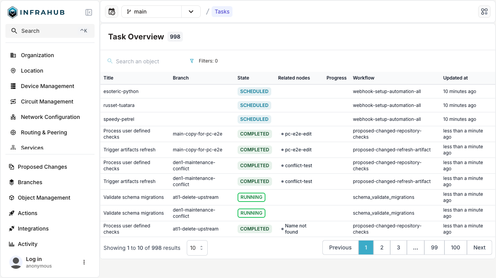

# Tasks

The **Tasks system** in Infrahub is designed to manage and control various backend operations with robust error reporting, improved supervision, and enhanced logging capabilities.

In Infrahub 1.0, we integrated Prefect as the task manager to orchestrate workflows. The task system is comprised of:

* A **Task manager** (based on Prefect) that orchestrates tasks.
* One or more **Task workers** (written in Python) that execute operations

In Infrahub 1.1, key backend tasks began to be migrated to this framework, and subsequent releases have further refined its functionality.

See the [Architecture](../../overview/architecture.mdx) subject for further information about the Task manager and Task worker as well as the overall system design.

Key operations managed by the task system include:

* Jinja template rendering.
* Performing checks and Transform functions.
* Carrying out pull, merge, and diff Git operations.

More logging and oversight are made possible by these enhancements, which increase background task dependability and transparency.
The tasks indicator at the top right of the Infrahub window is a noticeable feature for users. It provides a quick access to examine both in-progress and finished tasks and changes color while a job is active.

## Workflow types

Every workflow belongs to one of three types:

| Type | Shown in the UI as | What it covers |
| ---- | ------------------ | -------------- |
| `core` | Core | Infrastructure operations triggered by Infrahub itself, such as branch and repository work. |
| `user` | User | Code you supply — transforms, Generators and checks from a repository. |
| `internal` | System | Background flows Infrahub runs for itself, including the scheduled ones below. |

The Tasks list shows Core and User runs by default. Use the **Type** filter to include System runs;
the unfiltered list is unchanged when no type is selected.

## Scheduled flows

Some internal workflows run on a schedule rather than in response to an event. **Tasks → View
scheduled flows** (`/tasks/scheduled`) lists each one with its schedule, the outcome of its most
recent run, and a breakdown of every run outcome from the last 24 hours. Selecting a flow opens the
Tasks list scoped to that workflow, with no state filter applied so failed and cancelled runs are
included.

Each flow carries a health verdict:

| Verdict | Meaning |
| ------- | ------- |
| Healthy | The most recent run that executed neither failed nor was cancelled — it completed, or it is still running. |
| Failed | The most recent run that executed failed or crashed. |
| Cancelled | The most recent run that executed was cancelled — commonly by a concurrency collision, where a new run is dropped because the previous one is still going. |
| Overdue | No run has executed within three of the flow's own scheduled intervals. This is what a stalled or unclaimed schedule looks like. |
| Never run | The flow has not run since it was registered. |
| No recent runs | No run history is available, and it cannot be told apart from history that has been purged. |
| Paused | The schedule is switched off, so no run is expected. |

A flow whose runs are being cancelled by collisions, or whose 24-hour breakdown shows runs
scheduled but none completed, is not making progress even though nothing has failed outright.

The data behind the view is cached for up to one minute. It does not poll; use the refresh control
to fetch it again.
