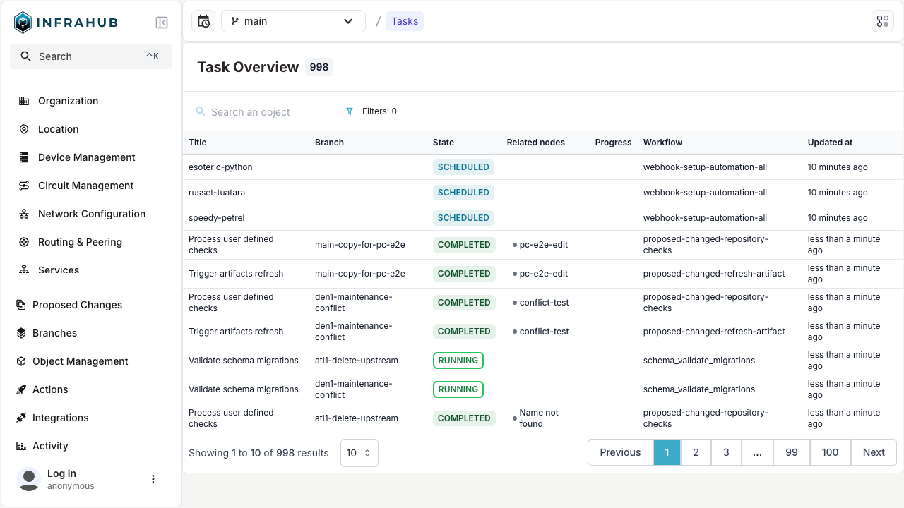

# Tasks

The **Tasks system** in Infrahub is designed to manage and control various backend operations with robust error reporting, improved supervision, and enhanced logging capabilities.

In Infrahub 1.0, we integrated Prefect as the task manager to orchestrate workflows. The task system is comprised of:

* A **Task manager** (based on Prefect) that orchestrates tasks.
* One or more **Task workers** (written in Python) that execute operations

In Infrahub 1.1, key backend tasks began to be migrated to this framework, and subsequent releases have further refined its functionality.

See the [Architecture](../../overview/architecture.mdx) subject for further information about the Task manager and Task worker as well as the overall system design.

Key operations managed by the task system include:

* Jinja template rendering.
* Performing checks and Transform functions.
* Carrying out pull, merge, and diff Git operations.

More logging and oversight are made possible by these enhancements, which increase background task dependability and transparency.
The tasks indicator at the top right of the Infrahub window is a noticeable feature for users. It provides a quick access to examine both in-progress and finished tasks and changes color while a job is active.



## Task history retention

The task manager stores every task run, with its logs and artifacts, in its own PostgreSQL database. This task history is what the Tasks view lists. Every hour, the task manager deletes the finished runs (completed, failed, cancelled, or crashed) whose end time is older than the task history retention, 30 days by default, together with their logs and artifacts. The deletion cannot be undone. Runs that are still running or pending are not deleted; see [Runs that stay running or pending](#runs-that-stay-running-or-pending).

### Set the retention

The `task_manager.retention` section of the configuration holds three retention settings. Each one has its own environment variable:

| Setting | Environment variable | Default | Records kept |
|---|---|---|---|
| `task_history` | `INFRAHUB_TASK_MANAGER_RETENTION_TASK_HISTORY` | `30d` | Finished task runs, with their logs and artifacts |
| `activity_log` | `INFRAHUB_TASK_MANAGER_RETENTION_ACTIVITY_LOG` | `7d` | The events of the [activity log](./activity-log.mdx#retention) |
| `prefect_own_events` | `INFRAHUB_TASK_MANAGER_RETENTION_PREFECT_OWN_EVENTS` | `7d` | The events that the task manager records for its own use, which the activity log does not show |

```toml
[task_manager.retention]
task_history = "90d"
activity_log = "7d"
prefect_own_events = "7d"
```

Set the values on the task manager, and on the container of its background services if they run in a container of their own. The Docker Compose file passes the three environment variables to the task manager, so you can set them in your `.env` file; [How to configure Infrahub](../install-configure/configure-infrahub.mdx) describes the ways to set environment variables. The values apply when the task manager starts.

Each value is a number of days, such as `30d`, or an ISO 8601 duration, such as `P30D`, from 1 to 36,500 days. A value outside that range, or in another form, stops the task manager at startup with an error that names the setting:

```text
task_history | Value error, Invalid task manager retention: task_history must be at least 1 day (value_error)
```

At startup, the task manager logs the values in effect, in lines that start with `Task manager retention:`.

The task manager applies these settings through the settings of Prefect, the workflow engine it runs. If one of the following Prefect variables is already set in the environment of the task manager, under any name Prefect accepts for it, its value takes precedence, and the task manager logs a warning such as `PREFECT_EVENTS_RETENTION_PERIOD is set and overrides task_manager.retention.activity_log`:

| Prefect variable | Setting it overrides |
|---|---|
| `PREFECT_SERVER_SERVICES_DB_VACUUM_ENABLED` | `task_history`: the task manager deletes task runs every hour only when the value includes `flow_runs` |
| `PREFECT_SERVER_SERVICES_DB_VACUUM_RETENTION_PERIOD` | `task_history` |
| `PREFECT_SERVER_EVENTS_RETENTION_PERIOD`, or its older name `PREFECT_EVENTS_RETENTION_PERIOD` | `activity_log` |
| `PREFECT_SERVER_SERVICES_DB_VACUUM_EVENT_RETENTION_OVERRIDES` | `prefect_own_events` |

Remove these variables from your deployment to let the `task_manager.retention` settings apply.

### Delete old task runs and get disk space back

`infrahub tasks flush flow-runs` deletes the same runs as the hourly cleanup, with their logs and artifacts, using the task history retention in effect on the task manager. The deletion runs inside the task manager, one day of end times at a time, and the command prints the progress and then a summary. If the command is interrupted, the deletion continues in the task manager. Running the command again follows the deletion that is still running, or continues from the oldest remaining day.

Deleting runs does not shrink the database files: PostgreSQL reuses the space of deleted rows for new runs, so the disk usage stays level but does not go down. With `--rewrite`, the command then rewrites the six task history tables, which returns the space of the deleted runs to the disk. Each table is locked while it is rewritten, and the rewrite needs free disk space for a copy of the runs that remain. Run it in a maintenance window, with the Infrahub server and the task workers stopped. On Docker Compose:

```bash
docker compose stop infrahub-server task-worker
docker compose run --rm infrahub-server infrahub tasks flush flow-runs --rewrite
docker compose start infrahub-server task-worker
```

The summary reports the number of runs deleted, the size of the task history tables before and after, and whether the tables were rewritten. If another session holds a lock on a table for more than 60 seconds, the command retries that table three times, then skips it and names it in the summary; run the command again later to rewrite it.

Use `--rewrite` after you lower the task history retention. The next hourly cleanup deletes the runs older than the new value, and the command rewrites the tables even though it has little left to delete. It is also the maintenance step of a Helm upgrade, described in [Upgrade Community](../maintain-upgrade/upgrade/community.mdx) and [Upgrade Enterprise](../maintain-upgrade/upgrade/enterprise.mdx).

The command exits with:

* `0` when the deletion completed, and also when the task manager runs a release without the cleanup, in which case it prints `The task manager does not provide the task history cleanup yet; skipped.` and deletes nothing.
* `1` when the deletion failed, when the task manager could not be reached to start it, when the task manager answered with an unexpected error, or when the command gave up after 3 hours in which the task manager only answered that another task manager replica runs a deletion, or could not be reached.

The command no longer accepts `--days-to-keep` and `--batch-size`. Set the `task_history` retention instead.

### Runs that stay running or pending

A run can stay running or pending after the task worker that ran it stopped, for example after a crash. The hourly cleanup does not delete these runs, because they never finished. `infrahub tasks flush stale-runs` marks the runs that have been running or pending for more than 2 days as crashed:

```bash
docker compose exec infrahub-server infrahub tasks flush stale-runs
```

A crashed run has an end time, so the hourly cleanup deletes it once it is older than the task history retention. Change the number of days with `--days-to-keep`. The command selects runs by the time they started, so it does not mark a pending run that never started. It also marks a run that is still working after that many days, so check that no task is meant to run that long before you run it.

### Background services in their own container

The task manager runs the hourly cleanups in its background services. When these services run in a container of their own instead of inside the task manager, start that container with `infrahub tasks background-services` rather than `prefect server services start`. `prefect server services start` does not read the `task_manager.retention` settings, so it does not delete task runs and keeps events for Prefect's default retention.
