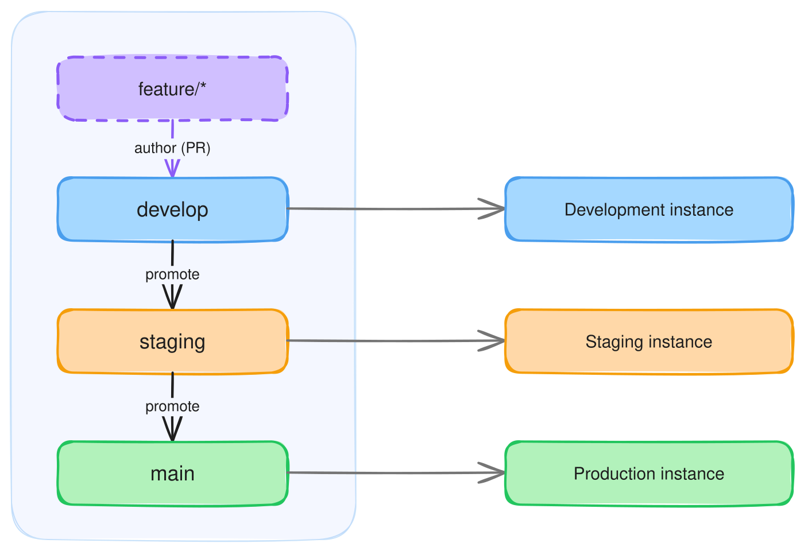

Run a separate Infrahub instance for each environment — development, staging, production — from one Git repository. Each instance reads its schemas, objects, and automation from a [read-only repository](./overview.mdx#read-only-vs-core) pinned to one long-lived branch. To move a change from one environment to the next, merge it into the next branch on your Git host, then trigger an import on the target instance.

Use this pattern when you want environment isolation with a Git-native promotion path: each environment is independent, every promotion is a pull request on your Git host, and a change is reviewed on the Git side and again inside Infrahub before it reaches production.

## What moves through Git

A read-only repository imports what you declare in [`.infrahub.yml`](./infrahub-yml.mdx):

- Schemas
- Objects defined in object files
- GraphQL queries
- Jinja2 and Python Transformations
- Artifact definitions
- Generators
- Checks
- Menus

These are the changes you promote between environments. Data created directly in an instance through the UI or API — the objects your users edit day to day — is not part of this. It lives in each instance and never moves through Git.

## Git and Infrahub terminology

A promotion touches two systems that share vocabulary — both Git and Infrahub have branches, a `main`, and a merge step. The terms below keep them apart:

- **Git branch**, **Git pull request** — on your Git host. The long-lived per-environment branches (`develop`, `staging`, `main`) are Git branches; moving a change from one to the next is a pull request.
- **Infrahub branch**, **proposed change** — inside a single instance. You import into an Infrahub branch, review it as a proposed change, and merge it into that instance's `main`.

Production's Git branch is also named `main`, but it is unrelated to any instance's internal `main`.

## The model

One repository holds one long-lived Git branch per environment. Each branch maps to its own instance through that instance's read-only repository `ref`:

| Git branch | Infrahub instance | Read-only repository `ref` |
| --- | --- | --- |
| `develop` | Development | `develop` |
| `staging` | Staging | `staging` |
| `main` | Production | `main` |

This example uses three environments, but the count is arbitrary — two (`develop` → `main`) or five work the same way, and the steps for each promotion hop are identical. Add or remove an environment by adding or removing a Git branch and the instance that tracks it.

Every environment is a **consumer**: its files come from a read-only repository, and no instance holds a read-write [`Repository`](./overview.mdx#read-only-vs-core), so nothing is ever pushed back to Git. You author changes the plain Git way — edit files locally and open a pull request into an environment's branch.

:::note Use a read-only repository, not a read-write one

Read-write `Repository` connections are not recommended for multi-environment setups: they push merges back to Git and track every branch, which breaks the per-environment isolation this pattern depends on. If you currently connect the repository as a read-write `Repository` on a single instance and want to adopt this pattern, connect it as a read-only repository instead.

:::

A read-only repository does not poll the remote for new commits — there is no background sync, unlike a read-write repository. It imports only in response to an explicit action: running the **Import latest commit** action, or changing its `ref` (which dispatches an import on its own). Either way, an import is a deliberate step, not an automatic sync of every new commit on the branch.

## Promoting a change

Each instance's `main` tracks its environment branch through the read-only repository's `ref` — the branch name you set. (Infrahub records which commit it imported internally; that is not something you set.)

You never import onto `main` directly. Land a change through an Infrahub branch: create the branch, import the change onto it by pointing `ref` at the branch that holds it, review the result as a [proposed change](../proposed-changes/overview.mdx), and merge — which advances `main`. Because `ref` is branch-aware, working on the Infrahub branch never disturbs `main`.

Authoring and promotion differ only in where the change comes from: a Git feature branch you are working on (authoring), or the environment branch after the previous environment merged into it (promotion). In both, `main`'s `ref` ends up on the environment branch. The [guide](./promote-between-environments.mdx) covers both, including how `ref` moves to a feature branch during authoring and returns to the environment branch before the merge.

:::caution Do not import onto `main` directly

Pointing `main`'s `ref` at a branch and importing there skips the Infrahub branch and its proposed change. It is faster but not recommended: an import can fail — especially while a schema is being developed and iterated — and there is no clean way to undo a bad import on `main`, whereas an Infrahub branch can be discarded.

:::

## Known limitations

- **Schema retirement is not automatic.** Removing a field or node from the schema files does not remove it from an instance — set `state: absent` on those nodes to retire them (the same as with `infrahubctl schema load`). Deleting the lines is not enough; the removal must be stated explicitly.
- **Clearing all object files at once orphans their objects.** Objects imported from an object file are pruned when you remove the file — deleted on the next import. The exception is removing the *last* object file, or clearing the whole `objects:` list, in a single import: with no objects left to track, the removal is not detected and the objects stay, needing manual cleanup. Remove object files one at a time, keeping at least one until the end; an empty file or `data: []` does not force the deletion.
- **A proposed change carries the repository's `ref` and `commit`.** Both are branch-aware, so merging an Infrahub branch that changed them updates `main` as well. Point the `ref` back to the environment branch before merging, so `main` keeps tracking it — the [guide](./promote-between-environments.mdx) does this.
- **No clean rollback.** A promotion applies forward; reverting the `ref` restores the file-defined content, not the instance state it produced. Recover a bad production promotion from a database backup — see [reaching production safely](#reaching-production-safely) below.
- **Data stays per-instance.** Only file-defined content promotes; objects created in the UI or API are not carried between environments.

## Reaching production safely

Lower environments make promotion safer, but they are not proof. Staging drifts from production over time — different data, a different history of applied changes — so a change that imported cleanly on staging can still behave differently against production's actual state.

Importing into an Infrahub branch and merging through a proposed change removes most of that risk: you review the exact diff before it touches production `main`. But the merge of that proposed change can itself fail partway and leave `main` in an unexpected state, and there is no clean rollback — an import applies forward, and reverting the `ref` restores the files, not the instance state the import produced.

To be certain a promotion applies cleanly, test it against production's real state first. Provision a pre-production instance on demand from a current production [database backup](../deploy-manage/maintain-upgrade/database-backup/backup-and-restore.mdx), run the promotion there, and confirm it applies cleanly before promoting production itself. Because it starts from a fresh backup, it matches production exactly, with none of the drift a long-lived staging environment accumulates. This rehearsal can be added as a stage in the pipeline that merges the promotion's proposed change, so production is touched only after the same change has applied cleanly on a copy of it.

## Further reading

- [Develop changes from a Git repository](./develop-changes.mdx) — the single-instance workflow promotion builds on
- [Promote changes between environments](./promote-between-environments.mdx) — the cross-environment how-to
- [Git integration](./overview.mdx) — repository types, `ref` tracking, and the import model
- [Proposed changes](../proposed-changes/overview.mdx) — the review and merge workflow used inside each instance
- [Database backup and restore](../deploy-manage/maintain-upgrade/database-backup/backup-and-restore.mdx) — spinning up a pre-production copy of production
