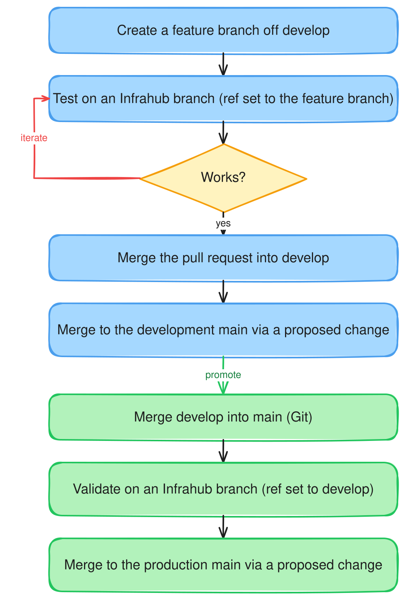

Run a separate Infrahub instance for each environment from one Git repository, and move changes from one environment to the next. This guide covers the **promotion** — taking a change that is already developed on one environment and landing it on the next. To develop and land a change on a single instance, see [develop changes from a Git repository](./develop-changes.mdx); for the concepts, see [multiple environments from a single repository](./multi-environment.mdx).

The example uses two environments — **development** (imports the `develop` branch) and **production** (imports the `main` branch) — but the steps repeat for any number.



## Prerequisites

- One Infrahub instance per environment, each with the repository connected as a **read-only repository** pinned to that environment's Git branch — `develop` on development, `main` on production (see [connect a repository](./connect-repository.mdx)).
- A change already developed and merged onto the development instance's `main` (see [develop changes from a Git repository](./develop-changes.mdx)).

## Register the repository

Connect the repository on each instance as a read-only repository, setting `ref` to that environment's Git branch.

```graphql
mutation {
  CoreReadOnlyRepositoryCreate(data: {
    name: { value: "infra" }
    location: { value: "https://github.com/<org>/<repo>.git" }
    ref: { value: "develop" }          # "main" on the production instance
    credential: { id: "<credential-id>" }
  }) { ok }
}
```

Each instance's `main` keeps its `ref` on its environment branch from here on; promotion advances the imported commit, never the `ref`.

## Promote a change

A promotion is a Git merge into the next environment's branch, then an import on that environment's instance. The instance-side steps are the same ones you use to [develop a change](./develop-changes.mdx) — the change comes from the upstream branch instead of a feature branch.

1. On your Git host, open a pull request from the source branch to the next (for example `develop` → `main`) and merge it. The target branch's head now holds the change.
2. On the target instance, land the merged change through an Infrahub branch, exactly as in [Develop changes, Step 3](./develop-changes.mdx#step-3-land-the-change-on-main): create a branch, run **Import latest commit** (its `ref` is already the target branch), open a proposed change to `main`, review, and merge.

To catch problems before the Git pull request merges, validate first: import the source branch onto a throwaway Infrahub branch (set its `ref` to the source branch) and check it there — see [Develop changes, Step 2](./develop-changes.mdx#step-2-test-it-on-an-infrahub-branch).

Repeat the hop for each environment in the chain (for example `develop` → `staging` → `main`).

:::note Rehearse a production promotion first

Lower environments drift from production over time, so a clean import there does not prove the change applies cleanly to production — and a proposed-change merge that fails partway leaves `main` in an unexpected state, with no clean rollback. Before promoting production, rehearse the promotion against a pre-production instance restored from a current [database backup](../deploy-manage/maintain-upgrade/database-backup/backup-and-restore.mdx). See [reaching production safely](./multi-environment.mdx#reaching-production-safely).

:::

## Automate the promotion (optional)

:::note Experimental — a starting point, not a finished solution

The manual steps above are the supported path. Automating the Infrahub side is possible, but treat what follows as inspiration to adapt, not a finished pipeline, and keep production promotions manual until you have validated your own automation end to end.

:::

An automated gate follows the same pattern: on a Git pull request into an environment branch, CI creates an Infrahub branch, imports the change onto it, opens a proposed change, and blocks the pull request — as a **required status check** — until the proposed change's checks pass. Checking those from CI uses the proposed change's `validations`, where each reports a `state` (`queued`, `in_progress`, `completed`) and a `conclusion` (`unknown`, `failure`, `success`):

```graphql
query {
  CoreProposedChange(ids: ["<proposed-change-id>"]) {
    edges { node {
      validations { edges { node {
        display_label
        state { value }
        conclusion { value }
      } } }
    } }
  }
}
```

Poll until every validation's `state` is `completed`, then fail the CI job unless every `conclusion` is `success`. Store each instance's address and an [API token](../deploy-manage/user-management/managing-api-tokens.mdx) as CI secrets, and authenticate with the `X-INFRAHUB-KEY` header.

## Related

- [Develop changes from a Git repository](./develop-changes.mdx) — the single-instance workflow this builds on
- [Multiple environments from a single repository](./multi-environment.mdx) — the concepts behind this pattern
- [Connect a repository](./connect-repository.mdx) — repository registration in depth
- [Proposed changes](../proposed-changes/overview.mdx) — the review workflow used inside each instance
