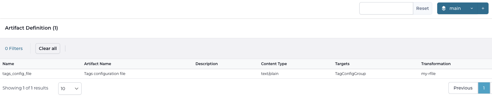
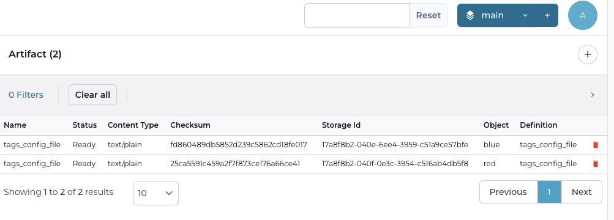
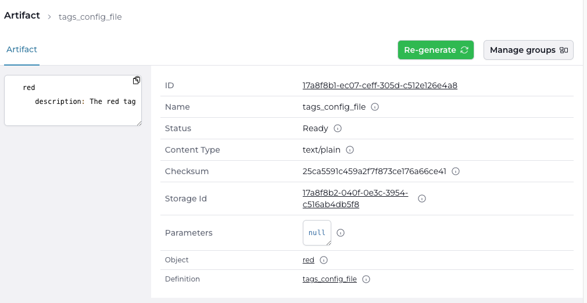

# Creating an artifact in Infrahub

:::note

This guide has the assumption that you followed the [Creating a Jinja Rendered File (Transform)](./jinja2-transform.mdx) or [Creating a Python transform](./python-transform.mdx) guide as well as [Creating a Group](./groups.mdx) guide
This is a prerequisite.

:::

The goal of this guide is to define an artifact for a Jinja rendered Transform or Python transform in Infrahub. We will be using the following steps.

1. Creating an artifact definition
2. Accessing the artifacts

## Creating an artifact definition

In the last step we need to define an Artifact definition, which groups together a [transformation](../topics/transformation.mdx) with a target group and forms the definition of the artifact. Artifact definitions can be created via the frontend, via GraphQL or via a [Git repository](../topics/repository.mdx). In this guide we will be using the Git repository.

Add the following contents to the end of the `.infrahub.yml` file at the root of the `tags_render` repository.

```yaml
artifact_definitions:
  - name: "tags_config_file"
    artifact_name: "Tags configuration file"
    parameters:
      tag: "name__value"
    content_type: "text/plain"
    targets: "TagConfigGroup"
    transformation: "my-transform"
```

This defines an artifact with the following properties:

- **name**: a unique name for the artifact
- **parameters**: the parameter to pass to the transformation GraphQL query, in this case this we will pass the name of the object (tag) as the tag parameter
- **content type**: the content type for the resulting artifact
- **targets**: the name of a group of which the members will be a target for this artifact
- **transformation**: the Jinja2 or Python transformation that should be used

More details on the `.infrahub.yml` file format can be found in [.infrahub.yml topic](../topics/infrahub-yml.mdx).

Commit the changes to the repository and push them to the Git server

```shell
git add .
git commit -m "add tags_config_file artifact definition"
git push origin main
```

The artifact definition will be created in the database, when the Task worker(s) notice the change in the Git repository. The `tags_config_file` should now be visible in the Artifact Definition view in the web interface.


## Accessing the artifacts

The artifacts are generated by the git-agents. You can find the resulting artifacts in the Artifact view under the Deployment menu in the web interface.



Open an artifact to get the result.


You can download the artifact by clicking on the `Storage Id` or alternatively through the rest API endpoint `http://<INFRAHUB_HOST:INFRAHUB_PORT>/api/storage/object/<storage_id>`

Optionally, Infrahub can create a relation between a node and an artifact, by inheriting from the CoreArtifactTarget generic in the schema of the node. This is outside the scope of this guide, since the BuiltinTag node does not inherit from CoreArtifactTarget. More information can be found in the [artifact](../topics/artifact.mdx) topic.
