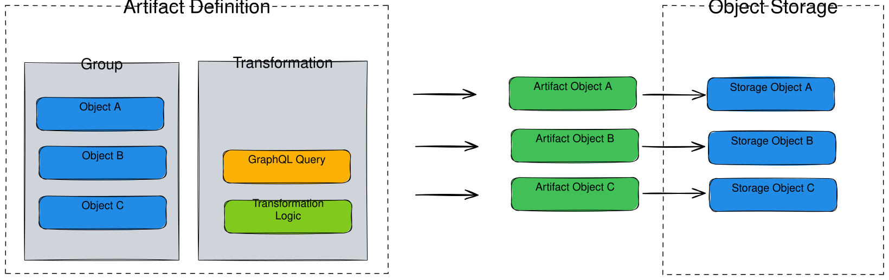
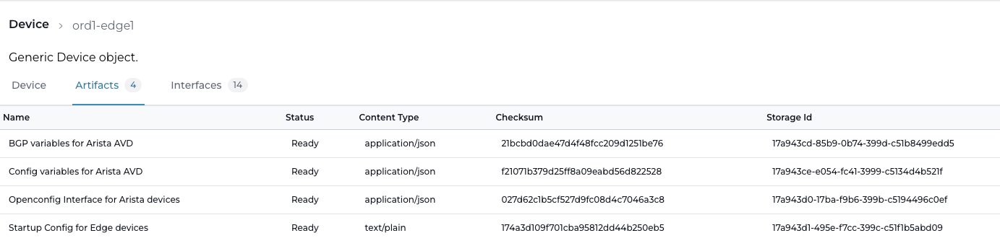
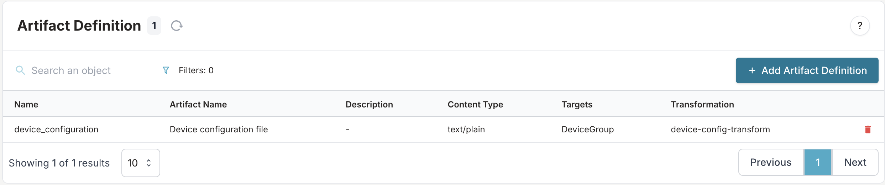
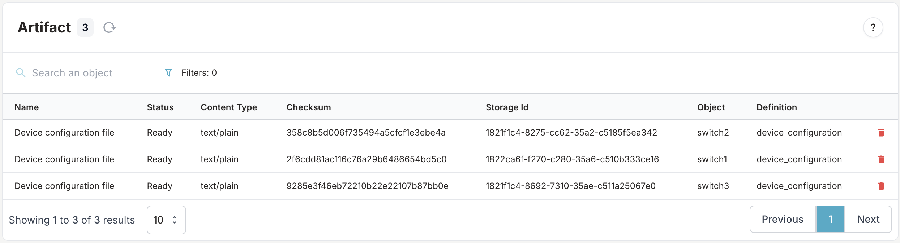
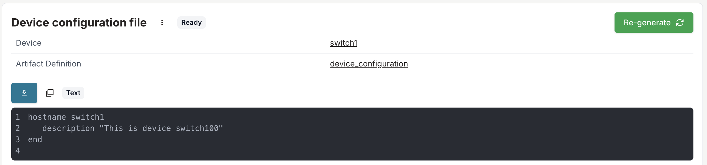
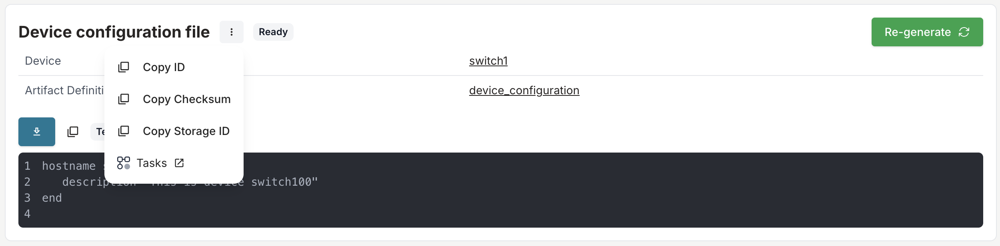

import VideoPlayer from '../../src/components/VideoPlayer';

# Artifacts in Infrahub

Artifacts are the result of a [transformation](../topics/transformation.mdx) for a specific context or object. You use artifacts to track generated configuration, store outputs, and enable traceability for infrastructure objects.

## Table of contents

- [What is an artifact?](#what-is-an-artifact)
- [Supported formats](#supported-formats)
- [Artifact examples](#artifact-examples)
- [Artifact benefits](#artifact-benefits)
- [High level design](#high-level-design)
- [Schema requirements](#schema-requirements)
- [Create a group and add members](#create-a-group-and-add-members)
- [Define an artifact](#define-an-artifact)
- [Access artifacts](#access-artifacts)

## What is an artifact?

An artifact is generated by running a transformation (such as a Jinja or Python template) for a specific object or group of objects. Artifacts are stored in Infrahub's object storage and are accessible via the web interface and API. The content of an artifact can change, but its identifier remains the same over time.

## Supported formats

Artifacts support the following MIME types and formats. These are rendered properly in the Infrahub web interface:

- application/json
- application/yaml
- application/xml
- application/hcl
- text/plain
- text/markdown
- text/csv
- image/svg+xml

## Artifact examples

:::success Examples

- For a network device, use an artifact to track the configuration generated from a Jinja template (transformation).
- For a security device, an artifact can be a list of rules in JSON generated by a Python transformation.
- An artifact can represent the configuration of a DNS server or a specific virtual IP on a load balancer.

:::

## Artifact benefits

- **Caching**: Generated artifacts are stored in internal [object storage](../topics/object-storage.mdx). For resource-intensive transformations, serving from cache reduces system load.
- **Traceability**: Past values of an artifact remain available. (Future releases will support artifact diffing.)
- **Peer review**: Artifacts are included in the [Proposed Change](../topics/proposed-change.mdx) review process.
- **Database integration**: Artifact nodes are stored in the database. Other nodes can reference them, enabling artifact-related queries.

## High level design

Artifacts are defined by grouping a [transformation](../topics/transformation.mdx) with a group of targets in an artifact definition. Each artifact definition specifies:

- Group of targets
- Transformation
- Output format
- Information to extract from each target and pass to the transformation

From an artifact definition, artifact nodes are created for each target in the group. The result of the transformation is stored in [object storage](../topics/object-storage.mdx). Task workers generate artifacts automatically.



## Schema requirements

To generate artifacts for a node, the node must inherit from the `CoreArtifactTarget` generic. This enables the Artifacts tab in the node's detail view in the UI, allowing you to access all artifacts generated for that node.

```yaml
nodes:
  - name: Device
    namespace: Infra
    inherit_from:
      - CoreArtifactTarget
    attributes:
      - name: name
        kind: Text
        label: Name
        optional: false
        unique: true
      - name: description
        kind: Text
        label: Description
        optional: true
```

Load the updated schema into Infrahub:

```bash
infrahubctl schema load /tmp/schema.yml
```



## Create a group and add members

Create a group for each artifact definition. An artifact is generated for every member of the group.

Example: Create a standard group named `DeviceGroup` and add `NetworkDevice` nodes `switch1`, `switch2`, and `switch3` as members.

See the [group guide](./groups.mdx) for more details.

<center>
  <VideoPlayer url='https://www.youtube.com/watch?v=ASGMKZVLCbY' light />
</center>

## Define an artifact

Define an artifact by creating an artifact definition. This links a transformation, a target group, and output details. You can define artifact definitions via the web interface, GraphQL, or a [Git repository](../topics/repository.mdx).

Example: Add to the end of the `.infrahub.yml` file in your repository:

```yaml
artifact_definitions:
  - name: device_configuration
    artifact_name: Device configuration file
    parameters:
      name: name__value
    content_type: text/plain
    targets: DeviceGroup
    transformation: device_config_transform
```

- **name**: Unique artifact name
- **parameters**: Parameters to pass to the transformation (e.g., device name)
- **content_type**: Output MIME type
- **targets**: Name of the group whose members are targets
- **transformation**: Name of the Jinja2 or Python transformation

See the [.infrahub.yml topic](../topics/infrahub-yml.mdx) for more details.

Commit and push your changes:

```bash
git add .
git commit -m "add device_configuration artifact definition"
git push origin main
```

Task workers will detect the new artifact definition and create it in the database. The artifact should appear in the Artifact Definition view in the web interface.



## Access artifacts

Artifacts are generated by task workers. You can access them in several ways:

- **Web interface**: Go to the Artifact view under Object Management.

  

  Open an artifact to view the result.

  

  Download the artifact using the download button or via the REST API:

  ```shell
  http://<INFRAHUB_HOST:INFRAHUB_PORT>/api/storage/object/<storage_id>
  ```

  The Storage Id is available in the menu next to the artifact name.

  

- **Object detail view**: Navigate to a device's detail page. The *Artifacts* tab lists all artifacts generated for that object.

  
