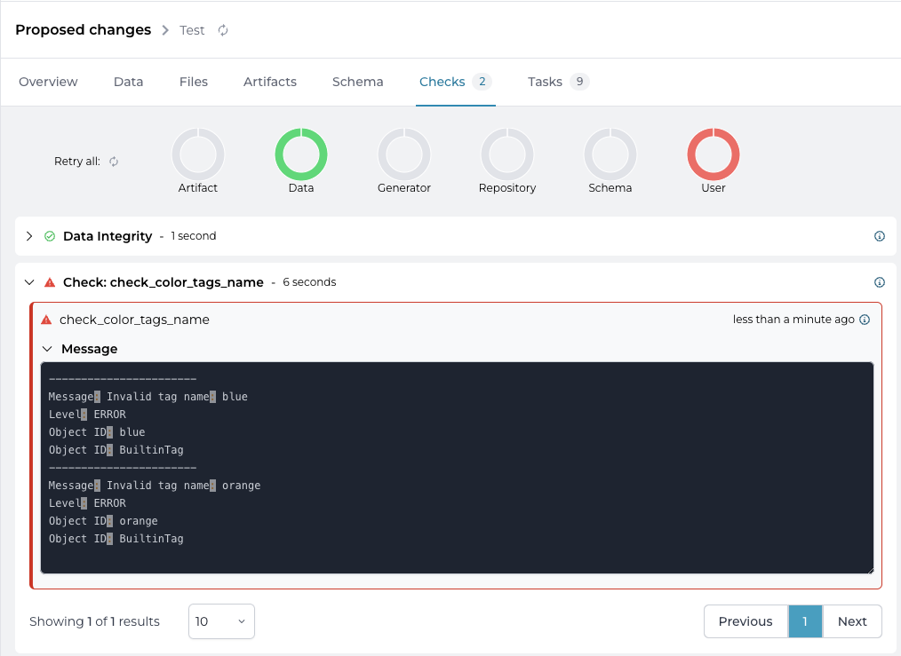

<!-- vale off -->
## Creating a Check
<!-- vale on -->
Within Infrahub a [Check](/topics/check) is defined in an [external repository](/topics/repository). However, during development and troubleshooting it is easiest to start from your local computer and run the check using [infrahubctl check](/infrahubctl/infrahubctl-check).

The goal of this guide is to develop a `Check` and add it to Infrahub, we will achieve this by following these steps.

1. Identify the relevant data in the database that you want to use as input for the check using a [GraphQL query](/topics/graphql), that can take an input parameter to filter the data
2. Write a Python script that will process and validate the data using your custom business logic
3. Create an entry for the check within an .infrahub.yml file
4. Create a Git repository
5. Test the Check with the `infrahubctl` command
6. Add the repository to Infrahub as an external repository
7. Test the Check in a proposed change

In this guide we are going to work with the builtin tag objects in Infrahub. The goal will be to use a `Check` to validate the naming convention of an object using a Regex. Validating a string with a Regex is something we can do directly in the schema so this check won't be super helpful but the goal is instead to show how Checks work. Once you have mastered the basics you will be ready to go on to create more advanced Checks.

### 1. Creating a query to collect the desired data

As the first step we need to have some data in the database to actually query.

Create three tags, called "color-red", "color-green", "blue", either using the frontend or by submitting three GraphQL mutations as per below (just swapping out the name of the color each time).
Note that the "blue" tag is following a different naming scheme compared to the other tags. This is on purpose and is needed for the rest of the guide.

```GraphQL
mutation CreateTags {
  BuiltinTagCreate(
      data: {name: {value: "color-red"}, description: {value: "The red tag"}}
  ) {
    ok
    object {
      id
    }
  }
}
```

The next step is to create a query that returns the data we just created. The rest of this guide assumes that the following query will return a response similar to the response below the query.

```GraphQL
query TagsQuery {
  BuiltinTag {
    edges {
      node {
        name {
          value
        }
        description {
          value
        }
      }
    }
  }
}
```

Response to the tags query:

```json
{
  "data": {
    "BuiltinTag": {
      "edges": [
        {
          "node": {
            "name": {
              "value": "blue"
            },
            "description": {
              "value": "The blue tag"
            }
          }
        },
        {
          "node": {
            "name": {
              "value": "color-green"
            },
            "description": {
              "value": "The green tag"
            }
          }
        },
        {
          "node": {
            "name": {
              "value": "color-red"
            },
            "description": {
              "value": "The red tag"
            }
          }
        }
      ]
    }
  }
}
```

Create a local directory on your computer.

```bash
mkdir tags_check
```

Then save the `TagsQuery` as a text file named `tags_check.gql`.

### 2. Create the Python check file

The next step is to create the Check Python business logic. The check is a Python class that inherits from `InfrahubCheck` from the [Python SDK](/python-sdk). Create a file called `tags_check.py`:

```python
import re

from infrahub_sdk.checks import InfrahubCheck


RE_TAG = re.compile(r"^color-[a-z]+")

class ColorTagsCheck(InfrahubCheck):
    query = "tags_check"

    def validate(self, data):
        for tag in data["BuiltinTag"]["edges"]:
            if not RE_TAG.match(tag["node"]["name"]["value"]):
                self.log_error(
                    message=f"Invalid tag name: {tag['node']['name']['value']}",
                    object_id=tag["node"]["name"]["value"],
                    object_type="BuiltinTag"
                )

```

The example is an example of what a naming convention logic for a tag could look like.

1. We import the `InfrahubCheck` class.

```python
from infrahub_sdk.checks import InfrahubCheck
```

2. We create and compile a regular expression against which we will match the tag names

```python
RE_TAG = re.compile(r"^color-[a-z]+")
```

3. We define our own class that inherits from `InfrahubCheck`.

```python
class ColorTagsCheck(InfrahubCheck):
```

Here we need to take note of the name of the class as we will need it later, optionally we can just call it `Check` which is the default name.

4. We define the query that will provide us the input data

```python
    query = "tags_check"
```

The query references to the file `tags_check.gql` that we created earlier.

5. We define the validate method

```python
    def validate(self, data):
        for tag in data["BuiltinTag"]["edges"]:
            if not RE_TAG.match(tag["node"]["name"]["value"]):
                self.log_error(
                    message=f"Invalid tag name: {tag['node']['name']['value']}",
                    object_id=tag["node"]["name"]["value"],
                    object_type="BuiltinTag"
                )
```

When running the check, the `data` argument will contain the response to the GraphQL query we created. We loop over every `BuiltinTag` node in `data` and validate that the name of the tag matches with the regular expression we created earlier.

If the name does not match the regular expression, we log an error. A check will have failed if it has encountered errors during the execution.

### 3. Create a .infrahub.yml file

In the `.infrahub.yml` file you define what checks you have in your repository that you want to use in Infrahub.

Create a `.infrahub.yml` file in the root of the directory.

```yaml
---
check_definitions:
  - name: "check_color_tags_name"
    class_name: "ColorTagsCheck"
    file_path: "tags_check.py"
```

Two parts here are required, first the `name` of the check which should be unique across Infrahub and also the `file_path` that should point to the Python file within the repository. In this example we have also defined `class_name`, the reason for this is that we gave our class the name `ColorTagsCheck` instead of the default `Check`.

### 4. Create a Git repository

Within the `tags_check` folder you should now have 3 files:

- `tags_check.gql`: Contains the GraphQL query
- `tags_check.py`: Contains the Python code with the business logic for the check
- `.infrahub.yml`: Contains the definition of the check

Before we can test our transform we must add the files to a local Git repository.

```bash
git init --initial-branch=main
git add .
git commit -m "First commit"
```

### 5. Test the check using infrahubctl

Using infrahubctl you can first verify that the `.infrahub.yml` file is formatted correctly by listing available checks.

```bash title="❯ infrahubctl check --list"
Python checks defined in repository: 1
check_color_tags_name (tags_check.py::ColorTagsCheck) Target: -global-
```

Run the check by specifying the name of the check as an argument.

```bash title="❯ infrahubctl check check_color_tags_name"
[09:23:25] INFO     HTTP Request: POST http://localhost:8000/graphql "HTTP/1.1 200 OK"
           ERROR    tags_check::ColorTagsCheck: FAILED
           ERROR      Invalid tag name: blue
```

We have now successfully created a check. Most of the checks you will create would be more complex than this, however the main building blocks will always remain the same.

### 6. Adding the repository to Infrahub

In order to avoid having the same instructions over and over please refer to the guide [adding a repository to Infrahub](/guides/repository) in order to sync the repository you created and make it available within Infrahub.

### 7. Using the check within Infrahub

Once the repository is synced to Infrahub, the check will be run as part of a proposed change.

1. Open a branch named `test`
2. Create a new `BuiltinTag` object named `orange` in the `test` branch
3. Open a proposed change
4. Navigate to the Checks tab
5. The User Checks should have a red color, indicating a Check has failed
6. Expanding the Check `check_color_tags_name` should show us that the check failed because the `BuiltinTag` objects `blue` and `orange` do not match with our naming scheme



## Creating a targeted check

Let's extend our example. We want to introduce a second set of tags. The naming scheme for these tags is different so we would need to introduce a second check.

Therefor we will redefine our `check_color_tags_name` check as a targeted check, and define a new targeted check for the tags with a different naming scheme.

We will be performing the following steps:

1. Define targets for the `check_color_tags_name` check in the repository configuration file
2. Create a new group `ColorTags`
3. Add the existing tags to a group named `ColorTags`
4. Modify the `tags_check` GraphQL query
5. Test the `check_color_tags_name` check
6. Add new `BuiltinTags` using the other naming schema
7. Create a new group `NumberTags`
8. Add the tags with the number naming scheme to the group
9. Add a new check to the Python `tags_checkk.py` script for the number naming scheme
10. Define a new targeted check in the repository configuration file
11. Test the new check

Before we start, make sure that you switch back to the `main` branch in Infrahub.

### 1. Define the targets for the `check_color_tags_name` check in the repository configuration file

Replace the contents of the `.infrahub.yml` file with this content.

```yaml
---
check_definitions:
  - name: "check_color_tags_name"
    class_name: "ColorTagsCheck"
    file_path: "tags_check.py"
    targets: "ColorTags"
    parameters:
      name: "name__value"
```

We added 2 definitions to the `check_color_tags_name`:

- `targets` the name of the group with the nodes that we want to target `ColorTags`
- `parameters` we define a `name` parameter that will be passed to the check's GraphQL query, in this case we will pass the value of the name attribute of each tag in the group

### 2. Creating a `ColorTags` group

Targeted checks use nodes in a group a their targets. Create the `ColorTags` group with this GraphQL query. Take node of the id of the group, we will need it in the next steps.

```graphql
mutation {
  CoreStandardGroupCreate(data: {name: {value: "ColorTags"}}) {
    ok
    object {
      id
    }
  }
}
```

### 3. Add the existing tags to a the `ColorTags` group

First we need to get the id of the existing tags.

```graphql
query {
  BuiltinTag {
    edges {
      node {
        id
      }
    }
  }
}
```

We can then use the id's of the tags to add them to the `ColorTags` group.

- replace the first id with the id of the group
- replace the second id with the id of the first tag returned by the previous query
- replace the third id with the id of the second tag returned by the previous query
- replace the fourth id with the id of the third tag returned by the previous query

```graphql
mutation {
  CoreStandardGroupUpdate(
    data: {
      id: "<id of the group>",
      members: [
        {id: "<id of tag1>"},
        {id: "<id of tag2>"},
        {id: "<id of tag3>"}
      ]
    }
  ) {
    ok
  }
}
```

### 4. Modify the `tags_check` GraphQL query

We need to modify the GraphQL query with the `name` parameter. The GraphQL query will be executed for every node that is part of the target group.

Replace the contents of the `tags_check.gql` file with the following contents.

```GraphQL
query TagsQuery($name: String!) {
  BuiltinTag(name__value: $name) {
    edges {
      node {
        name {
          value
        }
        description {
          value
        }
      }
    }
  }
}
```

### 5. Test the `check_color_tags_name` check

```bash title="❯ infrahubctl check check_color_tags_name"
``[11:50:43] INFO     HTTP Request: GET http://localhost:8000/api/schema/?branch=main "HTTP/1.1 200 OK"
           INFO     HTTP Request: POST http://localhost:8000/graphql/main "HTTP/1.1 200 OK"
           INFO     HTTP Request: POST http://localhost:8000/graphql/main "HTTP/1.1 200 OK"
           INFO     HTTP Request: POST http://localhost:8000/graphql/main "HTTP/1.1 200 OK"
           INFO     HTTP Request: POST http://localhost:8000/graphql/main "HTTP/1.1 200 OK"
           INFO     HTTP Request: POST http://localhost:8000/graphql "HTTP/1.1 200 OK"
           INFO     color_tags_check::ColorTagsCheck: PASSED - {'name': 'color-red'}
           INFO     HTTP Request: POST http://localhost:8000/graphql "HTTP/1.1 200 OK"
           INFO     color_tags_check::ColorTagsCheck: PASSED - {'name': 'color-green'}
[11:50:44] INFO     HTTP Request: POST http://localhost:8000/graphql "HTTP/1.1 200 OK"
           ERROR    color_tags_check::ColorTagsCheck: FAILED - {'name': 'blue'}
           ERROR      Invalid tag name: blue
```

Notice that the end-result is still the same, the check fails on the blue tag. However we can see that there was now an individual execution of the GraphQL and check per tag in the target group.

### 6. Add new `BuiltinTags` using the other naming schema

Create two tags, called "1-one", "2-two" either using the frontend or by submitting two GraphQL mutations as per below (just swapping out the name of the tag each time).

```graphql
mutation CreateTags {
  BuiltinTagCreate(
      data: {name: {value: "1-one"}, description: {value: "The first tag"}}
  ) {
    ok
    object {
      id
    }
  }
}
```

Take note of their id as we will need it in the next steps.

### 7. Create a new group `NumberTags`

```grapql
mutation {
  CoreStandardGroupCreate(data: {name: {value: "NumberTags"}}) {
    ok
      object {
        id
      }
  }
}
```

Take note of the id as we will need it in the next step.

### 8. Add the tags with the number naming scheme to the group

Add the newly created tags to the `NumberTags` group with the following mutation.

- replace the first id with the id of the group
- replace the second id with the id of the first tag
- replace the third id with the id of the second tag

```graphql
mutation {
  CoreStandardGroupUpdate(
    data: {
      id: "<id of the group>", 
      members: [
        {id: "<id of tag1>"}, 
        {id: "<id of tag2>"}
      ]
    }
  ) {
    ok
  }
}
```

### 9. Add new check logic

Add the following Python code to the `tags_check.py` script in the repository.

```python
RE_NUMBER_TAG = re.compile(r"^\d+-[a-z]+$")

class NumberTagsCheck(InfrahubCheck):
    query = "tags_check"

    def validate(self, data):
        for tag in data["BuiltinTag"]["edges"]:
            if not RE_NUMBER_TAG.match(tag["node"]["name"]["value"]):
                self.log_error(
                    message=f"Invalid number tag name: {tag['node']['name']['value']}",
                    object_id=tag["node"]["name"]["value"],
                    object_type="BuiltinTag"
                )
```

### 10. Define a new targeted check

Replace the contents of `.infrahub.yml` file with the following contents.

```yaml
---
check_definitions:
  - name: "check_color_tags_name"
    class_name: "ColorTagsCheck"
    file_path: "tags_check.py"
    targets: "ColorTags"
    parameters:
      name: "name__value"
  - name: "check_number_tags_name"
    class_name: "NumberTagsCheck"
    file_path: "tags_check.py"
    targets: "NumberTags"
    parameters:
      name: "name__value"
```

We now have 2 targeted checks defined, each targeting its own set of tags, with its own validation logic.

### 11. Test the new check

Verify that we have 2 checks defined using the `infrahubctl` command.

```bash title="❯ infrahubctl check --list"
Python checks defined in repository: 2
check_color_tags_name (tags_check.py::ColorTagsCheck) Target: ColorTags
check_number_tags_name (tags_check.py::NumberTagsCheck) Target: NumberTags
```

Check that the `check_color_tags_name` fails because of the tag `blue` not complying with the naming scheme:

```bash title="❯ infrahubctl check check_color_tags_name"
[14:04:50] INFO     HTTP Request: GET http://localhost:8000/api/schema/?branch=main "HTTP/1.1 200 OK
[14:04:51] INFO     HTTP Request: POST http://localhost:8000/graphql/main "HTTP/1.1 200 OK"
           INFO     HTTP Request: POST http://localhost:8000/graphql/main "HTTP/1.1 200 OK"
           INFO     HTTP Request: POST http://localhost:8000/graphql/main "HTTP/1.1 200 OK"
           INFO     HTTP Request: POST http://localhost:8000/graphql/main "HTTP/1.1 200 OK"
           INFO     HTTP Request: POST http://localhost:8000/graphql "HTTP/1.1 200 OK"
           INFO     tags_check::ColorTagsCheck: PASSED - {'name': 'color-red'}
           INFO     HTTP Request: POST http://localhost:8000/graphql "HTTP/1.1 200 OK"
           INFO     tags_check::ColorTagsCheck: PASSED - {'name': 'color-green'}
           INFO     HTTP Request: POST http://localhost:8000/graphql "HTTP/1.1 200 OK"
           ERROR    tags_check::ColorTagsCheck: FAILED - {'name': 'blue'}
           ERROR      Invalid tag name: blue
```

Check that the `check_number_tags_name` succeeds:

```bash title="❯ infrahubctl check check_number_tags_name"
[14:09:32] INFO     HTTP Request: GET http://localhost:8000/api/schema/?branch=main "HTTP/1.1 200 OK"
           INFO     HTTP Request: POST http://localhost:8000/graphql/main "HTTP/1.1 200 OK"
           INFO     HTTP Request: POST http://localhost:8000/graphql/main "HTTP/1.1 200 OK"
           INFO     HTTP Request: POST http://localhost:8000/graphql/main "HTTP/1.1 200 OK"
           INFO     HTTP Request: POST http://localhost:8000/graphql "HTTP/1.1 200 OK"
           INFO     tags_check::NumberTagsCheck: PASSED - {'name': '1-one'}
           INFO     HTTP Request: POST http://localhost:8000/graphql "HTTP/1.1 200 OK"
           INFO     tags_check::NumberTagsCheck: PASSED - {'name': '2-two'}
```
