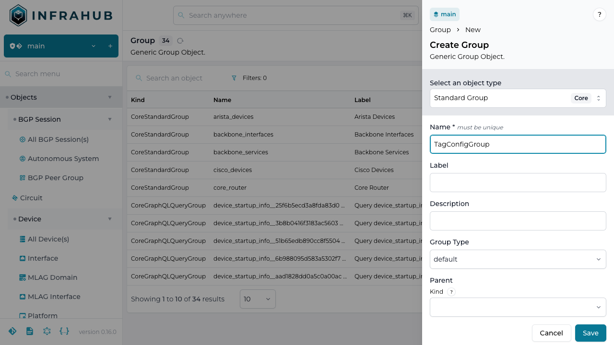
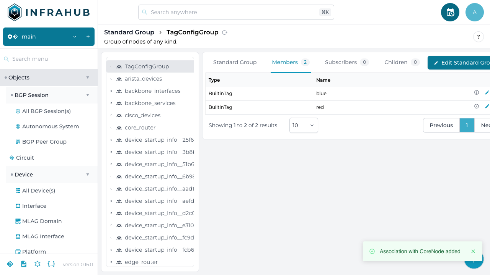

<!-- vale off -->
# Creating a Group in Infrahub
<!-- vale on -->

Within Infrahub a [Group](/topics/groups) can be created in multiple ways: in the UI, GraphQL, SDK and allow you to create and manage collections of objects.

As the first step we need to create a group.
We will be adding the `red` and `blue` tag to the `TagConfigGroup` group that we created in the previous step.

- [Via the web interface](#via-the-web-interface)
- [Via the GraphQL interface](#via-the-graphql-interface)

## Via the web interface

As the first step we need to create a group.


Then we will add members to the group.


## Via the GraphQL interface

### Creating a new group

Execute this GraphQL mutation to create the group `TagConfigGroup`.

```GraphQL
mutation CreateGroup {
  CoreStandardGroupCreate (data: {name: {value: "TagConfigGroup"}}) {
    ok
    object {
      hfid
    }
  }
}
```

Take note of the returned `HFID`, we will need it when we add members to this group.

### Adding members to the group

We will be adding the `red` and `blue` tag to the `TagConfigGroup` group that we created in the previous step.

We need to retrieve the ids of the `red` and `blue` tag. Execute the following GraphQL query and take note of the ids.

```GraphQL
query {
  BuiltinTag (name__values: ["red","blue"]) {
    edges {
      node {
        id
        display_label
      }
    }
  }
}
```

Next, we will be adding the tag nodes to the group. We will use the following GraphQL mutation.
In the mutation, replace the `IDs`:

- The first id needs to be replaced with the id of the group that we created in the first step
- The second and third id need to be replaced with the ids of the tags from the previous step

```graphql
mutation UpdateGroupMembers {
  CoreStandardGroupUpdate (
    data: {
      hfid: ["TagConfigGroup"],
      members: [
        {id: "<id of red tag>"},
        {id: "<id of blue tag>"}]}
  ) {
    ok
  }
}
```


The resulting mutation should look like this (note that the ids will be different in your case).

```GraphQL
mutation UpdateGroupMembers {
  CoreStandardGroupUpdate(
    data: {
      id: "TagConfigGroup",
      members: [
        {id: "17a8f438-fe39-d85f-3c3b-c51d66d0603f"},
        {id: "17a8f437-157a-e023-3c3c-c51f788ddf91"}]}
  ) {
    ok
  }
}
```

In the web interface navigate to Standard Groups under the Groups section in the menu on the left.
Select the `TagConfigGroup` and navigate to the Members tab. We can confirm that the `red` and `blue` tag are now a member of the group.


