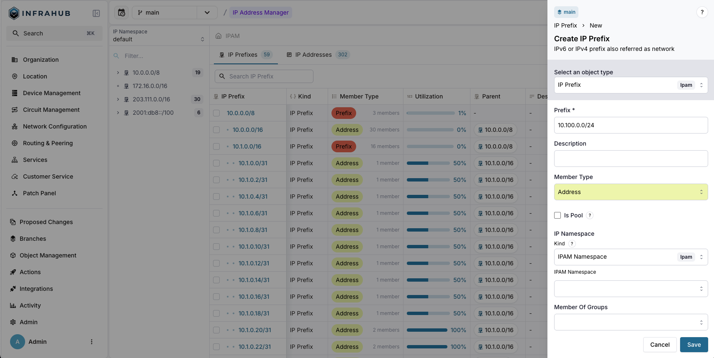
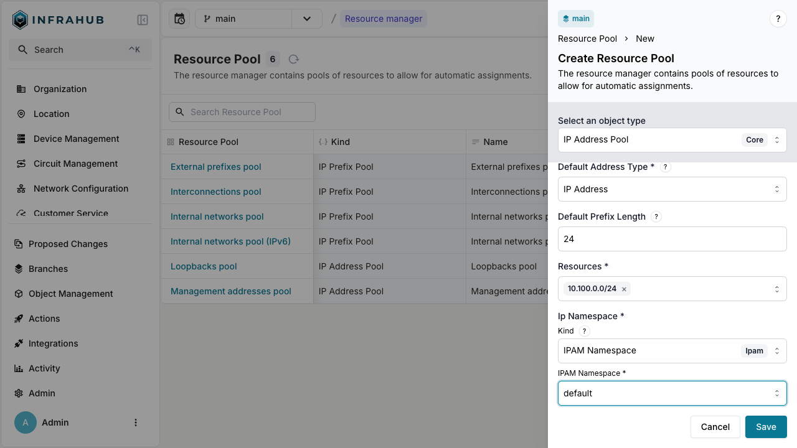
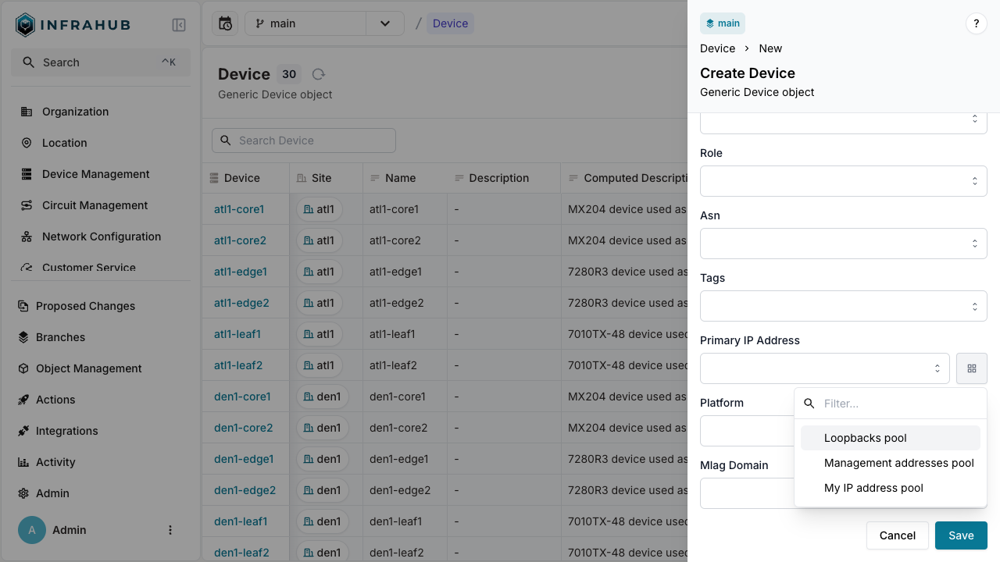
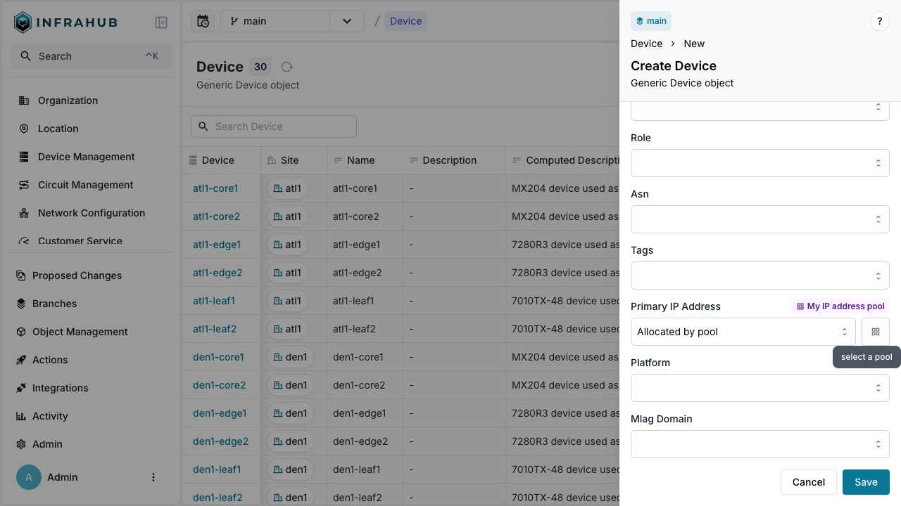
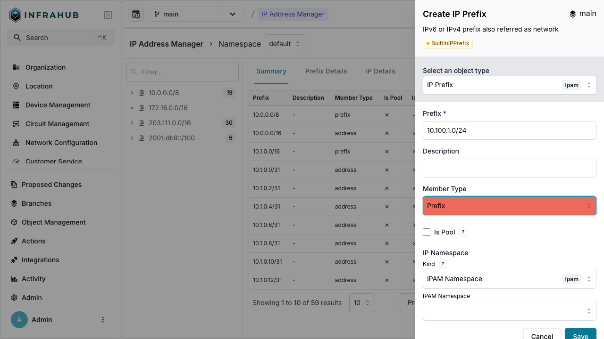
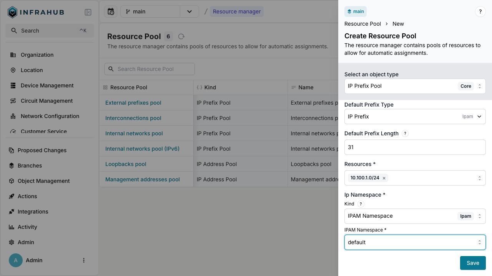
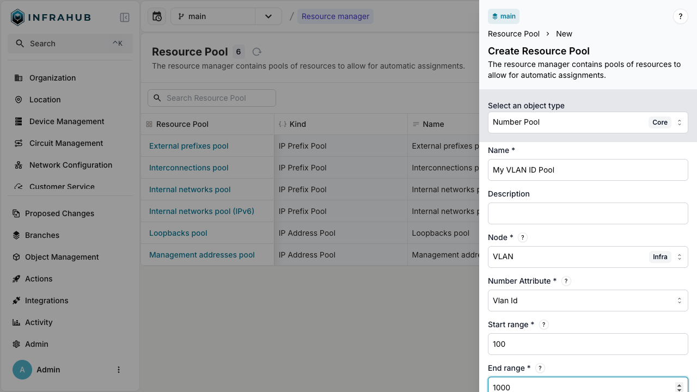
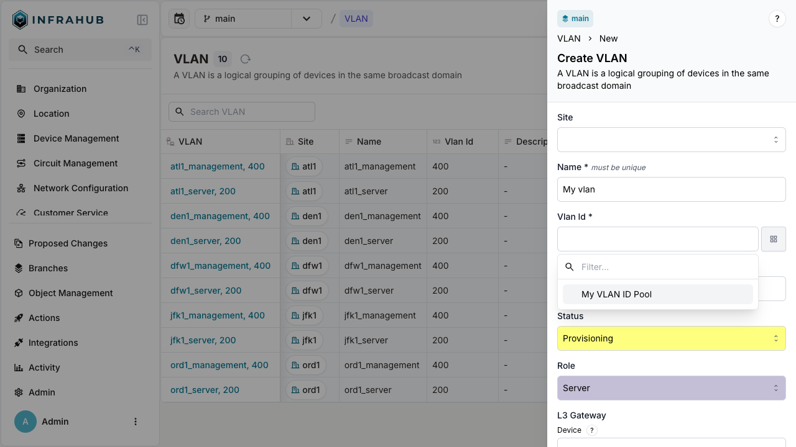
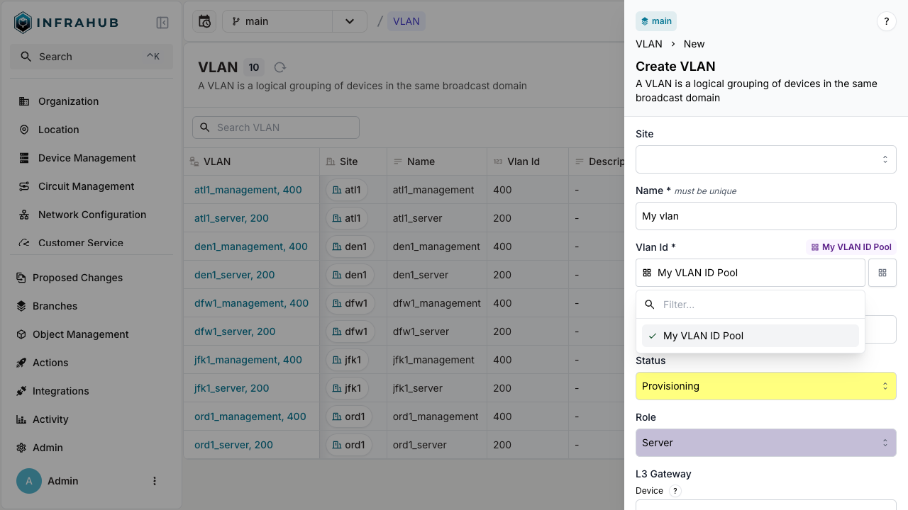

import VideoPlayer from '../../src/components/VideoPlayer';
import Tabs from '@theme/Tabs';
import TabItem from '@theme/TabItem';

This guide shows you how to create resource pools and allocate resources from them automatically. Resource managers eliminate manual IP address and number assignment by providing dynamic allocation from predefined pools.

:::note

This guide uses a simplified schema. If you already have the demo schema loaded, skip the schema loading section and adapt the examples to your existing setup.

:::

<center>
  <VideoPlayer url='https://www.youtube.com/watch?v=sVU4OKi9_9o' light />
</center>

## Prerequisites

- A running Infrahub instance
- Basic understanding of GraphQL or web interface navigation
- `infrahubctl` CLI installed (for schema loading)

## Load the schema

Save this schema to a local file (for example, `/tmp/schema.yml`):

```yaml
# yaml-language-server: $schema=https://schema.infrahub.app/infrahub/schema/latest.json
---
version: "1.0"
generics:
  - name: Service
    namespace: Infra
    description: "Services"
    default_filter: name__value
    order_by:
      - name__value
    display_labels:
      - name__value
    attributes:
      - name: name
        kind: Text
        label: Name
        optional: false
        order_weight: 1

nodes:
  - name: IPPrefix
    namespace: Ipam
    include_in_menu: false
    inherit_from:
      - "BuiltinIPPrefix"
    description: "IPv4 or IPv6 network"
    label: "IP Prefix"
    relationships:
      - name: vlan
        peer: IpamVLAN
        optional: true
        cardinality: one
        kind: Attribute

  - name: IPAddress
    namespace: Ipam
    include_in_menu: false
    inherit_from:
      - "BuiltinIPAddress"
    description: "IP Address"
    label: "IP Address"

  - name: VLAN
    namespace: Ipam
    description: "A VLAN is isolated layer two domain"
    label: "VLAN"
    icon: "mdi:lan-pending"
    include_in_menu: true
    order_by:
      - name__value
    display_labels:
      - name__value
    attributes:
      - name: name
        kind: Text
        unique: true
        order_weight: 2
      - name: description
        kind: Text
        optional: true
      - name: vlan_id
        kind: Number
        order_weight: 3

  - name: Device
    namespace: Infra
    label: "Device"
    icon: "mdi:server"
    human_friendly_id: ["name__value"]
    order_by:
      - name__value
    display_labels:
      - name__value
    attributes:
      - name: name
        kind: Text
        label: Name
        optional: false
        unique: true
    relationships:
      - name: primary_ip
        label: "Primary IP Address"
        peer: IpamIPAddress
        kind: Attribute
        cardinality: one

  - name: Service
    namespace: Customer
    description: "A Customer service"
    icon: "carbon:ibm-cloud-internet-services"
    label: "Customer Service"
    inherit_from:
      - InfraService
    relationships:
      - name: assigned_prefix
        label: "Assigned prefix"
        peer: IpamIPPrefix
        optional: false
        kind: Attribute
        cardinality: one
```

Load the schema with this command:

```shell
infrahubctl schema load /tmp/schema.yml
```

:::success

You should see: `schema '/tmp/schema.yml' loaded successfully`

:::

## Create IP address pools

IP address pools (`CoreIPAddressPool`) dynamically allocate individual IP addresses from source prefixes.

### Create an IP Prefix object

Create the IP prefix that serves as the allocation source:

<Tabs>
  <TabItem value="web" label="Web interface" default>

Navigate to **IP Prefixes** and create a new prefix with:

- **Prefix**: `10.100.0.0/24`
- **Member Type**: `address`



  </TabItem>

  <TabItem value="graphql" label="GraphQL">

  ```graphql
  mutation {
    IpamIPPrefixCreate(data: {
      prefix: {value: "10.100.0.0/24"},
      member_type: {value: "address"},
    })
    {
      ok
      object {
        id
      }
    }
  }
  ```

  Save the prefix ID for the next step.

  </TabItem>
</Tabs>

### Create the IP address pool

Create a `CoreIPAddressPool` resource manager:

<Tabs>
  <TabItem value="web" label="Web interface" default>

Navigate to **Resource Managers** and create a new IP Address Pool with:

- **Name**: `My IP address pool`
- **Default Address Type**: `IpamIPAddress`
- **Default Prefix Length**: `24`
- **Resources**: Select the `10.100.0.0/24` prefix
- **IP Namespace**: `default`



  </TabItem>

  <TabItem value="graphql" label="GraphQL">

  ```graphql
  mutation {
    CoreIPAddressPoolCreate(data: {
      name: {value: "My IP address pool"},
      default_address_type: {value: "IpamIPAddress"},
      default_prefix_length: {value: 24},
      resources: [{id: "<prefix-id>"}],
      ip_namespace: {id: "default"}
    })
    {
      ok
      object {
        id
        hfid
      }
    }
  }
  ```

  Save the pool ID for allocation operations.

  </TabItem>
</Tabs>

### Allocate IP addresses

You can allocate IP addresses in two ways: direct allocation or allocation during node creation.

#### Direct allocation

Allocate an IP address directly from the pool:

<Tabs>
  <TabItem value="graphql" label="GraphQL">

  ```graphql
  mutation {
    IPAddressPoolGetResource(
      data: {
        id: "<pool-id>",
        data: {
          description: "my first allocated ip"
        }
      }
    )
    {
      ok
      node {
        id
        display_label
      }
    }
  }
  ```

  </TabItem>
</Tabs>

:::info Idempotent allocation
Include an `identifier` field to ensure the same IP address is returned on repeated calls:

```graphql
mutation {
  IPAddressPoolGetResource(data: {
    id: "<pool-id>",
    identifier: "my-allocated-ip",
  })
  {
    ok
    node {
      id
      display_label
    }
  }
}
```

This is essential for [generators](../topics/generator.mdx) and automated workflows.
:::

#### Allocation during node creation

Allocate an IP address when creating a device:

<Tabs>
  <TabItem value="web" label="Web interface" default>
  
  Navigate to **Devices** → **Add Device**. Next to the Primary IP Address field, click the pools button and select your resource pool.

  
  

  </TabItem>

  <TabItem value="graphql" label="GraphQL">

  ```graphql
  mutation {
    InfraDeviceCreate(data: {
      name: {value: "dev-123"},
      primary_ip: {
        from_pool: {
          id: "<pool-id>"
        }
      }
    })
    {
      ok
      object {
        display_label
        primary_ip {
          node {
            address {
              value
            }
          }
        }
      }
    }
  }
  ```

  </TabItem>
</Tabs>

## Create IP prefix pools

IP prefix pools (`CoreIPPrefixPool`) allocate IP subnets from larger prefixes.

### Create a source prefix

Create the parent prefix:

<Tabs>
  <TabItem value="web" label="Web interface" default>

Create a prefix with:

- **Prefix**: `10.100.1.0/24`
- **Member Type**: `prefix`



  </TabItem>

  <TabItem value="graphql" label="GraphQL">

  ```graphql
  mutation {
    IpamIPPrefixCreate(data: {
      prefix: {value: "10.100.1.0/24"},
      member_type: {value: "prefix"},
    })
    {
      ok
      object {
        id
      }
    }
  }
  ```

  </TabItem>
</Tabs>

### Create the IP prefix pool

Create a `CoreIPPrefixPool`:

<Tabs>
  <TabItem value="web" label="Web interface" default>

Create a new IP Prefix Pool with:

- **Name**: `Customer Service Pool`
- **Default Prefix Type**: `IpamIPPrefix`
- **Default Prefix Length**: `31`
- **Resources**: Select the `10.100.1.0/24` prefix
- **IP Namespace**: `default`



  </TabItem>

  <TabItem value="graphql" label="GraphQL">

  ```graphql
  mutation {
    CoreIPPrefixPoolCreate(data: {
      name: {value: "Customer Service Pool"},
      default_prefix_length: {value: 31},
      default_prefix_type: {value: "IpamIPPrefix"},
      resources: [{id: "<prefix-id>"}],
      ip_namespace: {id: "default"}
    })
    {
      ok
      object {
        id
        hfid
      }
    }
  }
  ```

  </TabItem>
</Tabs>

### Allocate IP prefixes

#### Direct allocation

```graphql
mutation {
  IPPrefixPoolGetResource(data: {
    id: "<pool-id>",
    data: {
      description: "prefix allocated to point to point connection"
    }
  })
  {
    ok
    node {
      id
      display_label
    }
  }
}
```

#### Allocation during service creation

```graphql
mutation {
  CustomerServiceCreate(data: {
    name: {value: "svc-123"},
    assigned_prefix: {
      from_pool: {
        id: "<pool-id>"
      }
    }
  })
  {
    ok
    object {
      display_label
      assigned_prefix {
        node {
          prefix {
            value
          }
        }
      }
    }
  }
}
```

:::success Weighted allocation
To control allocation order from multiple resources, inherit from `CoreWeightedPoolResource` in your schema and set `allocation_weight` values. Higher weights are allocated first.

```yaml
nodes:
  - name: IPPrefix
    namespace: Ipam
    inherit_from:
      - "BuiltinIPPrefix"
      - "CoreWeightedPoolResource"
```

:::

## Create number pools

Number pools (`CoreNumberPool`) automatically assign sequential numbers to numeric attributes.

### Create a number pool

Create a pool for VLAN IDs:

<Tabs>
  <TabItem value="web" label="Web interface" default>

Create a Number Pool with:

- **Name**: `My VLAN ID Pool`
- **Node**: `IpamVLAN`
- **Node attribute**: `vlan_id`
- **Start range**: `100`
- **End range**: `1000`



  </TabItem>

  <TabItem value="graphql" label="GraphQL">

  ```graphql
  mutation {
    CoreNumberPoolCreate(data:{
      name: {value: "My VLAN ID Pool"},
      node: {value: "IpamVLAN"},
      node_attribute: {value: "vlan_id"},
      start_range: {value: 100},
      end_range: {value: 1000}
    })
    {
      ok
      object {
        hfid
        id
      }
    }
  }
  ```

  </TabItem>
</Tabs>

### Allocate numbers

<Tabs>
  <TabItem value="web" label="Web interface" default>

  Navigate to **VLANs** → **Add VLAN**. Next to the VLAN ID field, click the pools button and select your number pool.

  
  

  </TabItem>

  <TabItem value="graphql" label="GraphQL">

  ```graphql
  mutation {
    IpamVLANCreate(data:{
      name: {value: "My vlan"},
      vlan_id: {from_pool: {hfid: ["My VLAN ID Pool"]}}
    })
    {
      ok
      object {
        name {
          value
        }
        vlan_id {
          value
        }
        id
      }
    }
  }
  ```

  </TabItem>
</Tabs>

## Verify branch-agnostic allocation

Resource managers allocate resources across all branches to prevent conflicts.

Create a test branch:

```shell
infrahubctl branch create test
```

Allocate an IP address in the test branch:

```graphql
mutation {
  IPAddressPoolGetResource(
    data: {
      id: "<pool-id>",
  })
  {
    ok
    node {
      id
      display_label
    }
  }
}
```

Check allocation status from the main branch:

```graphql
query {
  InfrahubResourcePoolAllocated(pool_id: "<pool-id>", resource_id: "<prefix-id>") {
    edges {
      node {
        display_label
        branch
      }
    }
  }
  IpamIPAddress {
    edges {
      node {
        display_label
      }
    }
  }
}
```

:::success
The query shows the IP address is allocated in the test branch, preventing duplicate allocation in main, even though the IP address object doesn't exist in main yet.
:::

## Related resources

- [Resource Manager topic](../topics/resource-manager.mdx) - Deep dive into concepts and architecture
- [Resource Manager blog post](https://opsmill.com/blog/infrahub-resource-manager-automate-allocation/) - Alternative learning resource with additional examples
- [Generators topic](../topics/generator.mdx) - Automate resource allocation workflows
