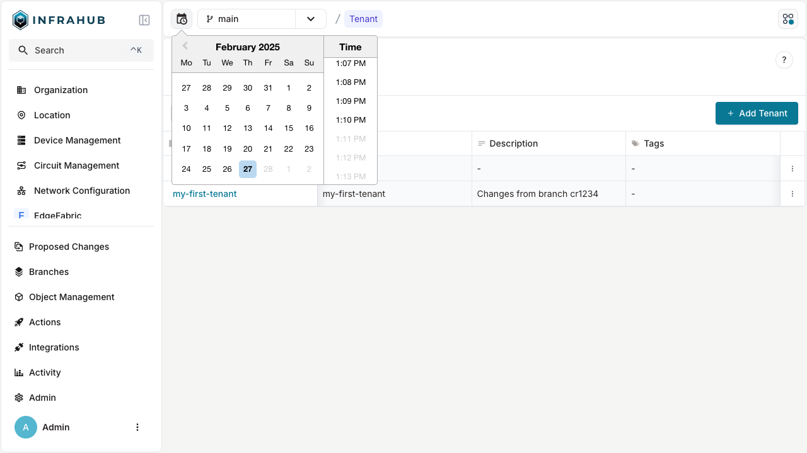

import Tabs from '@theme/Tabs';
import TabItem from '@theme/TabItem';

Infrahub lets you query infrastructure data at previous points in time and compare how it changed
between them. Use queries with a timestamp to investigate incidents, verify changes during a period,
answer audit questions, and inspect how objects and relationships differed at an earlier time.

To query a specific point, specify a branch and timestamp. Infrahub returns the values and
relationships that were valid at that time through the same interfaces you use for current data. To
compare changes, specify two timestamps.

## Specify a branch and a time

Each query is evaluated for a branch and a point in time. Infrahub uses those two inputs to select
which versions of objects and relationships it returns. If you do not set either one, Infrahub
returns the current data from the default branch.

| State to read | Branch | Time |
|---|---|---|
| Production as it stands | default | now |
| Production during last night's incident | default | a time within the incident |
| The change someone is proposing | their branch | now |
| The default branch just before that change merged | default | a time before the merge |

Queries for earlier data therefore use the same read interfaces as current queries. The difference
is that you specify the time to evaluate the data.

## How historical queries work

When you add a timestamp to a query, Infrahub evaluates each requested object using the attribute
values and relationships that were valid at that time. You use the same query structure as you do
for current data; the timestamp changes which versions Infrahub returns.

Infrahub can return those versions because changes create new attribute values and relationship
versions instead of replacing the previous ones. History is tracked per attribute and relationship,
so a comparison can identify the specific fields or connections that changed, including the previous
values.

Later changes do not modify versions that were already recorded. See [Immutable
history](./overview.mdx) for more detail on how Infrahub preserves those versions and how immutable
history relates to branches and the Activity log.

## Query data at a specific time

Use a timestamp when you need the values and relationships that existed at a known point — for
example, during an incident or before a change.

You can specify a time when viewing or querying Infrahub data through the web interface, GraphQL,
REST API, or Python SDK. Use the web interface for interactive investigation and the APIs or SDK
when you need a repeatable or programmatic query.

<Tabs groupId="method" queryString>
  <TabItem value="web" label="Web interface" default>

Select the time selector — the calendar and clock icon beside the branch selector — and choose a
date and time in UTC. Until you set a time, the selector displays only the icon; once you set one,
the bar beside it displays **Current view time** with your selection.

The selected time remains applied as you navigate, so objects and relationships are displayed using
the values valid at that timestamp. Select the × beside the displayed time to return to the current
time.



</TabItem>

  <TabItem value="graphql" label="GraphQL">

Apply the historical time to the same GraphQL query you use for current data. Use this when you can
already state the data you need and want a repeatable query.

`at` is a query-string parameter on the endpoint, so the query document itself is unchanged:

```graphql # Read a device as it existed at an earlier time
# Endpoint : http://localhost:8000/graphql/main?at=2026-03-09T14:00:00Z
query DeviceAtTime {
  InfraDevice(name__value: "ord1-edge1") {
    edges {
      node {
        name { value }
        description { value }
        status { value }
      }
    }
  }
}
```

</TabItem>

  <TabItem value="rest" label="REST API">

Use the REST API when an external tool, scheduled process, or integration needs data for a specific
timestamp. `at` applies to stored GraphQL queries, artifacts, and Transformations rather than to
ad-hoc object reads, so save the query as a `CoreGraphQLQuery` and execute it by name:

```bash
curl "http://localhost:8000/api/query/device-status?branch=main&at=2026-03-09T14:00:00Z" \
  -H "X-INFRAHUB-KEY: $INFRAHUB_API_TOKEN"
```

The same parameter applies to `/api/artifact/{artifact_id}` and the transformation endpoints, where
Infrahub renders the artifact from the data that was valid at that timestamp.

</TabItem>

  <TabItem value="sdk" label="Python SDK">

Pass the `at` argument to the SDK query methods when you need a node or set of nodes as they existed
at a specific time. `all()`, `get()`, and `filters()` take a `Timestamp`; `execute_graphql()` also
accepts a string.

```python
from infrahub_sdk.timestamp import Timestamp

device = await client.get(
    kind="InfraDevice",
    name__value="ord1-edge1",
    at=Timestamp("2026-03-09T14:00:00Z"),
)
```

</TabItem>
</Tabs>

## Compare changes between two timestamps

Use a diff when you need to identify which objects or attributes changed between two timestamps.
`DiffTree` compares the data at `from_time` with the data at `to_time`. The timestamps do not need
to align with a branch point or Proposed Change, so you can compare any useful period, such as the
four hours around an incident.

```graphql # What changed on main between two timestamps
# Endpoint : http://localhost:8000/graphql/main
query ChangesBetween {
  DiffTree(
    branch: "main"
    from_time: "2026-03-09T00:00:00Z"
    to_time: "2026-03-10T00:00:00Z"
  ) {
    num_added
    num_updated
    num_removed
    nodes {
      kind
      label
      status
      attributes {
        name
        action
      }
    }
  }
}
```

Behavior to expect:

- Omit `from_time` and the comparison starts at the branch's `branched_from` timestamp.
- Omit `to_time` and the comparison runs to the present.
- Use `filters` to narrow the result by kind, namespace, or status.
- Use `limit` and `offset` to page through results.
- Use `DiffTreeSummary` when you only need counts rather than the full set of changed nodes.
- The base of the comparison is the default branch. Name a feature branch to compare it with the
  default branch across the requested period, or name the default branch to compare it with itself
  over time.
- If no diff covering the requested period is available, the query returns `null` rather than an
  empty result. Treat `null` as "not calculated," not "nothing changed."

`DiffTree` retrieves a diff that has already been calculated. To calculate one for a period, send
the `DiffUpdate` mutation first with the `branch` and, when you need a period other than the
default, `from_time` and `to_time`. This is why a request for an arbitrary period can return `null`
on the first attempt.

In the web interface, a branch's Branch view shows its diff and lets you refresh it, whether or not
a Proposed Change exists for that branch. When you are comparing a branch with its base and also
need review, validation, and checks, use a [Proposed Change](../proposed-changes/overview.mdx).

## Choose an absolute timestamp or relative offset

Use a relative offset when you are investigating from the current time. Use an absolute timestamp
when the query needs to resolve to the same time each time it runs — for example, for an audit
answer, post-incident report, or reproducible analysis.

| Form | Example | Resolves to |
|---|---|---|
| ISO 8601 with a zone or offset | `2026-03-09T14:00:00Z` or `2026-03-09T15:00:00+01:00` | The specified instant |
| ISO 8601 without a zone | `2026-03-09T14:00:00` | The same wall-clock time, interpreted as UTC |
| Date only | `2026-03-09` | 12:00 UTC on that day |
| Offset from now | `30s`, `45m`, `6h`, `2h30m` | That interval before the current time |

A date without a time resolves to midday rather than midnight, so include an explicit time when a
day boundary matters. Relative offsets support seconds, minutes, and hours, including combined
values such as `2h30m`. They do not support day or week units; use an absolute timestamp for those
intervals.

## Understand branch history limits

Each branch has an earliest timestamp you can query. If the requested time is earlier than the
history available to that branch, Infrahub rejects the query rather than returning partial data.

When you create a branch, Infrahub records where it diverged rather than copying the entire dataset.
You can query the history available through the default branch, plus the changes recorded on the
branch after it diverged.

On the default branch and the global branch, the earliest available time is that branch's creation.
On any other branch, the boundary is the creation time of the default branch.

```text
Requested time '2026-01-05T00:00:00Z' is before branch 'main' was created at '2026-02-01T09:14:22.481000Z'.
```

If you need data from an earlier timestamp than the branch allows, query the default branch instead.

Rebasing a branch moves the timestamps of changes made on it up to the rebase time, so a change
recorded on the branch before a rebase is no longer readable at its original timestamp.

## Related

- [Immutable history](./overview.mdx) — how Infrahub preserves previous values and relationships
- [Branches](../branches/overview.mdx) — how branches diverge, share history, and merge
- [Activity log](../deploy-manage/run-observe/activity-log.mdx) — which operations occurred, when,
  and by whom
- [Proposed Changes](../proposed-changes/overview.mdx) — compare a branch with its base with review,
  validation, and checks
