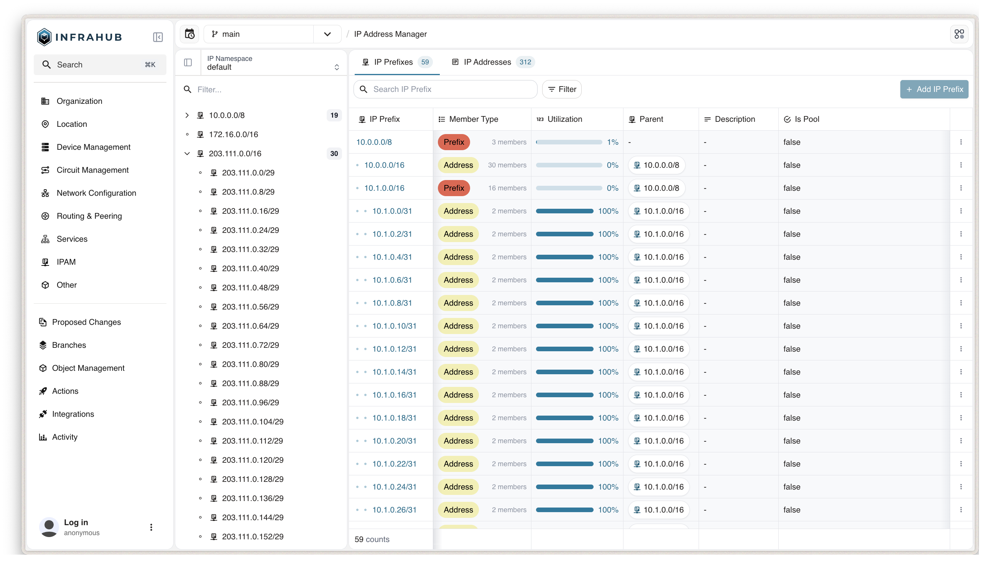

import VideoPlayer from '../../src/components/VideoPlayer';

Use Infrahub IPAM to manage IP prefixes, IP addresses, and namespaces alongside the rest of your infrastructure data. Prefixes and addresses are ordinary Infrahub objects, so you can add relationships to devices, interfaces, and services the same way you would on any other node. Infrahub computes hierarchy automatically and calculates utilization on read. Every change is branch-aware. Both IPv4 and IPv6 are supported.

:::tip Migrating from another system?

Once your IPAM schema is in place, use [Infrahub Sync](https://docs.infrahub.app/sync) to bring in your existing IP data from a prior source of truth.

:::

## Built-in generics

Infrahub provides three built-in generics to inherit from when building your IPAM schema:

- `BuiltinIPNamespace` — isolates a set of IP prefixes and addresses. Comparable to a VRF or routing instance.
- `BuiltinIPPrefix` — models an IPv4 or IPv6 network in CIDR notation.
- `BuiltinIPAddress` — models a single IPv4 or IPv6 host address.

Infrahub includes a schema node called `IpamNamespace` that inherits from `BuiltinIPNamespace`, and creates a `default` namespace object automatically on first start.

:::info

Building an IPAM with these generics serves a different purpose from using the `IPHost`, `IPNetwork`, or `IPAddress` attribute kinds on other nodes. The IPAM generics use the `IPHost` and `IPNetwork` attribute kinds internally. See [Build your IPAM schema](./build-your-ipam-schema.mdx#iphost-ipnetwork-and-ipaddress-attribute-kinds) for when to use an attribute kind instead of a full IPAM node.

:::

## Hierarchy

IP prefixes and addresses form a tree based on network containment — a prefix can be the parent or child of another prefix, and an address always belongs to the most specific prefix that contains it. Infrahub reconciles this tree automatically on every create, update, or delete, so parent, child, and address-to-prefix relationships stay correct without manual intervention. See [Query IPAM data](./query-ipam-data.mdx) for the relationships exposed on prefixes and addresses.

## Utilization

Every IP prefix exposes a read-only `utilization` attribute, computed on read from the graph, using one of two formulas based on `member_type`:

- **`prefix` mode** — utilization is the address space of the child prefixes, divided by the address space of the prefix itself. For example, `192.0.2.0/24` with one `192.0.2.0/26` child reports 25%.
- **`address` mode** — utilization is the number of IP addresses assigned to the prefix, divided by the number of usable addresses in the prefix. For example, `192.0.2.0/26` holds up to 62 usable addresses (excluding network and broadcast); with 20 addresses assigned, it reports 32%.

Network and broadcast addresses count toward the usable total when `is_pool` is `true`, when an IPv4 prefix is `/31` or longer (per [RFC 3021](https://datatracker.ietf.org/doc/html/rfc3021)), and for every IPv6 prefix.

## Namespaces

Every IP prefix and IP address belongs to exactly one IP namespace. Namespaces isolate IP space — the same prefix or address can exist in multiple namespaces without conflict, similar to how a VRF isolates a routing table. Use additional namespaces when you need that isolation, for example between customers or business units with overlapping address ranges.

Deleting a namespace deletes every IP prefix and IP address it contains. The `default` namespace cannot be deleted.

## Branching

Creating, updating, or deleting an IP namespace, prefix, or address is supported on any branch. Hierarchy reconciliation runs immediately after each mutation, and again when the branch is merged or rebased into another branch — Infrahub reads the diff between the two branches, identifies which prefixes and addresses changed, and reconciles only those. See [Plan changes on a branch](./plan-changes-on-a-branch.mdx) for the full workflow, including concurrency control for concurrent branch-based changes.

## Resource Manager

Resource Pool is the recommended way to allocate IP addresses and prefixes in automation — provisioning pipelines, generators, and CI/CD workflows. A `CoreIPAddressPool` or `CoreIPPrefixPool` draws from your IPAM prefixes as its resources and returns the next available address or subnet. Passing the same identifier on repeated calls returns the same allocation, so a provisioning script can run more than once without allocating the same resource twice.

Infrahub also exposes lower-level GraphQL queries — `InfrahubIPAddressGetNextAvailable` and `InfrahubIPPrefixGetNextAvailable` — that return the next free address or subnet without creating a record and without the pool's cross-branch allocation guarantees. Use Resource Pool for production workflows; use these only to look up a value without persisting it.
