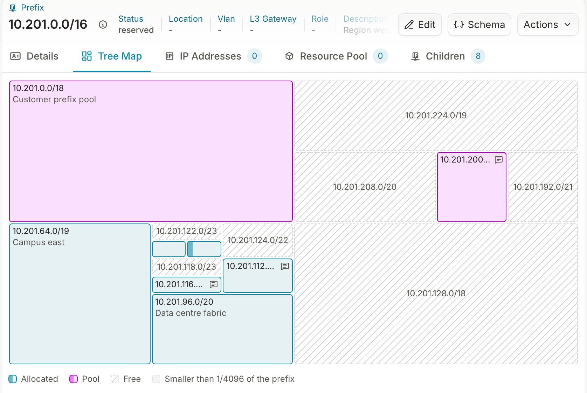

Use the **Tree Map** tab on a prefix to see where its address space has gone and where contiguous free space remains. Each direct child prefix and each free block is a tile whose area is its share of the parent, so a `/18` inside a `/16` covers a quarter of the map and a `/24` covers 1/256 of it. Tiles are placed by address along a space-filling curve, so blocks that are next to each other in address space are next to each other on the map, and a run of free blocks reads as one free region. The tab sits on every prefix detail page, between **Details** and **IP Addresses**.

## Read the map

- **Allocated** tiles have a solid border and a tinted fill. The fill covers the share of the tile that matches the child's own utilization, so a `/20` at 80% is mostly filled and one at 2% is nearly empty.
- **Pool** tiles are child prefixes with `is_pool` set, typically the resources of a [resource pool](../resource-manager/overview.mdx). They use a second color so you can tell space reserved for automated allocation from static allocations.
- **Free** tiles are hatched with a dashed border. They are the blocks no child prefix covers, computed on read from the gaps between children; the **Children** tab lists the same blocks as available.
- Prefixes and free blocks smaller than 1/4096 of the parent are grouped by the 1/4096 cell that contains them, so the group stays where its members are. A cell holding at least one small prefix is a **smaller prefixes** tile that opens the **Children** tab; a cell holding only small free blocks is a **smaller free blocks** tile. Hover either to list its members.

Hover any tile for its details. A child prefix shows its CIDR, description, member type, utilization and member count; a free block shows its CIDR. A tile wide enough for two lines shows its description under the CIDR; a narrower tile shows a small marker next to the CIDR instead, to tell you that a description exists.

## Drill into a child prefix

Click an allocated or pool tile to open that prefix's own Tree Map. The branch and IP namespace you are viewing stay selected, and the breadcrumb and the IPAM tree on the left follow you, so you can descend one level at a time and return through the breadcrumb.

## Allocate from a free block

Click a free tile to open the **Create IP Prefix** form with the block's CIDR filled in. Shorten the prefix length if you want a smaller block from inside it, then save; the map refreshes with the new child in place. Creating a prefix this way requires permission to create prefixes. Without it the tile is disabled and shows the reason on hover.

For allocation driven by automation, use a resource pool instead; see [Allocate IPs and prefixes](./allocate-ips-and-prefixes.mdx).

## Prefixes that hold addresses

A prefix whose `member_type` is `address` and that has no child prefixes has nothing to tile, so the tab shows its utilization meter and a link to the **IP Addresses** tab instead. A prefix marked as holding addresses that still contains child prefixes, a common way to model a supernet, gets the map.

## Large prefixes

The map loads at most 1,000 direct children, in address order. When a prefix has more, a notice above the map says how many are shown, and the address space after the last loaded block is cross-hatched and marked **Not loaded**. That space may hold more children or free blocks; the map does not know, so it does not draw it as either. Click it to open the **Children** tab, where you can filter and page through all of them.

Utilization is computed on read for every child shown, the same cost the **Children** tab pays, so a prefix with hundreds of children takes longer to render than one with a few.

## Next

- [Allocate IPs and prefixes](./allocate-ips-and-prefixes.mdx) — pool-based allocation for automation
- [Plan changes on a branch](./plan-changes-on-a-branch.mdx) — redesign a subnet on a branch and check the map before merging
- [Query IPAM data](./query-ipam-data.mdx) — the computed values behind the tiles
