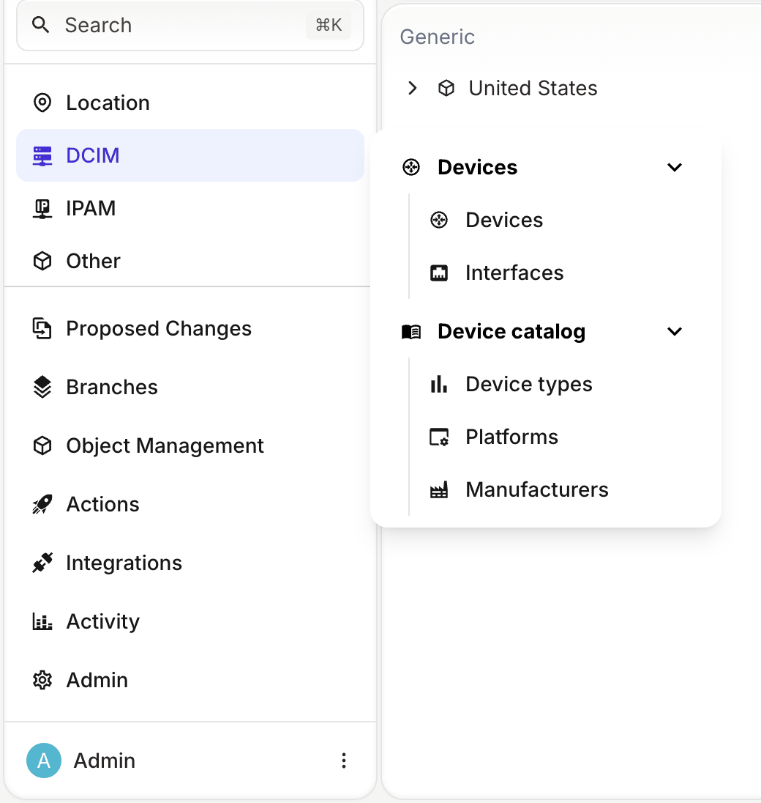
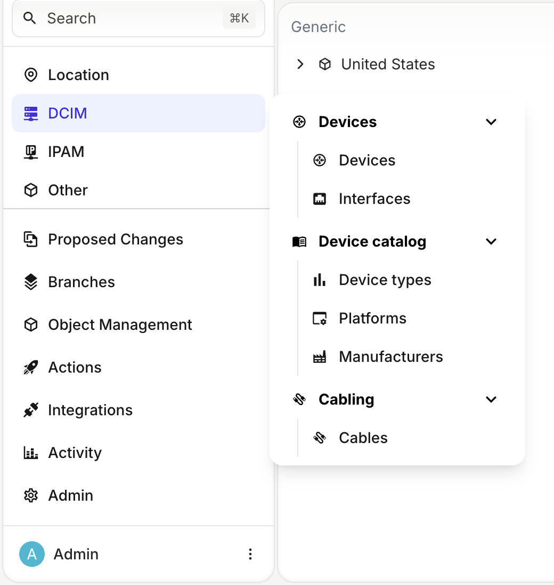
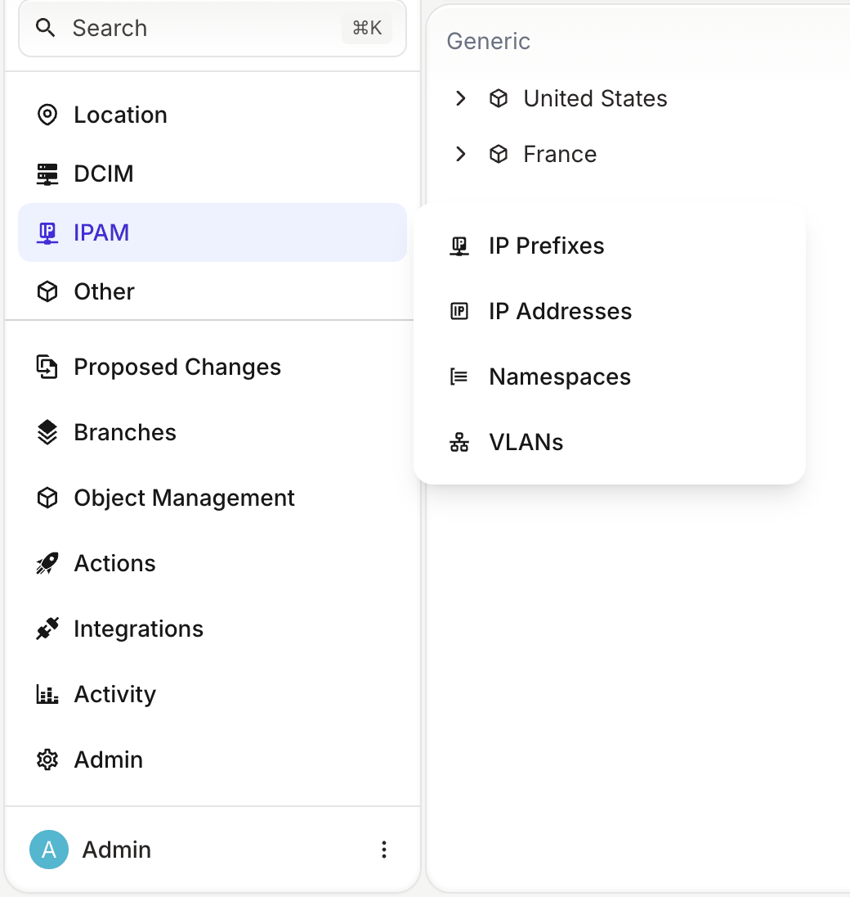
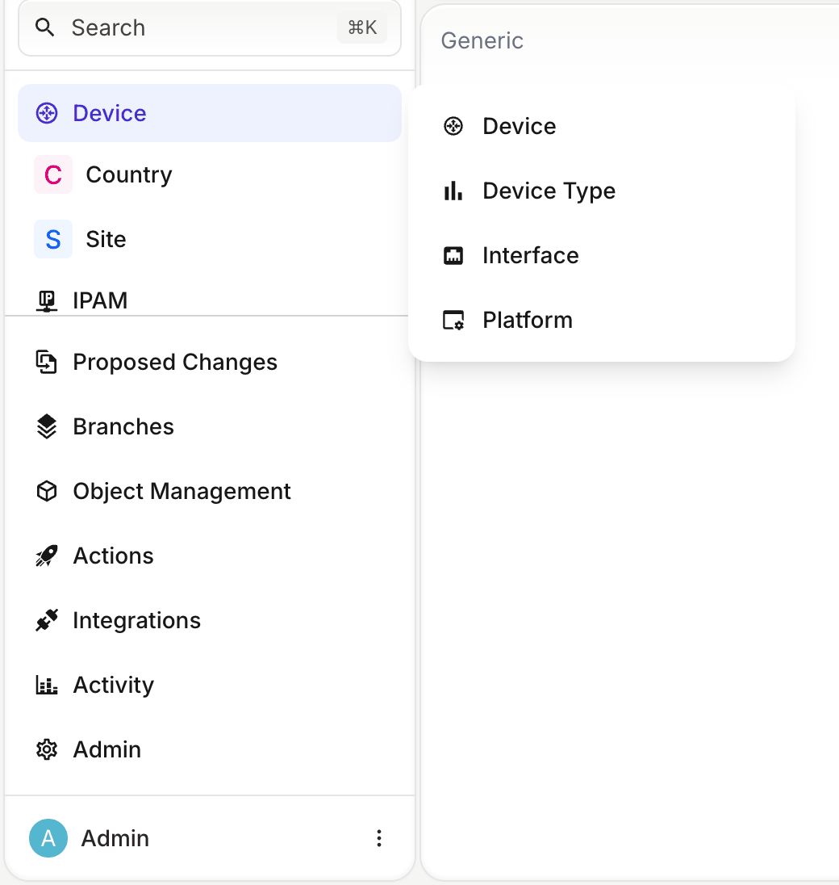

import ReferenceLink from "../../src/components/Card";

A nested menu groups related entries inside a menu section. For example, a **DCIM** section can hold a **Device catalog** group with the device types, platforms and manufacturers that your team maintains, separate from the devices and interfaces it operates.

You can nest menu entries in two ways:

- In a menu file, give a menu item `children`, and give those children their own `children`. The menu file sets the label, icon and order of every entry, at every level.
- In the schema, set `menu_placement` on a node to put its entry under the entry of another node. This applies to the menu that Infrahub generates for nodes that no menu file defines.

## Prerequisites

- A running Infrahub instance
- Knowledge of how to define and load a menu file, described in [Menu customization](./overview)

<details>
<summary>Schema used in this guide</summary>

The examples on this page use the schema from [Menu customization](./overview), plus the following nodes. The IP prefix and IP address nodes make Infrahub show the built-in IPAM section.

```yaml
---
version: "1.0"
nodes:
  - name: DeviceType
    namespace: Dcim
    label: Device Type
    include_in_menu: false
    attributes:
      - name: name
        kind: Text
        unique: true
  - name: Platform
    namespace: Dcim
    include_in_menu: false
    attributes:
      - name: name
        kind: Text
        unique: true
  - name: Cable
    namespace: Dcim
    include_in_menu: false
    attributes:
      - name: name
        kind: Text
        unique: true
  - name: Manufacturer
    namespace: Organization
    include_in_menu: false
    attributes:
      - name: name
        kind: Text
        unique: true
  - name: Prefix
    namespace: Ipam
    include_in_menu: false
    inherit_from:
      - BuiltinIPPrefix
  - name: IPAddress
    namespace: Ipam
    label: IP Address
    include_in_menu: false
    inherit_from:
      - BuiltinIPAddress
  - name: VLAN
    namespace: Ipam
    label: VLAN
    include_in_menu: false
    attributes:
      - name: name
        kind: Text
      - name: vlan_id
        kind: Number
```

</details>

## Group menu entries inside a section

A menu item with `children` is a group. Each child can have its own `children`, and a menu file has no limit on the number of levels.

The following menu file defines a **DCIM** section with two groups. **Devices** holds the entries for devices and interfaces, and **Device catalog** holds the entries for device types, platforms and manufacturers:

```yaml
# yaml-language-server: $schema=https://schema.infrahub.app/infrahub/menu/latest.json
---
apiVersion: infrahub.app/v1
kind: Menu
spec:
  data:
    - namespace: Dcim
      name: Mainmenu
      label: DCIM
      icon: "mdi:server-network"
      children:
        data:
          - namespace: Dcim
            name: DevicesMenu
            label: Devices
            icon: "mdi:router"
            children:
              data:
                - namespace: Dcim
                  name: Device
                  label: Devices
                  kind: DcimDevice
                  icon: "mdi:router"

                - namespace: Dcim
                  name: Interface
                  label: Interfaces
                  kind: DcimInterface
                  icon: "mdi:ethernet"

          - namespace: Dcim
            name: CatalogMenu
            label: Device catalog
            icon: "mdi:book-open-variant"
            children:
              data:
                - namespace: Dcim
                  name: DeviceType
                  label: Device types
                  kind: DcimDeviceType
                  icon: "mdi:poll"

                - namespace: Dcim
                  name: Platform
                  label: Platforms
                  kind: DcimPlatform
                  icon: "mdi:application-cog-outline"

                - namespace: Organization
                  name: Manufacturer
                  label: Manufacturers
                  kind: OrganizationManufacturer
                  icon: "mdi:factory"
```

Load the file:

```bash
infrahubctl menu load menus/dcim.yml
```

Select **DCIM** in the menu. The section opens a panel with the **Devices** and **Device catalog** groups. Each group is expanded, with its entries listed below its name. Select the arrow next to a group to collapse it:



A group inside a section can also open a list view. Give it a `kind` as well as `children`, and its name becomes a link to the list view of that kind. A section at the top level of the menu only opens its panel, even when it has a `kind`.

## Add entries to a menu item from another file

To add entries to a section or a group that another menu file defines, set `parent` on the new item to the namespace and name of that menu item, as a list. With separate files, a team can maintain the entries for its own nodes without editing the file that defines the section.

For example, the following file adds a **Cabling** group to the **DCIM** section:

```yaml
# yaml-language-server: $schema=https://schema.infrahub.app/infrahub/menu/latest.json
---
apiVersion: infrahub.app/v1
kind: Menu
spec:
  data:
    - namespace: Dcim
      name: CablingMenu
      label: Cabling
      icon: "mdi:cable-data"
      order_weight: 3000
      parent:
        - Dcim
        - Mainmenu
      children:
        data:
          - namespace: Dcim
            name: Cable
            label: Cables
            kind: DcimCable
            icon: "mdi:cable-data"
```

After you load the file, the **DCIM** panel shows **Cabling** after **Device catalog**:



Load the file that defines the parent item first. When the parent item does not exist, `infrahubctl menu load` stops with an error such as `Unable to find the node Dcim :: Mainmenu / CoreMenu in the database.` and creates no menu item. When you pass a folder to `infrahubctl menu load`, it loads the files in the alphabetical order of their names.

### Add entries to the built-in IPAM section

The [IPAM section is built in](./overview#the-ipam-section-is-built-in): you do not define it in a menu file, but you can add entries to it. Its namespace is `Builtin` and its name is `IPAM`. The following file adds a **VLANs** entry to it:

```yaml
# yaml-language-server: $schema=https://schema.infrahub.app/infrahub/menu/latest.json
---
apiVersion: infrahub.app/v1
kind: Menu
spec:
  data:
    - namespace: Ipam
      name: VLAN
      label: VLANs
      kind: IpamVLAN
      icon: "mdi:lan"
      order_weight: 4000
      parent:
        - Builtin
        - IPAM
```

The built-in **IP Prefixes**, **IP Addresses** and **Namespaces** entries have order weights 1000, 2000 and 3000, so an order weight of 4000 puts **VLANs** after them:



## Order of nested entries

Infrahub sorts the entries at each level of the menu by `order_weight`, lowest first.

When an item in a `children` list has no `order_weight`, `infrahubctl menu load` sets one from the position of the item in the list: 1000 for the first item, 2000 for the second, and so on.

Items at the top of a menu file do not get an order weight from their position, and this includes items that you add with `parent`. Their order weight is 2000 unless you set one. Without `order_weight: 3000`, the **Cabling** group in the earlier example would have the same order weight as **Device catalog**. Set `order_weight` on every item that you add with `parent`.

## Nest nodes in the generated menu

Infrahub generates a menu entry for every node that has `include_in_menu: true`, which is the default, unless a menu file defines an item with the same namespace and name as the node. Without `menu_placement`, each of these nodes gets its own entry at the top level of the menu.

To put the entry of a node under the entry of another node, set `menu_placement` on it to the kind of that other node. The following properties put interfaces, device types and platforms under devices:

```yaml
nodes:
  - name: Device
    namespace: Dcim
    include_in_menu: true
    icon: "mdi:router"
  - name: Interface
    namespace: Dcim
    include_in_menu: true
    menu_placement: DcimDevice
    icon: "mdi:ethernet"
  - name: DeviceType
    namespace: Dcim
    include_in_menu: true
    menu_placement: DcimDevice
    icon: "mdi:poll"
  - name: Platform
    namespace: Dcim
    include_in_menu: true
    menu_placement: DcimDevice
    icon: "mdi:application-cog-outline"
```

The **Device** entry then opens a panel. Its first entry opens the list of devices, and the entries for interfaces, device types and platforms follow it:



- The schema has no property to set the order of the entries under a node. They all have an order weight of 5000. To control the order, define the entries in a menu file.
- When `menu_placement` names an entry that does not exist in the menu, Infrahub puts the entry of the node under **Other**.

<ReferenceLink title="menu_placement in the schema reference" url="../reference/schema/node#menu_placement" />

## Related pages

- [Menu customization](./overview): define and load a menu file
- [Menu definition file](../reference/menu): every key of a menu item
