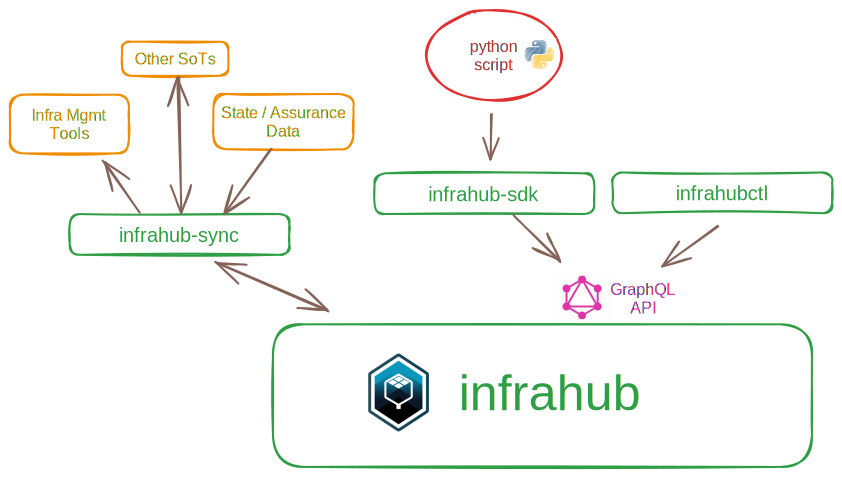

# Data input and sync

When a schema has been loaded in to Infrahub, data can be populated or synced through multiple methods:

- Via the WebUI: users can add, modify, and delete objects
- Via [infrahub-sync](../integrations/sync/)
- Via the [Infrahub SDK](../python-sdk/), which simplifies working with the GraphQL API:
  - One-time imports can done similar to this [python example](https://github.com/opsmill/infrahub-demo-dc-fabric/blob/main/generators/create_basic.py)
  - Integration with other systems
- Via the GraphQL or REST API directly

Infrahub provides [data lineage and metadata](../topics/metadata.mdx) for tracking the origin and ownership of the data, and how the data changes and moves over time. When data comes from other systems and creates objects in the Infrahub database, those objects will have attributes such as it's source and if it's read-only, allowing for unidirectional sync from other sources of truth.
