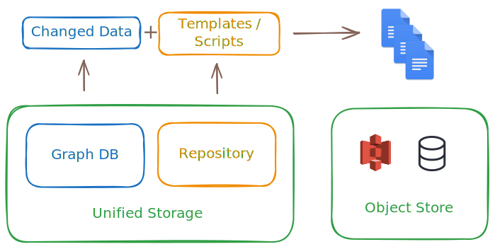

# Data transformations

Transformations in InfraHub are operations that allow users to extract and export their infrastructure data in a structured and repeatable way. It involves converting data retrieved via GraphQL queries into a desired format, using either Jinja2 templates or Python code.

These transformations allow for flexible and powerful data manipulation, making it easier to integrate and utilize data in various applications and workflows.

For more details, you can refer to the [transformation topic](../topics/transformation.mdx).
