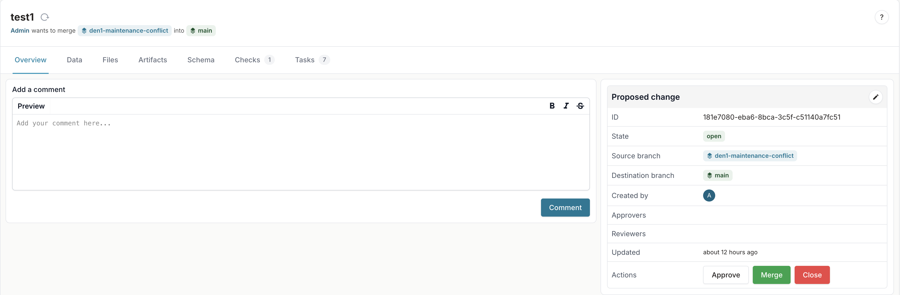
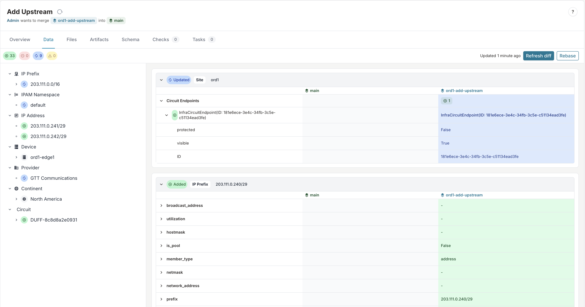
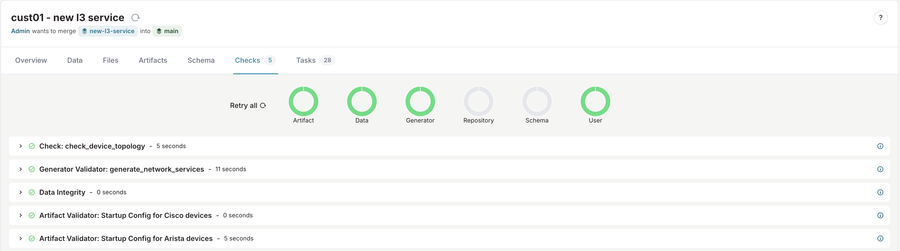

import VideoPlayer from '../../src/components/VideoPlayer';
import EnterpriseBadge from "../../src/components/EnterpriseBadge";

A proposed change in Infrahub is a structured workflow mechanism that enables teams to review, discuss, and merge changes in a controlled and collaborative manner. It serves as the primary method for implementing infrastructure changes safely while maintaining proper oversight and governance.

For people with a software development background, proposed changes function similarly to pull requests in GitHub or merge requests in GitLab.

<center>
  <VideoPlayer url='https://www.youtube.com/watch?v=OAXk3dKKgf0' light />
</center>

## Why use proposed changes?

Proposed changes address several crucial needs in infrastructure management:

- **Controlled collaboration**: Enable multiple team members to work on infrastructure changes without directly affecting production.
- **Accountability**: Establish a clear record of who proposed, reviewed, and approved changes.
- **Quality assurance**: Provide a systematic approach to reviewing changes before implementation.
- **Compliance**: Support regulatory requirements through documented approval processes.
- **Knowledge sharing**: Create opportunities for team members to learn from each other's changes.
- **Continuous integration**: Ensure that changes meet quality standards through automated validation checks.



## Multi-dimensional diffing

A proposed change in Infrahub offers a more sophisticated approach by integrating both data-level and code-level differences in a unified interface:

- **Data differences**: See precisely what objects were added, modified, or deleted, along with the specific attribute changes.
- **Schema differences**: Identify changes to the underlying data models that define your infrastructure.
- **File differences**: Track modifications to implementation files like Transformations, Generators, and templates.
- **Artifact differences**: Compare the [artifacts](../artifacts/overview) generated to understand output changes.



This multi-dimensional diffing provides a "single pane of glass" view, enabling reviewers to fully understand the scope and impact of changes before approval. This comprehensive visibility is especially valuable for complex infrastructure changes.

## Automated pipeline with continuous integration

Infrahub integrates robust validation capabilities within the proposed change workflow to ensure changes meet quality and policy requirements before implementation. These automated checks provide confidence that modifications won't introduce issues when deployed.

:::important
Any failing checks will block the merge process, ensuring only validated changes are applied.
:::

### Built-in checks

Infrahub runs several types of automated validations during the review process:

- **Data integrity checks**: Validates that the database remains consistent between branches and that all referential integrity constraints are satisfied.
- **Merge conflict detection**: Identifies and reports any conflicting changes between the source and target branches that would prevent a clean merge.
- **Git repository integration**: Displays merge conflicts for connected Git repositories, ensuring alignment between infrastructure code and configuration.
- **Schema validation**: Verifies potential changes made to the schema.



### Custom checks

Organizations can extend the validation framework with custom checks to enforce specific business rules and operational constraints.

Learn more about [Checks & Validation](../checks/overview.mdx) and how to implement custom validation logic.

### Artifact generation

Infrahub will automatically run Transformations and generate artifacts as part of the proposed change workflow.

Learn more about [Transformations](../transformations/overview) and [Artifacts](../artifacts/overview).

### Understanding artifact regeneration

When a proposed change includes commits to a linked Git repository, Infrahub regenerates only the artifacts whose Transformation actually depends on a changed file. Each Transformation's dependency closure - the templates it includes for a Jinja2 Transformation, or its own source file for a Python Transformation - is computed when the repository is imported and stored on the Transformation. A file change regenerates a definition's artifacts only when the changed file is in that definition's closure. A change to a GraphQL query the definition uses, or to the artifact definition itself, also triggers regeneration.

Two repository-level rules also apply:

- Editing a repository's `.infrahub.yml` does not by itself regenerate anything. The manifest is not part of any Transformation's closure, so a comment, a reformat, or an entry belonging to another definition regenerates no artifacts. What does regenerate is the change the edit makes to a definition: changing a Transformation's `template_path`, `file_path`, or `class_name`, or an artifact definition's `parameters`, `content_type`, `artifact_name`, or `targets`, is a change to the definition itself and regenerates its artifacts. Naming `.infrahub.yml` in a Transformation's [`watch.files`](../git-integration/infrahub-yml#declaring-extra-dependencies-with-watch) puts it back in that Transformation's closure, so every manifest edit regenerates its artifacts again.
- Read-only repositories follow the same rules as regular ones. Bumping a `CoreReadOnlyRepository` to a new pinned commit on the source branch regenerates the artifacts affected by that commit, even on branches where `sync_with_git` is disabled.

#### Where to find the why trail

Every regeneration decision is recorded in the proposed change pipeline's task log. This is the canonical place to see which file, query, or relationship change caused an artifact to regenerate: each entry names the affected definition and the precise cause. For example:

```text
Definition device-config (17e9c3b2-...): file templates/partials/header.j2 changed and is in this transform's dependency closure - all artifacts will regenerate.
```

When nothing regenerated for a definition the log says so as well, so you can confirm a quiet pipeline was intentional rather than a missed dependency.

#### When a Transformation regenerates on every change

Two situations leave Infrahub unable to attribute a change, so it falls back to regenerating a Transformation's artifacts on any commit to the repository:

- **A Jinja2 template reference it cannot follow**, such as a partial pulled in through a runtime variable (``). Auto-detection records the closure as incomplete (`dependencies_complete = false` on the Transformation), and the repository import log names the template and the location of the unresolved reference.
- **A Python Transformation with no `watch` declaration.** Its imports are never analyzed, so with nothing declared there is no basis for ruling any file out.

The task log explains each fallback and names the Transformation, so a broad regeneration can be told apart from a precise one. To get precise regeneration back, do one of the following, then commit so the closure recomputes on the next import:

- **Rewrite the dynamic reference with a literal name** so auto-detection can follow it, for example replacing `` with ``.
- **Declare the dependencies with `watch.files`** on the Transformation entry in `.infrahub.yml`, listing the files or the directory that contains them. On a Python Transformation, declare the key even with an empty `files` list when there is nothing to add. See [declaring extra dependencies](../git-integration/infrahub-yml#declaring-extra-dependencies-with-watch).

### Generator integration

Infrahub automatically runs Generators as part of the proposed change workflow, and applies the same precise regeneration that artifacts use. Each Generator's dependency closure - its own source file, plus any extra paths you declare with `watch.files` - is computed when the repository is imported and stored on the Generator definition. A file change re-runs a Generator's instances only when the changed file is in that Generator's closure. A change to the GraphQL query the Generator uses, or to the Generator definition itself, also triggers a re-run, and a data change on a node the query reads continues to run the Generator exactly as before.

The two repository-level rules above apply to Generators as well: editing a repository's `.infrahub.yml` re-runs only the Generators whose own definition the edit changed, and read-only repositories participate on the same terms - bumping a `CoreReadOnlyRepository` to a new pinned commit re-runs the Generators affected by that commit, even on branches where `sync_with_git` is disabled.

The why trail covers Generators too. Each run or skip decision is recorded in the task log with the precise cause, in Generator-correct wording:

```text
Definition device-tags (17e9c3b2-...): file generators/tags/tags.py changed and is in this generator source's dependency closure - all instances will run.
```

Generators are Python-only, and Infrahub does not analyze imports, so auto-detection never follows a helper module - whether it sits beside the Generator or in another package. Declare every such file with `watch.files` on the Generator entry in `.infrahub.yml`, and declare the key with an empty `files` list when there is nothing to add, exactly as you would for a Python Transformation. See [declaring extra dependencies](../git-integration/infrahub-yml#declaring-extra-dependencies-with-watch). A Generator imported before precise triggering shipped has no stored closure and falls back to re-running on any file change with no error; it self-heals to precise triggering the next time the repository is imported.

Learn more about [Generators](../generators/overview).

## Conflict management

In Infrahub, conflicts occur when the same infrastructure object is modified differently in both the source and target branches. Unlike traditional text-based version control systems, Infrahub's conflict detection operates at the data level, identifying specific attribute conflicts within objects.

Common conflict scenarios include:

- The same attribute of an object (for example, a router's hostname) is changed to different values in each branch.
- An object is modified in one branch but deleted in another.
- Relationship conflicts where the same object is linked to different entities in each branch.

Infrahub prevents merging a proposed change when data conflicts exist between branches to protect the integrity of your infrastructure data. For step-by-step resolution mechanics during review, see [Resolve a proposed-change conflict](./resolve-conflict.mdx).

## Lifecycle and collaborative review

Proposed changes follow a workflow with specific states that track progression from initial creation to final resolution. The review and approval process is central, providing a structured framework for evaluating proposed infrastructure changes before implementation.

For the full state machine, see [Lifecycle and state transitions](./lifecycle.mdx). For how reviewers engage and how a proposed change becomes approved, see [Review and stamp](./review-and-stamp.mdx).

## Comprehensive audit and traceability

The proposed change system provides robust audit capabilities that are critical for regulated environments and operational excellence:

### Audit capabilities

- **Approval records**: Captures who approved each change, when, and with what justification.
- **Complete discussion history**: Preserves all comments, questions, and responses throughout the review process.
- **Change documentation**: Maintains a record of what was modified and the rationale behind changes.
- **System-generated events**: Automatically logs all significant actions like state changes and merge operations.
- **Tamper-evident history**: Ensures the integrity of the audit trail through cryptographic verification.

### Business benefits of strong traceability

This comprehensive traceability delivers multiple benefits:

- **Regulatory compliance**: Satisfies documentation requirements for regulated industries.
- **Problem resolution**: Provides context when troubleshooting issues that might stem from recent changes.
- **Knowledge preservation**: Captures institutional knowledge about why specific changes were made.
- **Process improvement**: Enables analysis of the change management process to identify optimization opportunities.

The audit capabilities are particularly valuable for infrastructure changes that might impact production environments or require compliance documentation, providing peace of mind that all modifications are properly documented and justified.

## Related resources

The proposed change functionality interconnects with several other key concepts in Infrahub:

- [Branches](../branches/overview.mdx) — the underlying mechanism for change isolation
- [Immutable history](../immutable-history/overview.mdx) — the foundation of proposed changes
- [Schema](../schema/overview) — the data models reviewed in proposed changes
- [Artifacts](../artifacts/overview) — outputs that are regenerated as part of proposed changes
- [Checks & Validation](../checks/overview.mdx) — validation checks that gate merges
- [Transformations](../transformations/overview) — how Transformations are reviewed in proposed changes
- [Generators](../generators/overview) — Generators that may run in the proposed change pipeline
- [Permissions and roles](../deploy-manage/user-management/permissions-roles/overview) — access controls for proposing, reviewing, and merging
- [Change Management Workflow Blog Post](https://opsmill.com/blog/infrastructure-change-management-workflow/)
