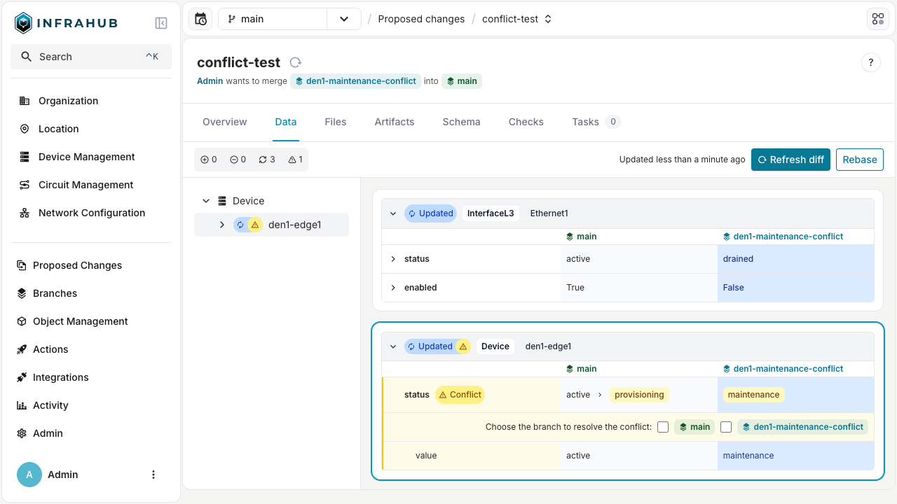

When a proposed change has data conflicts between its source and target branches, Infrahub blocks the merge to protect the integrity of your infrastructure data. Conflicts are resolved during the review process, before the change can be approved and merged.

## When conflicts are detected

When the system detects conflicts:

1. The proposed change displays a conflict warning with details about affected objects.
2. Reviewers can examine each conflict to understand the specific differences.
3. For a conflict on an attribute value or on a relationship to a single peer, reviewers choose which version to keep (source or target). For a delete-versus-modify conflict, they change the data instead.
4. Conflict resolutions are recorded as part of the change history for audit purposes.

## Resolution steps

To resolve conflicts on a proposed change:

1. Review the **Data Integrity** check results on the **Checks** tab of the proposed change.
2. On the **Data** tab, find the message "Choose the branch to resolve the conflict:" under each conflict on an attribute value or on a relationship to a single peer, and select the branch whose version to keep. Infrahub saves the choice as soon as you select it.
3. Merge the proposed change once every conflict has a branch selected and no delete-versus-modify conflict remains.

The **Data Integrity** check keeps listing a conflict after you choose a branch for it, and its result stays failed, including when the check runs again after later changes to the branch. Retrying the checks does not re-run **Data Integrity** unless the branch has changed since the last run. A conflict with a branch selected does not block the merge, and the merge applies the version you chose. A delete-versus-modify conflict is the exception: it blocks the merge whichever branch is selected, as described below.

The branch picker is on the **Data** tab of a proposed change, not on the diff of a branch outside a proposed change. You resolve two kinds of conflict another way:

- **A relationship to several peers, or an attribute's owner or source**: there is no picker. Resolve the conflict with the `ResolveDiffConflict` GraphQL mutation, passing the conflict ID that the `DiffTree` query returns and the branch to keep.
- **Delete versus modify**: an object deleted on one branch and changed on the other. Choosing a side does not clear this conflict. Change the data so that both branches agree.

## Related

- [Proposed Changes](./overview.mdx) — concepts and conflict types
- [Lifecycle and state transitions](./lifecycle.mdx) — where conflict resolution sits in the workflow
- [Review and stamp](./review-and-stamp.mdx) — the broader review process
- [Resolve conflicts](../branches/resolve-conflicts.mdx) — branch-level conflicts (different entry point, similar mechanics)
