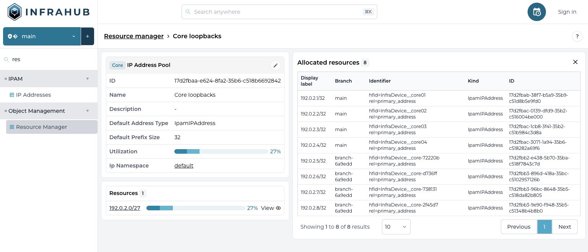
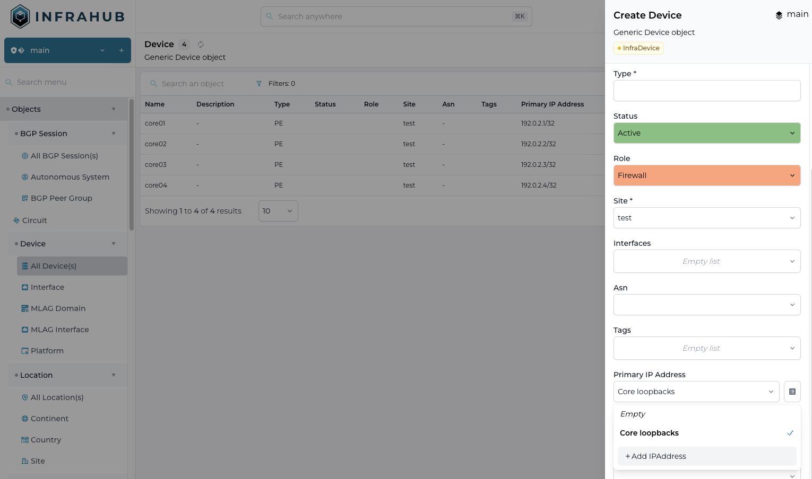

<table>
  <tbody>
    <tr>
      <th>Release Number</th>
      <td>0.14.0</td>
    </tr>
    <tr>
      <th>Release Date</th>
      <td>May 27, 2024</td>
    </tr>
    <tr>
      <th>Release Codename</th>
      <td>Beta #3</td>
    </tr>
    <tr>
      <th>Tag</th>
      <td>[infrahub-v0.14.0](https://github.com/opsmill/infrahub/releases/tag/infrahub-v0.14.0)</td>
    </tr>
  </tbody>
</table>

# Release 0.14.0

We are thrilled to announce the latest release of Infrahub (0.14), marking the start of our open beta.
This release focuses on preparing for the open beta by cleaning up and improving documentation and introducing key features like the Resource Manager.

## Main changes

### Unified storage

#### Resource manager

The resource manager simplifies resource management and allocation.
This initial implementation supports IP Prefixes and IP Addresses, with future support for additional resources like VLAN, IDs, and interfaces.

Key features of the Resource Manager include:

- **Inline Allocation**: Allocate resources from a pool directly when creating an object.
- **Branch Agnostic**: Resource allocation works across branches. A resource allocated in one branch won’t be allocated in another.
- **Idempotent**: If the same consumer requests a resource multiple times, the Resource Manager will always return the same value. This reduces the complexity of managing resource allocation on the client side in an idempotent way.




### Schema

#### Human Friendly Identifier (hfid)

In addition to the automatically generated internal ID (UUID) for each object, Infrahub now allows defining fields that form a human-friendly identifier (`hfid`).

The hfid can uniquely reference objects across systems, even before an object is created in Infrahub.

While mostly invisible in the frontend, `hfid` is crucial for building robust data synchronization between systems and creating truly idempotent scripts.

Applied to the network industry:

- the `hfid` of a device could be its name: `atl1-edge01`
- the `hfid` of an interface will be the combination of the name of the device and the name of the interface: `["atl1-edge01", "Ethernet1"]

The fields that will compose the `human_friendly_id` must be defined in the schema

##### `hfid` support in GraphQL

`hfid` can be used as an alternative to the ID in most GraphQL operations, including:

- Update Mutation
- Upsert Mutation
- Delete Mutation
- Related Node in all Mutations

### Other

#### Documentation update

We have significantly improved and added new content to the documentation, including a new FAQ section.

## Breaking changes

### Remove support for non-isolated branch

Support for branches in non-isolated mode has been removed.
Although useful, it posed challenges for operations dependent on other nodes in the graph, such as schema management, constraints validation, and IPAM.

All branches now operate in isolated mode by default, similar to branches in Git. A branch need to be rebased to stay in sync with main.

## Migration guide

To migrate your instance of Infrahub to the latest version, please run the following commands and restart all instances of Infrahub.

<!-- vale off -->
```shell
infrahub db migrate
infrahub db update-core-schema
```
<!-- vale on -->

> if you are running in docker these commands need to run from the container where Infrahub is installed

### Migration of the demo instance

If you are using the demo environment, you can migrate to the latest version with the following commands

```shell
invoke demo.stop
invoke demo.build
invoke demo.migrate
invoke demo.start
```

If you don't want to keep your data, you can start a clean instance with the following command

```shell
invoke demo.destroy demo.build demo.start demo.load-infra-schema demo.load-infra-data
```

> All data will be lost, please make sure to backup everything you need before running this command.

The repository https://github.com/opsmill/infrahub-demo-edge has also been updated, it's recommended to pull the latest changes into your fork.
