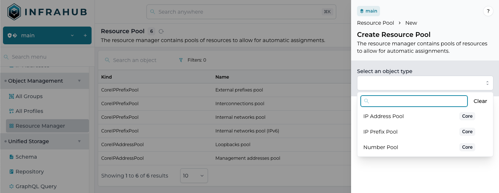
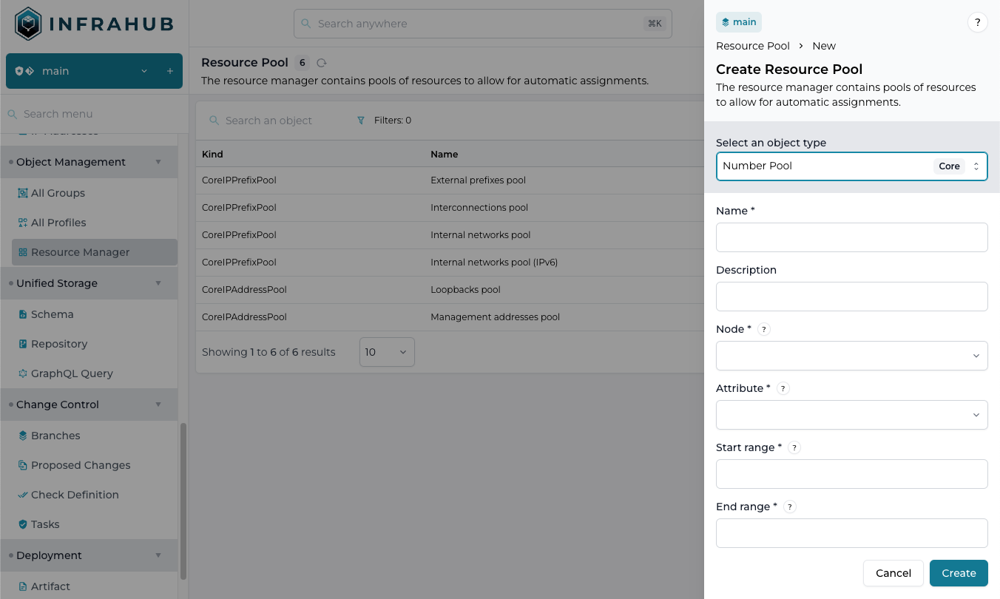
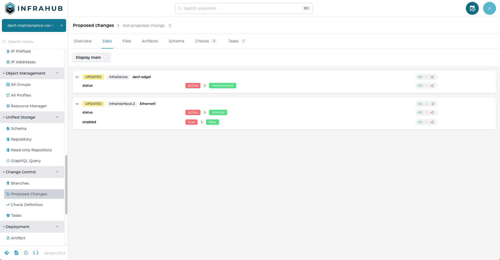
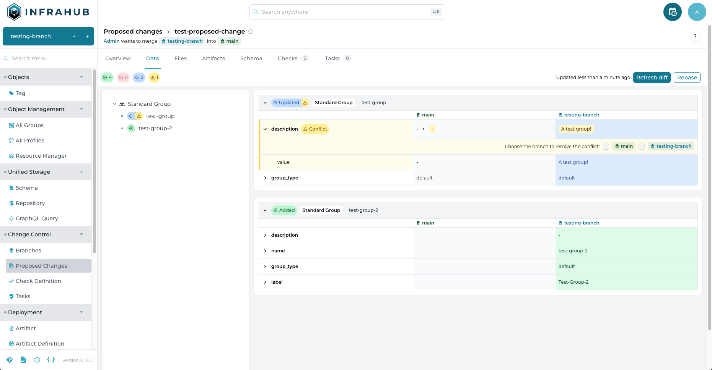

<table>
  <tbody>
    <tr>
      <th>Release Number</th>
      <td>0.16.0</td>
    </tr>
    <tr>
      <th>Release Date</th>
      <td>September 10th, 2024</td>
    </tr>
    <tr>
      <th>Release Codename</th>
      <td>Beta #5</td>
    </tr>
    <tr>
      <th>Tag</th>
      <td>[infrahub-v0.16.0](https://github.com/opsmill/infrahub/releases/tag/infrahub-v0.16.0)</td>
    </tr>
  </tbody>
</table>

# Release 0.16

We are thrilled to announce the latest release of Infrahub, version *0.16*!

This release focuses on adding critical features for additional use cases (for example, the Number resource pool capabilities)
and on enhancing the user experience.

Several user experience enhancements outlined below, such as for the Git Repository or Proposed Change workflows,
are driven by valuable feedback from our early testers.
We greatly appreciate all their time and efforts!

## Main changes

### Object management

#### Number resource pool

Users can now create a Resource pool for Numbers (integers) as well as IP Addresses/Prefixes.

This will enable users to assign items such as AS Number from a pool, and is managed via a Resource Manager the same way that IP Addresses/Prefixes are:



Adding a Number Pool:



See the Resource Manager documentation for more information on managing and utilizing Resource Pools:

- [Tutorials - Resource Manager](/tutorials/getting-started/resource-manager)

### Unified storage

#### Git repository management

The integration with external Git Repositories is very important to Infrahub, and major user experience improvements were implemented in v0.16.

As a user, it is now easier to manage Git repositories and to understand and troubleshoot the situation when things are not working as expected.

Added/changed features include:

- Improvements to identifying the state of the repository
- Additional logging and notifications, for example if authentication to the repository is not working
- Deleting a repository will delete the associated resources
- The supplied Git URL does not need to have the `.git` suffix, Infrahub will automatically handle this

See the documentation for more information on using Git repositories with Infrahub:

- [Guides - Adding/updating external repositories](/guides/repository)
- [Topics - Repository](/topics/repository)

### Schema

### Frontend

#### Branch diff improvements

There were many improvements to how the Proposed Change diff between two branches operates and is displayed.

For example:

- The view of a diff now is displayed as a tree, showing where/how specific objects have been added/deleted/modified.
- The calculated diff between branches is now cached in the database.
- The diff operation itself is considerably faster.

##### Before and after

Diff view in v0.15.3:



Diff view in v0.16.0:



As you can see above, there is much more information available for in version 0.16.0.

##### Further information

See the documentation for Version Control and Proposed Changes for more information:

- [Topics - Immutability and version control](../../topics/version-control#version-control)
- [Topics - Proposed change](../../topics/proposed-change)

#### Filter internal groups

Infrahub makes extensive use of Groups internally for features such as Generators.

However, these groups can clutter and confuse the Group assignment/editing user experience.

In v0.16.0, these groups are now hidden by default but can be made visible via an `auto-generated` toggle on the Group management screen as shown below:

import HideAutoGeneratedGroups from '../../media/release_notes/infrahub_0_16_0/hide_auto_generated_groups.png';


### Other

The complete list of changes can always be found in the `CHANGELOG.md` file in the Infrahub Git repository.

#### Removed

- Removed isolated branch information from schema topic in the documentation. ([#3968](https://github.com/opsmill/infrahub/issues/3968))

#### Added

- Allow adding multiple profiles to an object in the UI. ([#3061](https://github.com/opsmill/infrahub/issues/3061))
- Added "disabled" attribute to accounts to allow more granular user management. ([#3505](https://github.com/opsmill/infrahub/issues/3505))
- Added capabilities to manage API tokens in the Infrahub UI. ([#3527](https://github.com/opsmill/infrahub/issues/3527))
- Added filtering and search to IPAM view. ([#3740](https://github.com/opsmill/infrahub/issues/3740))
- Add number of prefixes to IPAM tree view. ([#3741](https://github.com/opsmill/infrahub/issues/3741))
- Allow navigation to related node in list view. ([#3889](https://github.com/opsmill/infrahub/issues/3889))
- Add support to search a node by human friendly ID within a GraphQL query. ([#3908](https://github.com/opsmill/infrahub/issues/3908))
- Added DB migrations for objects changed to Generic type in 0.16. ([#3915](https://github.com/opsmill/infrahub/issues/3915))
- Add clickable items in the Proposed Change list view. ([#3990](https://github.com/opsmill/infrahub/issues/3990))
- Added the ability to filter out Infrahub internal groups. ([#4027](https://github.com/opsmill/infrahub/issues/4027))
- Add action button to Repository objects. ([#4066](https://github.com/opsmill/infrahub/issues/4066))
- Added documentation for creating custom Infrahub Docker images. ([#4077](https://github.com/opsmill/infrahub/issues/4077))
- Add support for numbers bigger or smaller than signed integers. ([#4179](https://github.com/opsmill/infrahub/issues/4179))

#### Changed

- Move GraphQL queries to .infrahub.yml for Repository imports. ([#1938](https://github.com/opsmill/infrahub/issues/1938))
- Improve UI of Git repository form. ([#3893](https://github.com/opsmill/infrahub/issues/3893))
- Consistency improvements in Repository interactions. ([#4068](https://github.com/opsmill/infrahub/issues/4068))
- Enhancements to Repository status reporting. ([#4069](https://github.com/opsmill/infrahub/issues/4069))
- Simplified the Repository view to only show crucial information. ([#4071](https://github.com/opsmill/infrahub/issues/4071))
- Increased visibility during Git sync. ([#4072](https://github.com/opsmill/infrahub/issues/4072))

#### Fixed

- Add ability to import repositories with default branch other than 'main'. ([#3435](https://github.com/opsmill/infrahub/issues/3435))
- SchemasLoadAPI should not inherited from SchemaRoot but from BaseModel. ([#3821](https://github.com/opsmill/infrahub/issues/3821))
- Resolve inconsistencies when loading same schema twice. ([#3892](https://github.com/opsmill/infrahub/issues/3892))
- HFID of a node is not properly set by `prefetch_relationship` in Python SDK. ([#3900](https://github.com/opsmill/infrahub/issues/3900))
- Comment input is not cleared upon submission of Proposed Change form. ([#3942](https://github.com/opsmill/infrahub/issues/3942))
- Can not assign Profile when editing Node in the web UI. ([#3999](https://github.com/opsmill/infrahub/issues/3999))
- Allow users to add a new generic to an existing node. ([#4051](https://github.com/opsmill/infrahub/issues/4051))
- Allow users to run artifacts and generators on nodes without name attribute ([#4062](https://github.com/opsmill/infrahub/issues/4062))
- Allow bare Git URL and automatically add `.git`. ([#4070](https://github.com/opsmill/infrahub/issues/4070))
- Schema diff view not functioning in branch detail page. ([#4093](https://github.com/opsmill/infrahub/issues/4093))
- Removed erroneous approval button on Diff view. ([#4094](https://github.com/opsmill/infrahub/issues/4094))
- Edit node form displays empty input field for mandatory relationship of cardinality many. ([#4102](https://github.com/opsmill/infrahub/issues/4102))
- GraphQL query does not appear on Detail page. ([#4105](https://github.com/opsmill/infrahub/issues/4105))
- Do not allow '/' character in repository name to avoid sync failure. ([#4120](https://github.com/opsmill/infrahub/issues/4120))
- Can't close a comment thread on an Artifact. ([#4189](https://github.com/opsmill/infrahub/issues/4189))

## Migration guide

To migrate your instance of Infrahub to the latest version, please run the following commands and restart all instances of Infrahub.

<!-- vale off -->
```shell
infrahub db migrate
infrahub db update-core-schema
```
<!-- vale on -->

> if you are running in docker these commands need to run from the container where Infrahub is installed

### Migration of the demo instance

If you are using the demo environment, you can migrate to the latest version with the following commands

```shell
invoke demo.stop
invoke demo.build
invoke demo.migrate
invoke demo.start
```

If you don't want to keep your data, you can start a clean instance with the following command

```shell
invoke demo.destroy demo.build demo.start demo.load-infra-schema demo.load-infra-data
```

> All data will be lost, please make sure to backup everything you need before running this command.

The repository https://github.com/opsmill/infrahub-demo-edge has also been updated, it's recommended to pull the latest changes into your fork.
