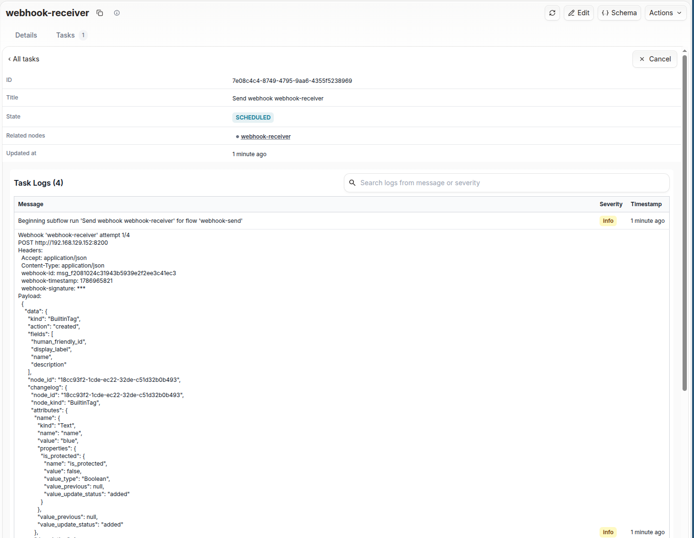
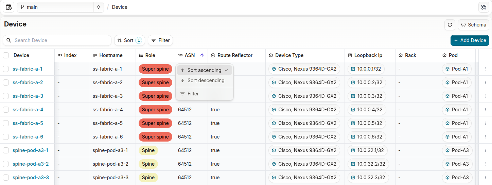
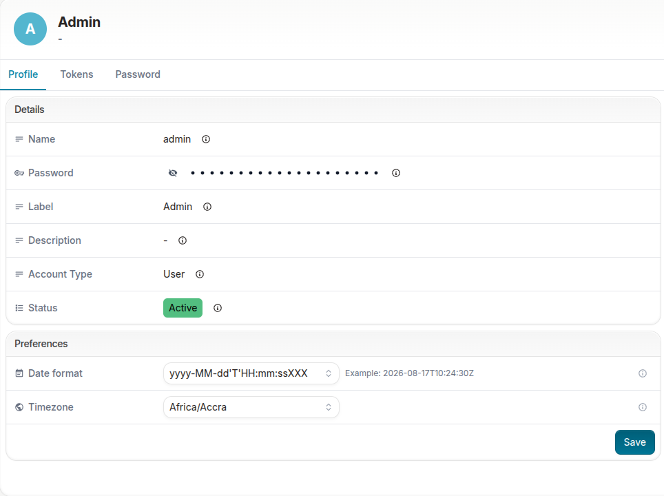
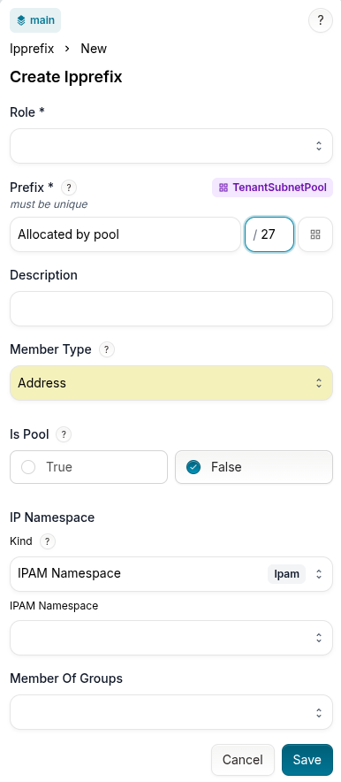

<table>
  <tbody>
    <tr>
      <th>Release Number</th>
      <td>1.11.0</td>
    </tr>
    <tr>
      <th>Release Date</th>
      <td>August, 17th 2026</td>
    </tr>
    <tr>
      <th>Tag</th>
      <td>[infrahub-v1.11.0](https://github.com/opsmill/infrahub/releases/tag/infrahub-v1.11.0)</td>
    </tr>
  </tbody>
</table>

We're excited to announce the release of Infrahub, v1.11.0!

## Release highlights

The headline of 1.11 is **scale and performance**. Until now, almost any change caused Infrahub to redo work the change could not have affected: merging a branch re-ran every Generator and regenerated every artifact, and a single commit to a linked repository recomputed every Transformation-based computed attribute in the instance. On a large dataset that meant thousands of background tasks and an instance that stayed busy long after an action finished. 1.11 makes that work proportional to what actually changed.

Alongside this, **webhook deliveries become first-class tasks you can inspect, retry and cancel**. A delivery used to be an anonymous step inside a larger task, so you could not see what was sent, read what came back, or resend anything without re-firing the original event.

The release centers on three themes: **performance at scale** — selective regeneration after a merge, precise Generator and computed-attribute triggers, and narrower schema validation; **operational visibility and recovery** — webhook delivery operability, and detection of and recovery from a failed merge; and **day-to-day usability** — server-side sorting and filtering, and personal date and time preferences.

## Before upgrading

### Breaking changes

> **⚠️ Breaking changes in this release**
>
> - **Artifact workflows after target removal:** If your workflow relies on an artifact remaining available after its target is removed from the artifact definition's target group, Infrahub deletes that artifact on the next full generation pass. Capture any required content, or update the workflow, before removing the target.
> - **`infrahub git-agent`:** Scripts or automation that still call this command will no longer work after upgrading. Replace those calls with the task worker.
> - **Generated OpenAPI clients:** Code that depends on the previous component schema names in `openapi.json` needs to be updated and regenerated.
> - **API backpressure:** Under sustained overload Infrahub now rejects requests with `429 Too Many Requests` and a `Retry-After` header. The web UI and the Python SDK handle this for you; a custom integration that calls the API directly is expected to handle it itself.
>
> The full Breaking changes section below explains the impact of each and the action to take.

### Upgrade preparation

> **📌 Non-breaking preparation**
>
> - **Separately managed Neo4j deployments:** Upgrade Neo4j to `2026.05.0` alongside Infrahub.
> - **Python Transformations and Generator definitions with external dependencies:** Add `watch` entries for modules imported from outside the Transformation's package directory.
>
> The Infrahub container image includes Python 3.14 and Neo4j 2026.05.0. Expect a one-time recomputation the first time each Transformation is imported after upgrading.

## Scale and performance

### Work proportional to the change

#### Regenerate only what a merge actually changed

When you merge a branch or a Proposed Change, Infrahub now regenerates only the artifact and Generator definitions whose inputs the merge actually changed, and only for the members affected — instead of regenerating every definition for every member.

A merge captures its own diff and uses it to decide what to run. A definition is regenerated when its GraphQL query, its definition object, or its code changed, and its members are narrowed to the objects the change touched. Across the scenarios used to validate this, the number of regeneration tasks a merge produces fell by between 73% and 100%. When a merge runs a Generator, Infrahub waits for it to finish and then regenerates the artifacts built from the objects that Generator created or changed.

The rule the selection follows is that regenerating too much is acceptable and regenerating too little is not.

- **Fallback behavior.** A missing or unreadable diff, a definition with no fingerprint yet, and an incomplete dependency list each cause Infrahub to regenerate every member of that definition. This creates more tasks than necessary, but no affected artifact is left stale.
- **Data referenced through relationships.** An interface's description or an owner's name cannot always be resolved to specific members, so Infrahub regenerates all members of the affected definitions. Definitions that render relationship data therefore see a smaller reduction than those built directly from the changed objects.

Selective regeneration is controlled by `selective_execution_after_merge` (`INFRAHUB_SELECTIVE_EXECUTION_AFTER_MERGE`) and is **enabled by default**. Setting it to `false` restores full regeneration after every merge.

#### Re-run only affected Generators when a integrated repository is updated

Generators, Transformations, and GraphQL queries usually live together in a repository shared by an automation team, and any commit to the repository used to re-run every Generator across every member of its target group. Within a Proposed Change, a Generator is now re-run only when the commits in the branch affected its source file, its GraphQL query, or its definition. A typo fixed in an unrelated README no longer re-runs anything.

This extends to Generators the precise regeneration that 1.10 introduced for artifacts. Each decision to run or skip is recorded in the Proposed Change's task log, naming the file, query, or definition field responsible, so a reviewer can see why a Generator ran without tracing the repository themselves. Read-only repositories participate on the same terms, even on branches where `sync_with_git` is disabled.

Generators imported before this upgrade keep working unchanged. Infrahub applies the narrower dependency checks to a Generator definition the next time it imports that definition; until then it may re-run that Generator on any file change in the repository, so no output goes stale during the transition. Editing `.infrahub.yml` re-runs every Generator in that repository, because the file defines what each of them depends on.

For dependencies Infrahub cannot detect on its own — a helper module imported at runtime from a sibling package, for example — declare them with the optional `watch:` key on `generator_definitions` in `.infrahub.yml`:

```yaml
generator_definitions:
  - name: interface_generator
    file_path: "generators/interfaces.py"
    class_name: InterfaceGenerator
    targets: network-devices
    query: device_interfaces
    watch:
      files:
        - "generators/shared/"          # directory entries are recursive
        - "generators/helpers/naming.py"
```

You can find more information on defining dependencies with the watch statement in the [documentation](https://docs.infrahub.app/git-integration/infrahub-yml#declaring-extra-dependencies-with-watch).

#### Recompute computed attributes only when their inputs change

Two separate causes of unnecessary recomputation are addressed.

- **A commit to a linked repository** used to recompute every Transformation-based computed attribute in the instance, for every object of its kind. Infrahub now recomputes only the attributes whose Python Transformation actually changed. An edit and its exact revert leave the Transformation unchanged and trigger no work at all.
- **A schema change** used to recompute every computed attribute on the branch. A computed attribute is now recomputed only when the change affects a schema element its value depends on, including elements reached through a relationship. Where the impact cannot be determined, Infrahub falls back to recomputing every computed attribute on the branch, so nothing goes stale.

Underneath both, definitions that produce output from a repository — GraphQL queries, Transformations, artifact definitions and Generator definitions — now include a `fingerprint` attribute holding a content hash of their inputs. Because the fingerprint is branch-aware, a change to a definition is detected the same way whether it arrived by a Git import, a branch merge, a rebase or a direct edit. A null fingerprint means the definition has not been imported since upgrading.

A Python Transformation that declares no `watch` key has the commit id folded into its fingerprint, so it continues to recompute on every commit to its repository — scoped to its own attributes only, rather than to every computed attribute in the instance. Declaring `watch` with an explicit list, including an empty one, opts that Transformation into precise, commit-independent recomputation. Jinja2 Transformations no longer need the empty declaration that 1.10 required, because Infrahub resolves their dependencies from the `include`, `import`, and `extends` graph; a template dependency it cannot resolve, such as a dynamic import, still requires declaring it as a dependency using the `watch` property.

Declaring `watch` on any Transformation is now a best practice, so its outputs are regenerated only when a real dependency changes. The first import of a Transformation after upgrading computes its attributes once; that is a one-time cost, not a per-commit one.

```yaml
python_transforms:
  - name: cabling_plan
    class_name: CablingPlan
    file_path: "./transforms/cabling_plan.py"
    # cabling_plan.py imports from the src package, which Infrahub cannot detect
    # from the Transformation's own directory. Declaring it here completes the
    # dependency list, so the artifact regenerates only on a real dependency change.
    watch:
      files:
        - src/infrahub_solution_ai_dc/protocols.py
```

More information can be found in the [documentation](https://docs.infrahub.app/git-integration/infrahub-yml#declaring-extra-dependencies-with-watch).

#### Reduce recomputation work after a large merge or rebase

Merging or rebasing a branch now runs a single combined recompute pass for Jinja2 computed attributes, display labels and human-friendly IDs, instead of one recompute job per changed node. The number of background tasks no longer grows with the size of the merge, and the resulting values are unchanged.

Recomputed values are written in bulk for both Jinja2 and Python computed attributes. Previously each value took its own update task and its own API call; results are now persisted together in bounded transactions, and an object whose recomputed value is unchanged is skipped entirely, so it neither writes nor triggers further recomputation. That removes a self-sustaining cycle in which recomputing already-correct values dispatched more recomputation.

Where the two still differ is the trigger. A Jinja2 computed attribute is recomputed only for the nodes the change actually affected. A computed attribute backed by a Python transform is not yet narrowed this way: the recompute still covers every node of that attribute's kind. To keep that broader trigger affordable, the transform's Git repository is initialized once for the whole batch rather than once per object, and values that come back unchanged are not written.

On the reference dataset used during development, a large post-merge recomputation went from about 1,500 background tasks to two, and from about 275 seconds to about one second. Results vary with the dataset, schema, and automation definitions in each environment.

#### Validate only the constraints a change can violate

Schema constraint validation during Proposed Change checks, merges and rebases used to run against every kind in the schema, even for a branch that changed only data. It is now scoped twice over:

- to the **kinds** the change touched — plus the generics they inherit from and any kind whose uniqueness constraint reads an attribute of a changed kind;
- to the **fields** a constraint actually guards — changing an attribute that participates in no uniqueness constraint no longer re-validates that kind's uniqueness, and re-parenting a child no longer triggers the children check on the parent.

The amount of validation work no longer grows with the total size of your schema. Schema diffs between two identical branches now correctly come back empty.

### Task and API priority

#### Task priority lanes

Background work and the operations a user is waiting on used to share a single queue, so clicking "merge" while the instance worked through a backlog meant waiting behind all of it. Infrahub now runs three priority lanes. Every task required to complete a branch create, merge, rebase, delete or validation operation is processed at the priority of that operation, and the same applies to the tasks created when a Proposed Change is merged.

- **High.** Branch create, merge, rebase, delete and validate; Proposed Change merges; Generator definition runs; schema load and check; Transformation rendering; and on-demand artifact generation.
- **Medium.** IPAM reconciliation.
- **Low.** Profile refresh, and post-merge follow-ups such as Proposed Change cancellation, automatic branch deletion, and artifact and Generator regeneration — which previously inherited the priority from the branch or proposed change merge action.

The queues are created automatically on startup, so an upgraded instance needs no manual migration.

Priority governs the order in which queued work is dispatched. It does not add capacity: on an instance whose task workers are already saturated, the time an operation waits is determined by worker capacity rather than by its priority. Scaling out task workers remains the lever that shortens those waits.

These changes apply mainly to Infrahub Enterprise. Later releases build on this work and will include improvements to Infrahub Community.

#### Keep the UI responsive when the instance is busy

Heavy background work and the web UI compete for the same finite API and database capacity. Because the API could not tell the two apart, a busy instance could stop serving the UI altogether and the application appeared to hang.

Requests can now declare their priority with an `X-Priority` header (`high`, `medium` or `low`; anything missing or invalid is treated as `medium`). Under sustained overload Infrahub asks lower-priority requests to retry first, returning `429 Too Many Requests` with a `Retry-After` header before the request does any work, so interactive traffic keeps flowing. The web UI sends `high` on its own calls and `low` on background traffic that can retry later. `infrahub-sdk` retries a rejected request with backoff, honoring `Retry-After`. A custom integration that calls the API without the SDK is expected to handle the backpressure itself — see Breaking changes.

An initial data load or a deliberate full regeneration goes through the same back-off, which protects the instance under peak load but can make that run take longer. On a normally loaded deployment no requests are rejected. Admission metrics are published on `/metrics`, and the whole layer can be switched off with `INFRAHUB_API_BACKPRESSURE_ENABLED=false`.

### Where the performance improvements apply

These changes reduce the regeneration, recomputation, and validation created around a change. They do not make the underlying operations themselves faster.

- Changing a Transformation, artifact definition, or Generator still regenerates every artifact that depends on it.
- The time to compute and apply a merge, rebase, or diff is unchanged; the reduction is in what happens around and after those operations.
- Schema loading itself is unchanged; the reduction applies to the computed-attribute recomputation and constraint validation that follow a schema update.
- Task priority and API admission change the order in which work is dispatched and shed. They are the foundation for keeping interactive operations responsive under load, and the responsiveness of a saturated instance is still governed by its task worker and database capacity.
## Operations and recovery

### Webhook deliveries

When a downstream system stops acting on Infrahub events, the first question is whether the webhook fired at all. The webhook detailed view Tasks tab used to report no deliveries, a successful delivery recorded no payload or response, and a failure showed a Python traceback with the cause buried inside it.

Every delivery is now its own task, listed in the Tasks tab of the webhook detailed view and the tasks panel, recording the request URL and headers, the response status code and body, and how long the target took to respond. Large response bodies are truncated. Infrahub masks the signature, any header value sourced from the environment, and well-known credential headers such as `Authorization` and `X-API-Key`, so inspecting a delivery does not expose them.

- **Failures are readable.** An expected delivery failure — an unreachable target, a TLS problem, a timeout, an HTTP error from the receiver, a misconfiguration — is reported as a named reason with a remediation hint, such as "The target rejected the request; check the URL and authentication." Unexpected errors keep their stack trace, so a genuine defect still looks like one.
- **Deliveries retry on their own.** A failed delivery is retried up to three times, two minutes apart, rather than exhausting its retries in a few seconds as before. Every failure is retried, including a `4xx` response or a header value Infrahub cannot resolve.
- **You can retry a settled delivery.** Retrying replays the payload captured when the event fired, resolves the webhook configuration again so a corrected URL, header or signing key applies, and runs as a new delivery. The original delivery is preserved as a record.
- **You can cancel one still running.** Infrahub checks for a cancellation before each attempt, so cancelling during the wait stops the remaining ones. A request already sent cannot be recalled, and a delivery that has already settled cannot be cancelled.



### Merge protection and recovery

If the worker running a merge is killed partway through, the instance used to be left with a half-merged default branch, a branch stuck in `MERGING`, and no way back other than restoring a backup or running manual database queries. 1.11 makes that state detectable, visible, and recoverable.

- **Writes are blocked for the duration of a merge.** Writes to both the default branch and the source branch are refused while a merge runs, and a new merge or rebase is refused until it completes. A blocked write receives a transient message asking the caller to retry shortly, and the block lifts automatically when the merge finishes or is rolled back.
- **A stalled merge is detected.** Infrahub notices when a worker executing a merge action is no longer running, records the branch as failed, and keeps the default branch protected. Writes then receive a distinct, non-retryable error telling the operator that recovery is required — separate from the transient "merge in progress" case, so a client does not retry forever.
- **`infrahub recover merge` puts things back.** The command rolls back the partial merge on the default branch, resets the branch and any associated Proposed Change to `OPEN`, and lifts the write protection. It shows what it will do and asks for confirmation (`--yes` to skip), and it is safe to run twice — an interrupted recovery can be run again. Object, attribute and relationship timestamps are restored to their pre-merge values, including for objects affected by a schema migration.

The original work stays available for inspection, so once the underlying problem is resolved the same branch goes through the normal validation and review workflow again.

Branch-status rejections now also include structured GraphQL error codes — `BRANCH_ALREADY_MERGED`, `BRANCH_NEEDS_REBASE` and `MERGE_IN_PROGRESS` — so API and SDK clients can react to a code instead of matching message text.

### Delete a repository and its related objects

Deleting a repository used to fail, because the objects it imports and generates — Transformations, checks, GraphQL queries, Generators, and the artifact definitions, artifacts, Generator instances and validators below them — are attached by mandatory relationships that Infrahub correctly refuses to break. The only way through was to delete the whole tree manually, leaf first.

Deleting a repository now removes the objects it owns along with it. Infrahub still refuses the deletion, naming the dependency, if one of those objects is required by something outside the repository, and makes no partial deletion. Validators attached to Proposed Changes, and the artifacts and Generator instances they produced, are removed too, which is the intended ownership relationship.

## Schema and data modeling

### Write schemas against a published contract

The model that described the schema you write was a partial copy of Infrahub's internal model, and it was wrong in two directions.

Fields that only Infrahub sets — `inherited`, `used_by`, `hierarchy`, a derived kind — appeared in it as though you could set them. A schema that set one looked correct, loaded, and then behaved in a way the schema file did not explain.

Bounded fields were described as free-form text. As far as the published model was concerned an attribute kind was a string, with no list of the kinds that exist, so a kind that Infrahub does not have was accepted at the boundary and failed later in the load. Writing a schema meant carrying facts in your head, or in the reference
documentation, that the model should have carried itself. An AI assistant generating a schema had no list to work from at all, which is the main reason schemas generated that way needed several corrections before they loaded.

1.11 generates two contracts from the single source of truth instead: a write contract, holding exactly the fields you may set and the values each one accepts, and a read contract, which adds the fields Infrahub computes and returns. POST /api/schema/load validates every node, generic, and extension you submit against the write
contract, and reports what it will not apply.

- Read the allowed values from the contract itself. An attribute kind, a relationship kind and cardinality, and the other bounded fields are published as enums. An invalid attribute kind is reported on the attribute, because kind selects which attribute contract applies, and the message lists every kind that exists.
- Correct a bad value from the message. A constrained field set outside its allowed values, or a value out of range or of the wrong type, is rejected with the field path and the value received.
- See which of your values Infrahub ignored, instead of finding out later. A field Infrahub computes and owns is accepted, dropped, and reported as a warning naming every kind and element that carried it… Reading a schema back from GET /api/schema, editing it, and loading it again keeps working, with nothing to strip out first.
- Validate a schema file before a server sees it. `infrahubctl validate schema <file>` reports the same errors and warnings with no server involved.
- Check a schema in CI against the contract your server enforces. The write contract ships as a committed model in the Python SDK. The model is versioned with the SDK, so installing the SDK that matches your Infrahub version gives you the contract that server applies.

The same contract is what an AI assistant reads, so a generated schema can be corrected against the allowed values before it is submitted rather than after a failed load.

### Model an IP address without a prefix length

Use the new `IPAddress` kind when the value represents an address only, such as a DNS record, an NTP or syslog target, a monitoring target, or an ACL entry. Where `IPHost` normalizes `192.0.2.1` to `192.0.2.1/32`, an `IPAddress` value keeps the address you entered,  a value that includes a prefix length or netmask is rejected. IPv6 values are stored in compressed lowercase form, and values sort lexically rather than numerically.

### Normalize values before changing an attribute's kind

If you change an attribute to `IPHost`, `IPNetwork`, `IPAddress` or `MacAddress`, the existing values must already match the storage format the new kind requires; Infrahub now rejects the conversion when they do not. A `Text` value of `aa-bb-cc-dd-ee-ff`, for example, must be normalized before conversion to `MacAddress`, where the value is stored as `AA:BB:CC:DD:EE:FF`.

### New ordered property on attribute schema

Attribute schemas gain an `ordered` flag. Setting it to `false` on a `List` or `JSON` attribute means reordering that attribute's elements is no longer reported as a conflict during a merge or rebase, while adding or removing an element still is.

The built-in `enum`, dropdown `choices`, `used_by` and `restricted_namespaces` attributes now use this. That resolves a case where two branches ended up holding the same set of dropdown choices in a different order and the branch could not be rebased.

## UI improvements

### Sort and filter object and IPAM lists

Object and IPAM lists can now be sorted and filtered from the UI, using the backend ordering support added in 1.10. Sorting runs on the server, so it applies to the complete result set rather than the current page, and stays responsive on large inventories.

From a column header, sort ascending or descending, filter from the same menu, or sort by a supported attribute on a related object when the column references a single related object. From the toolbar, add multiple sort fields, reorder them to change which takes precedence, and remove the ones you no longer need. A device list can be sorted by site and then by role, or a prefix view organized by namespace while you review address capacity.

The selected sort is stored in the page URL, so the resulting view can be bookmarked or shared.



### Set personal and organization-wide date and time preferences

Dates in the UI followed the browser's locale, and an organization had no way to set a house format. Each user can now choose their own date format and timezone from a **Preferences** card on the account Profile tab, and the choice applies wherever you sign in with the same account. Administrators holding the new `manage_global_preferences` permission set organization-wide defaults on a **Global preferences** tab. A field left unset inherits the organization default, and falls back to the browser's setting when no default exists. Personal preferences are private: reading or writing them only ever touches your own record.



### Choose a prefix length when allocating from a pool

Allocate an IP address or prefix using the prefix length that request needs, rather than always taking the pool default. The prefix length can be set from the allocation form in the UI and inline in a GraphQL mutation. Allocating with a prefix length that conflicts with an existing reservation now returns a clear error instead of silently reusing that reservation.



### Also in the UI

- Sort the Proposed Changes list by any sortable field; newest created appears first by default.
- A branch's details page shows whether you are working on that branch, and offers a one-click switch when you are not.
- The default branch is identified by the flag the API returns rather than by the name `main`, which reported the wrong branch when `INFRAHUB_INITIAL_DEFAULT_BRANCH` was set.
- Lists show current values immediately after records are created, edited, or deleted.
- Relationship selectors honor the schema's `common_parent` property, offering only peers that share the parent selected elsewhere in the same form.
- Hierarchical relationships show the related kind's label — **Region** or **Site** — in place of generic **Parent** and **Children** labels.
- Adding a child from a hierarchical object pre-fills the parent field.
- Markdown artifacts render Mermaid diagrams.
- The branch **Sync with Git** flag explains that it controls whether an Infrahub-created branch is propagated to Git, not whether the branch originated in Git.

## Minor changes

**Performance**

- When you request only the `id` of a cardinality-one relationship's peer, Infrahub no longer builds the full peer node.
- For very large merge and rebase diffs, Infrahub retrieves field summaries in pages bounded by `database.query_size_limit`, reducing the risk of exhausting the Neo4j heap during validation.

**Reliability**

- Merging or rebasing a branch that deletes a node refreshes the derived values of the nodes that read it across a relationship, so computed attributes, display labels and human-friendly IDs no longer reference the deleted object.
- Creating a node no longer fails when a Jinja2 computed attribute formats a value allocated from a number pool.
- Infrahub marks a Jinja2 Transformation as updated only when its content has changed.
- Repository synchronization continues when a branch that was already merged in Infrahub still exists on the remote.
- Removing a relationship from the schema closes the underlying relationship data, so stale peers do not reappear if the same identifier is added again later.
- A flow waiting for an automatic retry is given more time before it can be marked as crashed.
- TLS certificate verification failures are reported as TLS errors instead of generic connection errors.

**Telemetry**

- The daily anonymous telemetry payload adds adoption and activity signals: active accounts and account groups, open non-system branches, node counts that respect branches and time, and activity from the previous full UTC day. Each field is collected independently, and reporting remains opt-out through `INFRAHUB_TELEMETRY_OPTOUT`.

**Dependencies**

- Infrahub uses `@urql/core` instead of `@apollo/client` for frontend GraphQL requests, reducing the JavaScript bundle size without changing request behavior.
- The container image is smaller: the build toolchain is excluded from the runtime image, and `numpy` and `pyarrow` are no longer installed by default. `pyarrow` remains available through the `object-transfer` extra for `infrahubctl object load`.

## Breaking changes

Read this section before upgrading.

### API backpressure for custom integrations

**Impact.** Under sustained overload Infrahub rejects lower-priority requests with `429 Too Many Requests` and a `Retry-After` header, before the request does any work. A client that treats every non-2xx response as a failure surfaces these as errors instead of retrying, so calls that used to queue and eventually succeed now fail outright.

**What to do.** The web UI and `infrahub-sdk` need no change: the SDK retries a `429` with exponential backoff, honors `Retry-After`, and raises `RateLimitError` only once the retry budget is exhausted. A custom integration that calls the API without the SDK is expected to handle the backpressure itself — wait for the interval in `Retry-After` and retry. Send the `X-Priority` header (`high`, `medium` or `low`) so the integration's interactive calls are rejected last; a missing or invalid value is treated as `medium`.

SDK behavior is tunable through `rate_limit_retry_enabled`, `rate_limit_max_retries`, `rate_limit_backoff_base` and `rate_limit_backoff_max`. The admission layer can be turned off entirely with `INFRAHUB_API_BACKPRESSURE_ENABLED=false`.

### Artifact workflows after target removal

**Impact.** If your workflow relies on an artifact remaining available after its target is removed from the artifact definition's target group, Infrahub deletes that artifact on the next full generation pass instead of retaining a stale copy.

**What to do.** Capture any artifact content another workflow still needs, or update that workflow so it no longer depends on the artifact after the target is removed.

Full generation runs after a merge, after an artifact definition update, or when the generate endpoint is called with no node filter. A run limited to specific members does not delete artifacts outside that scope.

### `infrahub git-agent`

**Impact.** Scripts, deployment automation, or operational procedures that still call `infrahub git-agent` will no longer work after upgrading, because the deprecated command has been removed.

**What to do.** Replace any remaining calls with the task worker before upgrading.

### Generated OpenAPI clients

**Impact.** Generated clients or application code that depend on the previous component schema names in `openapi.json` need to be updated. The response body from `GET /api/schema` is unchanged.

**What to do.** Update the renamed component types and regenerate affected clients:

- `APINodeSchema` → `NodeSchemaRead`
- `APIGenericSchema` → `GenericSchemaRead`
- `APIProfileSchema` → `ProfileSchemaRead`
- `APITemplateSchema` → `TemplateSchemaRead`

## Upgrade notes

### Runtime versions

**If:** You run Neo4j separately from the version shipped with Infrahub.

**Then:** Upgrade Neo4j to `2026.05.0` alongside Infrahub 1.11.

**Notes:** The container image includes Neo4j `2026.05.0`, up from `2025.10.1`, and Python 3.14, up from Python 3.13.

### Declare the `watch` property for Python Transformations and Generator definitions in `.infrahub.yml`

**If:** You use a Python Transformation and Generators that imports modules from outside its package directory.

**Then:** Declare those files with the `watch` key on the entry in `.infrahub.yml`. An empty `watch` list opts in.

**Notes:** Without a complete dependency declaration, Infrahub recomputes the computed attributes produced by that Transformation after every commit to its linked repository. Jinja2 Transformations no longer need the empty `watch` declaration that 1.10 required. After upgrading, the first import of each Transformation recomputes its computed attributes once.

### Migration of an Infrahub instance

Before upgrading:

1. Delete branches that are no longer needed, so migrations are not run against unused branches.
2. Review the Breaking changes section above.
3. Upgrade existing `infrahub-sdk` installations to `v1.23.0`.
4. Back up the Infrahub instance and verify the restore procedure. See https://docs.infrahub.app/backup

**First**, stop the existing Infrahub instance

```shell
docker compose down
```

**Second**, update the Infrahub version running in your environment.

Below are some example ways to get the latest version of Infrahub in your environment.

- For deployments via Docker Compose, download the updated Docker Compose file
  - `curl https://infrahub.opsmill.io -o docker-compose.yml`
- Set the `VERSION` environment variable and start the environment
  - `export VERSION="1.11.0"; docker compose pull`
- Run the unified upgrade command
  - `docker compose run infrahub-server infrahub upgrade`
- For deployments via Kubernetes, utilize the latest version of the Helm chart supplied with this release

**Finally**, restart all instances of Infrahub.

```shell
docker compose restart
```

### Migration of a dev or demo instance

If you are using the `dev` or `demo` environments, we have provided `invoke` commands to aid in the migration to the latest version.
The below examples provide the `demo` version of the commands, however similar commands can be used for `dev` as well.

```shell
git fetch origin
git checkout infrahub-v1.11.0
git pull
git submodule update --init
invoke demo.stop
invoke demo.pull
invoke demo.upgrade --rebase-branches
invoke demo.start
```

If you don't want to keep your data, you can start a clean instance with the following command.

> **Warning: All data will be lost, please make sure to backup everything you need before running this command.**

```shell
git fetch origin
git checkout infrahub-v1.11.0
git submodule update --init
invoke demo.destroy demo.build demo.start demo.load-infra-schema demo.load-infra-data
```

The repository [infrahub-demo-edge](https://github.com/opsmill/infrahub-demo-edge) has also been updated, it's recommended to pull the latest changes into your fork.

## Full changelog

### Security

- Bumped transitive docs dependencies to address Dependabot advisories: `dompurify` >= 3.4.0, `follow-redirects` >= 1.16.0, `lodash` and `lodash-es` >= 4.18.0, `postcss` >= 8.5.10, and `uuid` (v11) >= 11.1.1.

### Removed

- Removed the `infrahub git-agent` command line utility, which was deprecated long ago and replaced by the task worker. ([#5584](https://github.com/opsmill/infrahub/issues/5584))

### Deprecated

- Deprecated the `has_schema_changes` field on the `Branch` and `InfrahubBranch` GraphQL types. Use `schema_differs_from_default_branch` instead. `has_schema_changes` still returns the same value and is scheduled for removal in Infrahub 1.14.0.

### Added

- Removing a relationship from a schema now closes the relationship data using that schema instead of leaving them active, but unreachable, in the graph. Previously the data was orphaned, which would resurface stale peers if a relationship with the same identifier was re-added later. ([#2474](https://github.com/opsmill/infrahub/issues/2474))
- Object Templates now expose `member_of_groups_for_instances` and `subscriber_of_groups_for_instances` relationships. Groups assigned through these fields are propagated to every object created from the template, mirroring the resource-pool pattern. The existing `member_of_groups` and `subscriber_of_groups` on a template continue to apply to the template itself only. ([#9094](https://github.com/opsmill/infrahub/issues/9094))
- Per-provider `groups_claim` setting for OAuth2 and OIDC providers: configure the JSON key used to extract the user's groups from the IdP claim payload (default `groups`). See the SSO guide for details. ([#9144](https://github.com/opsmill/infrahub/issues/9144))
- Added a Sort picker to the proposed changes list to order it by any sortable field, including creation and update dates. The list now defaults to newest created first. ([#9915](https://github.com/opsmill/infrahub/issues/9915))
- A branch's details page now says whether you're working on that branch, and lets you switch to it. When the page you're viewing isn't the branch you're working on, a notice explains that edits won't land there and offers a one-click switch.
- Added a **Global preferences** tab (`/profile/global-preferences`) to account settings, visible only to users holding the `manage_global_preferences` permission, where administrators set the organisation-wide default date format and timezone that apply to every user without a personal override.
- Added a `schema_differs_from_default_branch` field to the `Branch` and `InfrahubBranch` GraphQL types. It reports whether a branch's schema differs from the default branch, replacing the misleadingly named `has_schema_changes` field with a name that reflects what the value actually means.
- Added a `selective_execution_after_merge` setting (env `INFRAHUB_SELECTIVE_EXECUTION_AFTER_MERGE`) that narrows post-merge regeneration to the artifact and Generator definitions the merge actually affected, instead of regenerating every definition for every member. When enabled, a merge captures its diff and dispatches only the definitions whose query, definition, or code inputs changed, and only for the affected members. Every uncertain signal, such as a disabled flag, a missing or unreadable diff summary, a definition with no computed fingerprint, or an incomplete dependency closure, falls back to full regeneration, so no affected artifact or Generator can be left stale. On a direct merge that runs a Generator, the artifacts consuming that Generator's output are regenerated after the Generator completes. The setting is enabled by default.
- Added a database-stress signal derived from the reference permission query and used it to make API load shedding progressively tiered. The signal tracks the query's all-time fastest measured execution time (the "floor", timed over read executions of the query only) and, over a rolling window, how much slower the database currently is; new Prometheus gauges expose it (`infrahub_db_reference_query_floor_seconds`, `infrahub_db_reference_query_window_min_seconds`, `infrahub_db_reference_query_stress_ratio_median`). Database stress is now an independent shed trigger in the admission layer alongside CoDel: as a class's stress ratio climbs past its trigger, a growing fraction of that class is shed (20% within 1–2x the trigger, 50% within 2–5x, 80% at or beyond 5x) rather than the whole class at once. The triggers are tiered per class (low 5x, medium 20x, high 100x), so low-priority traffic sheds first, then medium, and high-priority (interactive) traffic is protected until the database is under extreme load. Stress-driven sheds are reported under a distinct `reason="stress"` label on `infrahub_admission_rejected_total`. New `INFRAHUB_API_BACKPRESSURE_*` settings tune the window, warm-up sample count, per-class stress thresholds, and per-class backstop caps.
- Added a new `IPAddress` attribute kind that stores a bare IP address. Unlike `IPHost`, which normalizes `192.0.2.1` to `192.0.2.1/32`, an `IPAddress` value must not carry a prefix length or netmask, and any value that does is rejected. IPv6 values are normalized to their compressed lowercase form. Note that values sort lexically rather than numerically.
- Added a personal **Preferences** card to the account Profile tab, where each user picks their own date format (from curated presets) and timezone (searchable IANA list). A field left unset inherits the organisation default, or the browser default when none is set.
- Added an `input` style variant to the Button component and adopted it for selector triggers (sort, filter, user preferences, number pool) so they match the styling of form inputs.
- Added graph path traversal feature with visual topology explorer. Users can discover paths between any two nodes, find dependencies from a source node, filter by kind and namespace, and explore the graph interactively with React Flow visualization.
- Added the `infrahub recover merge` CLI command to recover from a failed branch merge. It rolls back the partial merge on the default branch, resets the branch and any associated proposed change to `OPEN`, and lifts the write protection so the default branch is writable again. The command is operator-confirmed (skip the prompt with `--yes`) and idempotent: a run with nothing to recover reports so and makes no changes. While a branch is in the failed state, all mutations against it, including its deletion, are refused until recovery has run.
- Added the `manage_global_preferences` global permission. The `InfrahubSetPreferences` mutation enforces it when `scope` is `GLOBAL`, and the `InfrahubGlobalPreferences` query enforces it before reading the organisation-wide row (super admins implicitly pass). Writing your own preferences (`scope: USER`) or reading them (`InfrahubUserPreferences`) needs no permission — those paths only ever touch the calling account's own row.
- Added the ability to request a specific prefix length when allocating from an IP address or IP prefix pool, instead of always using the pool's default.
- Added user and global preferences as internal `StandardNode` objects (not schema nodes). A single `Preference` model holds both layers: one row per user stores that user's overrides, and a separate row stores the organisation-wide defaults (`date_format`, `timezone`). Rows are lazily created on first write; a missing row means nothing is set. The `InfrahubEffectivePreferences` GraphQL query returns the merged effective values for the calling user (user override → global default → the client's built-in default), each with the layer it was resolved from. User preferences are private by construction — there is no generic query, and the custom query and mutation only ever touch the caller's own row.
- Branch-status write rejections now carry structured GraphQL error codes in the error `extensions`: `BRANCH_ALREADY_MERGED`, `BRANCH_NEEDS_REBASE`, and `MERGE_IN_PROGRESS`. `MERGE_IN_PROGRESS` (HTTP status 423) signals a transient block while a merge is running and includes the branch being written and the branch being merged, so API and SDK clients can retry on the code instead of matching the message text.
- Infrahub can now auto-create account groups from identity-provider claims on SSO login. Opt in by configuring a claim filter under `security.auto_create_groups_filter`, with an optional per-login cap.
- Markdown artifacts now render Mermaid diagrams from ```mermaid code blocks.
- Priority-aware API backpressure. The API now accepts an optional `X-Priority` request header (`high`, `medium`, or `low`; defaults to `medium` when absent or invalid). Under sustained overload the admission layer sheds lower-priority traffic first, returning `429 Too Many Requests` with a `Retry-After` header while the request handler never runs, so interactive `high` traffic keeps flowing. Eight new `infrahub_admission_*` Prometheus metric families are exposed on `/metrics` for observability. The layer is disabled-inert on a normally-loaded deployment and can be turned off entirely with `INFRAHUB_API_BACKPRESSURE_ENABLED=false`.
- The GraphQL `order` argument now uses a single, structured interface for ordering results:

  - `order: {by: [{field: "name__value", direction: ASC}, {field: "node_metadata__created_at", direction: DESC}]}`
  - `field` is an attribute (`name__value`), a relationship attribute (`owner__name__value`), or node metadata (`node_metadata__created_at` / `node_metadata__updated_at`). It no longer carries a trailing `__asc`/`__desc` suffix.
  - `direction` is an enum (`ASC` / `DESC`) and defaults to `ASC` when omitted.
  - When provided, `by` fully replaces the schema's `order_by` default. It works at the root level, on many-relationship fields, and on hierarchical (`ancestors` / `descendants`) relationships.

  The `node_metadata` field on the `order` argument is deprecated; order by metadata through `by` using the `node_metadata__created_at` / `node_metadata__updated_at` fields instead. `node_metadata` cannot be combined with `by` in the same input.

  Schema-level `order_by` entries are unchanged and still reference object-level metadata (`node_metadata__created_at`) with an optional `__asc`/`__desc` suffix. A UUID tiebreaker is always appended so ordering is stable across paths.

  Breaking change: `node_metadata` is a reserved attribute and relationship name. Schemas that literally use `node_metadata` as an attribute or relationship name will fail to load and must rename the offending element.
- The daily anonymous telemetry payload now reports additional adoption and activity signals. New fields cover active accounts and account groups (`accounts.active`, `accounts.groups`), the count of open non-system branches (`branches.active`), and two branch- and temporal-correct node counts computed the same way the product counts nodes, distinct from the existing raw vertex total: `database.node_count.corenode` (all managed nodes) and `database.node_count.user` (user/business nodes in user-defined namespaces, excluding internal and built-in objects).

  A new `activity_24h` object summarizes what happened over the previous full UTC calendar day: logins and unique logins, validation checks started/passed/failed, artifacts created/updated, branches created/merged/deleted, and webhook deliveries that succeeded or failed.

  All changes are additive and backwards-compatible. Each field is reported independently, so a single failing source yields `null` for that field while the rest of the payload is still gathered and sent; a source that succeeds with nothing to count reports `0`. The `payload_format` identifier is advanced to reflect the new payload version.
- The frontend now declares request priority on every API call via the `X-Priority` header, sending `high` by default and `low` for opt-in background traffic. The API CORS allowed-headers list now includes `x-priority` so the header is accepted from the browser.
- Webhook deliveries are now first-class, observable tasks. Each delivery runs as its own task, retries automatically on failure, reports a classified failure reason with a remediation hint instead of a raw stack trace for expected delivery errors, records the request it sent and the response it received, and can be retried or cancelled by an operator.
- Writes to the default branch and to the source branch are now blocked for the full duration of a branch merge, and a new merge or rebase is refused while a merge is in progress. Blocked writes receive a transient message asking the caller to retry shortly, and the protection is lifted automatically once the merge completes (or is rolled back).
- `CoreGraphQLQuery`, `CoreTransformation`, `CoreArtifactDefinition`, and `CoreGeneratorDefinition` now carry an optional, branch-aware `fingerprint` attribute. It holds a content hash of the definition's inputs, laying the groundwork for change-driven regeneration. A null value means the node predates the feature or has not been re-imported since; nothing is backfilled.

### Changed

- **Breaking:** artifact generation now deletes artifacts whose target is no longer a member of the artifact definition's target group. Previously such artifacts were left behind indefinitely as stale copies, for example after merging a branch or proposed change that removed the target from the group. Any workflow that relied on reading those leftover artifacts must capture their content before the target is removed: the next full generation pass over the definition (after a merge, a definition update, or a call to the generate endpoint without a node filter) deletes them. ([#9790](https://github.com/opsmill/infrahub/issues/9790))
- **Breaking:** GraphQL error responses now carry a stable string code in `extensions.code` (for example, `"NODE_NOT_FOUND"`, `"AUTHENTICATION_REQUIRED"`) and a typed `extensions.data` payload, plus a new integer `extensions.http_status`. Previously `extensions.code` was an integer mirroring the HTTP status. Consumers reading the integer code (most commonly on the `/graphql` auth-short-circuit path) must migrate to switching on the string code; numeric checks now read `extensions.http_status`. REST `/api/...` responses are unchanged.
- Added an explanation to the branch "Sync with Git" flag (in both the branch details view and the create-branch form) clarifying that it controls whether an Infrahub-created branch is propagated to Git, and does not indicate whether the branch originated from Git. ([#9883](https://github.com/opsmill/infrahub/issues/9883))
- Allocating from an IP address or prefix pool with a conflicting prefix length now returns a clear error instead of silently reusing the existing reservation.
- Changing an attribute's kind is now rejected when the existing values are not already stored in the canonical form of the new kind. This affects conversions into `IPHost`, `IPNetwork`, `IPAddress` and `MacAddress`. For example converting a `Text` attribute holding `aa-bb-cc-dd-ee-ff` to `MacAddress` is now refused, because the canonical form is `AA:BB:CC:DD:EE:FF`. Normalize the values first, then change the kind.
- Column headers in object lists and IPAM IP address/prefix lists now open a menu to sort the list directly from the column: sortable attribute columns offer "Sort ascending" and "Sort descending", and to-one relationship columns offer a "Sort by" entry listing the related object's sortable attributes. The header shows a direction indicator for the active sort, selecting the active direction again restores the default order, and the sort stays in sync with the toolbar Sort control and the page URL. Per-column filtering, previously opened by clicking the header, is now the "Filter" item in this menu.
- Data fetching in the web UI is being consolidated onto TanStack Query, with a shared query cache.
- Flow runs that stop sending heartbeats are marked as crashed only after a longer grace period, so a run waiting out an automatic retry is no longer prematurely marked as crashed.
- HFID attribute values are now indexed in Neo4j for faster retrieval. A migration normalizes existing HFID values to consistent all-string format and adds database indexes. The HFID lookup query has been simplified to match directly on the stored value instead of reconstructing per-field filters.
- Hierarchical `parent` and `children` relationships now display the related kind's label (for example "Region" or "Site") instead of the generic "Parent"/"Children" everywhere they appear — the object detail view, tabs, table column headers, filters, the sort picker, and create/edit forms.
- Improve merge performance by moving the logic to the database level
- Improved design of the account token list page
- Merging or rebasing a branch now runs a single coalesced recompute for computed attributes, display labels, and human-friendly ids instead of one recompute job per changed node. The work after a merge or rebase scales with the number of affected derived values rather than the changed-node count, so a large merge or rebase returns the instance to normal much faster while producing the same derived values.
- Prefect task read queries optimized to fetch only required fields. `client.all()` and `client.filters()` calls replaced with targeted `execute_graphql()` queries in `display_labels`, `hfid`, `computed_attribute`, `git`, and `generators` tasks, significantly reducing data transfer per workflow execution.
- Recomputing a Python-transform computed attribute for a batch of nodes now initializes the transform's git repository once for the whole batch instead of once per node, and persists the results in a single bulk write instead of a GraphQL mutation per node. A node whose recomputed value is unchanged is now skipped, so it neither writes nor triggers a further recompute. This shortens the trailing recompute after a merge or rebase that affects many nodes of the same kind (for example a device-type change that refreshes every device's computed description).
- Refined graph path traversal API: renamed `InfrahubDependencies` to `InfrahubReachableNodes`, renamed `node_filter` input to `kind_filter`, added generic-kind support in filters, and hardened default-branch edge filtering.
- Rewrote the CLI reference and upgrade documentation for the 1.10 upgrade/migrate UX. The `--verbose` flag on `infrahub db migrate` and `infrahub upgrade` now correctly describes that it controls internal `infrahub`/`prefect` logger output (not per-migration progress, which is always shown). Developer-facing `Raises:` blocks are no longer leaked into the rendered CLI reference. The upgrade overview now explains the six-step upgrade pipeline, what operators should expect to see during an upgrade, and how to use `db showmigrations`, `db showmigration N`, and `db migrate --plan`. Every migration now carries a required `description` field that `db showmigration N` surfaces, so operators can see what each migration does without reading the source. Migrations 068–073 ship with real descriptions; older migrations are stubbed as `N/A` for now. The migration console no longer renders Rich `file.py:NNN` debug tags on every line.
- Several built-in `Core` generic schemas that have special handling in Infrahub now restrict inheritance to the `Core` namespace via the `restricted_namespaces` field. This prevents user-defined schemas from inheriting from generics whose code paths assume a specific internal structure.

  **Breaking change.** Any user-defined node schema that inherits from one of the generics listed below must be removed (and its data deleted) before upgrading. Infrahub will refuse to load a schema that violates these restrictions and the upgrade will not complete.

  The newly restricted generics are:

  - `CoreCredential`
  - `CoreGenericAccount`
  - `CoreResourcePool`
  - `CoreIPPool`
  - `CoreTransformation`
  - `CoreBasePermission`
  - `CoreMenu`
  - `CoreComment`
  - `CoreThread`
  - `CoreValidator`
  - `CoreKeyValue`
  - `CoreTriggerRule`
  - `CoreAction`
  - `CoreNodeTriggerMatch`
- Tab navigation on detail pages (Profile, Branch details, Proposed change, Object details) now uses URL path segments (`/profile/tokens`, `/branches/foo/data`, `/proposed-changes/abc/checks`, `/objects/CoreTag/abc/members`) instead of `?tab=` query parameters. Browser back/forward navigates between tabs as distinct history entries, and each tab's content is lazy-loaded per route. Bookmarks to old `?tab=` URLs render the default tab.
- Tasks a user is blocked on now run at high priority: branch mutations (create, merge, rebase, delete, validate), proposed-change merge, and generator-definition runs dispatch at high priority when waiting for completion, as do the schema load/check, transform rendering, and on-demand artifact generation endpoints. Profile refresh tasks now run at low priority alongside the other derived-value tasks, and post-merge follow-ups (proposed-change cancellation, automatic branch deletion, artifact and Generator regeneration) run at low priority instead of inheriting high priority from the merge, with IPAM reconciliation kept at medium.
- Upgraded Python to 3.14 (from 3.13).
  Upgraded Neo4j to 2026.05.0 (from 2025.10.1).
- When a Git commit changes a Python transform, Infrahub now recomputes only the computed attributes whose transform actually changed, instead of recomputing every transform-based computed attribute on any commit. The first time a transform is imported it still recomputes its attributes once, so the initial import keeps a one-time recompute cost.
- When a proposed change includes commits to a linked repository, Infrahub now re-runs only the Generators whose source, GraphQL query, or definition was actually affected by the change, instead of running every Generator in the repository on any file change. This extends the precise regeneration already applied to artifacts. Each run or skip decision is recorded in the proposed change's task log, naming the file, query, or definition field that triggered it. Read-only repositories participate on the same terms, even on branches where `sync_with_git` is disabled. Generators imported before this change keep working unchanged and adopt the precise behavior automatically on their next import; until then they conservatively re-run on any file change in their repository.

  For dependencies Infrahub cannot detect automatically, such as helper modules imported at runtime from a sibling package, you can declare extra files with the optional `watch:` key on `generator_definitions` entries in `.infrahub.yml`. Changes to a declared file or directory then re-run that Generator's instances.
- When a proposed change includes commits to a linked repository, Infrahub now regenerates only the artifacts whose transform source, GraphQL query, or artifact definition was actually affected by the change, instead of regenerating every artifact in the repository. Each regeneration decision is recorded in the proposed change's task log, naming the file, query, or definition field that triggered it. Transformations imported before this change keep working unchanged and adopt the precise behavior automatically on their next import; until then they conservatively regenerate on any file change in their repository.

  For dependencies Infrahub cannot detect automatically, such as templates pulled in dynamically or helper modules imported at runtime, you can declare extra files with a new optional `watch:` key on `jinja2_transforms` and `python_transforms` entries in `.infrahub.yml`. Changes to a declared file or directory then trigger regeneration of that transform's artifacts.
- `POST /api/schema/load` now validates every submitted node, generic, and extension against a user-facing *write* contract, and reports the fields it does not apply instead of ignoring them.

  Constrained fields (for example an attribute `kind` or a relationship `cardinality`) set outside their allowed values, and out-of-range values, are rejected with a field-level error naming the field and the invalid value:

  ```text
  nodes[0].relationships[0].cardinality: Input should be 'one' or 'many' (received: 'several')
  ```

  Attribute `parameters` belonging to a different attribute `kind` are rejected too — for example `start_range` on a `Number` attribute, which earlier versions accepted and then discarded, so the setting silently had no effect.

  Fields Infrahub computes and owns are accepted and reported as a warning, one per distinct field, naming every kind and element that carried it. These are `inherited`, `used_by`, `hierarchy`, a relationship's `hierarchical`, a node's derived `kind` and `hash`, and the bookkeeping a schema dumped from Infrahub carries on nested blocks such as `parameters`. The submitted value is ignored, so reading a schema back from Infrahub, editing it, and loading it again keeps working:

  ```text
  'inherited' is a read-only field, the submitted value is ignored [InfraDevice.name, InfraDevice.interfaces]
  ```

  `infrahubctl schema load` and `infrahubctl schema check` print these warnings; `infrahubctl validate schema` reports them offline. A field the contract does not recognize at all — a typo, or a field removed in a newer version — is rejected as before, now with the same field-level path.

  `GET /api/schema` returns the same response body as before and still includes read-only fields such as `inherited` and `used_by`. Its OpenAPI component schemas are now named after the generated read models — `NodeSchemaRead`, `GenericSchemaRead`, `ProfileSchemaRead`, and `TemplateSchemaRead` in place of `APINodeSchema`, `APIGenericSchema`, `APIProfileSchema`, and `APITemplateSchema` — so a client generating types from `openapi.json` needs to update those type names.

  The write contract is published as a committed model in the Python SDK (`infrahub_sdk.schema.generated.write`); the SDK `validate_schema()` helper reproduces the server verdict offline, including the warnings, so a payload can be checked before submission. `client.schema.validate()` reaches the same verdict and raises `ValueError` rather than a pydantic `ValidationError`.

### Fixed

- Removed the required asterisk from the "Sync with Git" checkbox on the create-branch form, since the checkbox is optional and the asterisk misleadingly implied it had to be checked. ([#IFC-2747](https://github.com/opsmill/infrahub/issues/IFC-2747))
- Branches containing only data changes no longer trigger every validator across every kind in the schema. Schema diffs between identical branches now come back empty, and constraint validation is scoped to the kinds with changed data or schemas. ([#2592](https://github.com/opsmill/infrahub/issues/2592))
- Fixed issue where Jinja2 Transformations were always marked as being updated during repository imports even though there were no changes. ([#3094](https://github.com/opsmill/infrahub/issues/3094))
- Added a new boolean input, allowing users to explicitly submit true, false, or null values. ([#4418](https://github.com/opsmill/infrahub/issues/4418))
- Stop `infrahub upgrade` from overwriting the status of merged or deleting branches. Branches in a terminal state (`MERGED`, `DELETING`) are now skipped, so they no longer reappear as `NEED_UPGRADE_REBASE` after an upgrade. ([#9103](https://github.com/opsmill/infrahub/issues/9103))
- Stop object-type conversion of agnostic nodes with aware attributes from re-opening merged or deleting branches. The "needs rebase" status now only applies to non-terminal branches. ([#9103](https://github.com/opsmill/infrahub/issues/9103))
- Prevent duplicated Node, Generic, Attribute, and Relationship schemas from being created in the case of a worker's in-memory schema cache being stale while updating schemas. ([#9250](https://github.com/opsmill/infrahub/issues/9250))
- Fix a bug in the merge logic that prevented the merge operation from deleting an object that had its kind or inheritance updated on the default branch after the branch being merged forked. ([#9283](https://github.com/opsmill/infrahub/issues/9283))
- Within a proposed change, Generator instances are now only re-run when the diff touches a field that the Generator's GraphQL query actually reads. Previously a Generator was dispatched for every instance sharing a relationship target with a changed node, even when the change touched no field the query depended on. ([#9378](https://github.com/opsmill/infrahub/issues/9378))
- Scope computed-attribute recompute to the schema elements a change actually touches. Previously any schema change recomputed every computed attribute on the branch (for Python-transform attributes, one recompute job per object of its kind), regardless of relevance. A computed attribute is now recomputed only when the change affects a schema element its value depends on — including elements reached through relationships — while changes whose impact cannot be determined still fall back to a full recompute so nothing goes stale. ([#9415](https://github.com/opsmill/infrahub/issues/9415))
- A Python Transformation's auto-detected dependency closure is now the file named by its `file_path` alone, rather than every Git-tracked file in the directory containing it. Keeping several Transformations in one directory - a common layout, where each sits next to its own query and helper modules - made every artifact rooted in that directory regenerate on any single-file edit there, including edits to files it never used. Helper modules a Transformation depends on are declared with the `watch.files` key in `.infrahub.yml`, where naming the containing directory covers all of them at once. Declaring `watch` with an empty `files` list on a Transformation that depends on nothing but its own file is what lets Infrahub stop treating every commit to the repository as a possible change to it. ([#9644](https://github.com/opsmill/infrahub/issues/9644))
- Added an `ordered` flag to attribute schemas. When set to `false` on a `List` or `JSON`-array attribute, reordering its elements is no longer reported as a conflict during branch merge and rebase (element counts still matter, so adding or removing an element is still a conflict). The built-in schema `enum`, dropdown `choices`, generic `used_by`, and `restricted_namespaces` attributes now use this so that two branches reordering the same list can be merged without a manual conflict resolution. ([#9764](https://github.com/opsmill/infrahub/issues/9764))
- Fixed some GraphQL requests returning an unexpected HTTP 500 error instead of a proper node-not-found (404) response. ([#9926](https://github.com/opsmill/infrahub/issues/9926))
- Fixed the proposed change Data diff tab crashing with `RangeError: Invalid array length` when the diff spans more than one page (300+ nodes). Each page also ships the ancestors of its own nodes as hierarchy context, so the same node could arrive several times; the duplicated entries corrupted the diff tree collection and crashed rendering. Each node is now kept once, preferring its changed entry when a page also delivered it as an unchanged placeholder. ([#10155](https://github.com/opsmill/infrahub/issues/10155))
- Fixed DateTime attributes on object detail pages dropping the time component of the user's preferred date format (or showing a relative phrase), while the list view rendered the full datetime. ([#10172](https://github.com/opsmill/infrahub/issues/10172))
- Fixed future dates more than a week away rendering as a relative phrase (such as "in 4 years") instead of the user's preferred date format. ([#10173](https://github.com/opsmill/infrahub/issues/10173))
- Fixed the date-format "Example" preview (and the source info tooltip) in the preferences forms rendering in the browser's timezone instead of the timezone preference being edited, which could show a time off by the zone offset or even the wrong calendar day. ([#10175](https://github.com/opsmill/infrahub/issues/10175))
- Fixed `CoreNumberPool` allocation stalling on a value that already exists on the target kind but was created outside the pool. Previously the pool kept offering such a value, the attribute's uniqueness constraint rejected it, and because the failed allocation reserved nothing the pool re-offered the same value on every subsequent attempt, parking permanently at that value. When the target attribute is unique, the pool now skips values already present on the target and advances to the next free one, so pools can be declared over ranges that already contain data. Attributes that are not unique on their own (including per-relationship uniqueness constraints) are unaffected and remain fully allocatable. ([#10179](https://github.com/opsmill/infrahub/issues/10179))
- Node and group mutation events no longer overflow the Prefect related-resources maximum after Prefect enlarges them. Events were truncated to exactly the configured maximum, and Prefect's events worker then appended its own run-context resources (flow run, task run, flow, deployment, work queue, work pool and one per flow-run tag) to the list in place, which skips the client-side validation. The enlarged event was refused by the Prefect API, which closes the event stream rather than dropping the single event. Events are now truncated to a budget that leaves room for that append. ([#10241](https://github.com/opsmill/infrahub/issues/10241))
- A TLS certificate verification failure when Infrahub connects to an external HTTPS endpoint (such as a webhook target or an SSO provider) is now reported as a TLS error instead of a generic connection error.
- Artifact and Generator regeneration during a proposed change no longer fails when a definition references a repository that has no changes in the branch diff; the missing repository is now skipped instead of aborting the task.
- Artifact generation no longer deletes artifacts that a narrowed run never examined. A run limited to specific members was treated as having evaluated the whole target group, so the stale-artifact cleanup could remove artifacts whose target was still a member. The cleanup now runs only for a pass that examined every member.
- Fix the "Resource Pool" tab on the IP prefix detail view so that it now lists both `CoreIPPrefixPool` and `CoreIPAddressPool` pools that have the prefix as a resource. A new `CoreIPPool` generic groups the two pool types and the `BuiltinIPPrefix.resource_pool` relationship now points at it. A database migration retroactively consolidates the IP pool ↔ IP prefix relationships.

  **Breaking change for GraphQL clients.** Because `BuiltinIPPrefix.resource_pool` now returns the abstract `CoreIPPool` generic (instead of the concrete `CoreIPAddressPool`), any existing GraphQL queries that selected fields directly under `resource_pool` will need to be updated to use inline fragments for fields that are specific to `CoreIPAddressPool` or `CoreIPPrefixPool`. For example:

  ```graphql
  # Before
  query {
    BuiltinIPPrefix {
      edges { node { resource_pool { edges { node { name { value } default_address_type { value } } } } } }
    }
  }

  # After
  query {
    BuiltinIPPrefix {
      edges { node { resource_pool { edges { node {
        name { value }
        ... on CoreIPAddressPool { default_address_type { value } }
        ... on CoreIPPrefixPool  { default_prefix_type  { value } }
      } } } } }
    }
  }
  ```

  Fields that exist on the `CoreResourcePool` generic (`name`, `description`) can still be selected directly without a fragment.
- Fixed Python transform based computed attributes not being configured after a repository commit update. The trigger template referenced `event.payload['commit']` instead of `event.payload['data']['commit']`; starting with Prefect 3.7 an undefined template reference fails the whole automation action instead of rendering an empty string, so the setup workflow never ran.
- Fixed display labels and human-friendly ids that read across a relationship not refreshing when they were recomputed by their own id. Resolving a cross-node template overwrote the cached own-id filter in place, so a later self recompute queried with the relationship filter, matched no node, and left the stored value stale.
- Fixed the focus ring on text inputs being clipped on the left and right edges when an object form is opened inside a sheet (for example the "Add object" form). The form no longer adds its own redundant scroll container, so the ring is drawn in full.
- Merging or rebasing a branch that deletes a node now refreshes the derived values of the nodes that read the deleted node across a relationship. Their computed attributes, display labels, and human-friendly ids no longer keep naming the deleted node.
- Proposed change action buttons (approve, reject, merge, close, draft) now surface the actual backend error message in the toast instead of a generic "An error occurred" message, making failures easier to diagnose.
- Python computed attributes no longer recompute on updates to nodes their query never reads. When a query followed a relationship whose peer is a generic, a trigger was created for every member kind of that generic, including kinds no field was read from. Those triggers carried no field filter, so any update to such a node started a recompute, and the values that recompute wrote could match the same triggers again and cascade.
- Python computed attributes now recompute when a `hfid` they read changes, and no longer recompute on every update to a kind whose `display_label` they read. A query that only read the `hfid` of a node got no trigger at all, because the query analyzer did not record `hfid` as a field. A query that read a `display_label` got a trigger with no field filter, so any update to that kind started a recompute. Both node properties are now reported under the name the schema and the change events use, so the trigger filters on them directly.
- Recovering from a failed branch merge now restores `updated_at`/`updated_by` metadata for objects, attributes, and relationships affected by a schema migration, such as changing the inheritance of a schema or adding a new attribute.
- Rolling back a failed branch merge now fully restores `updated_at`/`updated_by` metadata. Objects that first landed on the default branch as part of the failed merge have their merge-time stamps cleared instead of keeping the failed merge timestamp, and a recovery that is interrupted partway through can be re-run without leaving merge-time metadata or orphaned graph records behind.
- Schema and graph migrations now retry transient database errors (such as deadlocks) on a fresh transaction instead of failing the migration, matching the retry behavior already applied to mutations and resolvers.
- Schema constraint validation triggered by a data change now runs only the node-level constraints (uniqueness and hierarchy) whose specific field or path was actually modified, instead of every node-level constraint defined on the changed kind. A change to an attribute that participates in no uniqueness constraint no longer re-validates the kind's uniqueness, reducing the work performed during proposed-change checks, merges, and rebase operations.
- Selective regeneration after a merge now narrows Generator instances to the members actually impacted, instead of rerunning every instance in the group.
- Selective regeneration no longer skips an artifact or Generator when the change lands on a node the definition's query reads through a relationship. Such a node is not tracked as a member of the query's target group, so narrowing previously resolved it to no subscriber at all and left the output stale; these changes now regenerate every member of the definition instead. This also covers a kind the query reads both directly and through a relationship, which was mistaken for a directly-targeted kind.
- The SSO default group (`sso_user_default_group`) is now only assigned on a user's first login, when their external identity is created. Previously it was re-applied on every login whenever the identity provider returned no group claims, so an administrator who removed a user from the default group would find them added back on their next login. Groups derived from identity-provider claims continue to be synchronized on every login.
- Webhook task runs are now discoverable from the webhook related tasks panel.
- When adding a child to a hierarchical object (for example a Country under a Continent), the creation form now pre-fills the parent field with that object, so the parent no longer has to be selected by hand.
- `POST /api/schema/load` now returns the warnings it collected even when the submitted schema matches the one already loaded. Previously the response for an unchanged schema omitted them, so a deprecation or read-only-field warning went unreported on every load after the first.

### Housekeeping

- Upgraded FastAPI to `0.141.1` and the OpenTelemetry instrumentation and exporter stack to the `0.65b0`/`1.44.0` line. This unblocks native FastAPI frontend serving and picks up the OpenTelemetry instrumentation fix required for FastAPI 0.137 and later. ([#10101](https://github.com/opsmill/infrahub/issues/10101))
- Introduced a shared `isRelationshipSchema` type guard in the frontend schema entity and routed the previously inline `"peer" in fieldSchema` field-schema checks through it, so attribute/relationship discrimination now lives in one tested place instead of being duplicated across form, table, filter and detail components.
- Made the Neo4j Bolt connector thread-pool ceiling tunable in the testcontainers stacks via the `INFRAHUB_TESTING_DB_BOLT_THREAD_POOL_MAX_SIZE` environment variable (defaulting to Neo4j's own `400`, so normal test runs are unaffected). Heavy dataset/performance runs can raise it to avoid `Neo.TransientError.Request.NoThreadsAvailable` when a wide computed-attribute recompute fan-out saturates the pool.
- Refactored permission system to extract decision logic into a single `PermissionResolver` class. `PermissionManager` now delegates resolution to the resolver and the permission report uses the same resolver, ensuring the GraphQL pipeline and UI report always agree.
- Replaced the frontend GraphQL transport (`@apollo/client`) with the lighter `@urql/core`, reducing the JavaScript bundle size. Apollo was used transport-only (no hooks, no cache); all request behavior — auth, request priority, error routing, token refresh, and file uploads — is preserved. No user-facing behavior changes.
- Restructured the frontend tooling around a pnpm workspace:

  - All frontend packages (`app`, `packages/ui`, and the `schema-visualizer` git submodule) are now members of a single pnpm workspace at `frontend/` with one shared lock file; local edits to packages are live-symlinked into the app without re-installing.
  - Cross-package dependency versions are managed through the pnpm `catalog:`, giving a single source of truth for shared dependencies.
  - Hardened the pnpm configuration: install-time build scripts are disallowed (`allowBuilds`), and Playwright versions are pinned via `overrides`.
  - Restructured the node stages of `development/Dockerfile` (shared node base, frontend, docs) with BuildKit cache mounts, enabling parallel builds and much better layer-cache reuse; `pnpm install` only re-runs when a manifest changes.
- Significantly reduced the size of the Infrahub container image: the build toolchain now lives in a dedicated build stage that is excluded from the runtime image, and the `numpy` and `pyarrow` dependencies are no longer installed by default (`pyarrow` remains available via the `object-transfer` extra for `infrahubctl object load`).
