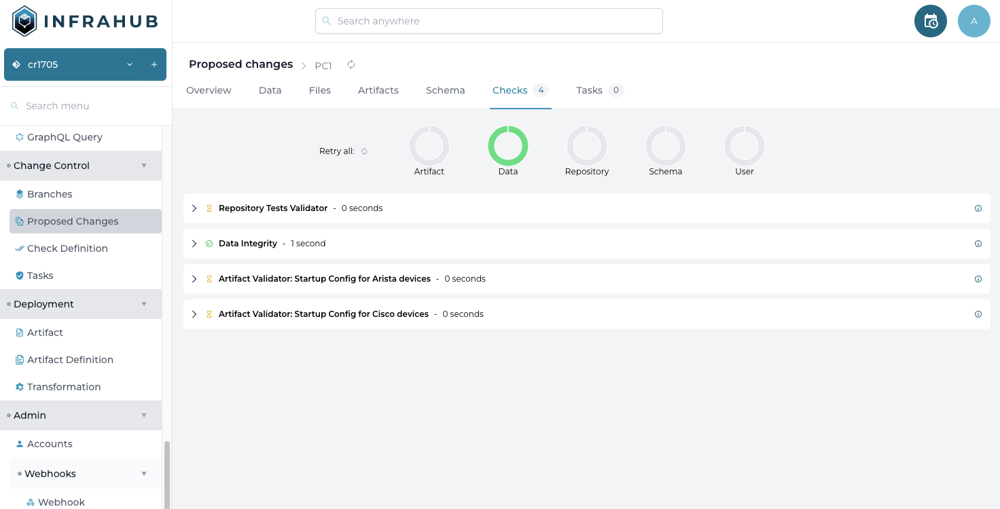
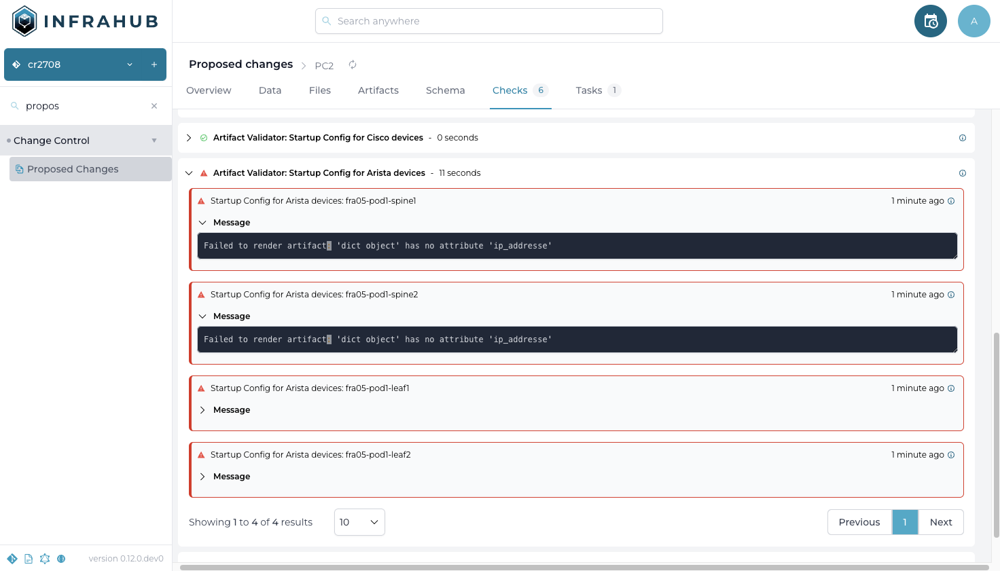
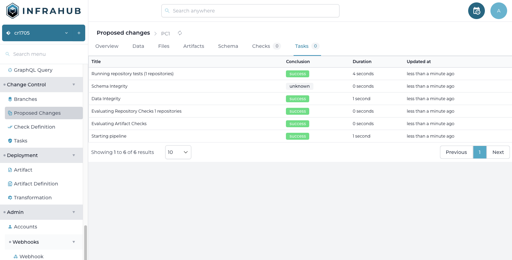
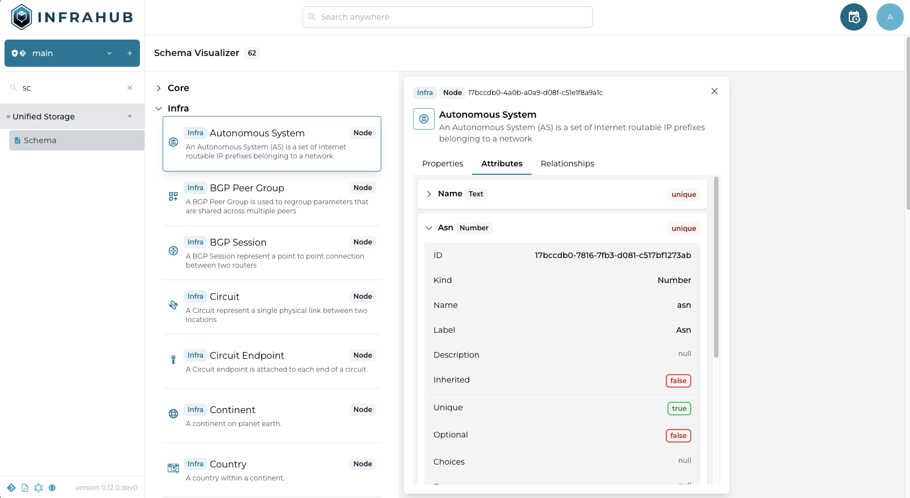
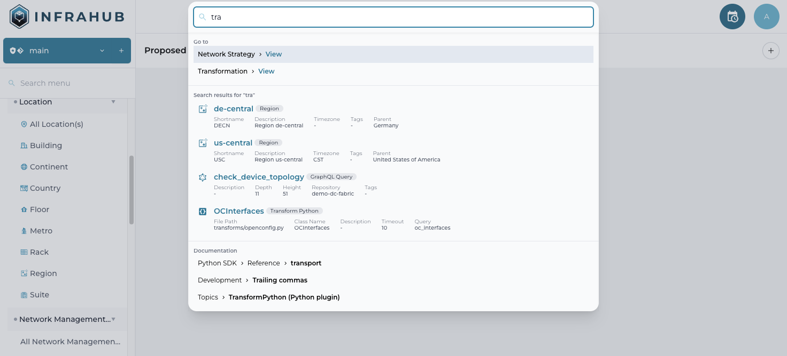

<table>
  <tbody>
    <tr>
      <th>Release Number</th>
      <td>0.12.0</td>
    </tr>
    <tr>
      <th>Release Date</th>
      <td>March XX, 2024</td>
    </tr>
    <tr>
      <th>Release Codename</th>
      <td>Beta #1</td>
    </tr>
    <tr>
      <th>Tag</th>
      <td>[infrahub-v0.12.0](https://github.com/opsmill/infrahub/releases/tag/infrahub-v0.12.0)</td>
    </tr>
  </tbody>
</table>

# Release 0.12.0 - Beta #1

## Main Changes

### Unified Storage

#### Schema Update & Migrations

It's now possible to update the schema without losing data. Infrahub will automatically apply the validations and the migrations to ensure the data currently in the database is compliant with the new schema.

The validations and the migrations will also be applied :

- As part of a Proposed Change
- During a branch rebase
- During a branch merge

#### Non Isolated Branches

The default behavior for a branch has been updated to keep in sync with the main branch by default.  
With this new behavior, all changes applied to the main branch will automatically be visible in the branches as well without the need for rebase.

A new Isolated mode has been introduced to allow a branch to be isolated from main and to not be affected by the changes in main.
With these changes, the `rebase` flag in the API and in the transformations has been deprecated

The flag `data_only` on a branch has been renamed to `sync_with_git` to provide a better description of its intent.

#### Additional Constraints for the Schema

A few additional constraints have been added to the schema to enforce your business logic.

##### multiple uniqueness constraints

On a Node or a Generic, it's now possible to define one or multiple uniqueness constraints composed of multiple attributes or relationships of cardinality one.

In the example below, all Interfaces will be garanteed to be unique based on their name and the device they are connected to.

```yaml {3-4}
  - name: Interface
    namespace: Infra
    uniqueness_constraints:
        - [ "device", "name__value"]
    attributes:
      - name: name
        kind: Text
    relationships:
      - name: device
        cardinality: one
        peer: InfraDevice
        kind: Parent
```

##### min_max / max_count for relationships

On a relationship of cardinality many, it's now possible to define a minimum or maximum number of peers that should be present.

```yaml {5-6}
    relationships:
      - name: "tags"
        cardinality: "many"
        peer: "BuiltinTag"
        max_count: 5
        min_count: 2
```

### CI Pipeline

The CI Pipeline as part of a Proposed Change has been significantly improved to provide more visibility to the user.

#### New version of the Check View

The page to display the progression and the results of the checks has been redesigned to provide more visibility.




#### Background Tasks

Also more information about the tasks running in the background during the Pipeline are available to the users in the `Tasks` tab.



### Schema

#### Schema Visualizer

The Schema page in the frontend has been redesigned to make it easier to navigate the current schema.
All information are now accessible, in the future the page will be updated to modify the schema directly from the frontend as well.



#### Schema Documentation

The internal schema has been refactor in order to generate better documentation and to be able to provide better validation of new schema.
A new definition of the internal schema has been published in JSONSchema format and it's accessible at `https://schema.infrahub.app/develop/schema.schema.json`

Multiple Editors are able to leverage this file to provide inline documentation and validation.

In VS Code, [the YAML Plugin](https://marketplace.visualstudio.com/items?itemName=redhat.vscode-yaml) support file with the `yaml-language-server` marker at the top of the file.

```yaml {1}
# yaml-language-server: $schema=https://schema.infrahub.app/develop/schema.schema.json
---
version: '1.0'
generics:
  - name: Interface
    namespace: Infra
```

### API / GraphQL

#### New DiffSummary query

The GraphQL query `DiffSummary` has been refactored to expose more information, it's now possible to query information about the attributes and the relationships in addition to the nodes.
The previous version of the Query has been migrated to `DiffSummaryOld` and it will be removed in the next release.

### Other

#### Enhanced Search Bar

The search bar has been enhanced to return more information. In addition to the objects, it's now possible to search the documentation and to navigate directly to other pages in the frontend.
The search results view has also been redesigned to make it faster and more accessible.



#### Performance Improvement

The processing of the schema internally has been significantly improved and as a result:

- Accessing the schema is 5x to 10x faster
- Loading a new schema is 3x faster
- Loading the frontend for the first time is significantly faster too

#### Sync Engine

The Synchronization Engine has been improved to be able to run in standalone mode and it has been integrated with the Dagster, to provide more visibility into the process and leverage its orchestration capabilitites.
The project has been packaged as a dedicated Python package and it's now available on Pypi `infrahub-sync`.

#### Documentation Update

There's been multiple improvement to the documentation including:

- A new Topic page about Immutability and Version Control
- A new topic page about the Resources testing framework
- A new guide on how to create your own schema
- The Python SDK section has been reorganized to have Guides and Reference and it includes more information
