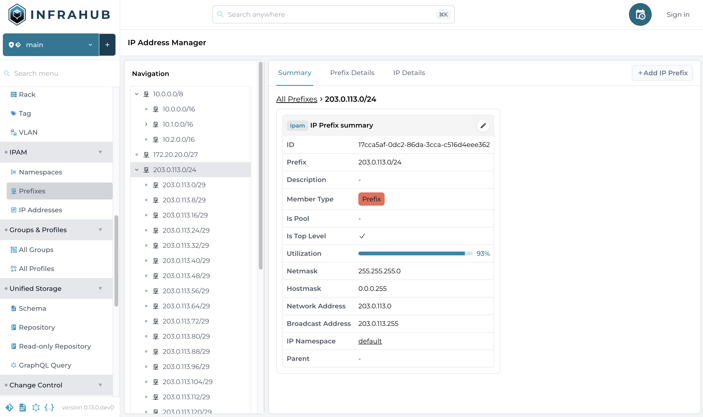

<table>
  <tbody>
    <tr>
      <th>Release Number</th>
      <td>0.13.0</td>
    </tr>
    <tr>
      <th>Release Date</th>
      <td>May XX, 2024</td>
    </tr>
    <tr>
      <th>Release Codename</th>
      <td> - </td>
    </tr>
    <tr>
      <th>Tag</th>
      <td> - </td>
    </tr>
  </tbody>
</table>

# Release 0.13.0

## Main Changes

### Unified Storage

#### IP Address Management

Infrahub now includes a builtin support for IP Prefixes and IP Addresses, both for IPv4 and IPv6.

To keep things extensible, Infrahub provides a minimum schema to capture the relationships between IP Prefix, IP address and IP Namespace.
Infrahub will automatically maintain trees of IP prefixes and IP addresses being built based on the IP Namespace.
Building these hierarchies/trees allows Infrahub to determine how IP prefixes and IP addresses are nested as well as computing utilization of the recorded IP spaces.

The following `Generic` are provided by default and can be extended as needed to add your own attributes/relationships or constraints:

- `BuiltinIPNamespace`: used to model a namespace to manage IP resources, this is a generic representation of what could be, for examples, a routing table, a routing instance or a VRF
- `BuiltinIPPrefix`: used to model a network, sometimes referred as supernet/subnet
- `BuiltinIPAddress`: used to model a single IP address

More information about IPAM is available in the [Documentation](https://docs.infrahub.app/topics/ipam)




#### Profiles

A profile in Infrahub allow you to define a common set of attributes that should be applied to nodes.

A node that has a profile assigned, will get the values of its attributes inherited from the assigned profile, if no value is defined for the attribute at the node, or if the default value is used.
The attribute values of a node that were inherited from a profile can be overridden, by defining them at the node.

More information about Profiles is available in the [Documentation](https://docs.infrahub.app/topics/profiles)

#### Leverage Database Indexes to improve performance

Infrahub is now leveraging database indexes to improve the overall performance of the database.
Indexes will be automatically applied on startup.

A new command `infrahub db index` has been introduced to managed the indexes.
<!-- vale off -->
```shell
infrahub db index --help

 Usage: infrahub db index [OPTIONS] [ACTION]:[show|add|drop] [CONFIG_FILE]

 Manage Database Indexes

╭─ Arguments ─────────────────────────────────────────────────────────────────────────────────────────────────────────╮
│   action           [ACTION]:[show|add|drop]  [default: IndexAction.SHOW]                                            │
│   config_file      [CONFIG_FILE]             [env var: INFRAHUB_CONFIG] [default: infrahub.toml]                    │
╰─────────────────────────────────────────────────────────────────────────────────────────────────────────────────────╯
╭─ Options ───────────────────────────────────────────────────────────────────────────────────────────────────────────╮
│ --help          Show this message and exit.                                                                         │
╰─────────────────────────────────────────────────────────────────────────────────────────────────────────────────────╯
```
<!-- vale on -->

### CI Pipeline

#### Generators

A Generator is a generic plugin that can be used apply your own logic to creates new nodes and relationships.
Generator are expected to be idempotent and should be able to run multiple times and always produce the same result.

One use case for the generators is to be able to manage technical objects derived from a higher level definition of a service.

Generator are associated with some input data identified by a GraphQL query.
Similar to the Transforms & Artifacts, Generator will be automatically executed as part of the CI Pipeline if the data associated with a given generator has changed.

The Generator itself is a Python class that is based on the `InfrahubGenerator` class from the SDK. Just like transforms and checks, the Generators are user defined.

More information about Generators is available in the [Documentation](https://docs.infrahub.app/topics/generator)

#### Redesigned proposed change creation form

The form to create a proposed change has been redesigned to include a description field.


### Schema

#### Relationship of type Parent can't be optional

The constraints around the relationships of kind `Parent` have been tighten and these relationships can't be optional anymore.
All existing relationships will be automatically migrated when upgrading to this release and your schema will need to be updated.

#### Improvement and modularization of demo schema

The demo schemas located in the `models` directory have been updated to cover more use cases and to simplify how to use them.

The main schema, previously stored in the file `infrastructure_base.yml` has been broken down in multiple schemas now located in the `base` directory.
The other schemas have been moved to the `examples` directory

#### Cascade node deletion

It's now possible to define how related nodes should be handled when a node is being deleted. This feature is usually referred as CASCADE DELETE.
On each relationship, it's now possible to defined `on_delete: CASCADE` to indicate that if this node is deleted, all nodes on the other side of this relationship must be deleted too.

#### New options available in the schema

The attribute `read-only` is now available on all relationship.
If True, users won't be able to add or remove peers to this relationship (not present in GraphQL mutations and forms)

The attribute `allow_override` is now available on all attributes and relationships.
This new flag is meant to be used on a Generic node to protect the attribute / relationship that can't be overwritten by a node inheriting from this generic.

The attribute `documentation` is now available on all Node and Generic.
This field is meant to store an URL where the documentation for this model is available.
The link will be displayed in the help popup in the frontend.

The attribute `on_delete` is now available on all relationships. See section above.

### API / GraphQL

#### `is_from_profile` and `is_default` properties on all attributes

In GraphQL, it's now possible to query 2 new properties on all attributes to gather more information about the origin of the value:

- `is_from_profile`: True if the value was inherited from a profile, the name of the profile will be available in under `source`
- `is_default`: True if the value was set by the default value defined in the schema

### Other

#### Schema information included in the search anywhere bar

The main search anywhere bar now includes information from the schema and
it can include return existing schema page as a potential result for the search.


#### Search and filter on object list view

The object list view has been updated to include a new search bar and a new panel to filter the element of the list.


#### Cleanup of invoke tasks and introduction of the `dev` namespace

The invoke tasks have been cleaned up to clearly separate the tasks related to the demo environment and the one for internal development.
A new namespace `dev` has been introduced and some commands have been renamed including `demo.dev-start` that has been renamed to `dev.deps`.

A new `demo.migrate` command has been introduced to apply the database & schema migrations.

#### Update GraphiQL Application

The Graph sandbox (GraphiQL) has been integrated into Infrahub directly to provide a better experience
and remove the dependencies to an external CDN.

The standard menu is now available on the left of the GraphiQL application
and its possible to directly select the active branch with the standard dropdown.


#### Help Panel in the list view

A new help popup is now available in the top right corner of a list view for all objects.
The help popup will include a link to the schema for this object and if defined in the schema, a link to the external documentation.


#### Configuration file & environment variables

Some cleanup have been done on the configuration file for Infrahub and associated environment variables.

- `initial_admin_password` has been renamed to `admin_token` and it's now located in the `initial` section
- `initial_admin_token` has been renamed to `admin_password` and it's now located in the `initial` section

The environment variables for the Python SDK and infrahubctl have been renamed to align with Infrahub.
Instead of starting with `INFRAHUB_SDK_`, all environment variables are not starting only with `INFRAHUB_` (without `SDK_`)
