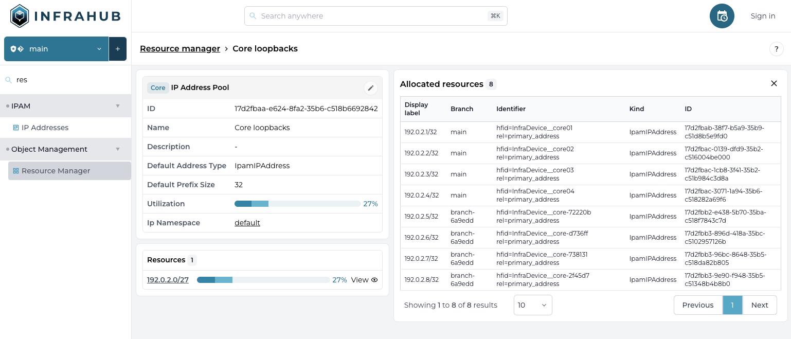

<table>
  <tbody>
    <tr>
      <th>Release Number</th>
      <td>0.14.0</td>
    </tr>
    <tr>
      <th>Release Date</th>
      <td>May 26, 2024</td>
    </tr>
    <tr>
      <th>Release Codename</th>
      <td>Beta #3</td>
    </tr>
    <tr>
      <th>Tag</th>
      <td>[infrahub-v0.14.0](https://github.com/opsmill/infrahub/releases/tag/infrahub-v0.14.0)</td>
    </tr>
  </tbody>
</table>

# Release 0.14.0

We're excited to announce the latest release of Infrahub (0.14) and the beginning of the open beta.
The main focus for this release was to prepare for the open beta with a lot of cleanup and improvement of the documentation as well as the introduction of some key features like the Resource Manager.

## Main changes

### Unified storage

#### Resource Manager

The Resource Manager provides an easy way to manage and allocate resources.
This first implementation supports IP Prefix and IP Address and more type of resources will be supported in the future (vlan, ids, interfaces etc.. )

What makes the resource manager special are
- **Inline Allocation** : Resources can be allocated from a pool directly when creating an object
- **Branch Agnostic** : the allocation of resources work across branches. A resource allocated in a branch won't be allocated to any other branch.
- **Idempotent** : If the same consumer is requesting a resource multiple times, the resource manager will always return the same value. This capability greatly helps to reduce the complexity required to manage resource allocation on the client side in an idempotent way.




### Schema

#### Human Friendly Identifier (hfid)

In addition to the internal id automatically generated for each object (UUID), Infrahub provides a way to define a set of fields that will constitute a human friendly identifier (hfid).

The `hfid` is meant to be used to reference objects uniquely across systems, or even before an object has been created in Infrahub.

This feature will be mostly invisible for users while using the frontend but having a human friendly way to identify an object is very important to build robust data synchronization between systems and to provide true idempotent scripts.

Applied to the  network industry:
- the `hfid` of a device could be its name : `atl1-edge01`
- the `hfid` of an interface will be the combination of the name of the device and the name of the interface: `["atl1-edge01", "Ethernet1"]

The fields that will compose the `human_friendly_id` must be defined in the schema

##### hfid support in GraphQL

`hfid` can be used as a alternative to id in most places in GraphQL, including :
- Update Mutation
- Upsert Mutation
- Delete Mutation
- Related Node in all Mutations

### Other

#### Documentation update

The documentation has seen a lot of improvement and additional content including a new FAQ

#### New GraphQL Query detail page (need to confirm if this is part of this release)

The page to access the detailed view of a GraphQL query has been redesigned to improve its usability and the readability of the query.
It's now possible to directly load the query in the GraphQL sandbox to execute it.

<add screenshot>

## Breaking Changes

### Remove support for non-isolated branch

The support for branches in non-isolated mode has been removed.
While this feature would have been very useful it presented some challenges when it comes to operations that depends on the other nodes in the graph like : schema management, constraints validation, IPAM

All branches are now operating by default in isolated mode, similar to how branches are working in Git.


## Migration Guide

To migrate your instance of Infrahub to the latest version, please run the following commands and restart all instances of infrahub.

```
infrahub db migrate
infrahub db update-core-schema
```
> if you are running in docker these commands need to run from the container where infrahub is installed

### Migration of the demo instance

If you are using the demo environment, you can migrate to the latest version with the following commands
```
invoke demo.stop
invoke demo.build
invoke demo.migrate
invoke demo.start
```

If you don't want to converse your data, you can start a clean instance with the following command
```
invoke demo.destroy demo.build demo.start demo.load-infra-schema demo.load-infra-data
```
> All data will be lost, please make sure to backup everything you need before running this command.

The repository https://github.com/opsmill/infrahub-demo-edge has also been updated, it's recommended to pull the latest changes into your fork.