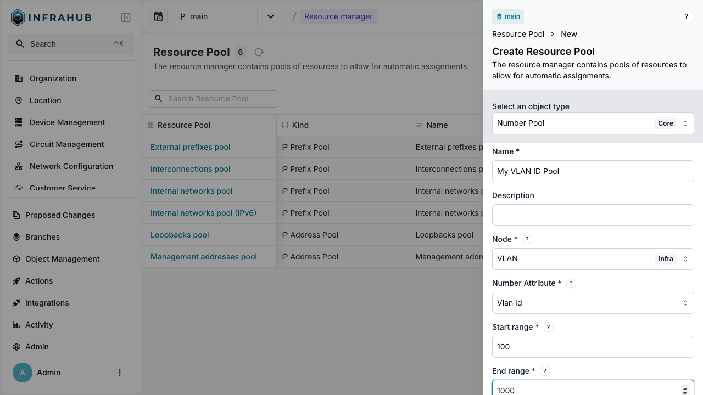
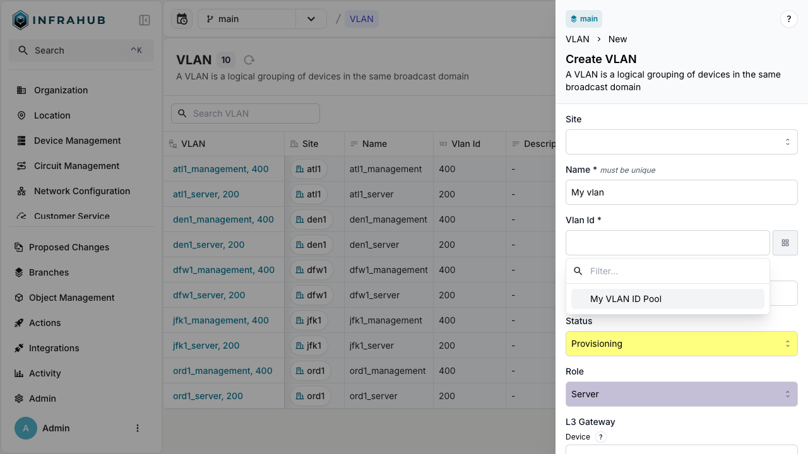
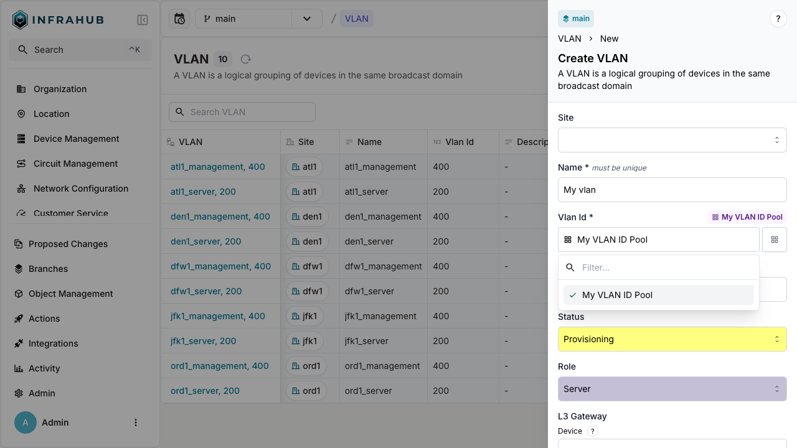

import Tabs from '@theme/Tabs';
import TabItem from '@theme/TabItem';

Number pools (`CoreNumberPool`) automatically assign sequential numbers to numeric attributes.

## Prerequisites

- A running Infrahub instance

<details>
<summary>Schema used in this guide</summary>

The examples on this page use the following schema node. Adapt the type names to match your own schema.

```yaml
nodes:
  - name: VLAN
    namespace: Ipam
    attributes:
      - name: name
        kind: Text
        unique: true
      - name: vlan_id
        kind: Number
```

</details>

## Step 1: Create a number pool

Create a pool for VLAN IDs:

<Tabs groupId="method" queryString>
  <TabItem value="web" label="Web interface" default>

Navigate to **Object Management** → **Resource Manager**, create a resource pool and select **Number Pool** as the object type. Fill in the form:

- **Name**: `My VLAN ID Pool`
- **Node**: `IpamVLAN`
- **Attribute**: `vlan_id`
- **Scoped by**: leave empty, so that all VLANs share one sequence of VLAN IDs
- **Ranges**: one range with **Start** `100` and **End** `1000`, and an empty **Weight**



A pool can hold several ranges. Click **Add range** to add a row, and give each row a start, an end and, optionally, a weight. The pool allocates numbers from the range with the highest weight first. An empty weight counts as 0, and among ranges with equal weights the pool starts with the lowest range. Ranges of one pool cannot overlap. When the start or end of a range is outside the minimum or maximum value of the attribute, the form shows the values that the range is limited to.

To give each value of a field its own sequence of numbers, select one or more fields in **Scoped by**. For example, when your VLAN kind has a required `site` relationship, selecting it gives each site its own sequence of VLAN IDs. Only the required fields of the node kind can be selected. The list shows the other fields with the reason they cannot be used. You set the scope when you create the pool and cannot change it afterwards in the web interface.

  </TabItem>
  <TabItem value="graphql" label="GraphQL">

```graphql
mutation {
  CoreNumberPoolCreate(
    data: {
      name: {value: "My VLAN ID Pool"}
      node: {value: "IpamVLAN"}
      node_attribute: {value: "vlan_id"}
      start_range: {value: 100}
      end_range: {value: 1000}
    }
  ) {
    ok
    object {
      hfid
      id
    }
  }
}
```

:::important

Save the pool ID for allocation operations!

:::

  </TabItem>
</Tabs>

## Step 2: Allocate a VLAN ID

<Tabs groupId="method" queryString>
  <TabItem value="web" label="Web interface" default>

  Navigate to **VLAN** → **Add VLAN**. Next to the VLAN ID field, click the pools button and select your number pool.

  
  

  </TabItem>

  <TabItem value="graphql" label="GraphQL">

  ```graphql
  mutation {
    IpamVLANCreate(
      data: {
        name: {value: "My vlan"}
        vlan_id: {from_pool: {id: "<POOL-ID>"}}
      }
    ) {
      ok
      object {
        name {
          value
        }
        vlan_id {
          value
        }
        id
      }
    }
  }
  ```

  </TabItem>
</Tabs>

:::success

The VLAN is created with VLAN ID allocated from the pool!

:::

## Change the ranges of a number pool

When a pool has no free numbers left or your numbering plan changes, add, remove or resize its ranges. In **Object Management** → **Resource Manager**, open the pool and click the edit button (pencil icon).

In the edit form you can change the name, the description and the ranges. The node, the attribute and the allocation scope are displayed as read-only values. Removing a range does not change the numbers already allocated from it: the objects keep their values.

For a pool defined in the schema, through a `NumberPool` attribute, the edit form displays the ranges as read-only values. Change them by updating the attribute's parameters in the schema on the default branch, as described in [Number pools](../schema/number-pool.mdx).

## Next

- [Allocate IP addresses](./allocate-ip-address.mdx)
- [Allocate IP prefixes](./allocate-ip-prefix.mdx)
