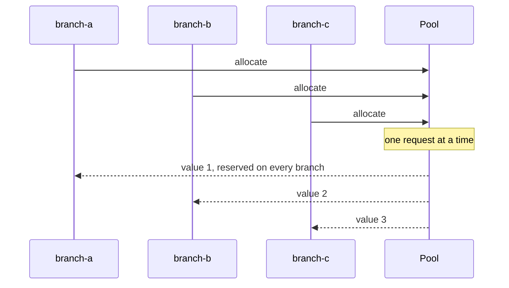
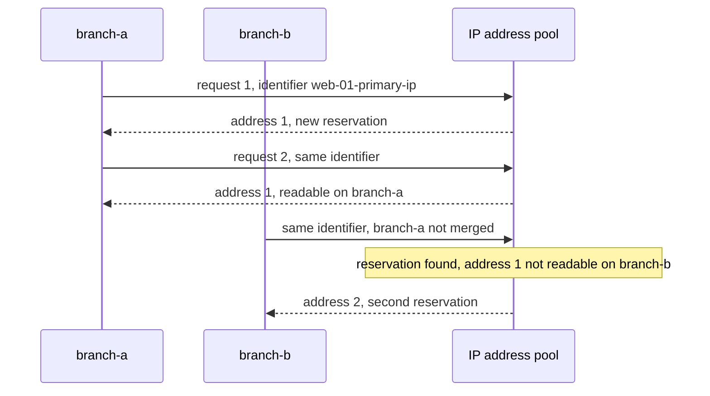

import VideoPlayer from '../../src/components/VideoPlayer';

Resource Manager in Infrahub automates the allocation of network resources from predefined pools, eliminating manual assignment and preventing conflicts across your infrastructure. This system ensures consistent resource allocation while maintaining complete visibility and control over your available resources.

## What is a resource manager?

A Resource Manager is a system component that automatically allocates resources from pools when creating or updating infrastructure objects. Instead of manually tracking available IP addresses, VLAN IDs, or other resources in spreadsheets, you define pools and let Infrahub handle the allocation.

Resource Manager supports three primary types of pools:

- **IP Address Pools** (`CoreIPAddressPool`) - Allocate individual IP addresses from IP prefixes
- **IP Prefix Pools** (`CoreIPPrefixPool`) - Allocate smaller subnets from larger IP prefixes
- **Number Pools** (`CoreNumberPool`) - Allocate sequential numbers for attributes like VLAN IDs, ASNs, or circuit IDs

:::note IP address and prefix pools require IPAM

**CoreIPAddressPool** and **CoreIPPrefixPool** require IP prefix objects as their pool sources. This means your schema must include nodes inheriting from `BuiltinIPPrefix` and `BuiltinIPAddress`, and those prefix objects must exist in your instance before a pool can allocate from them.

**CoreNumberPool** has no dependency on IPAM and can be used independently.

If you haven't set up your IPAM yet, start with [Build your IPAM schema](../ipam/build-your-ipam-schema.mdx).

:::

:::warning
When an attribute is assigned by a Resource Manager, the attribute cannot be used as part of the Human Friendly Identifier (HFID).

This is due to the dynamic nature of using Resource Manager and the idempotency of using the `allow_upsert=True`, which uses the HFID to understand if an object already exists within the database.
:::

## Pool types and use cases

### IP address pools

IP address pools allocate individual addresses from one or more IP prefixes. Common use cases include:

- **Device management IPs**: Loopback addresses for routers and switches
- **Server primary IPs**: Management interfaces for compute infrastructure
- **Service endpoints**: Load balancer VIPs, anycast addresses
- **Point-to-point links**: Interface addresses for interconnections

Key features:

- Automatic allocation of the next available address
- Support for both IPv4 and IPv6
- Ability to combine multiple prefixes in a single pool
- Optional allocation weighting for preferred ranges

### IP prefix pools

IP prefix pools allocate subnets from larger prefixes. Typical applications:

- **Customer allocations**: Assign /29 or /28 blocks to customers
- **Site networks**: Allocate /24 networks to new locations
- **Service subnets**: Reserve ranges for specific applications
- **Point-to-point links**: Allocate /30 or /31 prefixes for interconnects

Key features:

- Configurable prefix length for allocations
- Efficient subnet management and tracking
- Hierarchical allocation support
- Visual representation of utilization

### Number pools

Number pools manage sequential numeric identifiers. Common scenarios:

- **VLAN IDs**: Ranges 100-1000 for data VLANs, 2000-3000 for voice
- **ASN allocation**: Private ASN ranges for BGP deployments
- **Circuit IDs**: Sequential numbering for service provisioning
- **Interface indices**: Consistent numbering across devices

Key features:

- Define start and end ranges
- Automatic sequential allocation
- Skip values already in use, when the target attribute is `unique`
- Support for any numeric attribute

## Allocation methods

### Direct allocation

Direct allocation creates a standalone IP address or IP prefix from a pool, without linking it to another object. It is available for IP address and IP prefix pools only. In the web interface, you create the IP address or IP prefix and choose the pool with the pool button next to its **Address** or **Prefix** field, labelled "select a pool". In the GraphQL API, you call `InfrahubIPAddressPoolGetResource` or `InfrahubIPPrefixPoolGetResource`. A number pool has no direct allocation: it fills an attribute, as described in [Attribute allocation](#attribute-allocation).

Use direct allocation when:

- Pre-provisioning resources for future use
- Creating resources that will be assigned later
- Building resource inventories
- Testing pool configurations

Example: Allocating an IP address for future assignment:

```graphql
mutation {
  InfrahubIPAddressPoolGetResource(data: {
    id: "<pool-id>",
    data: {
      description: "Reserved for new web server"
    }
  }) {
    ok
    node {
      id
      display_label
    }
  }
}
```

### Relationship resource allocation

Relationship allocation assigns a resource to a relationship while you create an object. Pass `from_pool` with the pool's ID instead of the peer's ID, and Infrahub allocates the value while it creates the object, in the same request.

Example: Creating a device with automatic IP allocation:

```graphql
mutation {
  InfraDeviceCreate(data: {
    name: {value: "spine-01"},
    primary_ip: {
      from_pool: {
        id: "<pool-id>"
      }
    }
  }) {
    ok
    object {
      id
    }
  }
}
```

### Attribute allocation

A number pool fills a `Number` attribute on the object you create. Pass `from_pool` with the pool's ID on the attribute. The pool's `node` setting must name that kind or a generic it inherits from, and its `node_attribute` setting must name that attribute, or Infrahub rejects the request. In the web interface, click the pool button next to the field, labelled "select a pool", and choose the pool.

Example: Creating a VLAN with its VLAN ID taken from a number pool:

```graphql
mutation {
  IpamVLANCreate(data: {
    name: {value: "server-vlan"},
    vlan_id: {
      from_pool: {
        id: "<pool-id>"
      }
    }
  }) {
    ok
    object {
      id
      vlan_id {
        value
      }
    }
  }
}
```

For an attribute of kind `NumberPool` in the schema, Infrahub creates a pool and fills the attribute from it without `from_pool`. See [Number pools](../schema/number-pool.mdx) for that setup and [Allocate numbers](./allocate-number.mdx) for the full walkthrough.

## Branch-agnostic allocation

<center>
  <VideoPlayer url='https://youtu.be/F7tvLRQULdg?si=S83VyA0xmXHQGQqV' light />
</center>

When you allocate a value from a pool on any branch, Infrahub reserves it for every branch at that moment. A request from another branch to the same pool gets a different value, before either branch merges.

Consider this scenario:

1. You create a new branch "datacenter-expansion"
2. You allocate IP address 10.0.0.50 from a pool to a new device on this branch
3. Another team member, working on a different branch "network-refresh", requests an address from the same pool
4. Infrahub returns a different address, even though neither branch has merged

When both branches merge, their addresses from the pool do not collide. The reservation applies only to values allocated from the pool. A value you type into a unique attribute is not reserved anywhere. If two branches hold the same typed value, then once one of them merges, Infrahub refuses to rebase or merge the other until you change the value on it.

### Verifying branch-agnostic behavior

1. Create a test branch

```shell
infrahubctl branch create test
```

2. Allocate an IP address in the test branch

```graphql
mutation {
  InfrahubIPAddressPoolGetResource(
    data: {
      hfid: ["My IP address pool"]
      data: {description: "my IP allocated on branch test"}
    }
  ) {
    ok
    node {
      id
      display_label
    }
  }
}
```

3. Check allocation status from the main branch

```graphql
query {
  InfrahubResourcePoolAllocated(
    pool_id: "<POOL-ID>"
    resource_id: "<PREFIX-ID>"
  ) {
    edges {
      node {
        display_label
        branch
      }
    }
  }
  IpamIPAddress {
    edges {
      node {
        display_label
      }
    }
  }
}
```

:::success

The query shows the IP address is allocated in the test branch, preventing duplicate allocation in main, even though the IP address object doesn't exist in main yet.

:::

### Concurrent requests

Infrahub handles one allocation request at a time for each pool, across every Infrahub worker in the deployment. IP address, IP prefix and number pools all work this way. Two requests to the same pool at the same time, from different branches, Generators or clients, get different values. Requests to different pools do not wait for each other.



### Releasing an allocated resource

Because an allocation is reserved across every branch, deleting the object it was allocated to on one branch does not necessarily return the resource to the pool. For a delete to return it, the object has to be gone from **every** branch that can still read it. This includes any branch created while the object was active on the default branch.

The resource returns to the pool as soon as no branch can reach the object, whether that happens through the delete itself or through a later merge, rebase or branch deletion. Removing the allocated attribute or relationship from the schema releases it too, without deleting any object — again only once no branch still declares the field. See [Branch-agnostic data](../branches/branch-agnostic-data.mdx) for the full rule.

## Idempotent allocation

To get the same value back from an IP address pool or an IP prefix pool each time a script or a [Generator](../generators/overview) runs, pass an `identifier` when you allocate through the GraphQL API. For a later request to the same pool with the same identifier, Infrahub returns the value already reserved under it instead of allocating a new one:

```graphql
mutation {
  InfrahubIPAddressPoolGetResource(data: {
    id: "<pool-id>",
    identifier: "web-01-primary-ip",
  }) {
    ok
    node {
      id
      display_label
    }
  }
}
```

The same `identifier` field is available on `from_pool` when you allocate through a relationship. How Infrahub treats identifiers:

- **The web interface never sends one.** When you choose a pool in a form, Infrahub applies its default, described in the next two rules.
- **Infrahub allocates a new value for every direct allocation without an identifier.**
- **A relationship `from_pool` without an identifier gets a default one** when the object's kind has an HFID. Infrahub builds it from the object's kind, its HFID and the relationship name. When the kind has no HFID, there is no default, and Infrahub allocates a new value for each request.
- **Number pools ignore identifiers.** A number pool keys each reservation on the object whose attribute it fills.
- **Infrahub returns the reserved value only on a branch that can read it.** On another branch that cannot read the allocated object yet, Infrahub allocates a different value for a request with the same identifier, with no error.
- **Build the identifier from the object it is allocated to**, such as the device and interface names. An identifier built from a run ID or a timestamp changes on every run, so Infrahub allocates a new value on every run.



## Advanced features

### Weighted allocation

For IP pools containing multiple resources, you can control allocation priority using weights. Resources that inherit from `CoreWeightedPoolResource` gain an `allocation_weight` attribute:

```yaml
nodes:
  - name: IPPrefix
    namespace: Ipam
    inherit_from:
      - "BuiltinIPPrefix"
      - "CoreWeightedPoolResource"
```

Higher weight values are allocated first. This enables scenarios like:

- Preferring certain IP ranges for specific device types
- Gradually migrating between address spaces
- Implementing allocation policies

### Pool composition

Pools can contain multiple resources, providing flexibility in resource management:

- Combine non-contiguous IP ranges in a single pool
- Aggregate prefixes from different sites or providers
- Create logical groupings independent of network topology

### Allocation tracking

Infrahub provides comprehensive visibility into resource utilization:

- View all allocated resources from a pool
- Track allocation history and timestamps
- Identify which branch allocated each resource
- Monitor pool utilization percentages
- Export allocation reports

## Integration patterns

### With Generators

Resource Manager integrates seamlessly with [Generators](../generators/overview) to create fully automated provisioning workflows:

- Template configurations with dynamically allocated IPs
- Generate DNS records based on allocations
- Create monitoring configurations automatically

### In CI/CD pipelines

Incorporate resource allocation into your automation:

- Allocate resources during infrastructure deployment
- Validate resource availability before provisioning
- Clean up resources when decommissioning
- Implement approval workflows for resource requests

### API integration

Resource Manager exposes full functionality through GraphQL APIs:

- Build custom allocation interfaces
- Integrate with external IPAM systems
- Create resource request portals
- Implement custom allocation logic

## Best practices

### Pool design

- **Size pools appropriately**: Balance between too many small pools and unwieldy large ones
- **Use descriptive names**: "Campus-WiFi-Management" rather than "Pool1"
- **Document pool purposes**: Include descriptions explaining intended use
- **Plan for growth**: Size pools with future expansion in mind

### Allocation strategies

- **Use one identifier per object in scripts and Generators**: build it from the object the value is allocated to, so a rerun gets the same value back
- **Mark a number pool's target attribute `unique`**: the pool then skips values already in use on that attribute
- **Allocate early in workflows**: Reserve resources before lengthy provisioning
- **Clean up unused allocations**: Implement processes to reclaim resources
- **Monitor utilization**: Set alerts for pools approaching capacity

### Organizational considerations

- **Define ownership**: Assign pools to teams or services
- **Implement naming conventions**: Standardize how pools are named and organized
- **Create allocation policies**: Document when to use which pools
- **Regular audits**: Review allocations for accuracy and cleanup opportunities

## Related resources

- [Generator Documentation](../generators/overview) - Automate configurations with allocated resources
- [GraphQL Documentation](../development-resources/graphql/overview) - Learn about Infrahub's GraphQL interface
- [IPAM](../ipam/overview.mdx) - IP address management data model and schema
- [Branch-agnostic data](../branches/branch-agnostic-data.mdx) - How branch-agnostic values are reserved and released across branches
- [Allocate IP addresses](./allocate-ip-address.mdx) - Create an IP address pool and allocate from it in the web interface or with GraphQL
- [Allocate IP prefixes](./allocate-ip-prefix.mdx) - Create an IP prefix pool and allocate subnets from it
- [Allocate numbers](./allocate-number.mdx) - Create a number pool and fill a `Number` attribute from it
- [Run parallel branches](../branches/parallel-branches.mdx) - Allocate, rebase and merge when several branches are open at once
