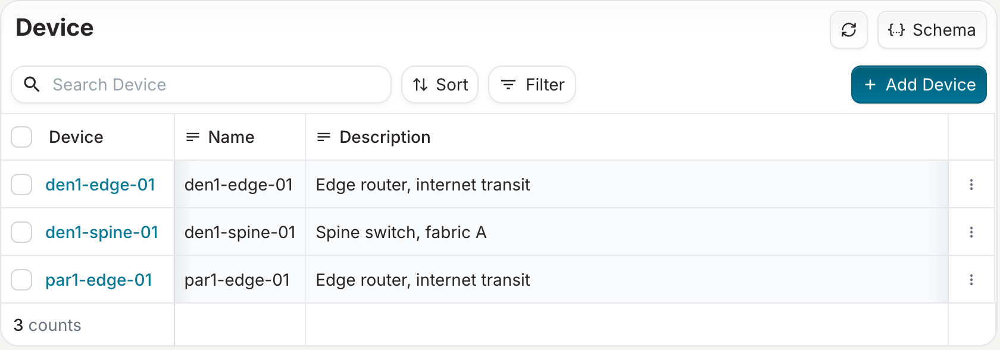
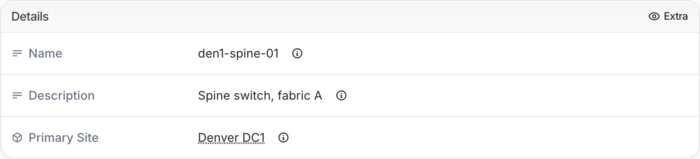
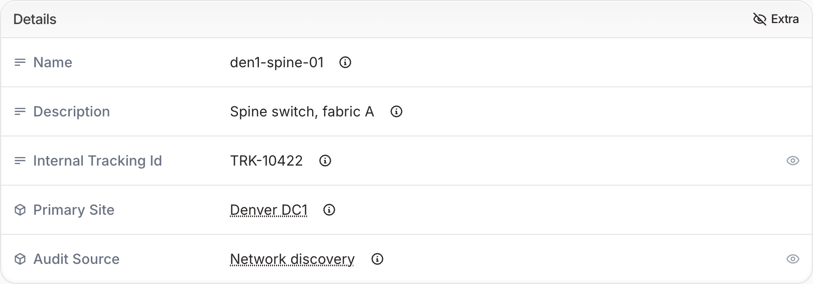
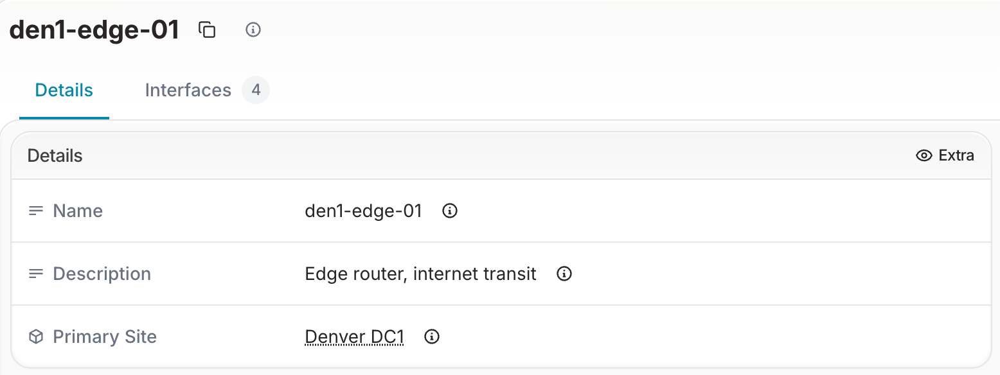

import ReferenceLink from "../../src/components/Card";

# Field visibility

Infrahub schemas can declare how attributes and relationships should appear in the frontend, independently of their presence in the data model. These declarations are purely UI hints — they do not affect data access via the API, GraphQL, or forms.

This separates two concerns that are often conflated: what data exists, and what data the interface surfaces by default.

## Why this matters

As schemas grow, object views and list views can become cluttered with internal tracking fields, audit metadata, or secondary attributes that aren't relevant for day-to-day operations. Without a way to distinguish primary fields from secondary ones at the schema level, all fields receive equal treatment in the UI, regardless of how often they're actually needed.

Schema-level UI hints let the schema author encode that intent directly, rather than relying on each user to manually navigate around noise. The result is a focused interface for common tasks, with full data still accessible when needed.

This principle — that the schema controls the default user experience, not just data structure — extends to any future capability that shapes how fields are organized or surfaced in the UI.

## Visibility: the `display` property

The `display` property on attributes and relationships controls whether a field is shown by default, or hidden from the list view and shown in the detail view only after you select **Extra**.

<ReferenceLink title="Attribute reference" url="../reference/schema/attribute#display" openInNewTab />
<ReferenceLink title="Relationship reference" url="../reference/schema/relationship#display" openInNewTab />

### Values

| Value | Meaning |
| --- | --- |
| `default` | The field appears in the detail view and in forms, and in the list view when the list view has a column for it. This is the default when `display` is not specified. |
| `extra` | The field is hidden from list and detail views by default. It is accessible via an **Extra** toggle in the detail view and still visible in create and edit forms. |

### Behavior by view

| View | `display: default` | `display: extra` |
| --- | --- | --- |
| List view | Visible when the list view has a column for the field | Hidden |
| Detail view | Visible | Accessible via Extra toggle |
| Create / edit forms | Visible | Visible |
| API / GraphQL | Accessible | Accessible |

The list view has a column only for some kinds of fields, whatever their `display` value:

- Attributes, except some kinds. For example, attributes of kind `TextArea`, `JSON`, `List`, `Any`, `Password` or `HashedPassword` have no column.
- Relationships of kind `Attribute` or `Parent`, and the `parent` relationship of a hierarchical node.

Relationships of kind `Generic`, which is the default kind, have no list view column. They appear in the detail view.

:::info Hiding a field does not restrict access

`display: extra` changes only the default list and detail views. Users can still:

- View the field in the detail view after they select **Extra**.
- Set its value in the create and edit forms.
- Read and write it through the API and GraphQL.

To control who can view or change data, use [permissions and roles](../deploy-manage/user-management/permissions-roles/overview). An object permission applies to a kind of node, such as `DcimDevice`, not to an individual attribute or relationship.

:::

### Example

```yaml
nodes:
  - name: Device
    namespace: Dcim
    attributes:
      - name: name
        kind: Text
      - name: description
        kind: Text
      - name: internal_tracking_id
        kind: Text
        display: extra          # hidden from list and detail views
    relationships:
      - name: primary_site
        peer: LocationSite
        cardinality: one
      - name: audit_source
        peer: AuditSource
        cardinality: one
        display: extra          # hidden from list and detail views
```

`internal_tracking_id` and `audit_source` are stored and fully accessible via the API but are not shown in the list or detail view by default.

With this schema, the list view of devices has **Name** and **Description** columns, but no **Internal Tracking Id** column. **Primary Site** has no column either, because it is a relationship of kind `Generic`:



The **Details** card of a device shows **Name**, **Description** and **Primary Site**. The **Extra** toggle appears in the card header because the schema has fields set to `display: extra`:



Select **Extra** to show **Internal Tracking Id** and **Audit Source**. An eye icon at the end of a row marks each field set to `display: extra`:



### Cardinality-many relationships

A relationship with `cardinality: many` and kind `Generic`, `Component` or `Hierarchy` has its own tab in the detail view, with the number of peers next to the tab name. It has no row in the **Details** card. The `display` property has no effect on these relationships: their tabs are always shown, whatever the `display` value.

For example, add an `interfaces` relationship to the device from the example above. The detail view of a device has an **Interfaces** tab, even with `display: extra`:

```yaml
nodes:
  - name: Device
    namespace: Dcim
    relationships:
      - name: interfaces
        peer: DcimInterface
        kind: Component
        cardinality: many
        display: extra          # no effect: the Interfaces tab is always shown
```



The `children` relationship of a hierarchical node is a relationship of kind `Hierarchy` with `cardinality: many`, so it also has its own tab.

A relationship of kind `Attribute` with `cardinality: many` has no tab. It appears as a row in the **Details** card, and `display: extra` hides it like any other field.

## Interaction with other schema properties

- **`order_weight`**: Controls the position of fields within a view. Fields set to `display: extra` keep their order weight: after you select **Extra**, they appear among the other fields in order weight order, not in a separate section.
- **`read_only`**: Marks a field as non-editable. Can be combined with `display: extra` for fields that should rarely be visible and never modified by users.
- **`optional`**: Determines whether a value is required. Setting `display: extra` on a required field means users must still provide a value in forms, even though the field is hidden in other views.

## Related concepts

- [Order weight](./order-weight) — Controls field ordering within views
- [Labels](./display_label) — Controls how fields and nodes are named in the UI
- [Permissions and roles](../deploy-manage/user-management/permissions-roles/overview) — Controls who can read and write data
- [Schema reference](../reference/schema/attribute) — Full attribute property reference
