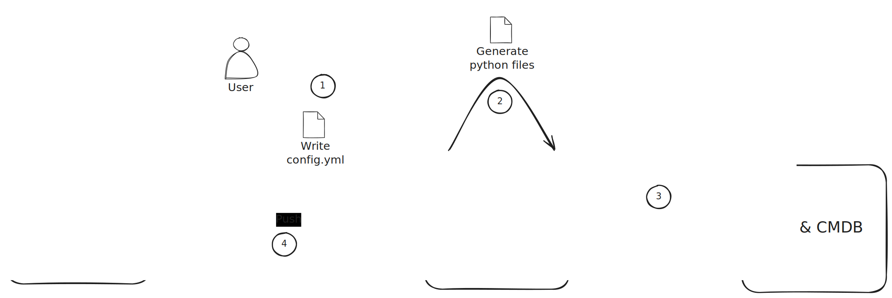

# Running sync tasks with Infrahub Sync

Learn how to use Infrahub Sync's commands to generate sync adapters, calculate differences, and synchronize data between your source and destination systems.



<!-- vale off -->
## Generating Sync Adapters and Models
<!-- vale on -->

Before you can run a synchronization task, you need to generate the necessary Python code for your sync adapters and models based on your configuration.
To create a new configuration, please refer to the guide [Creating a new Sync Instance](/sync/guides/creation)

### Command

```bash
infrahub-sync generate --name <sync_project_name> --directory <your_configuration_directory>
```

### Parameters

- `--name`: The name of the sync project you want to generate code for.
- `--directory`: The directory where your sync configuration files are located.

This command reads your configuration file and generates Python code for the sync adapters and models required for the synchronization task.

## Calculating differences

The `diff` command lets you see the differences between your source and destination before actually performing the synchronization. This is useful for verifying what will be synchronized.

### Command

```bash
infrahub-sync diff --name <sync_project_name> --directory <your_configuration_directory>
```

### Parameters

- `--name`: Specifies the sync project for which you want to calculate differences.
- `--directory`: The directory where your sync configuration files are located.

Running this command will output the differences detected based on the current state of your source and destination systems.

## Synchronizing data

Once you're ready to synchronize the data between your source and destination, you can use the `sync` command.

### Command

```bash
infrahub-sync sync --name <sync_project_name> --directory <your_configuration_directory>
```

### Parameters

- `--name`: The name of the sync project you wish to run.
- `--directory`: The directory where your sync configuration files are located.

This command performs the synchronization, applying the changes from the source to the destination based on the differences calculated by the `diff` command.

### Progress and logging

The `sync` command also supports additional flags for displaying progress and managing logging:

- `--show-progress`: Displays a progress bar during synchronization.
- `--diff`: Print the differences between the source and the destination before syncing.

For example:

```bash
infrahub-sync sync --name my_project --directory configs --diff --show-progress
```