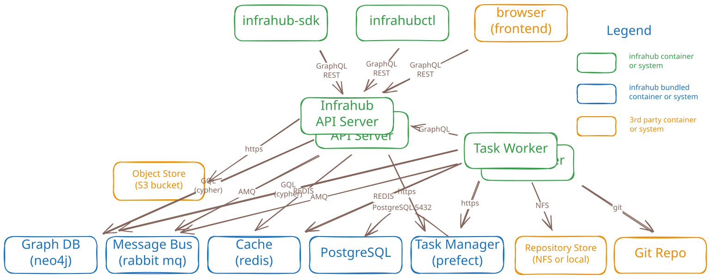
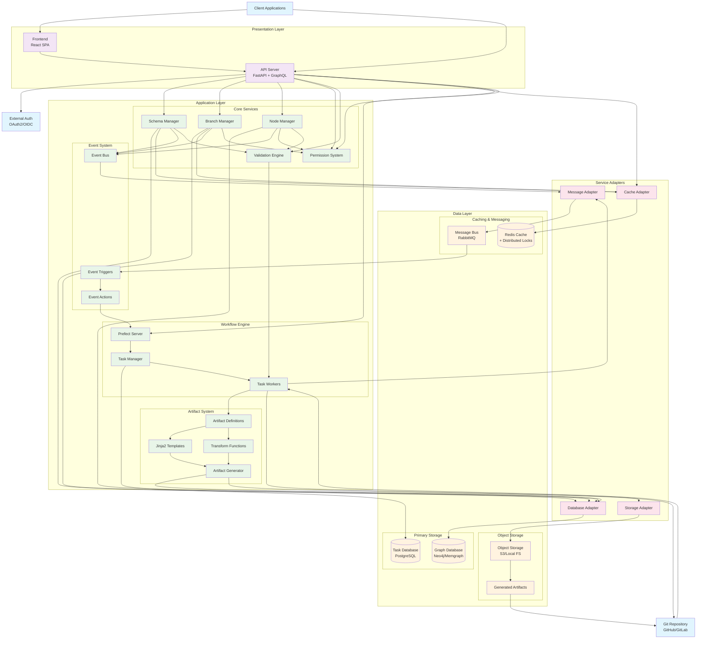
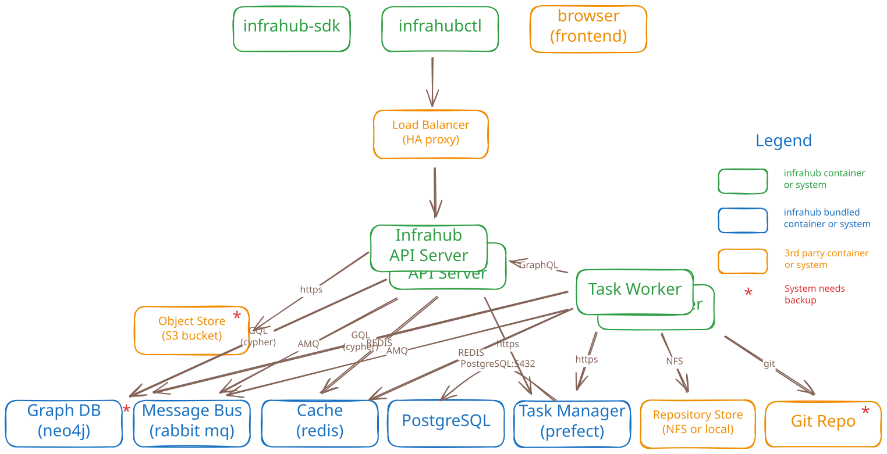

## Introduction

This topic explains the architecture and design principles behind Infrahub, helping you understand how its components work together to provide a unified infrastructure management platform. Understanding these concepts will help you make informed decisions about deployment, scaling, and integration strategies.

This explanation will answer:

- How does Infrahub combine graph database capabilities with Git-like version control?
- What architectural patterns enable Infrahub's scalability and resilience?
- How do the various components communicate and coordinate?
- What design decisions were made and why?

## Core architectural concepts

### The problem space

Traditional infrastructure management tools often struggle with:

- **Static data models** that can't evolve with your infrastructure
- **Limited version control** that makes rollbacks and auditing difficult
- **Poor integration** between different automation tools
- **Scaling challenges** when managing thousands of devices

Infrahub addresses these challenges through a unique architecture that combines the flexibility of a graph database with the version control capabilities of Git, all within a distributed, event-driven system.

### Architectural philosophy

Infrahub follows a **"microservices-in-a-monolith"** approach. While deployed as containers, the system internally uses service-oriented patterns with clean abstractions and dependency injection. This design provides:

- **Deployment simplicity** of a monolithic application
- **Architectural flexibility** of microservices
- **Clear separation of concerns** between components
- **Pluggable implementations** for different deployment scenarios

## System architecture overview



The architecture consists of three conceptual layers:

1. **Presentation Layer**: User interfaces and API endpoints
2. **Application Layer**: Business logic, workflow orchestration, and event processing
3. **Data Layer**: Persistent storage, caching, and messaging

### Detailed component architecture

The following diagram shows the detailed interactions between Infrahub components, including data flow, event handling, and artifact generation:


```mermaid
graph TB
    %% External Systems
    Client[Client Applications]
    GitRepo[Git Repository<br/>GitHub/GitLab]
    ExtAuth[External Auth<br/>OAuth2/OIDC]
    
    %% Presentation Layer
    subgraph "Presentation Layer"
        UI[Frontend<br/>React SPA]
        API[API Server<br/>FastAPI + GraphQL]
    end
    
    %% Application Layer
    subgraph "Application Layer"
        subgraph "Core Services"
            Schema[Schema Manager]
            Branch[Branch Manager]
            Node[Node Manager]
            Perm[Permission System]
            Valid[Validation Engine]
        end
        
        subgraph "Workflow Engine"
            Prefect[Prefect Server]
            TaskManager[Task Manager]
            Workers[Task Workers]
        end
        
        subgraph "Event System"
            EventBus[Event Bus]
            Triggers[Event Triggers]
            Actions[Event Actions]
        end
        
        subgraph "Artifact System"
            ArtifactDef[Artifact Definitions]
            Templates[Jinja2 Templates]
            Transforms[Transform Functions]
            Generator[Artifact Generator]
        end
    end
    
    %% Data Layer
    subgraph "Data Layer"
        subgraph "Primary Storage"
            GraphDB[(Graph Database<br/>Neo4j/Memgraph)]
            TaskDB[(Task Database<br/>PostgreSQL)]
        end
        
        subgraph "Caching & Messaging"
            Redis[(Redis Cache<br/>+ Distributed Locks)]
            MessageBus[Message Bus<br/>RabbitMQ]
        end
        
        subgraph "Object Storage"
            Storage[Object Storage<br/>S3/Local FS]
            Artifacts[Generated Artifacts]
        end
    end
    
    %% Service Layer
    subgraph "Service Adapters"
        DBAdapter[Database Adapter]
        CacheAdapter[Cache Adapter]
        MsgAdapter[Message Adapter]
        StorageAdapter[Storage Adapter]
    end
    
    %% Data Flow - Main Operations
    Client --> UI
    Client --> API
    UI --> API
    API --> ExtAuth
    
    %% API to Core Services
    API --> Schema
    API --> Branch
    API --> Node
    API --> Perm
    API --> Valid
    
    %% Core Services to Data
    Schema --> DBAdapter
    Branch --> DBAdapter
    Node --> DBAdapter
    DBAdapter --> GraphDB
    
    %% Caching
    API --> CacheAdapter
    Schema --> CacheAdapter
    Branch --> CacheAdapter
    CacheAdapter --> Redis
    
    %% Event Flow
    Node --> EventBus
    Branch --> EventBus
    Schema --> EventBus
    EventBus --> MsgAdapter
    MsgAdapter --> MessageBus
    MessageBus --> Triggers
    Triggers --> Actions
    Actions --> Prefect
    
    %% Workflow System
    API --> Prefect
    Prefect --> TaskManager
    TaskManager --> TaskDB
    TaskManager --> Workers
    Workers --> MsgAdapter
    
    %% Artifact Generation Flow
    Workers --> ArtifactDef
    ArtifactDef --> Templates
    ArtifactDef --> Transforms
    Templates --> Generator
    Transforms --> Generator
    Generator --> DBAdapter
    Generator --> StorageAdapter
    StorageAdapter --> Storage
    Storage --> Artifacts
    
    %% Git Integration
    Workers --> GitRepo
    Artifacts --> GitRepo
    GitRepo --> Workers
    
    %% Permission Flow
    API --> Perm
    Node --> Perm
    Branch --> Perm
    
    %% Validation Flow
    Node --> Valid
    Schema --> Valid
    Valid --> Workers
    
    %% Styling
    classDef external fill:#e1f5fe
    classDef presentation fill:#f3e5f5
    classDef application fill:#e8f5e8
    classDef data fill:#fff3e0
    classDef service fill:#fce4ec
    
    class Client,GitRepo,ExtAuth external
    class UI,API presentation
    class Schema,Branch,Node,Perm,Valid,Prefect,TaskManager,Workers,EventBus,Triggers,Actions,ArtifactDef,Templates,Transforms,Generator application
    class GraphDB,TaskDB,Redis,MessageBus,Storage,Artifacts data
    class DBAdapter,CacheAdapter,MsgAdapter,StorageAdapter service
```

This diagram illustrates:

- **Data Flow**: How requests flow from clients through the API to core services and data storage
- **Event-Driven Architecture**: How changes trigger events that flow through the message bus to workflows
- **Artifact Generation**: The complete pipeline from data to generated artifacts and Git integration
- **Service Abstraction**: How adapter patterns enable pluggable implementations
- **Cross-Cutting Concerns**: Authentication, authorization, caching, and validation

## Component deep dive

### API server

The API server is the central hub for all client interactions. Built with FastAPI, it provides both REST and GraphQL endpoints with a sophisticated middleware stack.

**Key Design Decisions:**

- **FastAPI over Flask/Django**: Chosen for async support, automatic API documentation, and type validation
- **Custom GraphQL implementation**: Allows branch-aware queries and dynamic schema generation
- **Middleware pipeline**: provides cross-cutting concerns like authentication, correlation tracking, and telemetry

**Architectural Patterns:**

- Request/Response interceptors for consistent error handling
- Dependency injection for service layer components
- Connection pooling for database efficiency

The API server can be horizontally scaled by running multiple instances behind a load balancer, with all instances sharing the same backend services.

### Graph database layer

The graph database is the heart of Infrahub's data model, storing infrastructure data as nodes and relationships.

**Why a Graph Database?**

Traditional relational databases struggle with:

- Complex relationships between infrastructure components
- Dynamic schema evolution
- Hierarchical and network-like data structures

Graph databases excel at these scenarios, allowing natural representation of infrastructure relationships like device connections, dependencies, and hierarchies.

**Advanced Features:**

- **Query optimization**: Automatic runtime selection (parallel, interpreted, compiled)
- **Connection pooling**: Efficient resource utilization
- **Transaction retry logic**: Resilience against transient failures
- **Index management**: Automated index creation and maintenance

### Branch management system

One of Infrahub's unique features is Git-like branching for infrastructure data.

**Mental Model:**

Think of your infrastructure data like source code:

- **Main branch**: Production state of your infrastructure
- **Feature branches**: Isolated environments for changes
- **Merging**: Controlled integration of changes
- **Conflict resolution**: Automated and manual conflict handling

**Implementation:**

The branch system is deeply integrated into the graph database layer, with:

- Branch-aware queries that filter data based on the active branch
- Copy-on-write semantics for efficient branch creation
- Three-way merge algorithms for conflict detection
- Diff calculations for change visualization

### Event-driven architecture

Infrahub uses an event-driven architecture for loose coupling between components.

**Event Categories:**

1. **Node Events**: Creation, updates, deletion of infrastructure nodes
2. **Branch Events**: Branch operations like creation, merging, rebasing
3. **Schema Events**: Changes to the data model
4. **Repository Events**: Git synchronization and updates
5. **Validation Events**: Data validation and check results

**Message Bus:**

Infrahub supports RabbitMQ for the message bus implementation:

- **RabbitMQ** (Primary):
  - AMQP protocol support
  - Proven reliability at scale
  - Complex routing capabilities
  - Durable message queues

### Workflow orchestration

Infrahub uses Prefect for workflow orchestration, providing a robust task execution framework.

**Workflow Types:**

1. **Internal Workflows**: System maintenance, data synchronization
2. **User Workflows**: Custom automation and integrations
3. **Git Workflows**: Repository operations and synchronization

**Design Rationale:**

Prefect was chosen for:

- **Dynamic workflow generation**: Workflows can be created programmatically
- **Distributed execution**: Tasks can run across multiple workers
- **Rich monitoring**: Built-in UI for workflow visualization
- **Failure handling**: Automatic retries and error recovery

**Task Workers:**

Workers execute tasks asynchronously, handling:

- Template rendering (Jinja2)
- Transform functions
- Validation checks
- Git operations
- External API calls

Multiple workers can run simultaneously for horizontal scaling.

### Cache and lock system

The caching layer serves two critical functions:

1. **Performance Optimization**: Frequently accessed data caching
2. **Distributed Locking**: Coordination between components

**Cache Implementations:**

- **Redis**:
  - Sub-millisecond latency
  - Rich data structures
  - Pub/sub capabilities
  - Distributed lock primitives

**Lock System:**

Distributed locks prevent race conditions in:

- Schema registry updates
- Branch operations
- Repository synchronization
- Concurrent data modifications

### Service layer architecture

Infrahub implements a sophisticated service layer with dependency injection.

**Component Registry:**

Services are registered at startup and injected where needed:

- Database connections
- Cache clients
- Message bus publishers
- Storage backends

### Storage layer

The storage layer handles file and artifact management.

**Storage Backends:**

- **Local Filesystem**: Development and small deployments
- **S3-Compatible**: Production deployments with object storage

**Use Cases:**

- Git repository storage
- Generated artifacts
- Backup data
- User uploads

## Security architecture

### Authentication and authorization

Infrahub implements a multi-layered security model:

**Authentication Methods:**

- **Local accounts**: Username/password with bcrypt hashing
- **OAuth2/OIDC**: Integration with enterprise identity providers
- **API tokens**: Service-to-service authentication

**Authorization Model:**

- **Role-Based Access Control (RBAC)**: Predefined roles with permissions
- **Object-Level Permissions**: Fine-grained access control
- **Branch Permissions**: Control who can create, merge, or delete branches

### TLS security

All component connections support TLS encryption:

```shell
# Example configuration
INFRAHUB_DB_TLS_ENABLED=true
INFRAHUB_DB_TLS_CA_FILE=/opt/ssl/ca.pem
INFRAHUB_BROKER_TLS_ENABLED=true
INFRAHUB_CACHE_TLS_ENABLED=true
```

## Scalability and High Availability

### Horizontal scaling

Components that can be horizontally scaled:

- **API Servers**: Multiple instances behind a load balancer
- **Task Workers**: Parallel task execution across workers
- **Message Consumers**: Multiple consumers for queue processing

### High availability deployment



A highly available deployment includes:

- **Neo4j Cluster**: 3+ nodes for graph database redundancy
- **Redis Sentinel**: Automatic failover for cache layer
- **RabbitMQ Cluster**: Message bus redundancy
- **PostgreSQL Replication**: Task manager database HA
- **Multiple API/Worker Instances**: Service redundancy

### Performance considerations

**Database Performance:**

- Query optimization through runtime selection
- Connection pooling for resource efficiency
- Index management for query speed
- Caching of frequently accessed data

**API Performance:**

- Async request handling
- Response streaming for large datasets
- GraphQL query depth limiting
- Request batching and dataloader patterns

## Monitoring and observability

### Telemetry stack

Infrahub includes comprehensive monitoring capabilities:

**Metrics (Prometheus)**:

- Request latencies
- Database query times
- Queue depths
- Worker utilization

**Tracing (OpenTelemetry)**:

- Distributed request tracing
- Cross-component correlation
- Performance bottleneck identification

**Logging**:

- Structured JSON logging
- Correlation ID tracking
- Log aggregation support

### Health monitoring

Each component provides health endpoints:

- Liveness checks
- Readiness probes
- Dependency health status

## Alternative deployment patterns

### Development deployment

For development, a simplified stack can be used:

- Local message bus
- File-based storage
- Single instance of each component

### Cloud-native deployment

For Kubernetes environments:

- Operator-based deployments
- Service mesh integration
- Horizontal pod autoscaling
- Persistent volume management

## Design trade-offs and decisions

### Why not microservices?

While Infrahub uses service-oriented patterns internally, it's deployed as a coordinated set of containers rather than independent microservices. This decision was made because:

- **Operational simplicity**: Easier to deploy and manage
- **Performance**: Reduced network overhead between components
- **Development velocity**: Faster iteration without service boundaries
- **Transaction consistency**: Easier to maintain data consistency

### Choice of technologies

**Python over Go/Rust:**

- Rich ecosystem for infrastructure automation
- Easier integration with existing tools (Ansible, Terraform)
- Faster development iteration
- Strong async support with modern Python

**Neo4j over PostgreSQL:**

- Natural fit for infrastructure relationships
- Flexible schema evolution
- Better performance for connected data queries
- Native graph algorithms

**Prefect over Airflow/Temporal:**

- Modern Python-native design
- Dynamic workflow generation
- Simpler operational model
- Better async support

## Further reading

- [Infrahub Installation Guide](../guides/installation.mdx) - Step-by-step installation instructions including high availability deployment examples
- [Version Control Concepts](./version-control.mdx) - Understanding Infrahub's Git-like branching system
- [Schema Design Principles](./schema.mdx) - Learn how to design flexible data schemas
- [Hardware Requirements](./hardware-requirements.mdx) - System requirements for optimal performance
- [Authentication & Security](./authentication.mdx) - Configure authentication and security features
