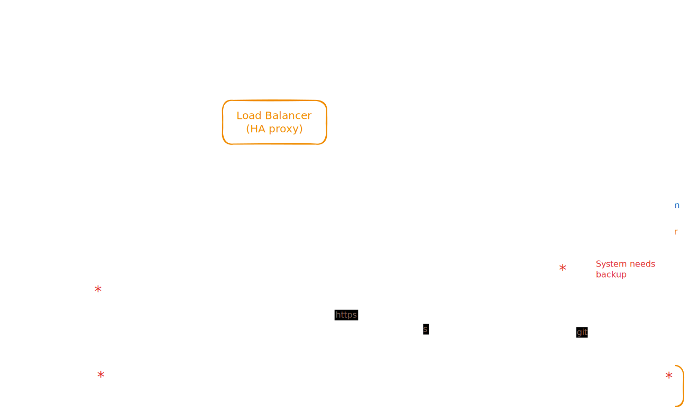

# Infrahub architecture

Infrahub is deployed as a container-based architecture, composed of multiple components. A minimum deployment consists of the following architecture:


## Infrahub components

The main components are:

- A **Frontend** written in React and rendered in the user's browser.
- An **API server** written in Python with FastAPI.
- A **Git agent** written in Python to manage the interaction with external Git repositories.
- A **Graph database** based on `neo4j`.
- A **Message bus** based on `RabbitMQ`.
- A **Cache** based on `redis`.
- An **Object Store** based on local storage or `Amazon S3`.

### API server

Language: Python

The API server delivers the REST API and the GraphQL endpoints.
Internally, the API server is built with FastAPI as the web framework and Graphene to generate the GraphQL endpoints.

:::note

Multiple instance of the API Server can run at the same time to process more requests.

:::

### Git agent

Language: Python

The Git agent is responsible for managing all the content related to the Git repositories. It organizes the file systems in order to quickly access any relevant commit. The Git Agent periodically pulls the Git server for updates and listens to the RPC channel on the event bus for tasks to execute.

Some of the tasks that can be executed on the Git agent includes:

- Rendering a Jinja template.
- Rendering a transform function.
- Executing a check.
- All Git operations (pull/merge/diff).

:::note

Multiple instance of the Git agent can run at the same time to process more requests.

:::

### Frontend

React-based single page application.

## External systems

### Graph database

The Graph database is based on Bolt and Cypher. Currently, we have validated both Neo4j 5.x and Memgraph as possible options.
Neo4j is a production grade, battle tested graph database that is used in thousands of deployments around the world.
Memgraph is a lightweight, very fast, in-memory database that works great for testing and demos.

### Message bus

The message bus is based on RabbitMQ. It supports both a fanout channel to distribute messages to all members at the same time and a RPC framework to distribute work synchronously.
Infrahub also supports NATS JetStream for the message bus.

### Cache

The cache is based on Redis. It's mainly used as a central point to support the distributed lock systems between all the different component of the system.
Infrahub also supports NATS JetStream for the cache.

### Git server (GitHub/GitLab)

Any Git server. The most popular being: GitHub, GitLab, or Bitbucket.

<!-- vale on -->
## TLS-secured connections
<!-- vale off -->

Infrahub supports TLS connections toward the dependencies above.
The following configuration variables are available to configure TLS:

```bash
INFRAHUB_BROKER_TLS_CA_FILE
INFRAHUB_BROKER_TLS_ENABLED
INFRAHUB_BROKER_TLS_INSECURE
INFRAHUB_CACHE_TLS_CA_FILE
INFRAHUB_CACHE_TLS_ENABLED
INFRAHUB_CACHE_TLS_INSECURE
INFRAHUB_DB_TLS_CA_FILE
INFRAHUB_DB_TLS_ENABLED
INFRAHUB_DB_TLS_INSECURE
```

### Graph database

You can configure TLS for Neo4j using the following Docker environment variables:

```bash
NEO4J_dbms_ssl_policy_bolt_enabled=true
NEO4J_dbms_ssl_policy_bolt_base__directory=/opt/ssl
NEO4J_dbms_ssl_policy_bolt_private__key=cert.key
NEO4J_dbms_ssl_policy_bolt_public__certificate=cert.pem
NEO4J_dbms_connector_bolt_tls__level=REQUIRED
```

## Infrahub High Availability Deployment

Infrahub may be deployed with no single-point of failure, and horizontally scaled architectures can be deployed. An example of a HA deployment is below:


