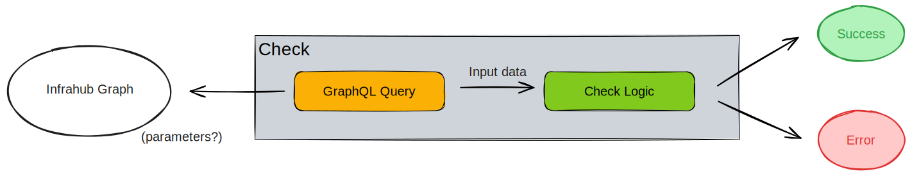

Checks are user defined logic, stored in an [external repository linked to Infrahub](/topics/repository), that are run as part of a [proposed change](/topics/proposed-change). It allows a user to perform any kind of data validation logic during a proposed change. If a check does not complete successfully, then the proposed change cannot be merged.

Some examples:

- name validation against a naming convention for all infrastructure components in the database
- validate that we always have a redundant WAN circuit in operational state for every site
- validate that all internet facing interfaces have an inbound access-list associated

## High level design

A check is composed of 2 main components:

- A GraphQL Query that will define the input data
- A check logic in the Python language that will validate the data

## Targeted checks

Targeted checks are exactly the same as a check, the main difference is that they target a specific group of nodes in Infrahub. The check will then only be executed against the nodes in that group.

This can be useful if a check should only be executed against a subset of a specific kind of nodes.

An example of such scenario could be that you want to validate that all devices for which we generate an OpenConfig artifact, have the NETCONF service enabled.
