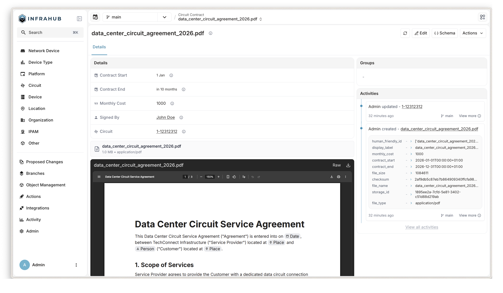

# File objects

Infrastructure management often involves more than just structured data. Contracts, compliance reports, network diagrams, configuration backups, and firmware images are all essential assets that relate directly to the devices, circuits, and services they describe. Infrahub's file object feature lets you attach files to any node in the graph, making these documents first-class citizens of your infrastructure data model with full version control, branch isolation, and permission enforcement.



## Why file objects matter

In many organizations, infrastructure documentation lives in separate systems: contracts in a shared drive, diagrams in a wiki, firmware in an FTP server. This separation creates a gap between the data that describes the infrastructure and the files that support it. When a circuit contract expires, the team managing the circuit may not know where to find the document. When a firmware image needs to be traced back to a specific device deployment, the link between the two is maintained manually, if at all.

File objects bridge this gap by storing files alongside the infrastructure data they relate to. A circuit contract becomes a node in the graph, linked to the circuit it covers. A firmware image becomes a node linked to the device models it supports. This means that when you query a circuit, you can also retrieve its contracts, and when you view a device, you can access its associated firmware, all from the same system and the same API.

## Concepts and definitions

A **file object** is an Infrahub node that combines structured metadata with a stored binary file. It inherits from the `CoreFileObject` generic, which provides a set of system-managed attributes that are automatically populated when a file is uploaded.

| Attribute | Description |
|-----------|-------------|
| `file_name` | Original filename as uploaded |
| `file_size` | File size in bytes |
| `file_type` | MIME type detected from file content |
| `checksum` | SHA-1 checksum of the uploaded file |
| `storage_id` | Internal identifier linking the node to the stored file |

All of these attributes are read-only. The system populates them during upload, so there is no risk of metadata drifting out of sync with the actual file content.

A **user-defined file object type** is a node kind that inherits from `CoreFileObject` and adds custom attributes and relationships. This is how you model domain-specific file types, such as circuit contracts with start and end dates, or firmware images with version numbers.

## How it works

### Schema-driven design

File objects follow the same schema-driven approach as every other node in Infrahub. You define a file object type in your schema by inheriting from `CoreFileObject` and adding whatever attributes and relationships make sense for your use case.

For example, to model circuit contracts:

```yaml
# yaml-language-server: $schema=https://schema.infrahub.app/infrahub/schema/latest.json
---
version: "1.0"
nodes:
  - name: CircuitContract
    namespace: Network
    inherit_from:
      - CoreFileObject
    attributes:
      - name: contract_start
        kind: DateTime
        optional: false
      - name: contract_end
        kind: DateTime
        optional: false
    relationships:
      - name: signed_by
        peer: CoreAccount
        kind: Attribute
        cardinality: one
        optional: true
      - name: circuit
        peer: NetworkCircuit
        kind: Attribute
        cardinality: one
        optional: true
```

This schema definition creates a `NetworkCircuitContract` node kind that has all the automatic file metadata from `CoreFileObject`, plus custom fields for contract dates and relationships to the signer and the circuit.

You can also define relationships from the other direction. A `NetworkCircuit` node can have a `contracts` relationship pointing back to its contract files, making it possible to navigate from either side of the relationship.

### Storage architecture

Infrahub's file storage follows two key principles: immutability and separation of concerns.

Files are stored in a content-addressable store that is completely separate from the graph database. The storage layer is a key-value system where each file is identified by a UUID. Once a file is stored, it is never modified or deleted. This immutability is what enables version control and time travel for files.

The graph database handles all the branch-aware, time-aware logic. A file object node contains a `storage_id` attribute that points to the stored file. When you update a file, Infrahub stores the new version under a new UUID and updates the node's `storage_id` on the current branch. The original file remains untouched in storage, and any branch or point in time that referenced the old `storage_id` continues to resolve to the original file.

```text
Storage layer (branch-agnostic):
  "abc-123" → file bytes (original version)
  "def-456" → file bytes (updated version)

Graph database (branch-aware):
  Branch "main":    NetworkCircuitContract { storage_id: "abc-123" }
  Branch "feature": NetworkCircuitContract { storage_id: "def-456" }
```

This design means that the storage layer does not need to understand branches or time. It stores files and retrieves them by UUID. All the complexity of version control lives in the graph database, where Infrahub already has mature support for branching, merging, and time travel.

### Version control integration

Because file object nodes are regular Infrahub nodes, they inherit the full version control capabilities of the platform:

- **Branching**: Create or update file objects on a branch, and the changes remain isolated until merged. The main branch continues to see the original file.
- **Time travel**: Query a file object at any point in time using the `at` parameter. Infrahub resolves the `storage_id` that was active at that moment and retrieves the corresponding file from storage.
- **Proposed changes**: File object modifications appear in proposed changes just like any other data change, enabling peer review of file updates before they reach the main branch.

:::info
Merge conflicts for file objects are resolved at the attribute level, not the object level. In rare cases, this could result in mismatched `checksum` and `storage_id` values after conflict resolution. Object-level conflict resolution for file objects is planned for a future release.
:::

### Permission enforcement

File objects integrate with Infrahub's [permission system](./permissions-roles.mdx). Downloading a file requires VIEW permission on the file object node. Creating or updating a file object requires the corresponding CREATE or UPDATE permissions. This means that access to files is governed by the same role-based access control that protects the rest of your infrastructure data.

## Use cases

### Storing contracts

A network team managing hundreds of circuits can define a `NetworkCircuitContract` file object type with attributes for contract dates and a relationship to the circuit. When a new contract is signed, the team uploads the PDF and links it to the circuit. Anyone querying the circuit can see its associated contracts, check expiration dates, and download the documents, all from the Infrahub API or UI.

When a contract is renewed, the team uploads the new document on a branch, updates the contract dates, and submits a proposed change for review. The main branch continues to show the original contract until the change is approved and merged.

### Firmware management

An operations team can create a `FirmwareImage` file object type linked to device models. Firmware binaries are uploaded and associated with the device platforms they support. When planning an upgrade, the team can query which firmware version is currently linked to each device model and download the image directly from Infrahub.

### Compliance documentation

A security team can attach audit reports, compliance certificates, or policy documents to the infrastructure nodes they relate to. Because file objects support time travel, the team can retrieve the compliance document that was active at any point in time, which is valuable during audits.

## Connection to other concepts

File objects build on several existing Infrahub features:

- **[Schema](./schema.mdx)**: File object types are defined in the schema, following the same inheritance model as other node kinds.
- **[Branching](./branching.mdx)**: File changes are isolated on branches and merged through the standard workflow.
- **[Proposed changes](./proposed-change.mdx)**: File updates go through the same review process as data changes.
- **[Object storage](./object-storage.mdx)**: File content is persisted in Infrahub's storage layer, which supports local and S3 backends.
- **[Permissions and roles](./permissions-roles.mdx)**: File access is controlled by the same role-based permissions as other data.
- **[Artifact](./artifact.mdx)**: While artifacts are system-generated outputs from transformations, file objects are user-uploaded documents. Both use the object storage layer, but they serve different purposes.

## Configuration

### File size limits

The maximum upload size defaults to 50 MB and can be adjusted through Infrahub's configuration. For example, to allow uploads up to 200 MB:

```shell
INFRAHUB_STORAGE_MAX_FILE_SIZE=200   # in MB, default is 50
```

For production deployments behind a reverse proxy, the proxy must also allow large request bodies. See the [configuration reference](../reference/configuration.mdx) for details.

## Further reading

- [Object storage](./object-storage.mdx): Storage backend configuration and architecture
- [Version control](./version-control.mdx): How Infrahub tracks changes over time
- [Branching](./branching.mdx): Working with branches for isolated changes
