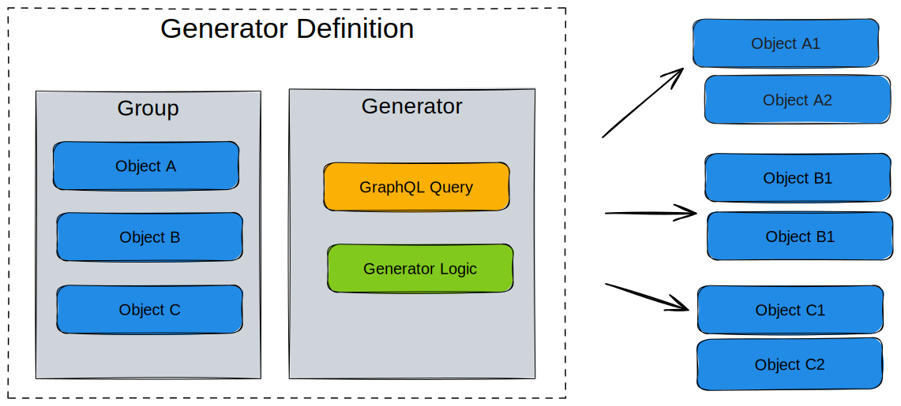

# Generator

A `Generator` is a generic plugin that queries data and creates new nodes and relationships based on the result.

:::success Examples

- Within your [schema](schema) you could create an abstract service object that through a Generator creates other nodes.

:::

## High level design

Generators are defined as a **generator definition** within an [.infrahub.yml](infrahub-yml) file. A Generator definition consists of a number of related objects.

- Group of targets
- Generator class
- GraphQL Query

Running an artifact definition will create new nodes as defined by the generator, or remove old ones that are no longer required. The removal of obsolete objects is handled using the [SDK tracking feature](/python-sdk/topics/tracking)

The targets point to a group that will consist of objects that are impacted by the generator. The members of this group can be any type of object within your schema, service objects, devices, contracts or anything you want the generator to act upon.

The [GraphQL query](graphql) defines the data that will be collected when running the generator. Any object identified in this step is added as a member to a GraphQL query group. The membership in these groups are then used to determine which generators need to be executed as part of a proposed change during the pipeline run.

The Generator itself is a Python class that is based on the `InfrahubGenerator` class from the SDK. Just like [transforms](transformation) and [checks](check), the Generators are user defined.